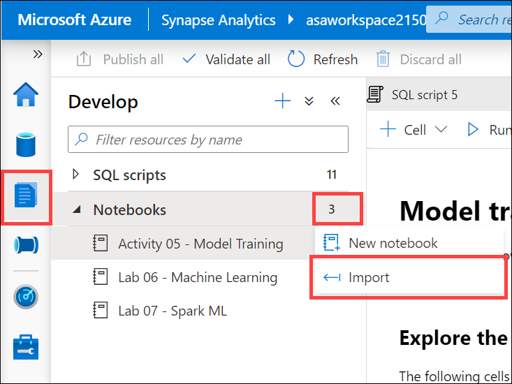

# Activity 05: Model Implementation with Predict

In this activity, you will work with your team to train a simple model and prepare it for use in Azure Synapse Analytics T-SQL queries.

## Team Challenge

WWI wants you to show them how automated machine learning might help them accelerate the model training effort.

1. Open the Develop hub.
2. Select Notebooks and open `Activity 05 - Model training.ipynb`.
3. Follow the instructions within the notebook.

### Solution

[Download the completed notebook](Activity%2005%20-%20Model%20Training%20SOLUTION.ipynb) that contains the solution. You can import it into Synapse Studio by navigating to the **Develop** hub, selecting the ellipses (...) next to Notebooks, then selecting **Import**.

