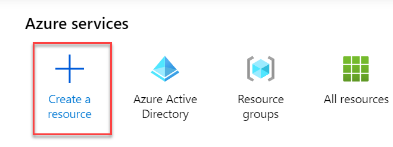
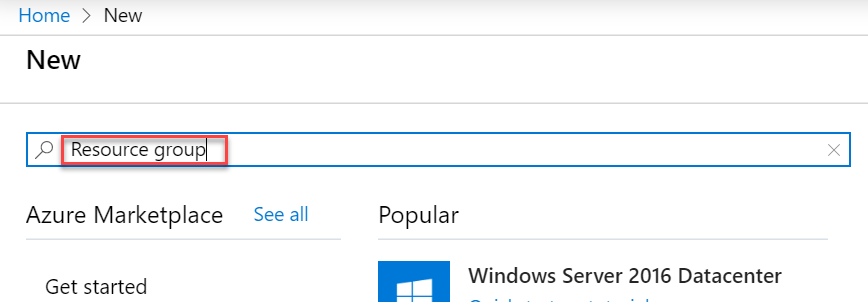
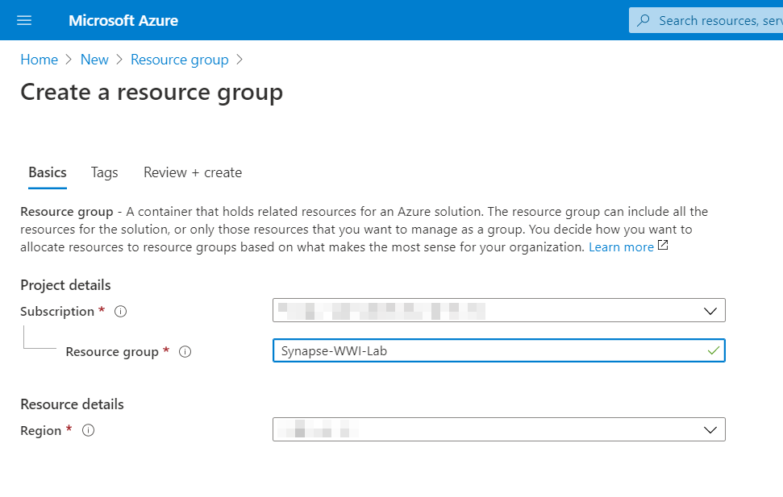
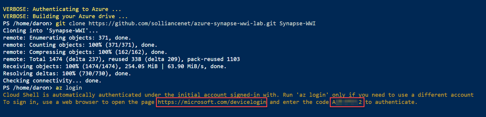
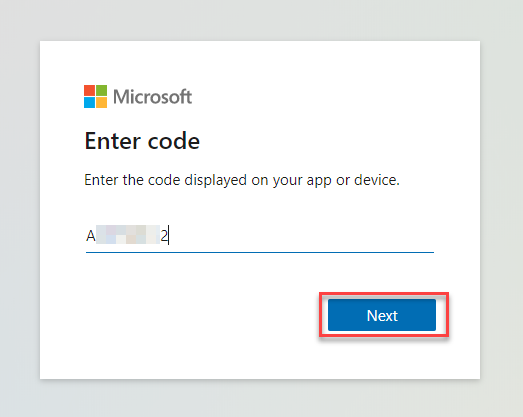
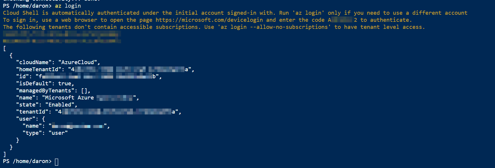
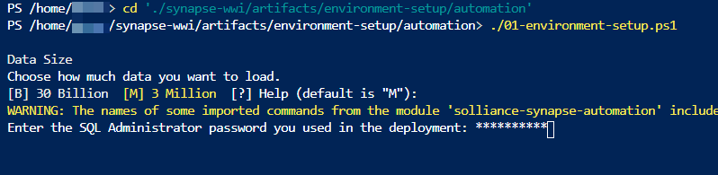

# Environment setup instructions

## Azure Setup

### Task 1: Create a resource group in Azure

1. Log into the [Azure Portal](https://portal.azure.com) using your Azure credentials.

2. On the Azure Portal home screen, select the **+ Create a resource** tile.

    

3. In the **Search the Marketplace** text box, type **Resource group** and press the **Enter** key.

    

4. Select the **Create** button on the **Resource group** overview page.

5. On the **Create a resource group** screen, select your desired Subscription and Region. For Resource group, enter **Synapse-WS-L400**, then select the **Review + Create** button.

    

6. Select the **Create** button once validation has passed.

### Task 2: Create Azure Synapse Analytics workspace

1. Deploy the workspace through the following Azure ARM template (press the button below):

    <a href="https://portal.azure.com/#create/Microsoft.Template/uri/https%3A%2F%2Fraw.githubusercontent.com%2Fsolliancenet%2Fazure-synapse-analytics-workshop-400%2Fmaster%2Fartifacts%2Fenvironment-setup%2Fautomation%2F00-asa-workspace-core.json" target="_blank"></a>

2. On the **Custom deployment** form fill in the fields described below.

* **Subscription**: Select your desired subscription for the deployment.
* **Resource group**: Select the **Synapse-WS-L400** resource group you previously created.
* **Unique Suffix**: This unique suffix will be used naming resources that will created as part of your deployment.
* **SQL Administrator Login Password**: Provide a strong password for the SQLPool that will be created as part of your deployment. Your password will be needed during the next steps. Make sure you have your password noted and secured.
  
    > **Important**: The `location` field under 'Settings' will list the Azure regions where Azure Synapse Analytics (Preview) is available as of July 2020. This will help you find a region where the service is available without being limited to where the resource group is defined.

1. Check the **I agree to the terms and conditions stated above**, then select the **Purchase** button. The provisioning of your deployment resources will take approximately 13 minutes.

    > **Note**: You may experience a deployment step failing in regards to Role Assignment. This error may safely be ignored.

## Path 1: Local PowerShell

### Task 1: Pre-requisites

* Windows PowerShell
* Azure PowerShell

    ```powershell
    if (Get-Module -Name AzureRM -ListAvailable) {
        Write-Warning -Message 'Az module not installed. Having both the AzureRM and Az modules installed at the same time is not supported.'
    } else {
        Install-Module -Name Az -AllowClobber -Scope CurrentUser
    }
    ```

* `Az.CosmosDB` 0.1.4 cmdlet

    ```powershell
    Install-Module -Name Az.CosmosDB -RequiredVersion 0.1.4
    ```

* `sqlserver` module

    ```powershell
    Install-Module -Name SqlServer
    ```

* Install VC Redist: <https://aka.ms/vs/15/release/vc_redist.x64.exe>
* Install MS ODBC Driver 17 for SQL Server: <https://www.microsoft.com/download/confirmation.aspx?id=56567>
* Install SQL CMD x64: <https://go.microsoft.com/fwlink/?linkid=2082790>
* Install Microsoft Online Services Sign-In Assistant for IT Professionals RTW: <https://www.microsoft.com/download/details.aspx?id=41950>

Create the following file: **C:\LabFiles\AzureCreds.ps1**

```powershell
$AzureUserName="odl_user_NNNNNN@msazurelabs.onmicrosoft.com"
$AzurePassword="..."
$TokenGeneratorClientId="1950a258-227b-4e31-a9cf-717495945fc2"
$AzureSQLPassword="..."
```

> The `AzureSQLPassword` value is the value passed to the `sqlAdministratorLoginPassword` parameter when running the `01-asa-workspace-core.json` ARM template. You can find this value by looking at the `SQL-USER_ASA` Key Vault secret.

### Task 2: Execute setup scripts

* Open PowerShell as an Administrator and change directories to the root of this repo within your local file system.
* Run `Set-ExecutionPolicy Unrestricted`.
* Execute `Connect-AzAccount` and sign in to the ODL user account when prompted.
* Execute `.\artifacts\environment-setup\automation\01-environment-setup.ps1`.
* Execute `.\artifacts\environment-setup\automation\03-environment-validate.ps1`.

## Path #2 (Cloud Shell)

### Task 1: Download artifacts

1. In the Azure Portal, open the Azure Cloud Shell by selecting its icon from the right side of the top toolbar.

    

    > **Note**: If you are prompted to choose a shell, select **Powershell**, and if asked to create a storage account for the Cloud Shell, agree to have it created.

2. In the Cloud Shell window, enter the following command to clone the repository files.

    ```PowerShell
    git clone https://github.com/solliancenet/azure-synapse-analytics-workshop-400.git synapse-ws-L400
    ```

    

3. Keep the Cloud Shell open.

### Task 2: Establish a user context

1. In the Cloud Shell, execute the following command:

    ```cli
    az login
    ```

2. A message will be displayed asking you to open a new tab in your web browser, navigate to [https://microsoft.com/devicelogin](https://microsoft.com/devicelogin) and enter the code you have been given for authentication.

   

   

3. Once complete, you may close the tab from the previous step and return to the Cloud Shell.

   

### Task 3: Run environment setup PowerShell script

When executing the script below, it is important to let the scripts run to completion. Some tasks may take longer than others to run. When a script completes execution, you will be returned to a command prompt. The total runtime of all steps in this task will take approximately 60 minutes.

1. In the Cloud Shell, change the current directory to the **automation** folder of the cloned repository by executing the following:

    ```PowerShell
    git clone https://github.com/solliancenet/azure-synapse-analytics-workshop-400.git synapse-ws-L400

    cd './synapse-ws-L400/artifacts/environment-setup/automation'
    ```

2. Execute the **01-environment-setup.ps1** script by executing the following command:

    ```PowerShell
    ./01-environment-setup.ps1
    ./03-environment-validate.ps1
    ```

    You may be prompted to enter the name of your desired Azure Subscription. You can copy and paste the value from the list to select one.

    You will also be prompted for the following information for this script:

    | Prompt |
    |--------|
    | Enter the SQL Administrator password you used in the deployment |

    

    Select the resource group you selected during Task 3.2. This will make sure automation runs against the correct environment you provisioned in Azure.

    

## Steps & Timing

The entire script will take a little over an hour to complete.  Major steps include:

* Configure Synapse resources
* Download all data sets and files into the data lake (~15 mins)
* Execute the setup and execute the SQL pipeline (~30 mins)
* Execute the Cosmos DB pipeline (~25 mins)
