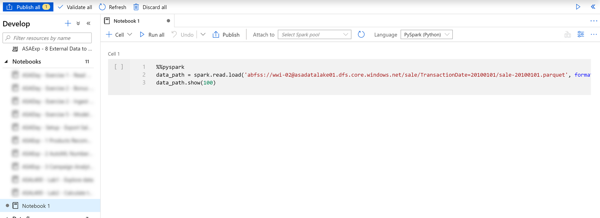
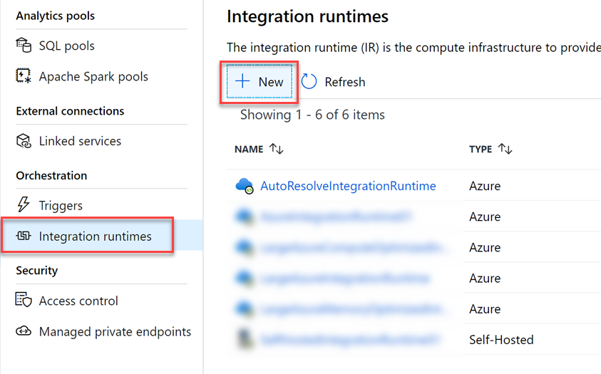
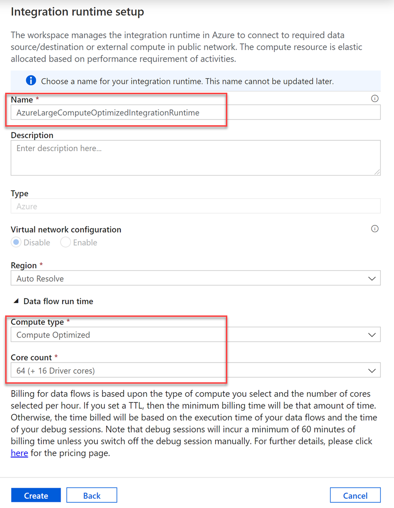
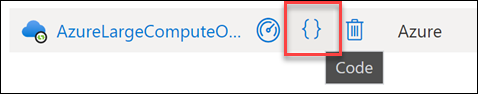
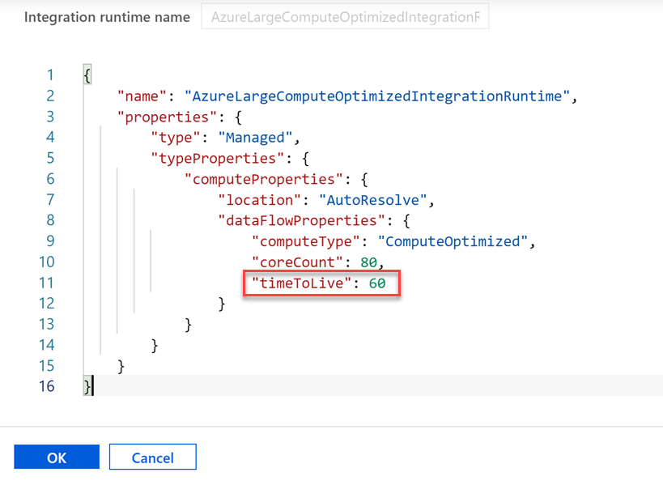

# Data Integration Part 1

- [Data Integration Part 1](#data-integration-part-1)
  - [Exercise 1: Configure linked service and create datasets](#exercise-1-configure-linked-service-and-create-datasets)
    - [Task 1: Create linked service](#task-1-create-linked-service)
    - [Task 2: Create datasets](#task-2-create-datasets)
  - [Exercise 2: Explore source data in the Data hub](#exercise-2-explore-source-data-in-the-data-hub)
    - [Task 1: Query sales Parquet data with Synapse SQL Serverless](#task-1-query-sales-parquet-data-with-synapse-sql-serverless)
    - [Task 2: Query sales Parquet data with Azure Synapse Spark](#task-2-query-sales-parquet-data-with-azure-synapse-spark)
    - [Task 3: Query user profile JSON data with Azure Synapse Spark](#task-3-query-user-profile-json-data-with-azure-synapse-spark)
  - [Exercise 3: Create data pipeline to copy a month of customer data](#exercise-3-create-data-pipeline-to-copy-a-month-of-customer-data)
  - [Exercise 4: Create custom Integration Runtime (IR)](#exercise-4-create-custom-integration-runtime-ir)
  - [Exercise 5: Update data pipeline with new integration runtime](#exercise-5-update-data-pipeline-with-new-integration-runtime)

```
Integrating Data Sources
Using Data Hub: Preview blob & DB data, T-SQL (On-Demand) and PySpark DataFrame
Orchestrate Hub: Connectors, Copy data

Studio - Manage Hub
Studio - Linked services
Studio - Integration runtimes

Large IR (32 cores) speed test:
    - General: 6:45
    - Memory: 3:29
    - Compute: 3:23
```

## Exercise 1: Configure linked service and create datasets

### Task 1: Create linked service

Our data sources for labs 1 and 2 include files stored in ADLS Gen2 and Azure Cosmos DB. The linked service for ADLS Gen2 already exists as it is the primary ADLS Gen2 account for the workspace.

1. Open Synapse Analytics Studio, and then navigate to the **Manage** hub.

    

2. Open **Linked services** and create a new linked service to the Azure Cosmos DB account for the lab. Name the linked service after the name of the Azure Cosmos DB account and set the **Database name** value to `CustomerProfile`.

    

### Task 2: Create datasets

1. Navigate to the **Data** hub.

    

2. Create a new **Azure Cosmos DB (SQL API)** dataset with the following characteristics:

    - **Name**: Enter `asal400_customerprofile_cosmosdb`.
    - **Linked service**: Select the Azure Cosmos DB linked service.
    - **Collection**: Select `OnlineUserProfile01`.

    

3. After creating the dataset, navigate to its **Connection** tab, then select **Preview data**.

    

4. Preview data queries the selected Azure Cosmos DB collection and returns a sample of the documents within. The documents are stored in JSON format and include a `userId` field, `cartId`, `preferredProducts` (an array of product IDs that may be empty), and `productReviews` (an array of written product reviews that may be empty). We will use this data in lab 2.

    

5. Select the **Schema** tab, then select **Import schema**. Synapse Analytics evaluates the JSON documents within the collection and infers the schema based on the nature of the data within. Since we are only storing one document type in this collection, you will see the inferred schema for all documents within.

    

6. Create a new **Azure Data Lake Storage Gen2** dataset with the **Parquet** format type with the following characteristics:

    - **Name**: Enter `asal400_sales_adlsgen2`.
    - **Linked service**: Select the `asadatalake01` linked service.
    - **File path**: Browse to the `wwi-02/sale` path.
    - **Import schema**: Select `From connection/store`.

    

7. Create a new **Azure Data Lake Storage Gen2** dataset with the **JSON** format type with the following characteristics:

    - **Name**: Enter `asal400_ecommerce_userprofiles_source`.
    - **Linked service**: Select the `asadatalake01` linked service.
    - **File path**: Browse to the `wwi-02/online-user-profiles-02` path.
    - **Import schema**: Select `From connection/store`.

## Exercise 2: Explore source data in the Data hub

Understanding data through data exploration is one of the core challenges faced today by data engineers and data scientists as well. Depending on the underlying structure of the data as well as the specific requirements of the exploration process, different data processing engines will offer varying degrees of performance, complexity, and flexibility.

In Azure Synapse Analytics, you have the possibility of using either the Synapse SQL Serverless engine, the big-data Spark engine, or both.

In this exercise, you will explore the data lake using both options.

### Task 1: Query sales Parquet data with Synapse SQL Serverless

When you query Parquet files using Synapse SQL Serverless, you can explore the data with T-SQL syntax.

1. In Synapse Analytics Studio, navigate to the **Data** hub.

    

2. Expand **Storage accounts**. Expand the `asadatalake01` primary ADLS Gen2 account and select `wwi-02`.

3. Navigate to the `wwi-02/sale/TransactionDate=20100102` folder. Right-click on the `sale-20100102.parquet` file, select **New SQL script**, then **Select TOP 100 rows**.

    

4. Ensure **SQL on-demand** is selected in the `Connect to` dropdown list above the query window, then run the query. Data is loaded by the Synapse SQL Serverless endpoint and processed as if was coming from any regular relational database.

    

5. Modify the SQL query to perform aggregates and grouping operations to better understand the data. Replace the query with the following, making sure that the file path in `OPENROWSET` matches your current file path:

    ```sql
    SELECT
        TransactionDate, ProductId,
        SUM(ProfitAmount) AS [(sum)ProfitAmount],
        ROUND(AVG(Quantity),4) AS [(avg)Quantity],
        SUM(Quantity) AS [(sum)Quantity]
    FROM
        OPENROWSET(
            BULK 'https://asadatalake01.dfs.core.windows.net/wwi-02/sale/TransactionDate=20100102/sale-20100102.parquet',
            FORMAT='PARQUET'
        ) AS [r] GROUP BY r.TransactionDate, r.ProductId;
    ```

    

6. Now let's figure out how many records are contained within the Parquet files. This information is important for planning how we optimize for importing the data into Azure Synapse Analytics. To do this, replace your query with the following:

    ```sql
    SELECT
        COUNT(*)
    FROM
        OPENROWSET(
            BULK 'https://asadatalake01.dfs.core.windows.net/wwi-02/sale/*/*',
            FORMAT='PARQUET'
        ) AS [r];
    ```

    > Notice how we updated the path to include all Parquet files in all subfolders of `sales`.

Optional: If you wish to keep this SQL script for future reference, select the Properties button, provide a descriptive name, such as `ASAL400 - Lab1 - Explore sales data`, then select **Publish all**.


**TODO**: Update to show the total count of records once all data is available in the environment.

### Task 2: Query sales Parquet data with Azure Synapse Spark

1. Navigate to the **Data** hub, browse to the data lake storage account folder `wwi-02/sale/TransactionDate=20100101`, then right-click the Parquet file and select New notebook.

    

2. This will generate a notebook with PySpark code to load the data in a dataframe and display 100 rows with the header.

    

3. Attach the notebook to a Spark pool.

    

4. Select **Run all** on the notebook toolbar to execute the notebook.

    > **Note:** The first time you run a notebook in a Spark pool, Synapse creates a new session. This can take approximately 3 minutes.

5. As you can see, the output is not formatted very well. To change this, replace the last line of code with the following and run the cell again to see the improved display:

    ```python
    display(data_path.limit(100))
    ```

    

6. Create a new cell underneath by selecting **{} Add code** when hovering over the blank space at the bottom of the notebook.

    

7. The Spark engine can analyze the Parquet files and infer the schema. To do this, enter the following in the new cell:

    ```python
    data_path.printSchema()
    ```

    Your output should look like the following:

    ```text
    root
     |-- TransactionId: string (nullable = true)
     |-- CustomerId: integer (nullable = true)
     |-- ProductId: short (nullable = true)
     |-- Quantity: short (nullable = true)
     |-- Price: decimal(29,2) (nullable = true)
     |-- TotalAmount: decimal(29,2) (nullable = true)
     |-- TransactionDate: integer (nullable = true)
     |-- ProfitAmount: decimal(29,2) (nullable = true)
     |-- Hour: byte (nullable = true)
     |-- Minute: byte (nullable = true)
     |-- StoreId: short (nullable = true)
    ```

8. Now let's use the dataframe to perform the same grouping and aggregate query we performed with the SQL Serverless pool. Create a new cell and enter the following:

    ```python
    from pyspark.sql import SparkSession
    from pyspark.sql.types import *
    from pyspark.sql.functions import *

    profitByDateProduct = (data_path.groupBy("TransactionDate","ProductId")
        .agg(
            sum("ProfitAmount").alias("(sum)ProfitAmount"),
            round(avg("Quantity"), 4).alias("(avg)Quantity"),
            sum("Quantity").alias("(sum)Quantity"))
        .orderBy("TransactionDate"))
    display(profitByDateProduct.limit(100))
    ```

    > We import required Python libraries to use aggregation functions and types defined in the schema to successfully execute the query.

### Task 3: Query user profile JSON data with Azure Synapse Spark

In addition to the sales data, we have customer profile data from an e-commerce system that provides top product purchases for each visitor of the site (customer) over the past 12 months. This data is stored within JSON files in the data lake. We will import this data in the next lab, but let's explore it while we're in the Spark notebook.

1. Create a new cell in the Spark notebook, enter the following code, and execute the cell:

    ```python
    df = (spark.read \
            .option("inferSchema", "true") \
            .json("abfss://wwi-02@asadatalake01.dfs.core.windows.net/online-user-profiles-02/*.json", multiLine=True)
        )

    df.printSchema()
    ```

    Your output should look like the following:

    ```text
    root
    |-- topProductPurchases: array (nullable = true)
    |    |-- element: struct (containsNull = true)
    |    |    |-- itemsPurchasedLast12Months: long (nullable = true)
    |    |    |-- productId: long (nullable = true)
    |-- visitorId: long (nullable = true)
    ```

    > Notice that we are selecting all JSON files within the `online-user-profiles-02` directory. Each JSON file contains several rows, which is why we specified the `multiLine=True` option. Also, we set the `inferSchema` option to `true`, which instructs the Spark engine to review the files and create a schema based on the nature of the data.

2. We have been using Python code in these cells up to this point. If we want to query the files using SQL syntax, one option is to create a temporary view of the data within the dataframe. Execute the following in a new cell to create a view named `user_profiles`:

    ```python
    # create a view called user_profiles
    df.createOrReplaceTempView("user_profiles")
    ```

3. Create a new cell. Since we want to use SQL instead of Python, we use the `%%sql` magic to set the language of the cell to SQL. Execute the following code in the cell:

    ```sql
    %%sql

    SELECT * FROM user_profiles LIMIT 10
    ```

    Notice that the output shows nested data for `topProductPurchases`, which includes an array of `productId` and `itemsPurchasedLast12Months` values. You can expand the fields by clicking the right triangle in each row.

    

    This makes analyzing the data a bit difficult. This is because the JSON file contents looks like the following:

    ```json
    [
    {
        "visitorId": 9529082,
        "topProductPurchases": [
        {
            "productId": 4679,
            "itemsPurchasedLast12Months": 26
        },
        {
            "productId": 1779,
            "itemsPurchasedLast12Months": 32
        },
        {
            "productId": 2125,
            "itemsPurchasedLast12Months": 75
        },
        {
            "productId": 2007,
            "itemsPurchasedLast12Months": 39
        },
        {
            "productId": 1240,
            "itemsPurchasedLast12Months": 31
        },
        {
            "productId": 446,
            "itemsPurchasedLast12Months": 39
        },
        {
            "productId": 3110,
            "itemsPurchasedLast12Months": 40
        },
        {
            "productId": 52,
            "itemsPurchasedLast12Months": 2
        },
        {
            "productId": 978,
            "itemsPurchasedLast12Months": 81
        },
        {
            "productId": 1219,
            "itemsPurchasedLast12Months": 56
        },
        {
            "productId": 2982,
            "itemsPurchasedLast12Months": 59
        }
        ]
    },
    {
        ...
    },
    {
        ...
    }
    ]
    ```

4. PySpark contains a special [`explode` function](https://spark.apache.org/docs/latest/api/python/pyspark.sql.html?highlight=explode#pyspark.sql.functions.explode), which returns a new row for each element of the array. This will help flatten the `topProductPurchases` column for better readability or for easier querying. Execute the following in a new cell:

    ```python
    from pyspark.sql.functions import udf, explode

    flat=df.select('visitorId',explode('topProductPurchases').alias('topProductPurchases_flat'))
    display(flat.limit(100))
    ```

    In this cell, we created a new dataframe named `flat` that includes the `visitorId` field and a new aliased field named `topProductPurchases_flat`. As you can see, the output is a bit easier to read and, by extension, easier to query.

    

5. Create a new cell and execute the following code to create a new flattened version of the dataframe that extracts the `topProductPurchases_flat.productId` and `topProductPurchases_flat.itemsPurchasedLast12Months` fields to create new rows for each data combination:

    ```python
    topPurchases = (flat.select('visitorId','topProductPurchases_flat.productId','topProductPurchases_flat.itemsPurchasedLast12Months')
        .orderBy('visitorId'))

    display(topPurchases.limit(100))
    ```

    In the output, notice that we now have multiple rows for each `visitorId`.

    

6. Let's order the rows by the number of items purchased in the last 12 months. Create a new cell and execute the following code:

    ```python
    # Let's order by the number of items purchased in the last 12 months
    sortedTopPurchases = topPurchases.orderBy("itemsPurchasedLast12Months")

    sortedTopPurchases.show(100)
    ```

7. How do we sort in reverse order? One might conclude that we could make a call like this: `topPurchases.orderBy("itemsPurchasedLast12Months desc")`. Try it in a new cell:

    ```python
    topPurchases.orderBy("itemsPurchasedLast12Months desc")
    ```

    Why does this not work?

   - The `DataFrames` API is built upon an SQL engine.
   - There is a lot of familiarity with this API and SQL syntax in general.
   - The problem is that `orderBy(..)` expects the name of the column.
   - What we specified was an SQL expression in the form of **requests desc**.
   - What we need is a way to programmatically express such an expression.
   - This leads us to the second variant, `orderBy(Column)` and more specifically, the class `Column`.

8. The **Column** class is an object that encompasses more than just the name of the column, but also column-level-transformations, such as sorting in a descending order. Execute the following code in a new cell:

    ```python
    sortedTopPurchases = (topPurchases
        .orderBy( col("itemsPurchasedLast12Months").desc() ))

    display(sortedTopPurchases.limit(100))
    ```

9. How many *types* of products did each customer purchase? To figure this out, we need to group by `visitorId` and aggregate on the number of rows per customer. Execute the following code in a new cell:

    ```python
    groupedTopPurchases = (sortedTopPurchases.select("visitorId")
        .groupBy("visitorId")
        .agg(count("*").alias("total"))
        .orderBy("visitorId") )

    display(groupedTopPurchases.limit(100))
    ```

    

10. How many *total items* did each customer purchase? To figure this out, we need to group by `visitorId` and aggregate on the sum of `itemsPurchasedLast12Months` values per customer. Execute the following code in a new cell:

    ```python
    groupedTopPurchases = (sortedTopPurchases.select("visitorId","itemsPurchasedLast12Months")
        .groupBy("visitorId")
        .agg(sum("itemsPurchasedLast12Months").alias("totalItemsPurchased"))
        .orderBy("visitorId") )

    display(groupedTopPurchases.limit(100))
    ```

    

## Exercise 3: Create data pipeline to copy a month of customer data

**TODO**: Waiting on updated source Sale dataset.

## Exercise 4: Create custom Integration Runtime (IR)

The Integration Runtime (IR) is the compute infrastructure used by Azure Synapse Analytics to provide data integration capabilities across different network environments. There are different types of IR, including Azure IR and self-hosted IR, which installs on-premises to bridge connectivity between your network on Azure. In this lab, we focus on the Azure IR.

When you create a new linked service, Azure IR provides fully managed compute resources to perform data movement and dispatch data transformation activities for the linked service. Unless otherwise specified in the linked service settings, the default Azure IR is used. However, sometimes the default IR configuration isn't enough for highly demanding data movement and transformation activities. If this is the case, you can create a custom IR.

1. Navigate to the **Manage** hub.

    

2. Select **Integration runtimes** under the Orchestration menu section, then select **+ New** to create a new IR.

    

3. In the `Integration runtime setup` blade, select **Azure, Self-Hosted**, then select **Continue**.

4. Under `Network environment`, select **Azure**, then select **Continue**.

5. In the `New integration runtime` form, configure the following:

    - **Name**: Enter `AzureLargeComputeOptimizedIntegrationRuntime`.
    - **Region**: Select `Auto Resolve`.
    - **Compute type**: Select `Compute Optimized`.
    - **Core count**: Select `64(+ 16 Driver cores)`.

    

6. Select **Create**.

7. After creating the new IR, hover over the name on the list, then select the **Code** link.

    

8. Change the `timeToLive` value to **60**. Every time you execute a pipeline that uses the IR, one of the first steps that happens in the background is to provision the IR cluster if it is idle or inactive. Here we set the `timeToLive` value to 60 minutes to keep the provisioned cluster up and running for longer periods of time so we don't need to wait for the provisioning step each subsequent pipeline execution. Please note that setting this value to 60 minutes likely comes with a cost increase if you have infrequent pipeline runs, since you are leaving it in an active state for longer periods of time.

    

9. Select **OK**.

## Exercise 5: Update data pipeline with new integration runtime

**TODO**: Waiting on updated source Sale dataset.

Set the concurrency on the pipeline to a higher number. Default value if unset is 4.

Compare importing with PolyBase to importing with COPY command

Compare importing into a clustered table vs. a heap table, then use a select into command to move from the heap to clustered table