# Data Integration Part 2

<!-- Create e2e pipeline for initial load & update
Data Prep: Handle bad data, file formats, join disparate sources
Troubleshoot: pipeline/activity failure (something beyond simply looking at the portal)
Optimize: trigger window, exec time

Triggering Pipelines
Creating schedule, tumbling window, event (blob vs ADLS)
Other cases: trigger via Function
    - Native and non-standard ways to trigger a pipeline
    - Set up change feed-triggered function (CSharp script via portal). Edit a document in Cosmos DB (maybe a pipeline parameter), which triggers the function
    - Maybe trigger the pipeline via REST call and shown here: https://github.com/solliancenet/azure-synapse-analytics/blob/master/infrastructure/asaexp/setup/ASAExp%20-%20Import%20SQL%20Pool%20Tables.ps1#L114

Spark notebook to connect to the wwi.UserTopProductPurchases Synapse database table.
    - Have user right-click the table, choose notebook, then new Spark notebook
    - Execute code to find the top 5 products for each user, based on which ones are both preferred and top, and have the most purchases in past 12 months
    - Top 5 products overall -->

## Resource naming throughout this lab

For the remainder of this guide, the following terms will be used for various ASA-related resources (make sure you replace them with actual names and values):

| Azure Synapse Analytics Resource  | To be referred to |
| --- | --- |
| Workspace resource group | `WorkspaceResourceGroup` |
| Workspace / workspace name | `Workspace` |
| Primary Storage Account | `PrimaryStorage` |
| Default file system container | `DefaultFileSystem` |
| SQL Pool | `SqlPool01` |

## Exercise 1: Create datasets and SQL tables

### Task 1: Create SQL tables

1. Navigate to the **Develop** hub.

    

2. From the **Develop** menu, select the + button and choose **SQL Script** from the context menu.

    

3. In the toolbar menu, connect to the **SQL Pool** assigned for your environment.

    

4. In the query window, replace the script with the following to create a new table for the Campaign Analytics CSV file:

    ```sql
    CREATE TABLE [wwi].[CampaignAnalytics]
    (
        [Region] [nvarchar](50)  NOT NULL,
        [Country] [nvarchar](30)  NOT NULL,
        [ProductCategory] [nvarchar](50)  NOT NULL,
        [CampaignName] [nvarchar](500)  NOT NULL,
        [Revenue] [decimal](10,2)  NULL,
        [RevenueTarget] [decimal](10,2)  NULL,
        [City] [nvarchar](50)  NULL,
        [State] [nvarchar](25)  NULL
    )
    WITH
    (
        DISTRIBUTION = HASH ( [Region] ),
        CLUSTERED COLUMNSTORE INDEX
    )
    ```

5. Select **Run** from the toolbar menu to execute the SQL command.

    

6. In the query window, replace the script with the following to create a new table for the Sales Parquet files:

    ```sql
    CREATE TABLE [wwi].[Sale]
    (
        [TransactionId] [uniqueidentifier]  NOT NULL,
        [CustomerId] [int]  NOT NULL,
        [ProductId] [smallint]  NOT NULL,
        [Quantity] [smallint]  NOT NULL,
        [Price] [decimal](9,2)  NOT NULL,
        [TotalAmount] [decimal](9,2)  NOT NULL,
        [TransactionDate] [int]  NOT NULL,
        [ProfitAmount] [decimal](9,2)  NOT NULL,
        [Hour] [tinyint]  NOT NULL,
        [Minute] [tinyint]  NOT NULL,
        [StoreId] [smallint]  NOT NULL
    )
    WITH
    (
        DISTRIBUTION = HASH ( [CustomerId] ),
        CLUSTERED COLUMNSTORE INDEX,
        PARTITION
        (
            [TransactionDate] RANGE RIGHT FOR VALUES (20100101, 20100201, 20100301, 20100401, 20100501, 20100601, 20100701, 20100801, 20100901, 20101001, 20101101, 20101201, 20110101, 20110201, 20110301, 20110401, 20110501, 20110601, 20110701, 20110801, 20110901, 20111001, 20111101, 20111201, 20120101, 20120201, 20120301, 20120401, 20120501, 20120601, 20120701, 20120801, 20120901, 20121001, 20121101, 20121201, 20130101, 20130201, 20130301, 20130401, 20130501, 20130601, 20130701, 20130801, 20130901, 20131001, 20131101, 20131201, 20140101, 20140201, 20140301, 20140401, 20140501, 20140601, 20140701, 20140801, 20140901, 20141001, 20141101, 20141201, 20150101, 20150201, 20150301, 20150401, 20150501, 20150601, 20150701, 20150801, 20150901, 20151001, 20151101, 20151201, 20160101, 20160201, 20160301, 20160401, 20160501, 20160601, 20160701, 20160801, 20160901, 20161001, 20161101, 20161201, 20170101, 20170201, 20170301, 20170401, 20170501, 20170601, 20170701, 20170801, 20170901, 20171001, 20171101, 20171201, 20180101, 20180201, 20180301, 20180401, 20180501, 20180601, 20180701, 20180801, 20180901, 20181001, 20181101, 20181201, 20190101, 20190201, 20190301, 20190401, 20190501, 20190601, 20190701, 20190801, 20190901, 20191001, 20191101, 20191201)
        )
    )
    ```

7. Select **Run** from the toolbar menu to execute the SQL command.

8. In the query window, replace the script with the following to create a new table for the user reviews contained within the user profile data in Azure Cosmos DB:

    ```sql
    CREATE TABLE [wwi].[UserProductReviews]
    (
        [UserId] [int]  NOT NULL,
        [ProductId] [int]  NOT NULL,
        [ReviewText] [nvarchar](1000)  NOT NULL,
        [ReviewDate] [datetime]  NOT NULL
    )
    WITH
    (
        DISTRIBUTION = HASH ( [ProductId] ),
        CLUSTERED COLUMNSTORE INDEX
    )
    ```

9. Select **Run** from the toolbar menu to execute the SQL command.

10. In the query window, replace the script with the following to create a new table that joins users' preferred products stored in Azure Cosmos DB with top product purchases per user from the e-commerce site, stored in JSON files within the data lake:

    ```sql
    CREATE TABLE [wwi].[UserTopProductPurchases]
    (
        [UserId] [int]  NOT NULL,
        [ProductId] [int]  NOT NULL,
        [ItemsPurchasedLast12Months] [int]  NULL,
        [IsTopProduct] [bit]  NOT NULL,
        [IsPreferredProduct] [bit]  NOT NULL
    )
    WITH
    (
        DISTRIBUTION = HASH ( [UserId] ),
        CLUSTERED COLUMNSTORE INDEX
    )
    ```

11. Select **Run** from the toolbar menu to execute the SQL command.

### Task 2: Create campaign analytics datasets

Your organization was provided a poorly formatted CSV file containing marketing campaign data. The file was uploaded to the data lake and now it must be imported into the data warehouse.


Issues include invalid characters in the revenue currency data, and misaligned columns.

1. Navigate to the **Data** hub.

    

2. With the Workspace tab selected under Data, select **+** in the toolbar, then select **Integration dataset** to create a new dataset.

    

3. Create a new **Azure Data Lake Storage Gen2** integration dataset with the **DelimitedText** format type with the following characteristics:

    - **Name**: Enter `asal400_campaign_analytics_source`.
    - **Linked service**: Select the `asadatalakeSUFFIX` linked service.
    - **File path**: Browse to the `wwi-02/campaign-analytics/campaignanalytics.csv` path.
    - **First row as header**: Leave `unchecked`. **We are skipping the header** because there is a mismatch between the number of columns in the header and the number of columns in the data rows.
    - **Import schema**: Select `From connection/store`.

    

4. After creating the dataset, navigate to its **Connection** tab. Leave the default settings. They should match the following configuration:

    - **Compression type**: Select `none`.
    - **Column delimiter**: Select `Comma (,)`.
    - **Row delimiter**: Select `Auto detect (\r,\n, or \r\n)`.
    - **Encoding**: Select `Default(UTF-8)`.
    - **Escape character**: Select `Backslash (\)`.
    - **Quote character**: Select `Double quote (")`.
    - **First row as header**: Leave `unchecked`.
    - **Null value**: Leave the field empty.

    

5. Select **Preview data**.

6. Preview data displays a sample of the CSV file. You can see some of the issues shown in the screenshot at the beginning of this task. Notice that since we are not setting the first row as the header, the header columns appear as the first row. Also, notice that the city and state values seen in the earlier screenshot do not appear. This is because of the mismatch in the number of columns in the header row compared to the rest of the file. We will exclude the first row when we create the data flow in the next exercise.

    

7. Create a new **Azure Synapse Analytics** integration dataset with the following characteristics:

    - **Name**: Enter `asal400_wwi_campaign_analytics_asa`.
    - **Linked service**: Select the `SqlPool01` service.
    - **Table name**: Select `wwi.CampaignAnalytics`.
    - **Import schema**: Select `From connection/store`.

    

### Task 3: Create user profile datasets

User profile data comes from two different data sources. In lab 1, you created datasets for these sources: `asal400_ecommerce_userprofiles_source` and `asal400_customerprofile_cosmosdb` (*complete Task 4 below if you did not complete lab 1*). The customer profile data from an e-commerce system that provides top product purchases for each visitor of the site (customer) over the past 12 months is stored within JSON files in the data lake. User profile data containing, among other things, product preferences and product reviews is stored as JSON documents in Cosmos DB.

In this task, you'll create datasets for the SQL tables that will serve as data sinks for data pipelines you'll create later in this lab.

1. Create a new **Azure Synapse Analytics** integration dataset with the following characteristics:

    - **Name**: Enter `asal400_wwi_userproductreviews_asa`.
    - **Linked service**: Select the `SqlPool01` service.
    - **Table name**: Select `wwi.UserProductReviews`.
    - **Import schema**: Select `From connection/store`.

    

2. Create a new **Azure Synapse Analytics** integration dataset with the following characteristics:

    - **Name**: Enter `asal400_wwi_usertopproductpurchases_asa`.
    - **Linked service**: Select the `SqlPool01` service.
    - **Table name**: Select `wwi.UserTopProductPurchases`.
    - **Import schema**: Select `From connection/store`.

    

3. Select **Publish all** to save your new resources.

    

### Task 4: OPTIONAL - Create datasets from Lab 1

If you **did not** complete Exercise 1 in lab 1, where you configure the linked service and create datasets, complete the steps below to create two additional datasets for this lab (`asal400_ecommerce_userprofiles_source` and `asal400_customerprofile_cosmosdb`).

1. Create a new **Azure Cosmos DB (SQL API)** dataset with the following characteristics:

    - **Name**: Enter `asal400_customerprofile_cosmosdb`.
    - **Linked service**: Select the Azure Cosmos DB linked service.
    - **Collection**: Select `OnlineUserProfile01`.

    

2. After creating the dataset, navigate to its **Connection** tab, then select **Preview data**.

    

3. Preview data queries the selected Azure Cosmos DB collection and returns a sample of the documents within. The documents are stored in JSON format and include a `userId` field, `cartId`, `preferredProducts` (an array of product IDs that may be empty), and `productReviews` (an array of written product reviews that may be empty). We will use this data in lab 2.

    

4. Select the **Schema** tab, then select **Import schema**. Synapse Analytics evaluates the JSON documents within the collection and infers the schema based on the nature of the data within. Since we are only storing one document type in this collection, you will see the inferred schema for all documents within.

    

5. Create a new **Azure Data Lake Storage Gen2** dataset with the **JSON** format type with the following characteristics:

    - **Name**: Enter `asal400_ecommerce_userprofiles_source`.
    - **Linked service**: Select the `asadatalakeXX` linked service that already exists.
    - **File path**: Browse to the `wwi-02/online-user-profiles-02` path.
    - **Import schema**: Select `From connection/store`.

6. Select **Publish all** to save your new resources.

    

## Exercise 2: Create data pipeline to import poorly formatted CSV

### Task 1: Create campaign analytics data flow

1. Navigate to the **Develop** hub.

    

2. Select + then **Data flow** to create a new data flow.

    

3. In the **General** settings of the **Properties** blade of the new data flow, update the **Name** to the following: `asal400_lab2_writecampaignanalyticstoasa`.

    

4. Select **Add Source** on the data flow canvas.

    

5. Under **Source settings**, configure the following:

    - **Output stream name**: Enter `CampaignAnalytics`.
    - **Source type**: Select `Dataset`.
    - **Dataset**: Select `asal400_campaign_analytics_source`.
    - **Options**: Select `Allow schema drift` and leave the other options unchecked.
    - **Skip line count**: Enter `1`. This allows us to skip the header row which has two fewer columns than the rest of the rows in the CSV file, truncating the last two data columns.
    - **Sampling**: Select `Disable`.

    

6. When you create data flows, certain features are enabled by turning on debug, such as previewing data and importing a schema (projection). Due to the amount of time it takes to enable this option, as well as environmental constraints of the lab environment, we will bypass these features. The data source has a schema we need to set. To do this, select **Script** above the design canvas.

    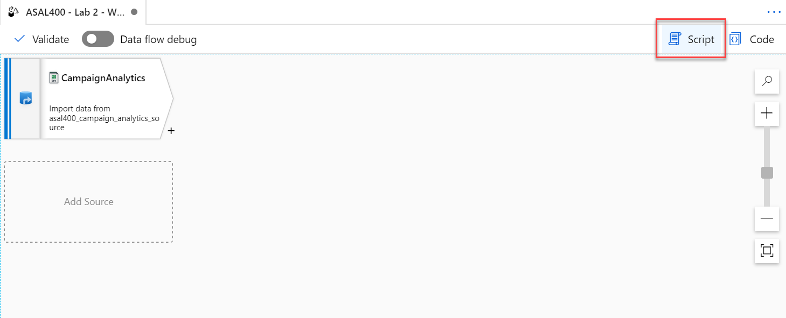

7. Replace the script with the following to provide the column mappings (`output`), then select **OK**:

    ```json
    source(output(
            {_col0_} as string,
            {_col1_} as string,
            {_col2_} as string,
            {_col3_} as string,
            {_col4_} as string,
            {_col5_} as double,
            {_col6_} as string,
            {_col7_} as double,
            {_col8_} as string,
            {_col9_} as string
        ),
        allowSchemaDrift: true,
        validateSchema: false,
        skipLines: 1) ~> CampaignAnalytics
    ```

    Your script should match the following:

    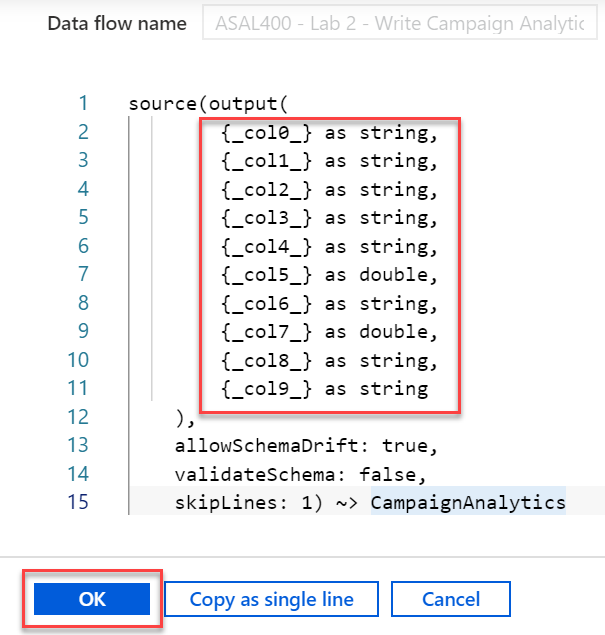

8. Select the **CampaignAnalytics** data source, then select **Projection**. The projection should display the following schema:

    

9. Select the **+** to the right of the `CampaignAnalytics` source, then select the **Select** schema modifier from the context menu.

    

10. Under **Select settings**, configure the following:

    - **Output stream name**: Enter `MapCampaignAnalytics`.
    - **Incoming stream**: Select `CampaignAnalytics`.
    - **Options**: Check both options.
    - **Input columns**: make sure `Auto mapping` is unchecked, then provide the following values in the **Name as** fields:
      - Region
      - Country
      - ProductCategory
      - CampaignName
      - RevenuePart1
      - Revenue
      - RevenueTargetPart1
      - RevenueTarget
      - City
      - State

    

11. Select the **+** to the right of the `MapCampaignAnalytics` source, then select the **Derived Column** schema modifier from the context menu.

    

12. Under **Derived column's settings**, configure the following:

    - **Output stream name**: Enter `ConvertColumnTypesAndValues`.
    - **Incoming stream**: Select `MapCampaignAnalytics`.
    - **Columns**: Provide the following information:

        | Column | Expression | Description |
        | --- | --- | --- |
        | Revenue | `toDecimal(replace(concat(toString(RevenuePart1), toString(Revenue)), '\\', ''), 10, 2, '$###,###.##')` | Concatenate the `RevenuePart1` and `Revenue` fields, replace the invalid `\` character, then convert and format the data to a decimal type. |
        | RevenueTarget | `toDecimal(replace(concat(toString(RevenueTargetPart1), toString(RevenueTarget)), '\\', ''), 10, 2, '$###,###.##')` | Concatenate the `RevenueTargetPart1` and `RevenueTarget` fields, replace the invalid `\` character, then convert and format the data to a decimal type. |

    

13. Select the **+** to the right of the `ConvertColumnTypesAndValues` step, then select the **Select** schema modifier from the context menu.

    

14. Under **Select settings**, configure the following:

    - **Output stream name**: Enter `SelectCampaignAnalyticsColumns`.
    - **Incoming stream**: Select `ConvertColumnTypesAndValues`.
    - **Options**: Check both options.
    - **Input columns**: make sure `Auto mapping` is unchecked, then **Delete** `RevenuePart1` and `RevenueTargetPart1`. We no longer need these fields.

    

15. Select the **+** to the right of the `SelectCampaignAnalyticsColumns` step, then select the **Sink** destination from the context menu.

    

16. Under **Sink**, configure the following:

    - **Output stream name**: Enter `CampaignAnalyticsASA`.
    - **Incoming stream**: Select `SelectCampaignAnalyticsColumns`.
    - **Sink type**: Select `Dataset`.
    - **Dataset**: Select `asal400_wwi_campaign_analytics_asa`, which is the CampaignAnalytics SQL table.
    - **Options**: Check `Allow schema drift` and uncheck `Validate schema`.

    

17. Select **Settings**, then configure the following:

    - **Update method**: Check `Allow insert` and leave the rest unchecked.
    - **Table action**: Select `Truncate table`.
    - **Enable staging**: Uncheck this option. The sample CSV file is small, making the staging option unnecessary.

    

18. Your completed data flow should look similar to the following:

    

19. Select **Publish all** to save your new data flow.

    

### Task 2: Create campaign analytics data pipeline

In order to run the new data flow, you need to create a new pipeline and add a data flow activity to it.

1. Navigate to the **Integrate** hub.

    

2. Select + then **Pipeline** to create a new pipeline.

    

3. In the **General** section of the **Properties** blade for the new pipeline, enter the following **Name**: `ASAL400 - Lab 2 - Write Campaign Analytics to ASA`.

4. Expand **Move & transform** within the Activities list, then drag the **Data flow** activity onto the pipeline canvas.

    

5. In the `Adding data flow` blade, select **Use existing data flow**, then select the `asal400_lab2_writecampaignanalyticstoasa` existing data flow you created in the previous task.

    

6. Select **Finish**.

7. Select the mapping data flow activity on the canvas. Select the **Settings** tab, then ensure `AutoResolveIntegrationRuntime` is selected for **Run on (Azure IR)**. Choose the `Compute Optimized` **Compute type** and select `32 (+ 16 cores)` for the **Core count**.

    

8. Select **Publish all** to save your new pipeline.

    

### Task 3: Run the campaign analytics data pipeline

1. Select **Add trigger**, and then select **Trigger now** in the toolbar at the top of the pipeline canvas.

    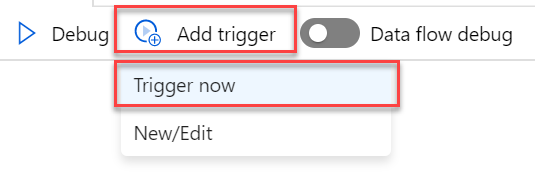

2. In the `Pipeline run` blade, select **OK** to start the pipeline run.

    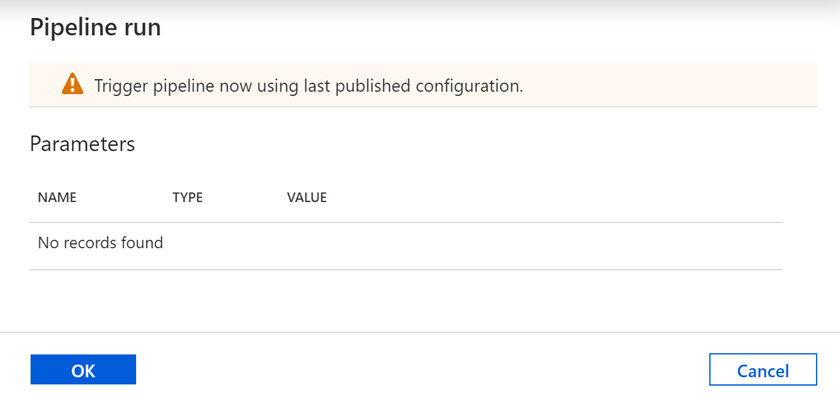

3. Navigate to the **Monitor** hub.

    

4. Wait for the pipeline run to successfully complete. You may need to refresh the view.

    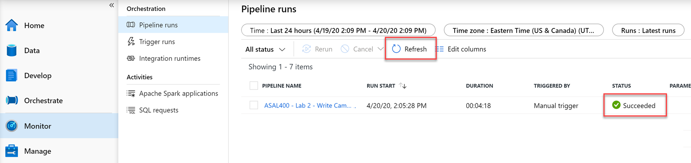

5. **Important:** if the pipeline run fails with `Internal Server Error:Failed to submit job on job cluster. Integration Runtime` or takes longer than **5 minutes** to complete, you are likely experiencing capacity-related issues. If one of these cases is true, **skip ahead** to **Task 4b (fallback)** to see a successful outcome.

### Task 4: View campaign analytics table contents

Now that the pipeline run is complete, let's take a look at the SQL table to verify the data successfully copied.

1. Navigate to the **Data** hub.

    

2. Expand the `SqlPool01` database underneath the **Workspace** section, then expand `Tables`.

3. Right-click the `wwi.CampaignAnalytics` table, then select the **Select TOP 100 rows** menu item under the New SQL script context menu. You may need to refresh to see the new tables.

    

4. The properly transformed data should appear in the query results.

    

5. Update the query to the following and **Run**:

    ```sql
    SELECT ProductCategory
    ,SUM(Revenue) AS TotalRevenue
    ,SUM(RevenueTarget) AS TotalRevenueTarget
    ,(SUM(RevenueTarget) - SUM(Revenue)) AS Delta
    FROM [wwi].[CampaignAnalytics]
    GROUP BY ProductCategory
    ```

6. In the query results, select the **Chart** view. Configure the columns as defined:

    - **Chart type**: Select `Column`.
    - **Category column**: Select `ProductCategory`.
    - **Legend (series) columns**: Select `TotalRevenue`, `TotalRevenueTarget`, and `Delta`.

    

### Task 4b (fallback): View campaign analytics table contents

> Read this task if the pipeline run failed due to capacity-related issues.

The pipeline truncates the `wwi.CampaignAnalytics` table and inserts the cleaned up campaign analytics data from the improperly formatted CSV. When we query the table to view its contents, it looks like the following:


If we wish to view the total revenue compared to the target revenue of each product category, we can update the query as follows:

```sql
SELECT ProductCategory
,SUM(Revenue) AS TotalRevenue
,SUM(RevenueTarget) AS TotalRevenueTarget
,(SUM(RevenueTarget) - SUM(Revenue)) AS Delta
FROM [wwi].[CampaignAnalytics]
GROUP BY ProductCategory
```

The query results output includes the standard Table view, as well as a Chart view. If we switch to the column chart view and set the category column to `ProductCategory`, we see the following:


## Exercise 3: Create data pipeline to join disparate data sources

### Task 1: Create user profile data flow

1. Navigate to the **Develop** hub.

    

2. Select + then **Data flow** to create a new data flow.

    

3. In the **General** section of the **Profiles** pane of the new data flow, update the **Name** to the following: `asal400_lab2_writeuserprofiledatatoasa`.

4. Select **Add Source** on the data flow canvas.

    

5. Under **Source settings**, configure the following:

    - **Output stream name**: Enter `EcommerceUserProfiles`.
    - **Source type**: Select `Dataset`.
    - **Dataset**: Select `asal400_ecommerce_userprofiles_source`.

    

6. Select the **Source options** tab, then configure the following:

    - **Wildcard paths**: Enter `online-user-profiles-02/*.json`.
    - **JSON Settings**: Expand this section, then select the **Single document** setting. This denotes that each file contains a single JSON document.

    

7. Select the **+** to the right of the `EcommerceUserProfiles` source, then select the **Derived Column** schema modifier from the context menu.

    

8. Under **Derived column's settings**, configure the following:

    - **Output stream name**: Enter `userId`.
    - **Incoming stream**: Select `EcommerceUserProfiles`.
    - **Columns**: Provide the following information:

        | Column | Expression | Description |
        | --- | --- | --- |
        | visitorId | `toInteger(visitorId)` | Converts the `visitorId` column from a string to an integer. |

    

9. Select the **+** to the right of the `userId` step, then select the **Flatten** schema modifier from the context menu.

    

10. Under **Flatten settings**, configure the following:

    - **Output stream name**: Enter `UserTopProducts`.
    - **Incoming stream**: Select `userId`.
    - **Unroll by**: Select `[] topProductPurchases`.
    - **Input columns**: Provide the following information:

        | userId's column | Name as |
        | --- | --- |
        | visitorId | `visitorId` |
        | topProductPurchases.productId | `productId` |
        | topProductPurchases.itemsPurchasedLast12Months | `itemsPurchasedLast12Months` |

    

    These settings provide a flattened view of the data source with one or more rows per `visitorId`, similar to when you explored the data within the Spark notebook in lab 1. Using data preview requires you to enable Debug mode, which we are not enabling for this lab. *The following screenshot is for illustration only*:

    

11. Select the **+** to the right of the `UserTopProducts` step, then select the **Derived Column** schema modifier from the context menu.

    

12. Under **Derived column's settings**, configure the following:

    - **Output stream name**: Enter `DeriveProductColumns`.
    - **Incoming stream**: Select `UserTopProducts`.
    - **Columns**: Provide the following information:

        | Column | Expression | Description |
        | --- | --- | --- |
        | productId | `toInteger(productId)` | Converts the `productId` column from a string to an integer. |
        | itemsPurchasedLast12Months | `toInteger(itemsPurchasedLast12Months)` | Converts the `itemsPurchasedLast12Months` column from a string to an integer. |

    

13. Select **Add Source** on the data flow canvas beneath the `EcommerceUserProfiles` source.

    

14. Under **Source settings**, configure the following:

    - **Output stream name**: Enter `UserProfiles`.
    - **Source type**: Select `Dataset`.
    - **Dataset**: Select `asal400_customerprofile_cosmosdb`.

    

15. Since we are not using the data flow debugger, we need to enter the data flow's Script view to update the source projection. Select **Script** in the toolbar above the canvas.

    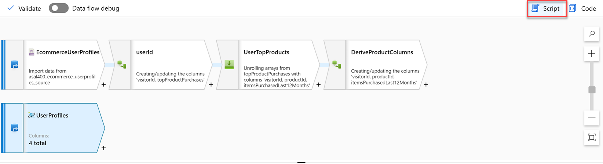

16. Locate the **UserProfiles** `source` in the script and replace its script block with the following to set `preferredProducts` as an `integer[]` array and ensure the data types within the `productReviews` array are correctly defined:

    ```json
    source(output(
            cartId as string,
            preferredProducts as integer[],
            productReviews as (productId as integer, reviewDate as string, reviewText as string)[],
            userId as integer
        ),
        allowSchemaDrift: true,
        validateSchema: false,
        format: 'document') ~> UserProfiles
    ```

    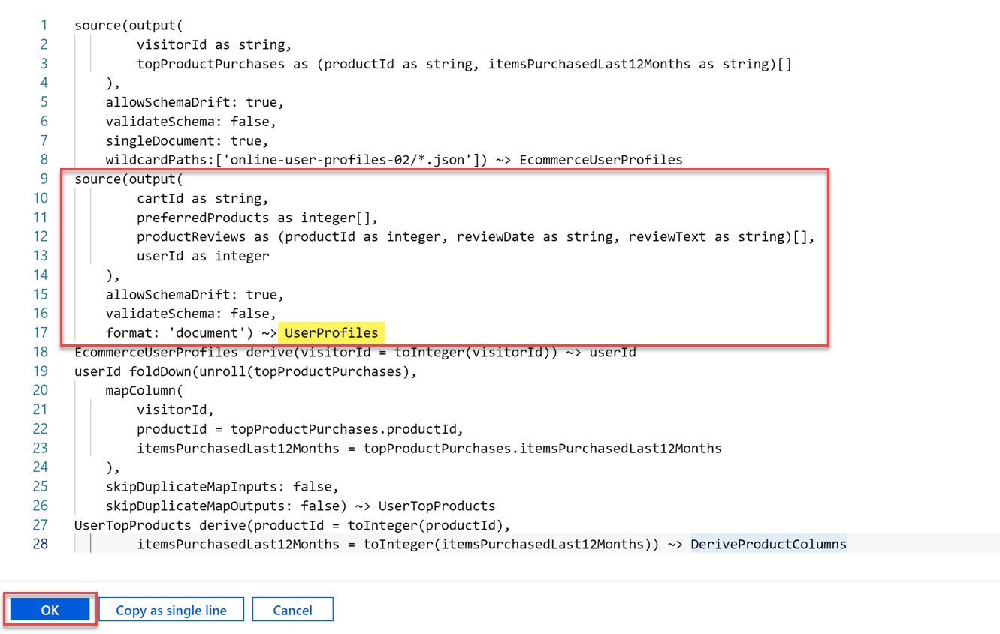

17. Select **OK** to apply the script changes. The data source has now been updated with the new schema. The following screenshot shows what the source data looks like if you are able to view it with the data preview option. Using data preview requires you to enable Debug mode, which we are not enabling for this lab. *The following screenshot is for illustration only*:

    

18. Select the **+** to the right of the `UserProfiles` source, then select the **Flatten** schema modifier from the context menu.

    

19. Under **Flatten settings**, configure the following:

    - **Output stream name**: Enter `UserPreferredProducts`.
    - **Incoming stream**: Select `UserProfiles`.
    - **Unroll by**: Select `[] preferredProducts`.
    - **Input columns**: Provide the following information. Be sure to **delete** `cartId` and `[] productReviews`:

        | UserProfiles's column | Name as |
        | --- | --- |
        | userId | `userId` |
        | [] preferredProducts | `preferredProductId` |

    

    These settings provide a flattened view of the data source with one or more rows per `userId`. Using data preview requires you to enable Debug mode, which we are not enabling for this lab. *The following screenshot is for illustration only*:

    

20. Now it is time to join the two data sources. Select the **+** to the right of the `DeriveProductColumns` step, then select the **Join** option from the context menu.

    

21. Under **Join settings**, configure the following:

    - **Output stream name**: Enter `JoinTopProductsWithPreferredProducts`.
    - **Left stream**: Select `DeriveProductColumns`.
    - **Right stream**: Select `UserPreferredProducts`.
    - **Join type**: Select `Full outer`.
    - **Join conditions**: Provide the following information:

        | Left: DeriveProductColumns's column | Right: UserPreferredProducts's column |
        | --- | --- |
        | `visitorId` | `userId` |

    

22. Select **Optimize** and configure the following:

    - **Broadcast**: Select `Fixed`.
    - **Broadcast options**: Check `Left: 'DeriveProductColumns'`.
    - **Partition option**: Select `Set partitioning`.
    - **Partition type**: Select `Hash`.
    - **Number of partitions**: Enter `30`.
    - **Column**: Select `productId`.

    

23. Select the **Inspect** tab to see the join mapping, including the column feed source and whether the column is used in a join.

    

    **For illustrative purposes of data preview only:** Since we are not turning on data flow debugging, do not perform this step. In this small sample of data, likely the `userId` and `preferredProductId` columns will only show null values. If you want to get a sense of how many records contain values for these fields, select a column, such as `preferredProductId`, then select **Statistics** in the toolbar above. This displays a chart for the column showing the ratio of values.

    

24. Select the **+** to the right of the `JoinTopProductsWithPreferredProducts` step, then select the **Derived Column** schema modifier from the context menu.

    

25. Under **Derived column's settings**, configure the following:

    - **Output stream name**: Enter `DerivedColumnsForMerge`.
    - **Incoming stream**: Select `JoinTopProductsWithPreferredProducts`.
    - **Columns**: Provide the following information (_type in_ the _first two_ column names):

        | Column | Expression | Description |
        | --- | --- | --- |
        | isTopProduct | `toBoolean(iif(isNull(productId), 'false', 'true'))` | Returns `true` if `productId` is not null. Recall that `productId` is fed by the e-commerce top user products data lineage. |
        | isPreferredProduct | `toBoolean(iif(isNull(preferredProductId), 'false', 'true'))` | Returns `true` if `preferredProductId` is not null. Recall that `preferredProductId` is fed by the Azure Cosmos DB user profile data lineage. |
        | productId | `iif(isNull(productId), preferredProductId, productId)` | Sets the `productId` output to either the `preferredProductId` or `productId` value, depending on whether `productId` is null.
        | userId | `iif(isNull(userId), visitorId, userId)` | Sets the `userId` output to either the `visitorId` or `userId` value, depending on whether `userId` is null.

    

    The derived column settings provide the following result:

    

26. Select the **+** to the right of the `DerivedColumnsForMerge` step, then select the **Filter** destination from the context menu.

    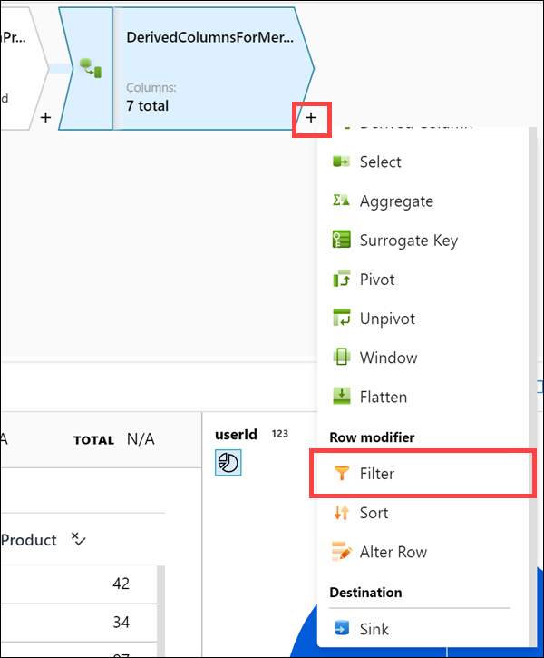

    We are adding the Filter step to remove any records where the `ProductId` is null. The data sets have a small percentage of invalid records, and null `ProductId` values will cause errors when loading into the `UserTopProductPurchases` SQL pool table.

27. Set the **Filter on** expression to **`!isNull(productId)`**.

    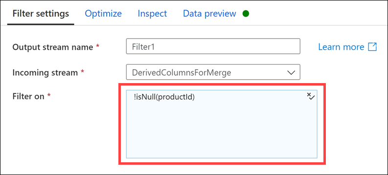

28. Select the **+** to the right of the `Filter1` step, then select the **Sink** destination from the context menu.

    

29. Under **Sink**, configure the following:

    - **Output stream name**: Enter `UserTopProductPurchasesASA`.
    - **Incoming stream**: Select `Filter1`.
    - **Sink type**: Select `Dataset`.
    - **Dataset**: Select `asal400_wwi_usertopproductpurchases_asa`, which is the UserTopProductPurchases SQL table.
    - **Options**: Check `Allow schema drift` and uncheck `Validate schema`.

    

30. Select **Settings**, then configure the following:

    - **Update method**: Check `Allow insert` and leave the rest unchecked.
    - **Table action**: Select `Truncate table`.
    - **Enable staging**: `Check` this option. Since we are importing a lot of data, we want to enable staging to improve performance.

    

31. Select **Mapping**, then configure the following:

    - **Auto mapping**: `Uncheck` this option.
    - **Columns**: Provide the following information:

        | Input columns | Output columns |
        | --- | --- |
        | userId | UserId |
        | productId | ProductId |
        | itemsPurchasedLast12Months | ItemsPurchasedLast12Months |
        | isTopProduct | IsTopProduct |
        | isPreferredProduct | IsPreferredProduct |

    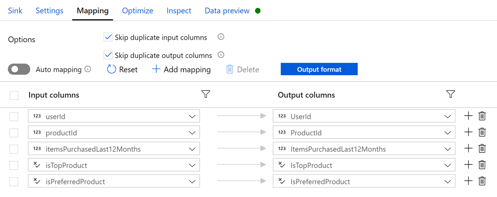

32. Your completed data flow should look similar to the following:

    

33. Select **Publish all** to save your new data flow.

    

### Task 2: Create user profile data pipeline

In order to run the new data flow, you need to create a new pipeline and add a data flow activity to it.

1. Navigate to the **Integrate** hub.

    

2. Select + then **Pipeline** to create a new pipeline.

    

3. In the **General** section of the **Properties** blade for the new pipeline, enter the following **Name**: `ASAL400 - Lab 2 - Write User Profile Data to ASA`.

4. Expand **Move & transform** within the Activities list, then drag the **Data flow** activity onto the pipeline canvas.

    

5. In the `Adding data flow` blade, select **Use existing data flow**, then select the `asal400_lab2_writeuserprofiledatatoasa` existing data flow you created in the previous task.

    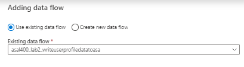

6. Select **Finish**.

7. Select the mapping data flow activity on the canvas. Select the **Settings** tab, then ensure `AutoResolveIntegrationRuntime` is selected for **Run on (Azure IR)**. Choose the `Compute Optimized` **Compute type** and select `32 (+ 16 cores)` for the **Core count**.

8. Expand **staging** and configure the following:

    - **Staging linked service**: Select the `asadatalakeSUFFIX` linked service.
    - **Staging storage folder**: Enter `staging/userprofiles`. The `userprofiles` folder will be automatically created for you during the first pipeline run.

    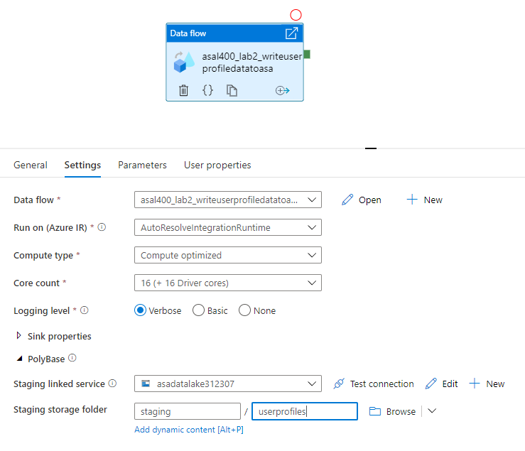

9. Select **Publish all** to save your new pipeline.

    

> **Important:** if your earlier pipeline run failed due to experiencing capacity-related issues and you were required to skip ahead to a fallback task, you will need to skip ahead again. The next task and the exercise that follows depend on your ability to successfully run your pipeline. If you cannot successfully run your pipeline, **skip ahead** to **Exercise 4b (fallback)** to see a successful outcome.

### Task 3: Trigger, monitor, and analyze the user profile data pipeline

1. Select **Add trigger** and select **Trigger now** in the toolbar at the top of the pipeline canvas.

    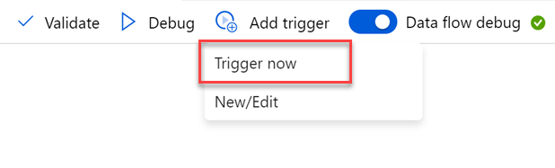

2. In the `Pipeline run` blade, select **OK** to start the pipeline run.

    

3. Navigate to the **Monitor** hub.

    

4. Wait for the pipeline run to successfully complete. You may need to refresh the view.

    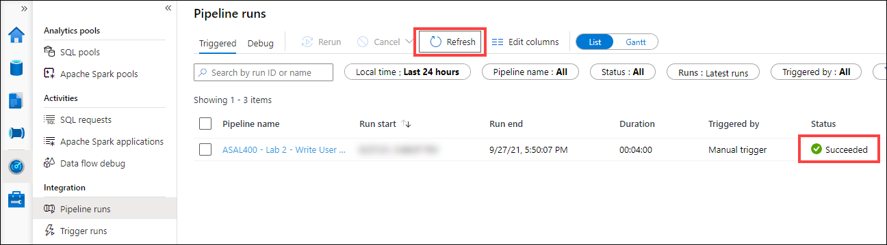

5. Select the name of the pipeline to view the pipeline's activity runs. Hover over the data flow activity name in the `Activity runs` list, then select the **Data flow details** icon.

    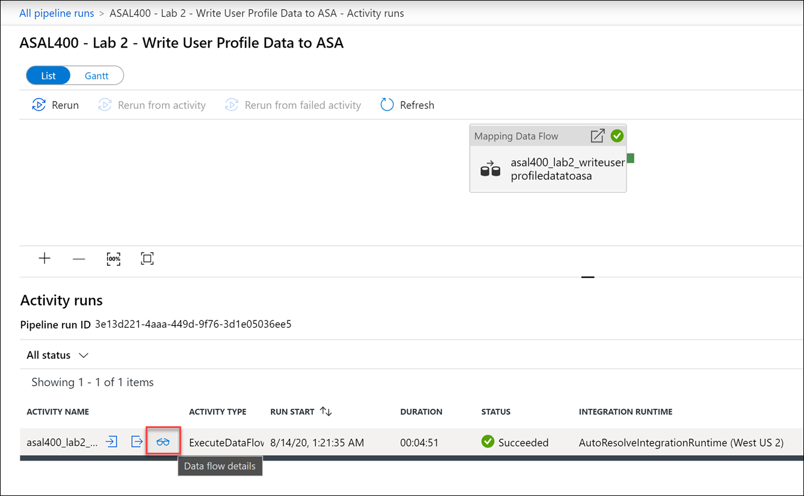

6. The data flow details displays the data flow steps and processing details. In our example, processing time took around 30 seconds to process and output around 510k rows. You can see which activities took longest to complete. The cluster startup time contributed almost three and a half minutes to the total pipeline run.

    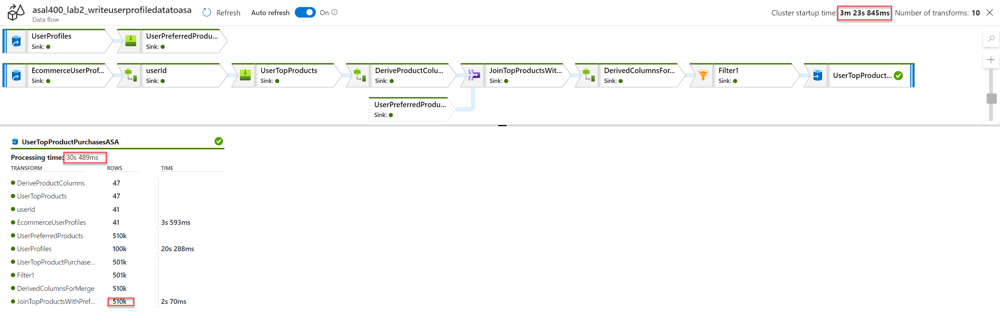

7. Select the `UserTopProductPurchasesASA` sink to view its details. We can see that 501,795 rows were calculated with a total of 30 partitions. It took around 3 seconds to stage the data in ADLS Gen2 prior to writing the data to the SQL table. The total sink processing time in our case was around 30 seconds. It is also apparent that we have a hot partition that is significantly larger than the others. If we need to squeeze extra performance out of this pipeline, we can re-evaluate data partitioning to more evenly spread the partitions to better facilitate parallel data loading and filtering. We could also experiment with disabling staging to see if there's a processing time difference. Finally, the size of the SQL Pool plays a factor in how long it takes to ingest data into the sink.

    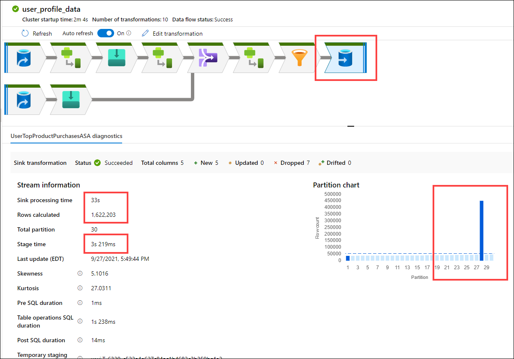

## Exercise 4: Create Synapse Spark notebook to find top products

Now that we have processed, joined, and imported the user profile data, let's analyze it in greater detail. In this exercise, you will execute code to find the top 5 products for each user, based on which ones are both preferred and top, and have the most purchases in past 12 months. Then, you will calculate the top 5 products overall.

1. Navigate to the **Data** hub.

    

2. Expand the `SqlPool01` database underneath the **Databases** section. Right-click the `wwi.UserTopProductPurchases` table, then select the **Load to DataFrame** menu item under the New notebook context menu. If you don't see the table listed, select `Refresh` above.

    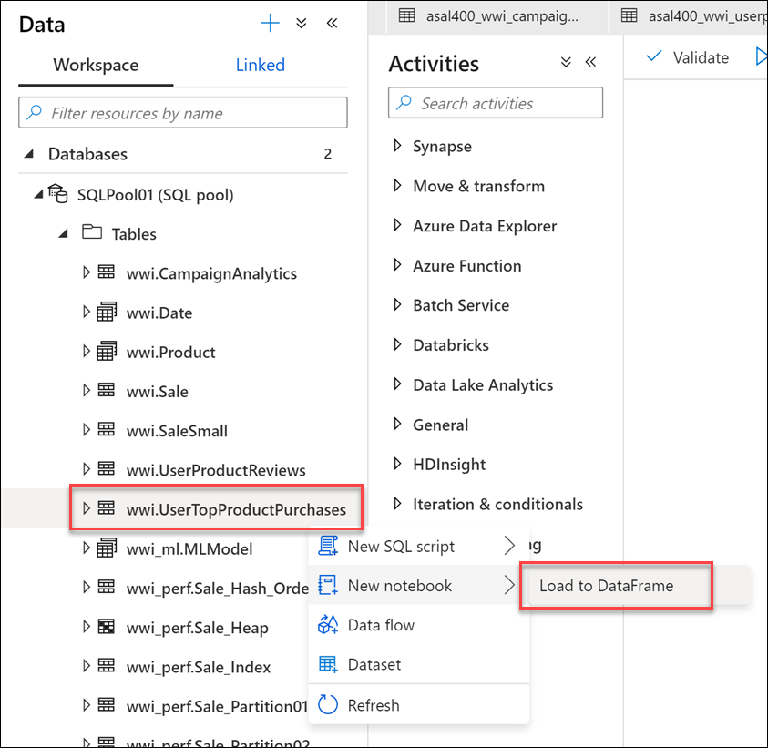

3. Attach the notebook to a Spark pool.

    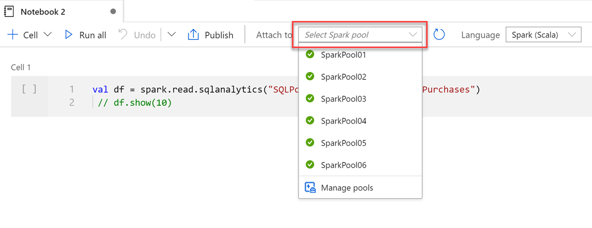

4. Select **Run all** on the notebook toolbar to execute the notebook.

    > **Note:** The first time you run a notebook in a Spark pool, Synapse creates a new session. This can take approximately 3-5 minutes.

    > **Note:** To run just the cell, either hover over the cell and select the _Run cell_ icon to the left of the cell, or select the cell then type **Ctrl+Enter** on your keyboard.

5. Create a new cell underneath by selecting **{} Add code** when hovering over the blank space at the bottom of the notebook.

    

6. Enter and execute the following in the new cell to show the first 10 rows and to create a new temporary view named `df`:

    ```python
    df.head(10)

    df.createTempView("df")
    ```

    The output should look similar to the following:

    ```text
    res3: Array[org.apache.spark.sql.Row] = Array([89792,2700,null,false,true], [89792,2338,null,false,true], [89792,4401,null,false,true], [89792,4423,null,false,true], [89792,1380,null,false,true], [6953,1296,null,false,true], [6953,1675,null,false,true], [20934,1395,null,false,true], [20934,891,null,false,true], [20934,657,null,false,true])
    ```

7. Notice that the language for this notebook is Spark Scala. We want to use Python to explore the data. To do this, we load the data into a temporary view, then we can load the view's contents into a DataFrame in a new PySpark cell. To do this, execute the following in a new cell:

    ```python
    %%pyspark
    # Calling the DataFrame df created in Scala to Python
    df = sqlContext.table("df")
    # *********************

    topPurchases = df.select(
        "UserId", "ProductId",
        "ItemsPurchasedLast12Months", "IsTopProduct",
        "IsPreferredProduct")

    topPurchases.show(100)
    ```

    We set the language of the cell to PySpark with the `%%pyspark` magic. Then we loaded the `df` view into a new DataFrame. Finally, we created a new DataFrame named `topPurchases` and displayed its contents.

    

8. Execute the following in a new cell to create a new DataFrame to hold only top preferred products where `IsTopProduct` is true:

    ```python
    %%pyspark
    from pyspark.sql.functions import *

    topPreferredProducts = (topPurchases
        .filter( col("IsTopProduct") == True)       
        .orderBy( col("ItemsPurchasedLast12Months").desc() ))

    topPreferredProducts.show(100)
    ```

    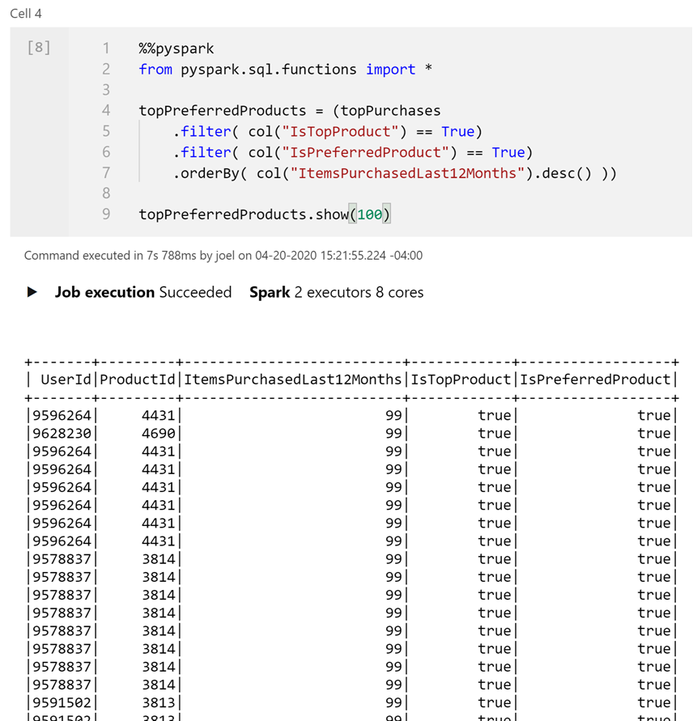

9. Execute the following in a new cell to create a new temporary view by using SQL:

    ```sql
    %%sql

    CREATE OR REPLACE TEMPORARY VIEW top_5_products
    AS
        select UserId, ProductId, ItemsPurchasedLast12Months
        from (select *,
                    row_number() over (partition by UserId order by ItemsPurchasedLast12Months desc) as seqnum
            from df
            ) a
        where seqnum <= 5 and IsTopProduct == true
        order by a.UserId
    ```

    *Note that there is no output for the above query.* The query uses the `df` temporary view as a source and applies a `row_number() over` method to apply a row number for the records for each user where `ItemsPurchasedLast12Months` is greatest. The `where` clause filters the results so we only retrieve up to five products where both `IsTopProduct` and `IsPreferredProduct` are set to true. This gives us the top five most purchased products for each user where those products are _also_ identified as their favorite products, according to their user profile stored in Azure Cosmos DB.

10. Execute the following in a new cell to create and display a new DataFrame that stores the results of the `top_5_products` temporary view you created in the previous cell:

    ```python
    %%pyspark

    top5Products = sqlContext.table("top_5_products")

    top5Products.show(100)
    ```

    You should see an output similar to the following, which displays the top five preferred products per user:

    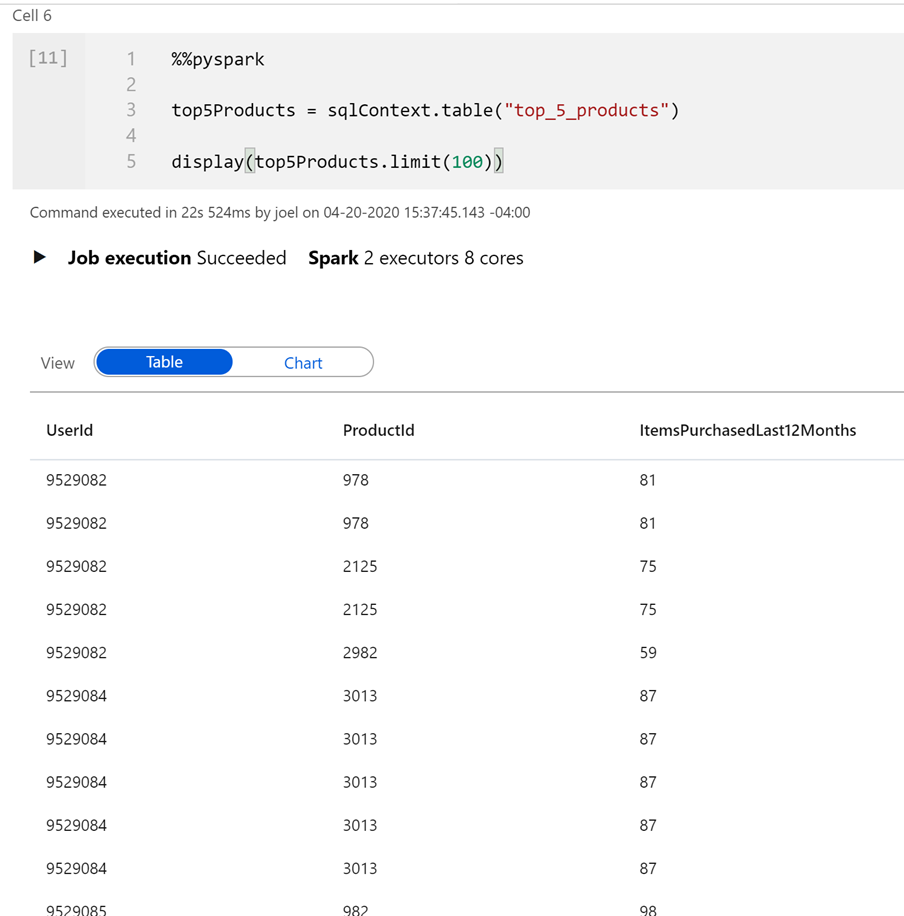

11. Execute the following in a new cell to compare the number of top preferred products to the top five preferred products per customer:

    ```python
    %%pyspark
    print('before filter: ', topPreferredProducts.count(), ', after filter: ', top5Products.count())
    ```

    The output should be similar to `before filter:  7, after filter:  5`.

12. Finally, let's calculate the top five products overall, based on those that are both preferred by customers and purchased the most. To do this, execute the following in a new cell:

    ```python
    %%pyspark

    top5ProductsOverall = (top5Products.select("ProductId","ItemsPurchasedLast12Months")
        .groupBy("ProductId")
        .agg( sum("ItemsPurchasedLast12Months").alias("Total") )
        .orderBy( col("Total").desc() )
        .limit(5))

    top5ProductsOverall.show()
    ```

    In this cell, we grouped the top five preferred products by product ID, summed up the total items purchased in the last 12 months, sorted that value in descending order, and returned the top five results. Your output should be similar to the following:

    ```text
    +---------+-----+
    |ProductId|Total|
    +---------+-----+
    |     2107| 91  |
    |     4833| 83  |
    |      347| 53  |
    |     3459| 32  |
    |     4246| 28  |
    +---------+-----+
    ```

## Exercise 4b (fallback) Monitor and analyze the user profile data pipeline and create Synapse Spark notebook to find top products

> Read this exercise if you are unable to run the pipelines due to capacity-related issues.

For illustrative purposes, we have triggered the user profile pipeline that runs the data flow that processes, joins, and imports user profile data into a Synapse SQL Pool table.

The **Monitor** hub contains, among other things, pipeline runs. When the pipeline run is successful, we select the name of the pipeline to view its activity runs. Notice that the custom `AzureLargeComputeOptimizedIntegrationRuntime` IR was used. To view its details, we hover over the data flow activity name in the `Activity runs` list, then select the **Data flow details** icon.


The data flow details displays the data flow steps and processing details. In our example, processing time took around 30 seconds to process and output around 510k rows. You can see which activities took longest to complete. The cluster startup time contributed almost three and a half minutes to the total pipeline run.


Here we select the `UserTopProductPurchasesASA` sink to view its details. We can see that 15,308,766 rows were calculated with a total of 30 partitions. It took around seven seconds to stage the data in ADLS Gen2 prior to writing the data to the SQL table. The total sink processing time in our case was around 45 seconds. It is also apparent that we have a hot partition that is significantly larger than the others. If we need to squeeze extra performance out of this pipeline, we can re-evaluate data partitioning to more evenly spread the partitions to better facilitate parallel data loading and filtering. We could also experiment with disabling staging to see if there's a processing time difference. Finally, the size of the SQL Pool plays a factor in how long it takes to ingest data into the sink.


Now that we have processed, joined, and imported the user profile data, let's analyze it in greater detail. In the example that follows, we execute code to find the top 5 products for each user, based on which ones are both preferred and top, and have the most purchases in past 12 months. Then, we calculate the top 5 products overall.

The easiest way to create a new notebook to explore the `UserTopProductPurchases` table, which we populated with the data flow, is to navigate to the **Data** hub, expand the `SqlPool01` database underneath the **Databases** section, right-click the `wwi.UserTopProductPurchases` table, then select the **Load to DataFrame** menu item under the New notebook context menu.


The notebook's language is set to `Spark (Scala)` by default. The first cell is populated with code that creates a new DataFrame from the `spark.read.sqlanalytics` method, which reads from the table in the SQL Pool. We update the cell to show the first 10 records (`df.head(10))` and to create a new temporary view named "df":

```java
val df = spark.read.sqlanalytics("SQLPool01.wwi.UserTopProductPurchases")
df.head(10)

df.createTempView("df")
```

The output looks like the following:

```text
res3: Array[org.apache.spark.sql.Row] = Array([89792,2700,null,false,true], [89792,2338,null,false,true], [89792,4401,null,false,true], [89792,4423,null,false,true], [89792,1380,null,false,true], [6953,1296,null,false,true], [6953,1675,null,false,true], [20934,1395,null,false,true], [20934,891,null,false,true], [20934,657,null,false,true])
```

Notice that the language for this notebook is Spark Scala. We want to use Python to explore the data. To do this, we load the data into a temporary view, then we can load the view's contents into a DataFrame in a new PySpark cell.

```python
%%pyspark
# Calling the DataFrame df created in Scala to Python
df = sqlContext.table("df")
# *********************

topPurchases = df.select(
    "UserId", "ProductId",
    "ItemsPurchasedLast12Months", "IsTopProduct",
    "IsPreferredProduct")

topPurchases.show(100)
```

We set the language of the cell to PySpark with the `%%pyspark` magic. Then we loaded the `df` view into a new DataFrame. Finally, we created a new DataFrame named `topPurchases` and displayed its contents.


The following cell creates a new DataFrame to hold only top preferred products where `IsTopProduct` is true:

```python
%%pyspark
from pyspark.sql.functions import *

topPreferredProducts = (topPurchases
    .filter( col("IsTopProduct") == True)       
    .orderBy( col("ItemsPurchasedLast12Months").desc() ))

topPreferredProducts.show(100)
```


This cell creates a new temporary view by using SQL:

```sql
%%sql

CREATE OR REPLACE TEMPORARY VIEW top_5_products
AS
    select UserId, ProductId, ItemsPurchasedLast12Months
    from (select *,
                row_number() over (partition by UserId order by ItemsPurchasedLast12Months desc) as seqnum
        from df
        ) a
    where seqnum <= 5 and IsTopProduct == true
    order by a.UserId
```

*Note that there is no output for the above query.* The query uses the `df` temporary view as a source and applies a `row_number() over` method to apply a row number for the records for each user where `ItemsPurchasedLast12Months` is greatest. The `where` clause filters the results so we only retrieve up to five products where both `IsTopProduct` and `IsPreferredProduct` are set to true. This gives us the top five most purchased products for each user where those products are _also_ identified as their favorite products, according to their user profile stored in Azure Cosmos DB.

The following cell creates and displays a new DataFrame that stores the results of the `top_5_products` temporary view that was created in the previous cell:

```python
%%pyspark

top5Products = sqlContext.table("top_5_products")

top5Products.show(100)
```

The output displays the top five preferred products per user:


This cell compares the number of top preferred products to the top five preferred products per customer:

```python
%%pyspark
print('before filter: ', topPreferredProducts.count(), ', after filter: ', top5Products.count())
```

The output is `before filter:  7, after filter:  5`.

Finally, this cell calculates the top five products overall, based on those that are both preferred by customers and purchased the most.

```python
%%pyspark

top5ProductsOverall = (top5Products.select("ProductId","ItemsPurchasedLast12Months")
    .groupBy("ProductId")
    .agg( sum("ItemsPurchasedLast12Months").alias("Total") )
    .orderBy( col("Total").desc() )
    .limit(5))

top5ProductsOverall.show()
```

We grouped the top five preferred products by product ID, summed up the total items purchased in the last 12 months, sorted that value in descending order, and returned the top five results. The output is:

```text
+---------+-----+
|ProductId|Total|
+---------+-----+
|     2107| 91  |
|     4833| 83  |
|      347| 53  |
|     3459| 32  |
|     4246| 28  |
+---------+-----+
```
