# Data Integration Part 2

- [Data Integration Part 2](#data-integration-part-2)
  - [Resource naming throughout this lab](#resource-naming-throughout-this-lab)
  - [Exercise 1: Create datasets and SQL tables](#exercise-1-create-datasets-and-sql-tables)
    - [Task 1: Create SQL tables](#task-1-create-sql-tables)
    - [Task 2: Create campaign analytics datasets](#task-2-create-campaign-analytics-datasets)
    - [Task 3: Create user profile datasets](#task-3-create-user-profile-datasets)
  - [Exercise 2: Create data pipeline to import poorly formatted CSV](#exercise-2-create-data-pipeline-to-import-poorly-formatted-csv)
    - [Task 1: Create campaign analytics data flow](#task-1-create-campaign-analytics-data-flow)
    - [Task 2: Create campaign analytics data pipeline](#task-2-create-campaign-analytics-data-pipeline)
    - [Task 3: Run the campaign analytics data pipeline](#task-3-run-the-campaign-analytics-data-pipeline)
    - [Task 4: View campaign analytics table contents](#task-4-view-campaign-analytics-table-contents)
  - [Exercise 3: Create data pipeline to import user reviews](#exercise-3-create-data-pipeline-to-import-user-reviews)
    - [Task 1: Create user reviews data flow](#task-1-create-user-reviews-data-flow)
    - [Task 2: Create user reviews data pipeline](#task-2-create-user-reviews-data-pipeline)
  - [Exercise 4: Create data pipeline to join disparate data sources](#exercise-4-create-data-pipeline-to-join-disparate-data-sources)
    - [Task 1: Create user profile data flow](#task-1-create-user-profile-data-flow)
  - [Exercise 5: Create pipeline trigger window to import remaining Parquet data](#exercise-5-create-pipeline-trigger-window-to-import-remaining-parquet-data)
  - [Exercise 6: Create Synapse Spark notebook to find top products](#exercise-6-create-synapse-spark-notebook-to-find-top-products)

```
Create e2e pipeline for initial load & update
Data Prep: Handle bad data, file formats, join disparate sources
Troubleshoot: pipeline/activity failure (something beyond simply looking at the portal)
Optimize: trigger window, exec time

Triggering Pipelines
Creating schedule, tumbling window, event (blob vs ADLS)
Other cases: trigger via Function
    - Native and non-standard ways to trigger a pipeline
    - Set up change feed-triggered function (CSharp script via portal). Edit a document in Cosmos DB (maybe a pipeline parameter), which triggers the function
    - Maybe trigger the pipeline via REST call and shown here: https://github.com/solliancenet/azure-synapse-analytics/blob/master/infrastructure/asaexp/setup/ASAExp%20-%20Import%20SQL%20Pool%20Tables.ps1#L114

Spark notebook to connect to the wwi.UserTopProductPurchases Synapse database table.
    - Have user right-click the table, choose notebook, then new Spark notebook
    - Execute code to find the top 5 products for each user, based on which ones are both preferred and top, and have the most purchases in past 12 months
    - Top 5 products overall

```

## Resource naming throughout this lab

For the remainder of this guide, the following terms will be used for various ASA-related resources (make sure you replace them with actual names and values):

| Azure Synapse Analytics Resource  | To be referred to |
| --- | --- |
| Workspace resource group | `WorkspaceResourceGroup` |
| Workspace / workspace name | `Workspace` |
| Primary Storage Account | `PrimaryStorage` |
| Default file system container | `DefaultFileSystem` |
| SQL Pool | `SqlPool01` |

## Exercise 1: Create datasets and SQL tables

### Task 1: Create SQL tables

1. Open Synapse Analytics Studio, and then navigate to the **Develop** hub.

    

2. From the **Develop** menu, select the + button and choose **SQL Script** from the context menu.

    

3. In the toolbar menu, connect to the database on which you want to execute the query.

    

4. In the query window, replace the script with the following to create a new table for the Campaign Analytics CSV file:

    ```sql
    CREATE TABLE [wwi].[CampaignAnalytics]
    (
        [Region] [nvarchar](50)  NOT NULL,
        [Country] [nvarchar](30)  NOT NULL,
        [ProductCategory] [nvarchar](50)  NOT NULL,
        [CampaignName] [nvarchar](500)  NOT NULL,
        [Revenue] [decimal](10,2)  NULL,
        [RevenueTarget] [decimal](10,2)  NULL,
        [City] [nvarchar](50)  NULL,
        [State] [nvarchar](25)  NULL
    )
    WITH
    (
        DISTRIBUTION = HASH ( [Region] ),
        CLUSTERED COLUMNSTORE INDEX
    )
    ```

5. Select **Run** from the toolbar menu to execute the SQL command.

    

6. In the query window, replace the script with the following to create a new table for the Sales Parquet files:

    ```sql
    CREATE TABLE [wwi].[Sale]
    (
        [TransactionId] [uniqueidentifier]  NOT NULL,
        [CustomerId] [int]  NOT NULL,
        [ProductId] [smallint]  NOT NULL,
        [Quantity] [smallint]  NOT NULL,
        [Price] [decimal](9,2)  NOT NULL,
        [TotalAmount] [decimal](9,2)  NOT NULL,
        [TransactionDate] [int]  NOT NULL,
        [ProfitAmount] [decimal](9,2)  NOT NULL,
        [Hour] [tinyint]  NOT NULL,
        [Minute] [tinyint]  NOT NULL,
        [StoreId] [smallint]  NOT NULL
    )
    WITH
    (
        DISTRIBUTION = HASH ( [CustomerId] ),
        CLUSTERED COLUMNSTORE INDEX,
        PARTITION
        (
            [TransactionDate] RANGE RIGHT FOR VALUES (20100101, 20100201, 20100301, 20100401, 20100501, 20100601, 20100701, 20100801, 20100901, 20101001, 20101101, 20101201, 20110101, 20110201, 20110301, 20110401, 20110501, 20110601, 20110701, 20110801, 20110901, 20111001, 20111101, 20111201, 20120101, 20120201, 20120301, 20120401, 20120501, 20120601, 20120701, 20120801, 20120901, 20121001, 20121101, 20121201, 20130101, 20130201, 20130301, 20130401, 20130501, 20130601, 20130701, 20130801, 20130901, 20131001, 20131101, 20131201, 20140101, 20140201, 20140301, 20140401, 20140501, 20140601, 20140701, 20140801, 20140901, 20141001, 20141101, 20141201, 20150101, 20150201, 20150301, 20150401, 20150501, 20150601, 20150701, 20150801, 20150901, 20151001, 20151101, 20151201, 20160101, 20160201, 20160301, 20160401, 20160501, 20160601, 20160701, 20160801, 20160901, 20161001, 20161101, 20161201, 20170101, 20170201, 20170301, 20170401, 20170501, 20170601, 20170701, 20170801, 20170901, 20171001, 20171101, 20171201, 20180101, 20180201, 20180301, 20180401, 20180501, 20180601, 20180701, 20180801, 20180901, 20181001, 20181101, 20181201, 20190101, 20190201, 20190301, 20190401, 20190501, 20190601, 20190701, 20190801, 20190901, 20191001, 20191101, 20191201)
        )
    )
    ```

7. Select **Run** from the toolbar menu to execute the SQL command.

8. In the query window, replace the script with the following to create a new table for the user reviews contained within the user profile data in Azure Cosmos DB:

    ```sql
    CREATE TABLE [wwi].[UserProductReviews]
    (
        [UserId] [int]  NOT NULL,
        [ProductId] [int]  NOT NULL,
        [ReviewText] [nvarchar](1000)  NOT NULL,
        [ReviewDate] [datetime]  NOT NULL
    )
    WITH
    (
        DISTRIBUTION = HASH ( [ProductId] ),
        CLUSTERED COLUMNSTORE INDEX
    )
    ```

9. Select **Run** from the toolbar menu to execute the SQL command.

10. In the query window, replace the script with the following to create a new table that joins users' preferred products stored in Azure Cosmos DB with top product purchases per user from the e-commerce site, stored in JSON files within the data lake:

    ```sql
    CREATE TABLE [wwi].[UserTopProductPurchases]
    (
        [UserId] [int]  NOT NULL,
        [ProductId] [int]  NOT NULL,
        [ItemsPurchasedLast12Months] [int]  NULL,
        [IsTopProduct] [bit]  NOT NULL,
        [IsPreferredProduct] [bit]  NOT NULL
    )
    WITH
    (
        DISTRIBUTION = HASH ( [UserId] ),
        CLUSTERED COLUMNSTORE INDEX
    )
    ```

11. Select **Run** from the toolbar menu to execute the SQL command.

### Task 2: Create campaign analytics datasets

Your organization was provided a poorly formatted CSV file containing marketing campaign data. The file was uploaded to the data lake and now it must be imported into the data warehouse.

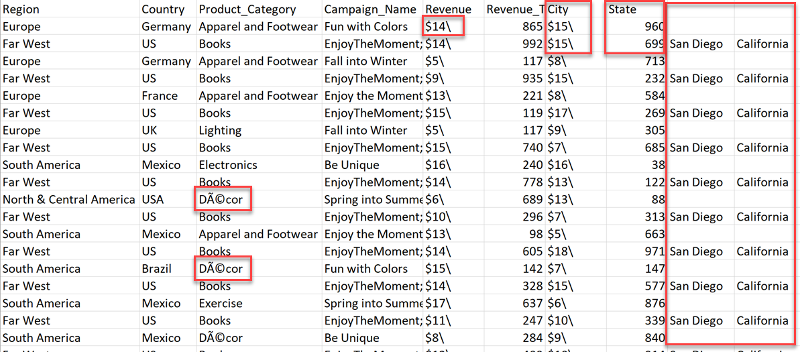

Issues include invalid characters in some product categories, invalid characters in the revenue currency data, and misaligned columns.

1. Navigate to the **Data** hub.

    

2. Create a new **Azure Data Lake Storage Gen2** dataset with the **DelimitedText** format type with the following characteristics:

    - **Name**: Enter `asal400_campaign_analytics_source`.
    - **Linked service**: Select the `asadatalake01` linked service.
    - **File path**: Browse to the `wwi-02/campaign-analytics/campaignanalytics.csv` path.
    - **First row as header**: Leave `unchecked`. **We are skipping the header** because there is a mismatch between the number of columns in the header and the number of columns in the data rows.
    - **Import schema**: Select `From connection/store`.

    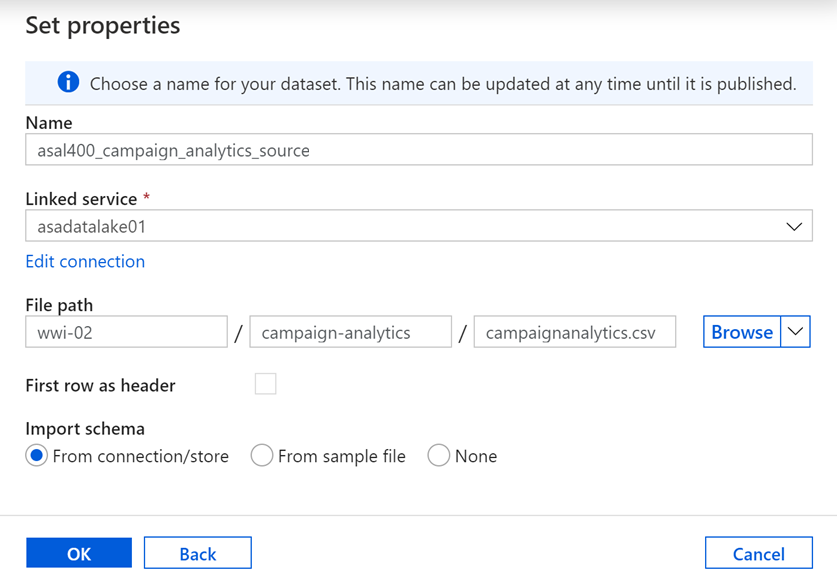

3. After creating the dataset, navigate to its **Connection** tab. Leave the default settings. They should match the following configuration:

    - **Compression type**: Select `none`.
    - **Column delimiter**: Select `Comma (,)`.
    - **Row delimiter**: Select `Auto detect (\r,\n, or \r\n)`.
    - **Encoding**: Select `Default(UTF-8).
    - **Escape character**: Select `Backslash (\)`.
    - **Quote character**: Select `Double quote (")`.
    - **First row as header**: Leave `unchecked`.
    - **Null value**: Leave the field empty.

    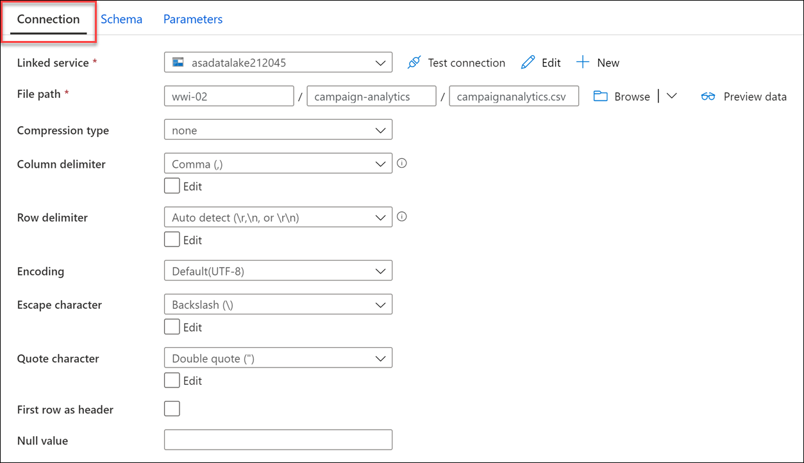

4. Select **Preview data**.

5. Preview data displays a sample of the CSV file. You can see some of the issues shown in the screenshot at the beginning of this task. Notice that since we are not setting the first row as the header, the header columns appear as the first row. Also, notice that the city and state values seen in the earlier screenshot do not appear. This is because of the mismatch in the number of columns in the header row compared to the rest of the file. We will exclude the first row when we create the data flow in the next exercise.

    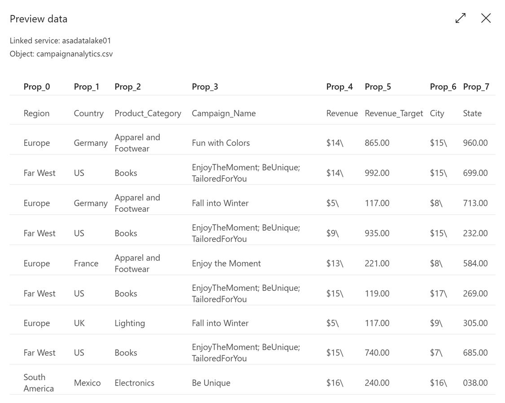

6. Create a new **Azure Synapse Analytics** dataset with the following characteristics:

    - **Name**: Enter `asal400_wwi_campaign_analytics_asa`.
    - **Linked service**: Select the `SqlPool01` service.
    - **Table name**: Select `wwi.CampaignAnalytics`.
    - **Import schema**: Select `From connection/store`.

    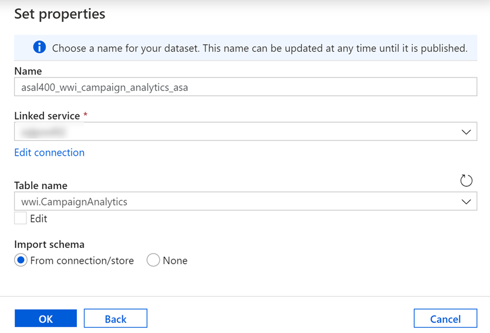

### Task 3: Create user profile datasets

User profile data comes from two different data sources. In lab 1, you created datasets for these sources: `asal400_ecommerce_userprofiles_source` and `asal400_customerprofile_cosmosdb`. The customer profile data from an e-commerce system that provides top product purchases for each visitor of the site (customer) over the past 12 months is stored within JSON files in the data lake. User profile data containing, among other things, product preferences and product reviews is stored as JSON documents in Cosmos DB.

In this task, you'll create datasets for the SQL tables that will serve as data sinks for data pipelines you'll create later in this lab.

1. Create a new **Azure Synapse Analytics** dataset with the following characteristics:

    - **Name**: Enter `asal400_wwi_userproductreviews_asa`.
    - **Linked service**: Select the `SqlPool01` service.
    - **Table name**: Select `wwi.UserProductReviews`.
    - **Import schema**: Select `From connection/store`.

    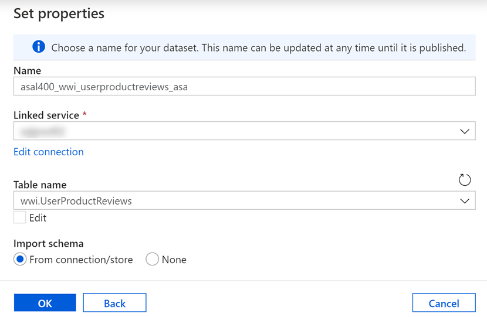

2. Create a new **Azure Synapse Analytics** dataset with the following characteristics:

    - **Name**: Enter `asal400_wwi_usertopproductpurchases_asa`.
    - **Linked service**: Select the `SqlPool01` service.
    - **Table name**: Select `wwi.UserTopProductPurchases`.
    - **Import schema**: Select `From connection/store`.

    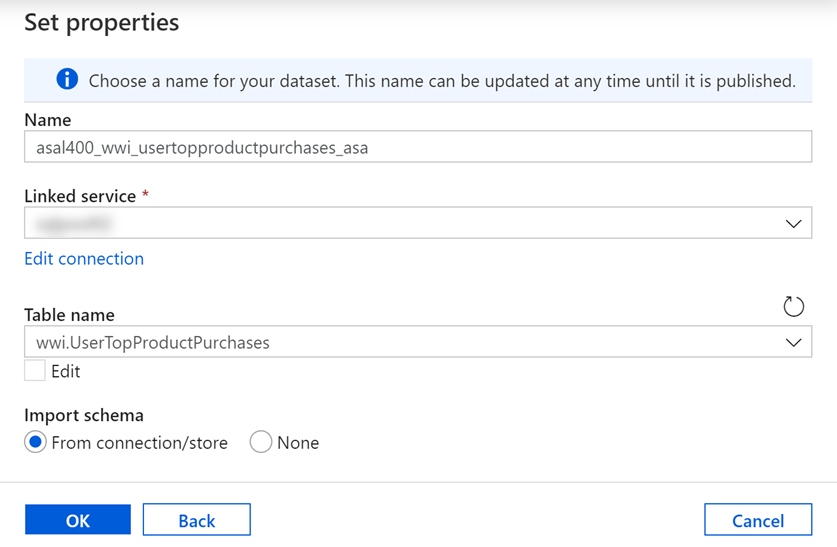

## Exercise 2: Create data pipeline to import poorly formatted CSV

### Task 1: Create campaign analytics data flow

1. Navigate to the **Develop** hub.

    

2. Select + then **Data flow** to create a new data flow.

    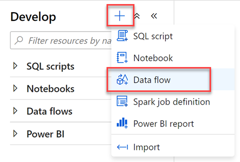

3. In the **General** tab of the new data flow, update the **Name** to the following: `ASAL400 - Lab 2 - Write Campaign Analytics to ASA`.

    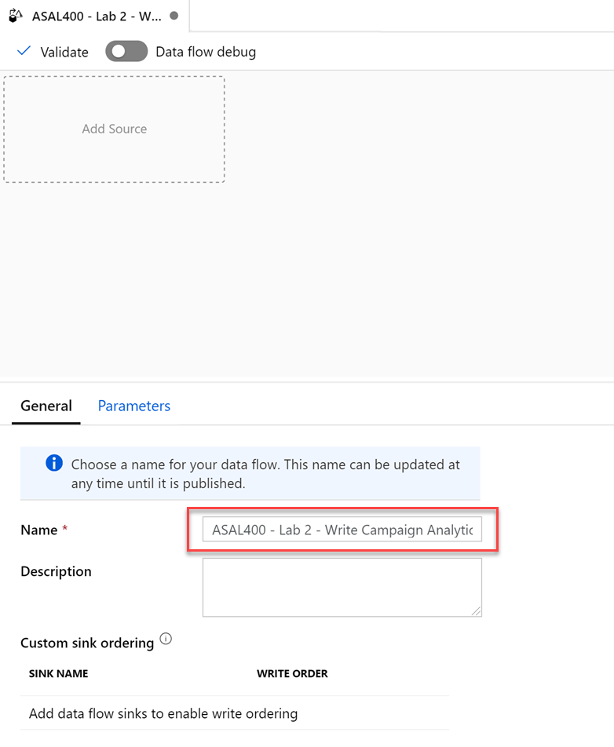

4. Select **Add Source** on the data flow canvas.

    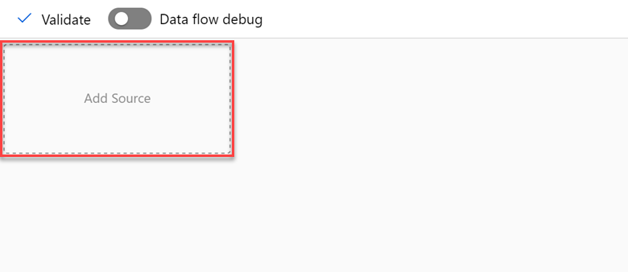

5. Under **Source settings**, configure the following:

    - **Output stream name**: Enter `CampaignAnalytics`.
    - **Dataset**: Select `asal400_campaign_analytics_source`.
    - **Options**: Select `Allow schema drift` and leave the other options unchecked.
    - **Skip line count**: Enter `1`. This allows us to skip the header row which has two fewer columns than the rest of the rows in the CSV file, truncating the last two data columns.
    - **Sampling**: Select `Disable`.

    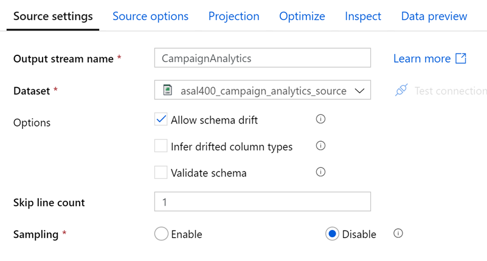

6. Select the **Projection** tab, then select **Import projection**.

    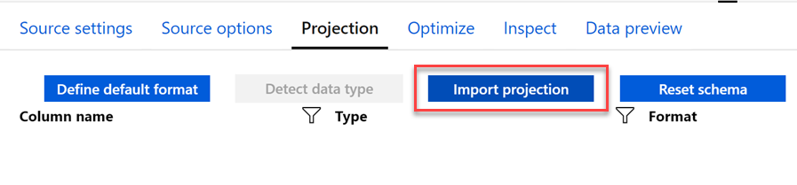

    The projection should display the following schema:

    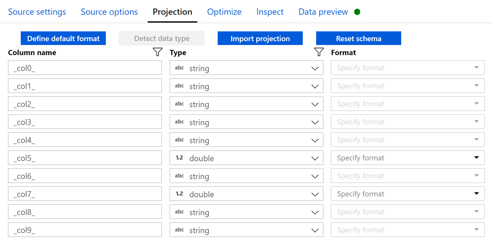

7. If a data flow debug session is not currently running, select the **AzureLargeComputeOptimizedIntegrationRuntime** IR, then select **Turn on debug**.

    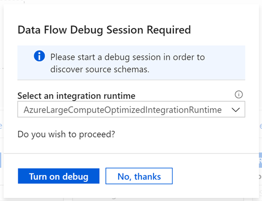

8. Select the **Data preview** tab, then select **Refresh** to display data from the CSV file. If you scroll to the right, you should see that the City and State columns are now included.

    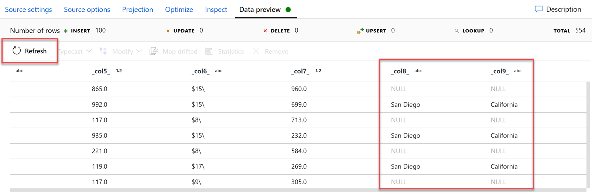

9. Select the **+** to the right of the `CampaignAnalytics` source, then select the **Select** schema modifier from the context menu.

    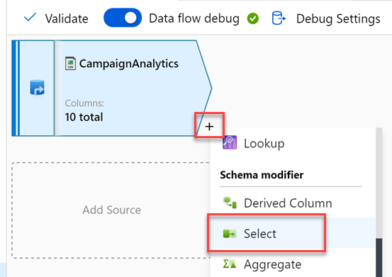

10. Under **Select settings**, configure the following:

    - **Output stream name**: Enter `MapCampaignAnalytics`.
    - **Incoming stream**: Select `CampaignAnalytics`.
    - **Options**: Check both options.
    - **Input columns**: make sure `Auto mapping` is unchecked, then provide the following values in the **Name as** fields:
      - Region
      - Country
      - ProductCategory
      - CampaignName
      - RevenuePart1
      - Revenue
      - RevenueTargetPart1
      - RevenueTarget
      - City
      - State

    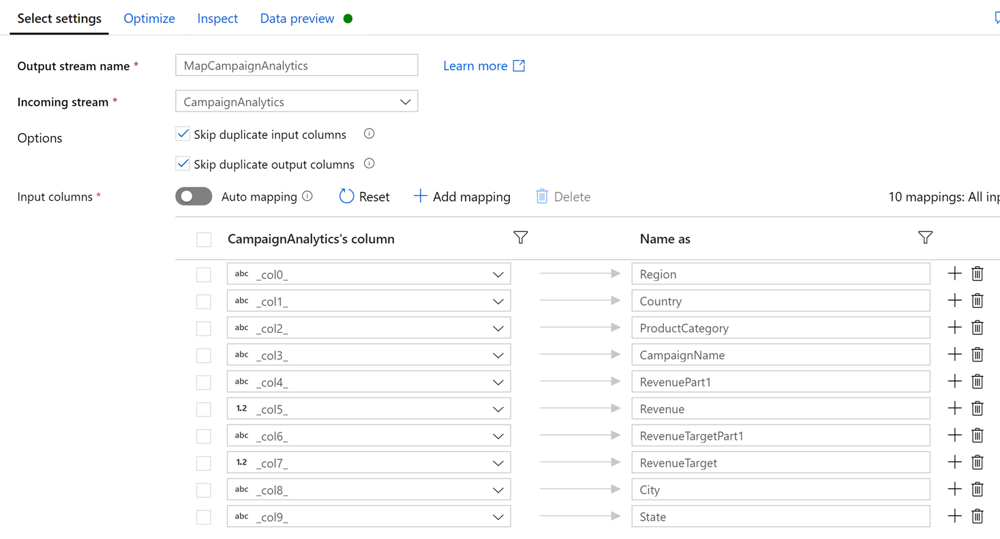

11. Select the **+** to the right of the `MapCampaignAnalytics` source, then select the **Derived Column** schema modifier from the context menu.

    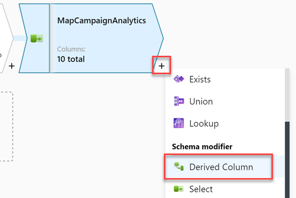

12. Under **Derived column's settings**, configure the following:

    - **Output stream name**: Enter `ConvertColumnTypesAndValues`.
    - **Incoming stream**: Select `MapCampaignAnalytics`.
    - **Columns**: Provide the following information:

        | Column | Expression | Description |
        | --- | --- | --- |
        | Revenue | `toDecimal(replace(concat(toString(RevenuePart1), toString(Revenue)), '\\', ''), 10, 2, '$###,###.##')` | Concatenate the `RevenuePart1` and `Revenue` fields, replace the invalid `\` character, then convert and format the data to a decimal type. |
        | RevenueTarget | `toDecimal(replace(concat(toString(RevenueTargetPart1), toString(RevenueTarget)), '\\', ''), 10, 2, '$###,###.##')` | Concatenate the `RevenueTargetPart1` and `RevenueTarget` fields, replace the invalid `\` character, then convert and format the data to a decimal type. |
        | ProductCategory | `replace(toString(ProductCategory), 'é', 'e')` | Replace the invalid characters in the `ProductCategory` field with the letter e. |

    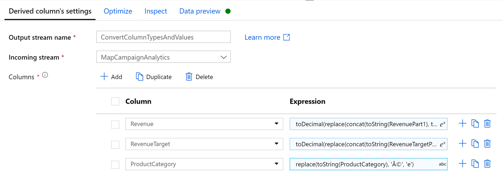

13. Select **Data preview** and select **Refresh** to verify the expressions work as expected.

    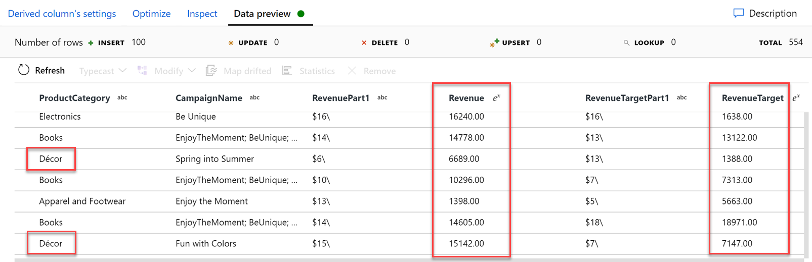

14. Select the **+** to the right of the `ConvertColumnTypesAndValues` step, then select the **Select** schema modifier from the context menu.

    

15. Under **Select settings**, configure the following:

    - **Output stream name**: Enter `SelectCampaignAnalyticsColumns`.
    - **Incoming stream**: Select `ConvertColumnTypesAndValues`.
    - **Options**: Check both options.
    - **Input columns**: make sure `Auto mapping` is unchecked, then **Delete** `RevenuePart1` and `RevenueTargetPart1`. We no longer need these fields.

    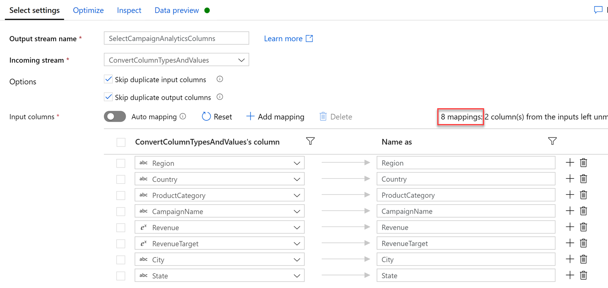

16. Select the **+** to the right of the `SelectCampaignAnalyticsColumns` step, then select the **Sink** destination from the context menu.

    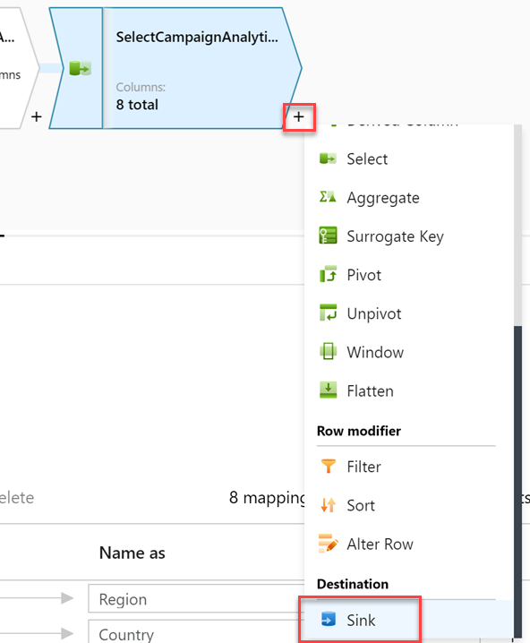

17. Under **Sink**, configure the following:

    - **Output stream name**: Enter `CampaignAnalyticsASA`.
    - **Incoming stream**: Select `SelectCampaignAnalyticsColumns`.
    - **Dataset**: Select `asal400_wwi_campaign_analytics_asa`, which is the CampaignAnalytics SQL table.
    - **Options**: Check `Allow schema drift` and uncheck `Validate schema`.

    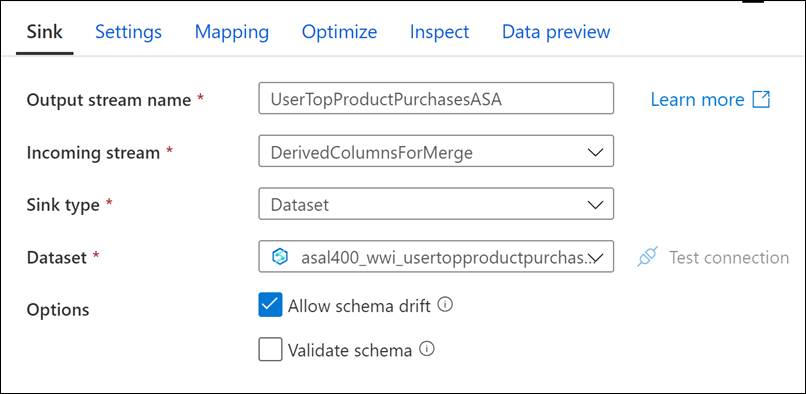

18. Select **Settings**, then configure the following:

    - **Update method**: Check `Allow insert` and leave the rest unchecked.
    - **Table action**: Select `Truncate table`.
    - **Enable staging**: Uncheck this option. The sample CSV file is small, making the staging option unnecessary.

    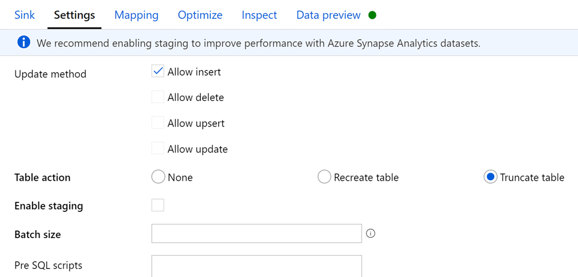

19. Your completed data flow should look similar to the following:

    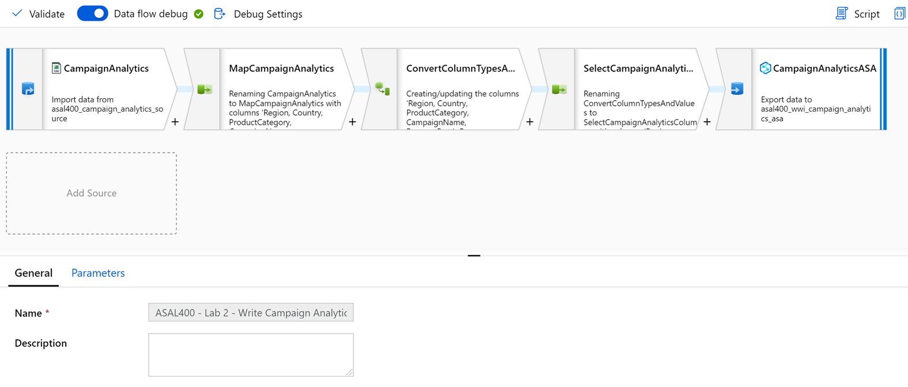

20. Select **Publish all** to save your new data flow.

    

### Task 2: Create campaign analytics data pipeline

In order to run the new data flow, you need to create a new pipeline and add a data flow activity to it.

1. Navigate to the **Orchestrate** hub.

    

2. Select + then **Pipeline** to create a new pipeline.

    

3. In the **General** tab for the new pipeline, enter the following **Name**: `ASAL400 - Lab 2 - Write Campaign Analytics to ASA`.

4. Expand **Move & transform** within the Activities list, then drag the **Data flow** activity onto the pipeline canvas.

    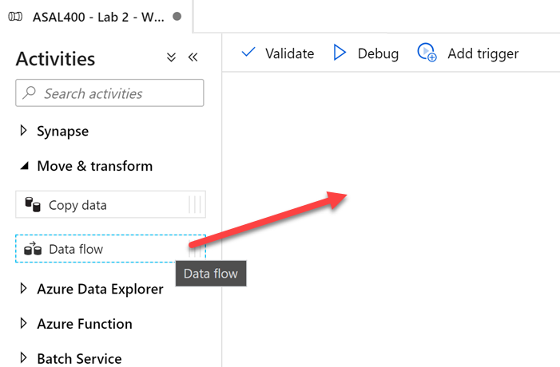

5. In the `Adding data flow` blade, select **Use existing data flow**, then select the `ASAL400 - Lab 2 - Write Campaign Analytics to ASA` existing data flow you created in the previous task.

    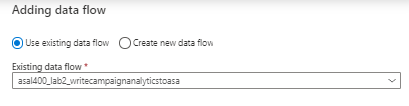

6. Select **Finish**.

7. Select the mapping data flow activity on the canvas. Select the **Settings** tab, then set the **Run on (Azure IR)** setting to the `AzureLargeComputeOptimizedIntegrationRuntime` custom IR you created in lab 1.

    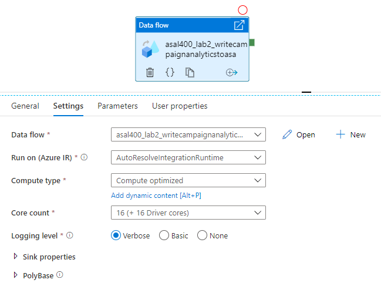

### Task 3: Run the campaign analytics data pipeline

1. Select **Debug** in the toolbar at the top of the pipeline canvas to start running the pipeline in debug mode.

    

2. The pipeline run displays below the pipeline canvas when you execute the debug session. Wait for the **Status** to change to `Succeeded`. You may need to refresh the view a few times.

    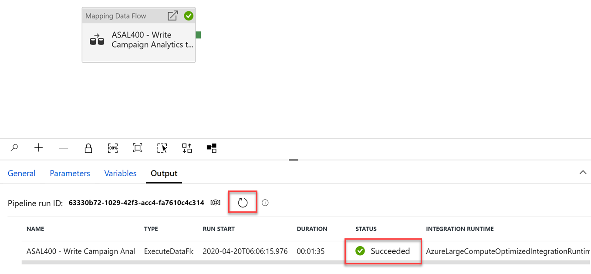

> Please note, if this is the first time you have executed a pipeline after turning on debugging, it will take longer for this initial run to complete (~6 minutes). Each subsequent run will be much shorter since the cluster provisioning step only needs to happen once (~1:20).

### Task 4: View campaign analytics table contents

Now that the pipeline run is complete, let's take a look at the SQL table to verify the data successfully copied.

1. Navigate to the **Data** hub.

    

2. Expand the `SqlPool01` database underneath the **Databases** section. Right-click the `wwi.CampaignAnalytics` table, then select the **Select TOP 1000 rows** menu item under the New SQL script context menu.

    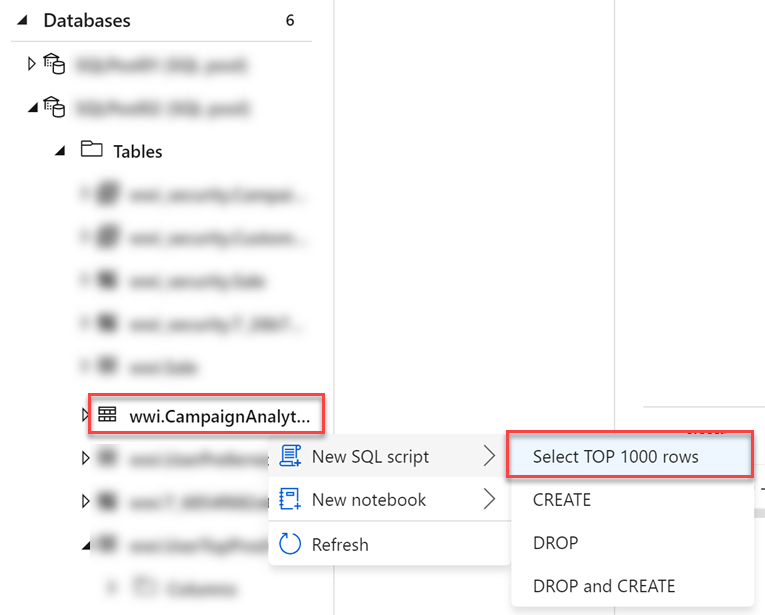

3. The properly transformed data should appear in the query results.

    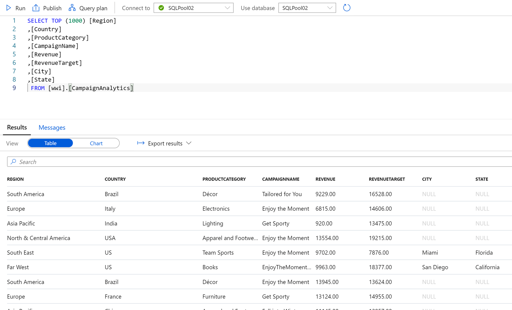

4. Update the query to the following and **Run**:

    ```sql
    SELECT ProductCategory
    ,SUM(Revenue) AS TotalRevenue
    ,SUM(RevenueTarget) AS TotalRevenueTarget
    ,(SUM(RevenueTarget) - SUM(Revenue)) AS Delta
    FROM [wwi].[CampaignAnalytics]
    GROUP BY ProductCategory
    ```

5. In the query results, select the **Chart** view. Configure the columns as defined:

    - **Chart type**: Select `Column`.
    - **Category column**: Select `ProductCategory`.
    - **Legend (series) columns**: Select `TotalRevenue`, `TotalRevenueTarget`, and `Delta`.

    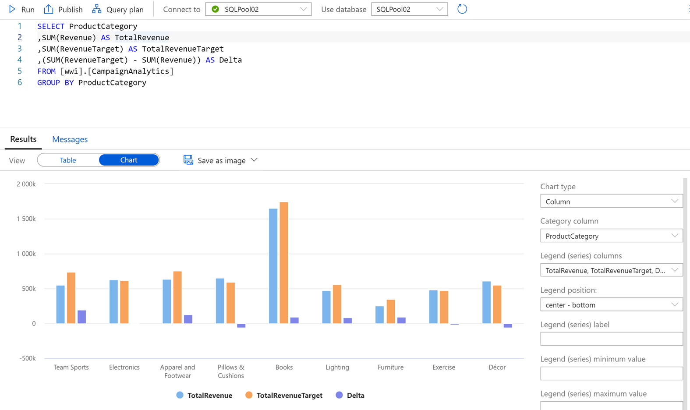

## Exercise 3: Create data pipeline to import user reviews

**TODO**: Add if there's time.

### Task 1: Create user reviews data flow

### Task 2: Create user reviews data pipeline

## Exercise 4: Create data pipeline to join disparate data sources

### Task 1: Create user profile data flow

1. Navigate to the **Develop** hub.

    

2. Select + then **Data flow** to create a new data flow.

    

3. In the **General** tab of the new data flow, update the **Name** to the following: `ASAL400 - Lab 2 - Write User Profile Data to ASA`.

4. Select **Add Source** on the data flow canvas.

    

5. Under **Source settings**, configure the following:

    - **Output stream name**: Enter `EcommerceUserProfiles`.
    - **Dataset**: Select `asal400_ecommerce_userprofiles_source`.

    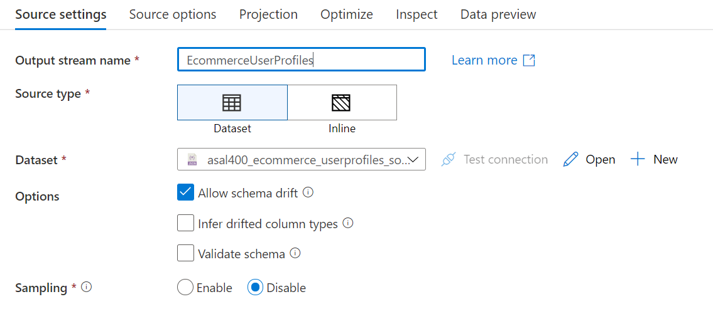

6. Select the **Source options** tab, then configure the following:

    - **Wildcard paths**: Enter `online-user-profiles-02/*.json`.
    - **Single document** under JSON Settings: Check this setting. This denotes that each JSON document contains multiple rows of data.

    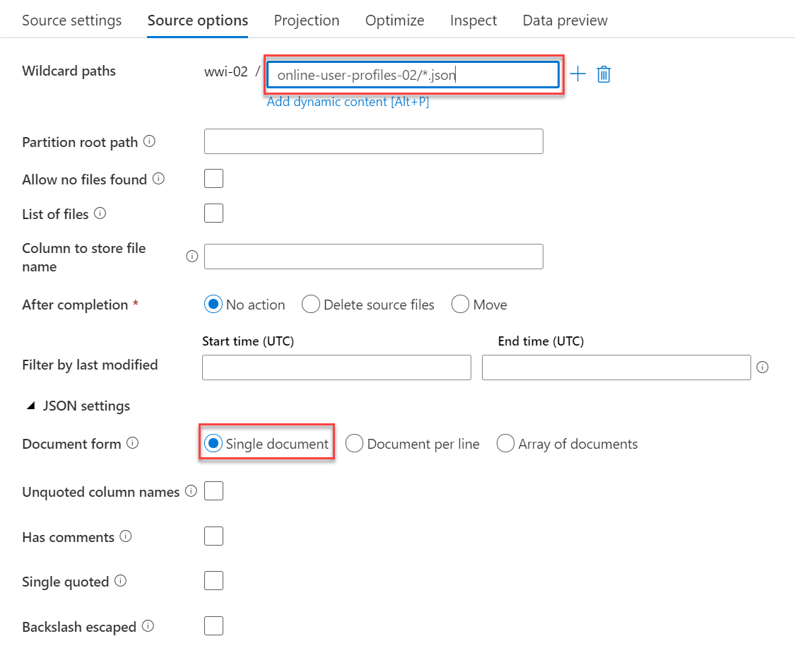

7. Select **Data preview** and select **Refresh** to display the data. Select a row under the `topProductPurchases` column to see an expanded view of the array.

    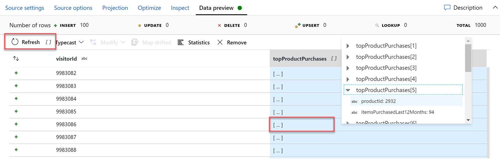

8. Select the **+** to the right of the `CampaignAnalytics` source, then select the **Derived Column** schema modifier from the context menu.

    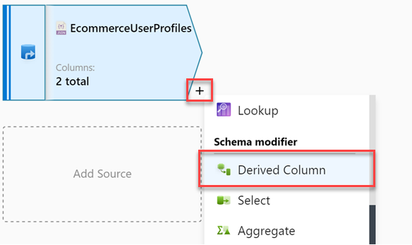

9. Under **Derived column's settings**, configure the following:

    - **Output stream name**: Enter `userId`.
    - **Incoming stream**: Select `EcommerceUserProfiles`.
    - **Columns**: Provide the following information:

        | Column | Expression | Description |
        | --- | --- | --- |
        | visitorId | `toInteger(visitorId)` | Converts the `visitorId` column from a string to an integer. |

    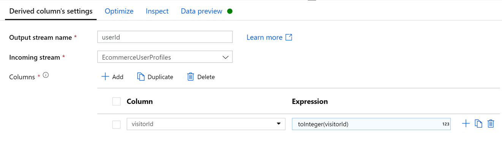

10. Select the **+** to the right of the `userId` step, then select the **Flatten** schema modifier from the context menu.

    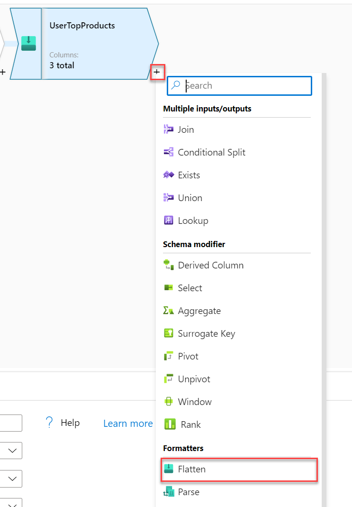

11. Under **Flatten settings**, configure the following:

    - **Output stream name**: Enter `UserTopProducts`.
    - **Incoming stream**: Select `userId`.
    - **Unroll by**: Select `[] topProductPurchases`.
    - **Input columns**: Provide the following information:

        | userId's column | Name as |
        | --- | --- |
        | visitorId | `visitorId` |
        | topProductPurchases.productId | `productId` |
        | topProductPurchases.itemsPurchasedLast12Months | `itemsPurchasedLast12Months` |

    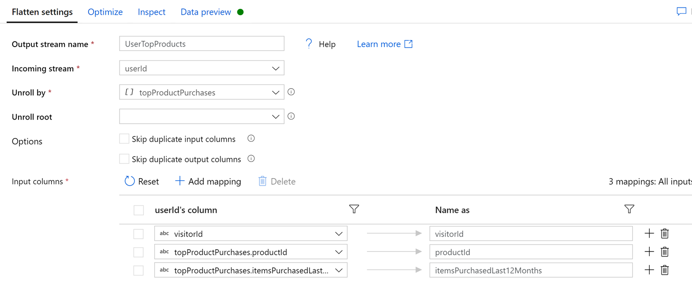

12. Select **Data preview** and select **Refresh** to display the data. You should now see a flattened view of the data source with one or more rows per `visitorId`, similar to when you explored the data within the Spark notebook in lab 1.

    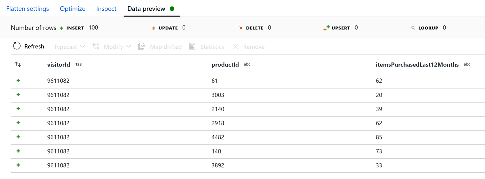

13. Select the **+** to the right of the `UserTopProducts` step, then select the **Derived Column** schema modifier from the context menu.

    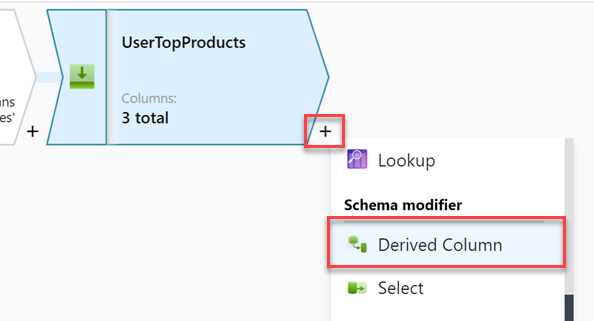

14. Under **Derived column's settings**, configure the following:

    - **Output stream name**: Enter `DeriveProductColumns`.
    - **Incoming stream**: Select `UserTopProducts`.
    - **Columns**: Provide the following information:

        | Column | Expression | Description |
        | --- | --- | --- |
        | productId | `toInteger(productId)` | Converts the `productId` column from a string to an integer. |
        | itemsPurchasedLast12Months | `toInteger(itemsPurchasedLast12Months)` | Converts the `itemsPurchasedLast12Months` column from a string to an integer. |

    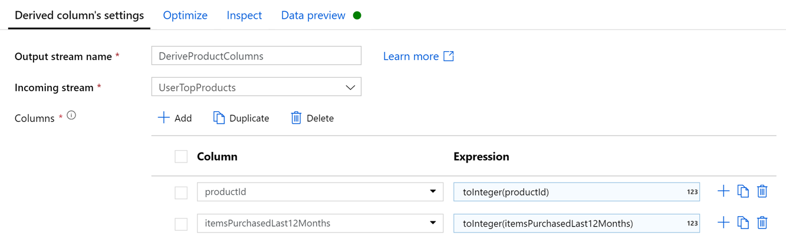

15. Select **Add Source** on the data flow canvas beneath the `EcommerceUserProfiles` source.

    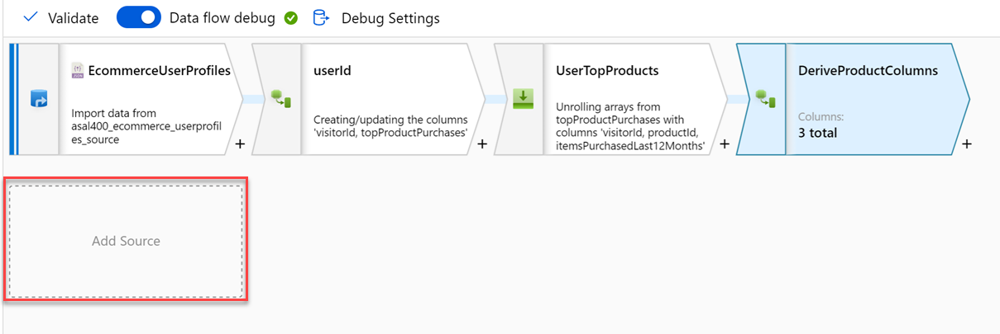

16. Under **Source settings**, configure the following:

    - **Output stream name**: Enter `UserProfiles`.
    - **Dataset**: Select `asal400_customerprofile_cosmosdb`.

    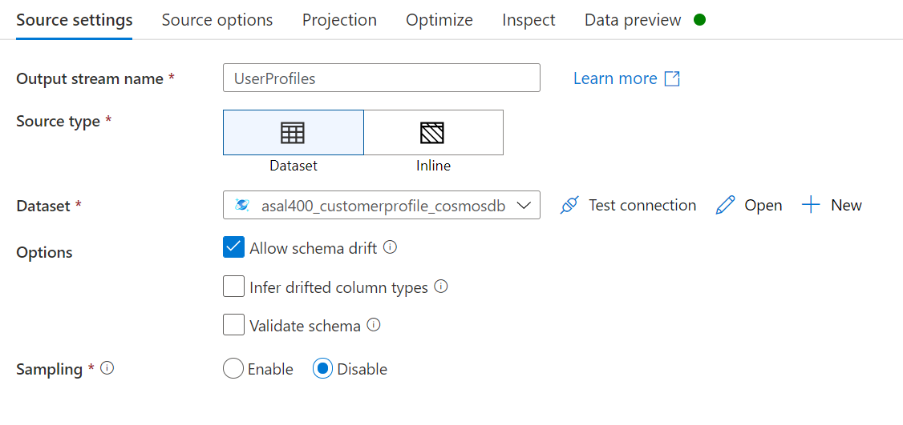

17. Select **Projection** and inspect the inferred schema. If the `preferredProducts` type is not identified as an integer array (`[] integer`), select **Import projection**.

    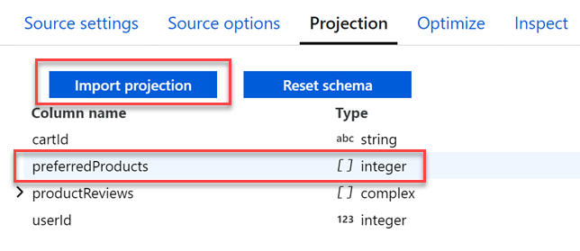

18. Select **Data preview** and select **Refresh** to display the data. Select a row under the `preferredProducts` column to see an expanded view of the array.

    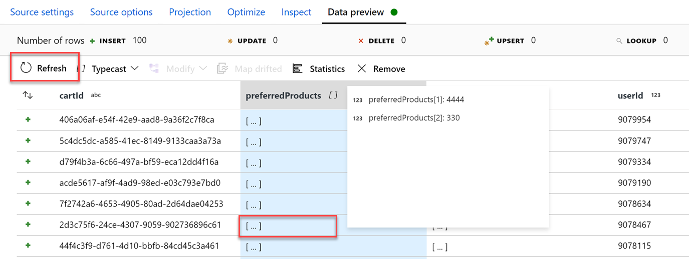

19. Select the **+** to the right of the `UserProfiles` source, then select the **Flatten** schema modifier from the context menu.

    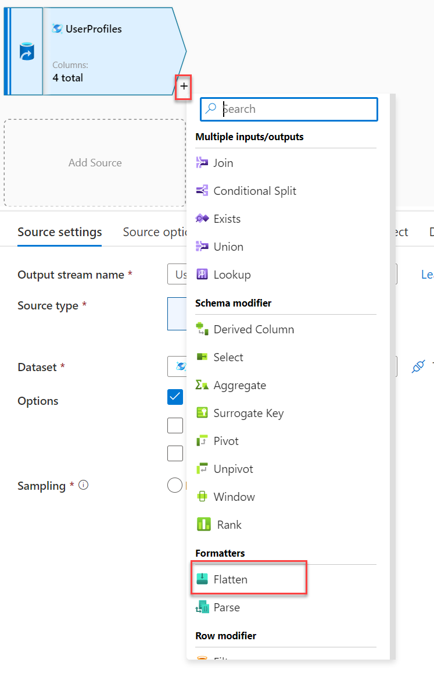

20. Under **Flatten settings**, configure the following:

    - **Output stream name**: Enter `UserPreferredProducts`.
    - **Incoming stream**: Select `UserProfiles`.
    - **Unroll by**: Select `[] preferredProducts`.
    - **Input columns**: Provide the following information:

        | UserProfiles's column | Name as |
        | --- | --- |
        | userId | `userId` |
        | preferredProducts | `preferredProductId` |

    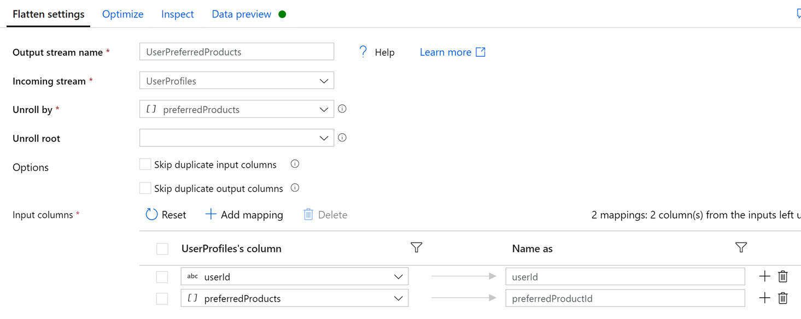

21. Select **Data preview** and select **Refresh** to display the data. You should now see a flattened view of the data source with one or more rows per `userId`.

    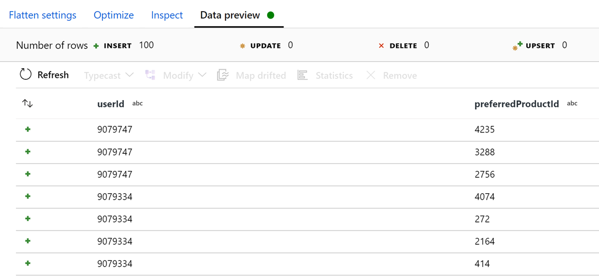

22. Now it is time to join the two data sources. Select the **+** to the right of the `DeriveProductColumns` step, then select the **Join** option from the context menu.

    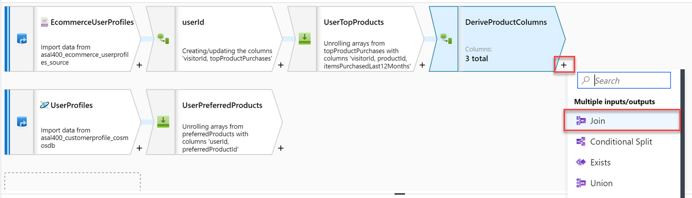

23. Under **Join settings**, configure the following:

    - **Output stream name**: Enter `JoinTopProductsWithPreferredProducts`.
    - **Left stream**: Select `DeriveProductColumns`.
    - **Right stream**: Select `UserPreferredProducts`.
    - **Join type**: Select `Full outer`.
    - **Join conditions**: Provide the following information:

        | Left: DeriveProductColumns's column | Right: UserPreferredProducts's column |
        | --- | --- |
        | `visitorId` | `userId` |

    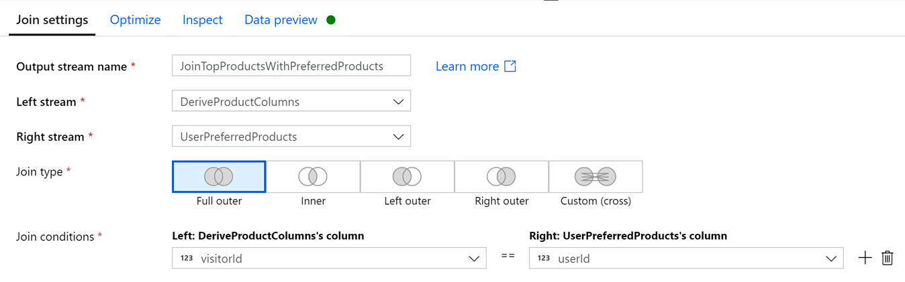

24. Select **Optimize** and configure the following:

    - **Broadcast**: Check `Left: 'DeriveProductColumns'`.
    - **Partition option**: Select `Set partitioning`.
    - **Partition type**: Select `Hash`.
    - **Number of partitions**: Enter `30`.
    - **Column**: Select `productId`.

    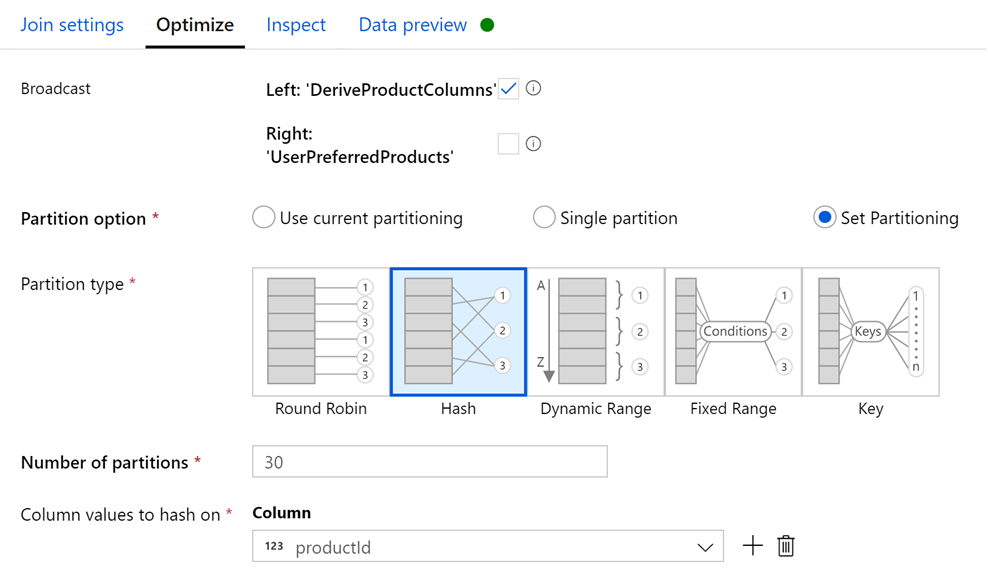

    Optimization description.

25. Select the **Inspect** tab to see the join mapping, including the column feed source and whether the column is used in a join.

    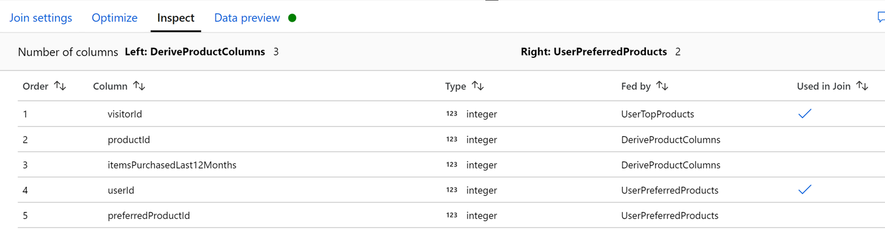

26. Select **Data preview** and select **Refresh** to display the data. In this small sample of data, likely the `userId` and `preferredProductId` columns will only show null values. If you want to get a sense of how many records contain values for these fields, select a column, such as `preferredProductId`, then select **Statistics** in the toolbar above. This displays a chart for the column showing the ratio of values.

    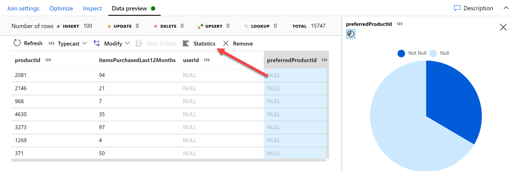

27. Select the **+** to the right of the `JoinTopProductsWithPreferredProducts` step, then select the **Derived Column** schema modifier from the context menu.

    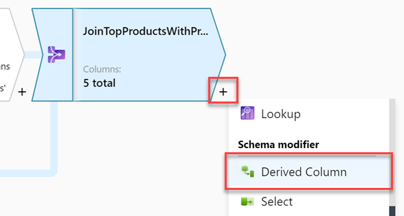

28. Under **Derived column's settings**, configure the following:

    - **Output stream name**: Enter `DerivedColumnsForMerge`.
    - **Incoming stream**: Select `JoinTopProductsWithPreferredProducts`.
    - **Columns**: Provide the following information:

        | Column | Expression | Description |
        | --- | --- | --- |
        | isTopProduct | `toBoolean(iif(isNull(productId), 'false', 'true'))` | Returns `true` if `productId` is not null. Recall that `productId` is fed by the e-commerce top user products data lineage. |
        | isPreferredProduct | `toBoolean(iif(isNull(preferredProductId), 'false', 'true'))` | Returns `true` if `preferredProductId` is not null. Recall that `preferredProductId` is fed by the Azure Cosmos DB user profile data lineage. |
        | productId | `iif(isNull(productId), preferredProductId, productId)` | Sets the `productId` output to either the `preferredProductId` or `productId` value, depending on whether `productId` is null.
        | userId | `iif(isNull(userId), visitorId, userId)` | Sets the `userId` output to either the `visitorId` or `userId` value, depending on whether `userId` is null.

    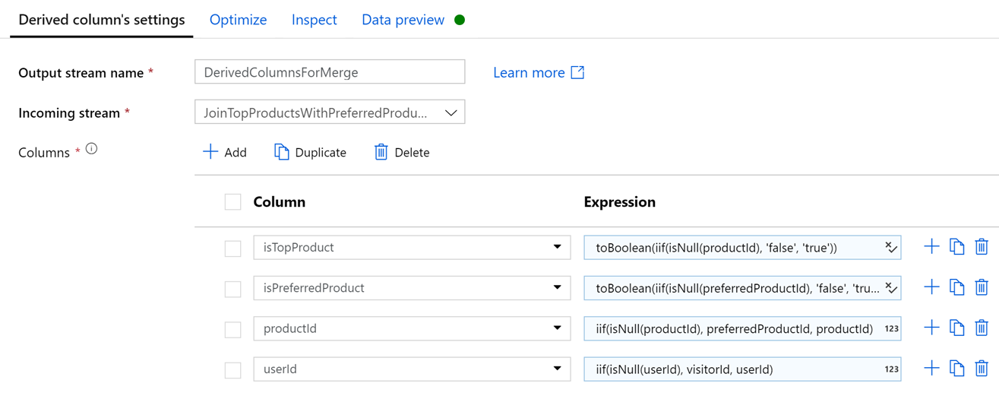

29. Select **Data preview** and select **Refresh** to display the data and verify the derived column settings.

    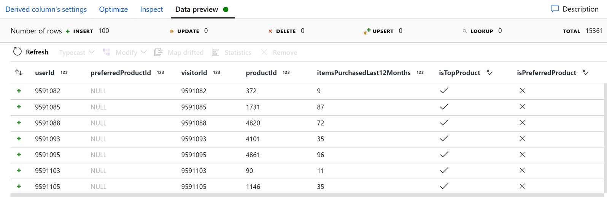

30. Select the **+** to the right of the `DerivedColumnsForMerge` step, then select the **Sink** destination from the context menu.

    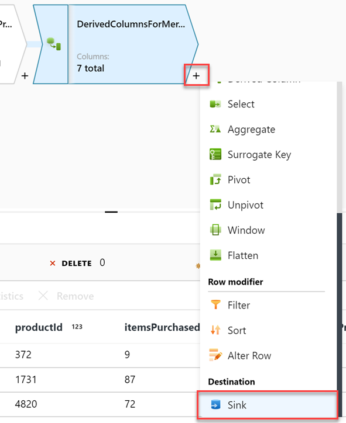

31. Under **Sink**, configure the following:

    - **Output stream name**: Enter `UserTopProductPurchasesASA`.
    - **Incoming stream**: Select `DerivedColumnsForMerge`.
    - **Dataset**: Select `asal400_wwi_usertopproductpurchases_asa`, which is the UserTopProductPurchases SQL table.
    - **Options**: Check `Allow schema drift` and uncheck `Validate schema`.

    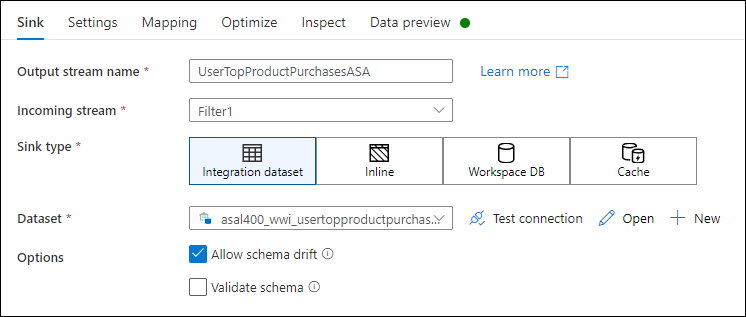

32. Select **Settings**, then configure the following:

    - **Update method**: Check `Allow insert` and leave the rest unchecked.
    - **Table action**: Select `Truncate table`.
    - **Enable staging**: `Check` this option. Since we are importing a lot of data, we want to enable staging to improve performance.

    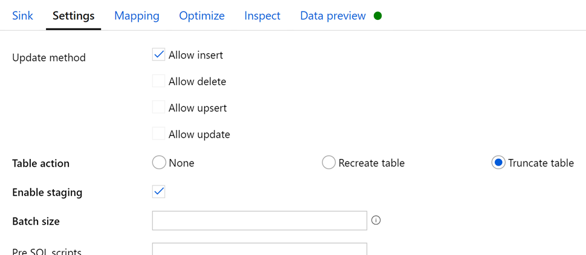

33. Your completed data flow should look similar to the following:

    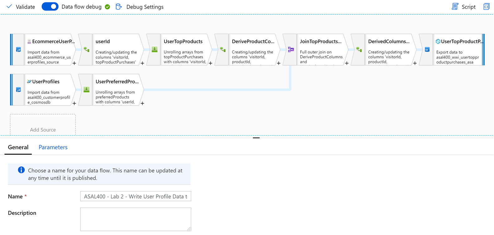

34. Select **Publish all** to save your new data flow.

    

## Exercise 5: Create pipeline trigger window to import remaining Parquet data

**TODO**: Waiting on updated source Sale dataset.

## Exercise 6: Create Synapse Spark notebook to find top products
