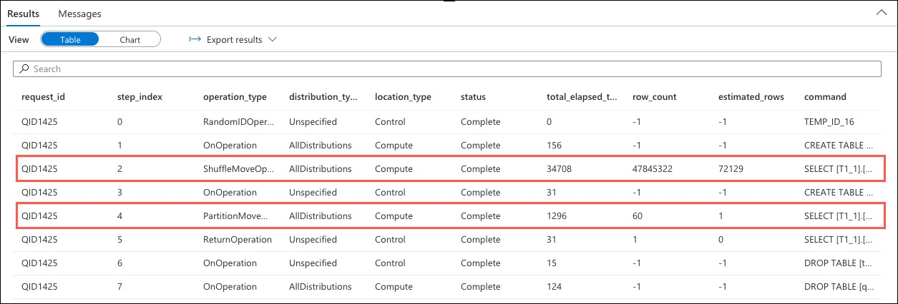
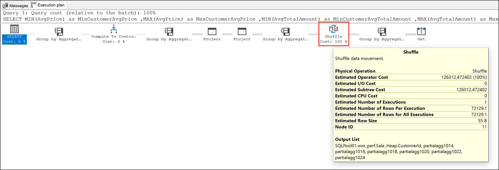

# DSQL Execution Plan Demo

There are several methods that can be used to better understand query execution and the plans generated by Azure Synapse Analytics dedicated SQL pools.

This demo provides a comparison for the DSQL plan using `EXPLAIN`, Dynamic Management Views (DMVs), and the SSMS estimated execution plan.

To begin, execute the following "slow-running" query in a new SQL Script tab the **Develop** hub in Synapse Studio:

```sql
SELECT
    MIN(AvgPrice) as MinCustomerAvgPrice
    ,MAX(AvgPrice) as MaxCustomerAvgPrice
    ,MIN(AvgTotalAmount) as MinCustomerAvgTotalAmount
    ,MAX(AvgTotalAmount) as MaxCustomerAvgTotalAmount
    ,MIN(AvgProfitAmount) as MinAvgProfitAmount
    ,MAX(AvgProfitAmount) as MaxAvgProfitAmount
FROM
(
    SELECT
        FS.CustomerID
        ,MIN(FS.Quantity) as MinQuantity
        ,MAX(FS.Quantity) as MaxQuantity
        ,AVG(FS.Price) as AvgPrice
        ,AVG(FS.TotalAmount) as AvgTotalAmount
        ,AVG(FS.ProfitAmount) as AvgProfitAmount
        ,COUNT(DISTINCT FS.StoreId) as DistinctStores
    FROM
        wwi_perf.Sale_Heap FS
    GROUP BY
        FS.CustomerId
) T
```

Examine the execution time, and then jump into the various ways we can examine the query execution plans to better understand where performance slowdowns might be happening.

## Explain

The `EXPLAIN` statement in Azure Synapse Analytics returns the query plan for a SQL statement without running the statement. Use `EXPLAIN` to preview which operations will require data movement and to view the estimated costs of the query operations.

1. Update the query execute above to include the `EXPLAIN` statement on the first line. In Synapse Studio, execute the following query against the dedicated SQL pool (`SQLPool01`):

    ```sql
    EXPLAIN
    SELECT
        MIN(AvgPrice) as MinCustomerAvgPrice
        ,MAX(AvgPrice) as MaxCustomerAvgPrice
        ,MIN(AvgTotalAmount) as MinCustomerAvgTotalAmount
        ,MAX(AvgTotalAmount) as MaxCustomerAvgTotalAmount
        ,MIN(AvgProfitAmount) as MinAvgProfitAmount
        ,MAX(AvgProfitAmount) as MaxAvgProfitAmount
    FROM
    (
        SELECT
            FS.CustomerID
            ,MIN(FS.Quantity) as MinQuantity
            ,MAX(FS.Quantity) as MaxQuantity
            ,AVG(FS.Price) as AvgPrice
            ,AVG(FS.TotalAmount) as AvgTotalAmount
            ,AVG(FS.ProfitAmount) as AvgProfitAmount
            ,COUNT(DISTINCT FS.StoreId) as DistinctStores
        FROM
            wwi_perf.Sale_Heap FS
        GROUP BY
            FS.CustomerId
    ) T
    ```

2. Copy the `EXPLAIN` output, navigate to <https://www.freeformatter.com/xml-formatter.html> in a web browser, paste the `EXPLAIN` output into the XML Formatter **Option 1** box, and then select the **FORMAT XML** button.

    

    > **NOTE**: You can also use Visual Studio Code to format the `EXPLAIN` XML output.

3. Highlight key components of the `EXPLAIN` output:

    - `dsql_operations`: Point out `total_cost` and `total_number_operations` values.
    - Locate the dql_operations where the `operation_type` equals `SHUFFLE_MOVE` and `PARTITION_MOVE`: Highlight that the cost of the `SHUFFLE_MOVE` operation is close to the `total_cost` of the entire query and the `PARTITION_MOVE` operation takes up the remainder of the cost.

## Dynamic Management Views

Next, let's look at how we can monitor query execution and understand the query execution plan using Dynamic Management Views (DVMs) in Azure Synapse Analytics.

1. In Synapse Studio, execute the following query from a new SQL script tab in the **Develop** hub:

    ```sql
    -- Find top 5 queries longest running queries
    SELECT TOP 5
        request_id,
        status,
        total_elapsed_time,
        command
    FROM sys.dm_pdw_exec_requests
    ORDER BY total_elapsed_time DESC;
    ```

2. Locate the line in the results for the `SELECT` query executed above and copy the `request_id`.

    

3. Next, execute the below query in Synapse Studio, replacing the `request_id` value with the `request_id` copied from the previous query:

    ```sql
    SELECT
        request_id,
        step_index,
        operation_type,
        distribution_type,
        location_type,
        status,
        total_elapsed_time,
        row_count,
        estimated_rows,
        command
    FROM sys.dm_pdw_request_steps
    WHERE request_id = 'QIDXXXX' -- TODO: Replace request_id with value copied above.
    ORDER BY step_index;
    ```

4. In the **Results** pane, locate the lines where the `operation_type` equals `ShuffleMoveOperation` and `PartitionMoveOperation`. As with the `EXPLAIN` statement, we can see that these two lines make up the bulk of the total elapsed query execution time.

    

5. Finally, demonstrate how to visualize the results using a pie chart based on `operation_type` and `total_elapsed_time`. In the **Results** pane:

    - Select **Chart**.
    - Change the **Chart type** to **Pie**.
    - Select `operation_type` for the **Category column**.
    - Select `total_elapsed_time` for the **Legend (series) column**.

    

## SQL Server Management Studio

Finally, examine the query execution plan in SQL Server Management Studio (SSMS).

1. Open SSMS and connect to the dedicated SQL pool (SQLPool01) of your Azure Synapse Analytics workspace.

2. Create a new query and paste the following query into the window:

    ```sql
    SELECT
        MIN(AvgPrice) as MinCustomerAvgPrice
        ,MAX(AvgPrice) as MaxCustomerAvgPrice
        ,MIN(AvgTotalAmount) as MinCustomerAvgTotalAmount
        ,MAX(AvgTotalAmount) as MaxCustomerAvgTotalAmount
        ,MIN(AvgProfitAmount) as MinAvgProfitAmount
        ,MAX(AvgProfitAmount) as MaxAvgProfitAmount
    FROM
    (
        SELECT
            FS.CustomerID
            ,MIN(FS.Quantity) as MinQuantity
            ,MAX(FS.Quantity) as MaxQuantity
            ,AVG(FS.Price) as AvgPrice
            ,AVG(FS.TotalAmount) as AvgTotalAmount
            ,AVG(FS.ProfitAmount) as AvgProfitAmount
            ,COUNT(DISTINCT FS.StoreId) as DistinctStores
        FROM
            wwi_perf.Sale_Heap FS
        GROUP BY
            FS.CustomerId
    ) T
    ```

3. On the SSMS toolbar, select the **Display Estimated Execution Plan** button and observe the plan generated in the **Results** pane.

    

4. Observe the generated execution plan in the output pane:

    
