# DW Optimization Part 1

## Lab pre-requisite

Start the SQL Pool in your lab environment.

1. Open the [Synapse Studio workspace](https://web.azuresynapse.net/) and navigate to the **Manage** hub.

    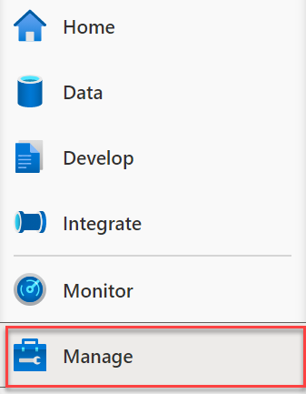

2. From the center menu, select **SQL pools** from beneath the **Analytics pools** heading. Locate `SQLPool01`, and select the **Resume** button.

    

## Exercise 1 - Explore query performance and improve table structure

### Task 1 - Identify performance issues related to tables

1. In `Synapse Studio`, open a new SQL script and run the following statement (make sure you run queries on **SQLPool01** as opposed to `Built-in`):

    ```sql
    SELECT  
        COUNT_BIG(*)
    FROM
        [wwi_perf].[Sale_Heap]
    ```

    The script takes around 20 seconds to execute and returns a count of ~ 340 million rows in the table.

2. Run the following (more complex) statement:

    ```sql
    SELECT TOP 1000 * FROM
    (
        SELECT
            S.CustomerId
            ,SUM(S.TotalAmount) as TotalAmount
        FROM
            [wwi_perf].[Sale_Heap] S
        GROUP BY
            S.CustomerId
    ) T
    OPTION (LABEL = 'Lab03: Heap')
    ```

    The script takes up to a 30 seconds to execute and returns the result. There is clearly something wrong with the `Sale_Heap` table that induces the performance hit.

    > Note the OPTION clause used in the statement. This comes in handy when you're looking to identify your query in the [sys.dm_pdw_exec_requests](https://docs.microsoft.com/en-us/sql/relational-databases/system-dynamic-management-views/sys-dm-pdw-exec-requests-transact-sql) DMV.
    >
    >```sql
    >SELECT  *
    >FROM    sys.dm_pdw_exec_requests
    >WHERE   [label] = 'Lab03: Heap';
    >```
    >

3. Check the structure of the `Sale_Heap` table, by right-clicking on it in the `Data` hub and selecting `New SQL script` and then `CREATE`. Take a look at the script used to create the table (**Do NOT run this script**):

    ```sql
    CREATE TABLE [wwi_perf].[Sale_Heap]
    (
        [TransactionId] [uniqueidentifier]  NOT NULL,
        [CustomerId] [int]  NOT NULL,
        [ProductId] [smallint]  NOT NULL,
        [Quantity] [smallint]  NOT NULL,
        [Price] [decimal](9,2)  NOT NULL,
        [TotalAmount] [decimal](9,2)  NOT NULL,
        [TransactionDateId] [int]  NOT NULL,
        [ProfitAmount] [decimal](9,2)  NOT NULL,
        [Hour] [tinyint]  NOT NULL,
        [Minute] [tinyint]  NOT NULL,
        [StoreId] [smallint]  NOT NULL
    )
    WITH
    (
        DISTRIBUTION = ROUND_ROBIN,
        HEAP
    )
    ```

    You can immediately spot at least two reasons for the performance hit:
    - The `ROUND_ROBIN` distribution
    - The `HEAP` structure of the table

    > **NOTE**
    >
    >In this case, when we are looking for fast query response times, the heap structure is not a good choice as we will see in a moment. Still, there are cases where using a heap table can help performance rather than hurting it. One such example is when we're looking to ingest large amounts of data into the SQL pool.

4. Run the same script as the one you've run at step 2, but this time with the `EXPLAIN WITH_RECOMMENDATIONS` line before it:

    ```sql
    EXPLAIN WITH_RECOMMENDATIONS
    SELECT TOP 1000 * FROM
    (
        SELECT
            S.CustomerId
            ,SUM(S.TotalAmount) as TotalAmount
        FROM
            [wwi_perf].[Sale_Heap] S
        GROUP BY
            S.CustomerId
    ) T
    ```

    The `EXPLAIN WITH_RECOMMENDATIONS` clause returns the query plan for an Azure Synapse Analytics SQL statement without running the statement. Use EXPLAIN to preview which operations will require data movement and to view the estimated costs of the query operations. By default, you will get the execution plan in XML format, which you can export to other formats like CSV or JSON. **Do not** select `Query Plan` from the toolbar as it will try do download the query plan and open it in SQL Server Management Studio.

    Your query should return something similar to:

    ```xml
    <?xml version="1.0" encoding="utf-8"?>
    <dsql_query number_nodes="1" number_distributions="60" number_distributions_per_node="60">
    <sql>SELECT TOP 1000 * FROM (SELECTS.CustomerId,SUM(S.TotalAmount) as TotalAmountFROM[wwi_perf].[Sale_Heap] SGROUP BYS.CustomerId ) T</sql>
    <materialized_view_candidates>
        <materialized_view_candidates with_constants="False">CREATE MATERIALIZED VIEW View1 WITH (DISTRIBUTION = HASH([Expr0])) AS SELECT [S].[CustomerId] AS [Expr0],SUM([S].[TotalAmount]) AS [Expr1] FROM [wwi_perf].[Sale_Heap] GROUP BY [S].[CustomerId]</materialized_view_candidates>
    </materialized_view_candidates>
    <dsql_operations total_cost="4.6605624" total_number_operations="5">
        <dsql_operation operation_type="RND_ID">
        <identifier>TEMP_ID_5</identifier>
        </dsql_operation>
        <dsql_operation operation_type="ON">
        <location permanent="false" distribution="AllDistributions" />
        <sql_operations>
            <sql_operation type="statement">CREATE TABLE [qtabledb].[dbo].[TEMP_ID_5] ([CustomerId] INT NOT NULL, [col] DECIMAL(38, 2) NOT NULL ) WITH(DISTRIBUTED_MOVE_FILE='');</sql_operation>
        </sql_operations>
        </dsql_operation>
        <dsql_operation operation_type="SHUFFLE_MOVE">
        <operation_cost cost="4.6605624" accumulative_cost="4.6605624" average_rowsize="13" output_rows="89626.2" GroupNumber="11" />
        <source_statement>SELECT [T1_1].[CustomerId] AS [CustomerId], [T1_1].[col] AS [col] FROM (SELECT SUM([T2_1].[TotalAmount]) AS [col], [T2_1].[CustomerId] AS [CustomerId] FROM [SQLPool01].[wwi_perf].[Sale_Heap] AS T2_1 GROUP BY [T2_1].[CustomerId]) AS T1_1 OPTION (MAXDOP 4, MIN_GRANT_PERCENT = [MIN_GRANT], DISTRIBUTED_MOVE(N''))</source_statement>
        <destination_table>[TEMP_ID_5]</destination_table>
        <shuffle_columns>CustomerId;</shuffle_columns>
        </dsql_operation>
        <dsql_operation operation_type="RETURN">
        <location distribution="AllDistributions" />
        <select>SELECT [T1_1].[CustomerId] AS [CustomerId], [T1_1].[col] AS [col] FROM (SELECT TOP (CAST ((1000) AS BIGINT)) SUM([T2_1].[col]) AS [col], [T2_1].[CustomerId] AS [CustomerId] FROM [qtabledb].[dbo].[TEMP_ID_5] AS T2_1 GROUP BY [T2_1].[CustomerId]) AS T1_1 OPTION (MAXDOP 4, MIN_GRANT_PERCENT = [MIN_GRANT])</select>
        </dsql_operation>
        <dsql_operation operation_type="ON">
        <location permanent="false" distribution="AllDistributions" />
        <sql_operations>
            <sql_operation type="statement">DROP TABLE [qtabledb].[dbo].[TEMP_ID_5]</sql_operation>
        </sql_operations>
        </dsql_operation>
    </dsql_operations>
    </dsql_query>
    ```

    Notice the details of the internal layout of the MPP system:

    `<dsql_query number_nodes="1" number_distributions="60" number_distributions_per_node="60">`
 
    This layout is given by the current Date Warehouse Units (DWU) setting. In the setup used for the example above, we were running at `DW500c` which means that there is a single physical node to service the 60 distributions, giving a number of, again, 60 distributions per physical node. Depending on your own DWU settings, these numbers will vary.

    Here is an example layout we would get if we were running at `DW2000c`.

    `<dsql_query number_nodes=""4"" number_distributions=""60"" number_distributions_per_node=""15"">`

    In this case, we have four physical nodes to service the 60 distributions, giving a number of 15 distributions per physical node.

    The query plan indicates data movement is required. This is indicated by the `SHUFFLE_MOVE` distributed SQL operation. Data movement is an operation where parts of the distributed tables are moved to different nodes during query execution. This operation is required where the data is not available on the target node, most commonly when the tables do not share the distribution key. The most common data movement operation is shuffle. During shuffle, for each input row, Synapse computes a hash value using the join columns and then sends that row to the node that owns that hash value. Either one or both sides of join can participate in the shuffle. The diagram below displays shuffle to implement join between tables T1 and T2 where neither of the tables is distributed on the join column col2.

    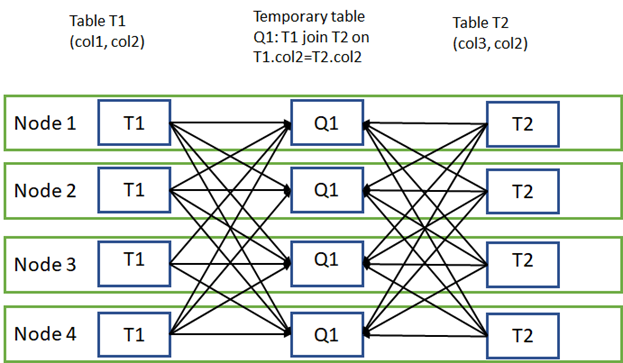

    Let's dive now into the details provided by the query plan to understand some of the problems our current approach has. The following table contains the description of every operation mentioned in the query plan:

    Operation | Operation Type | Description
    ---|---|---
    1 | RND_ID | Identifies an object that will be created. In our case, it's the `TEMP_ID_76` internal table.
    2 | ON | Specifies the location (nodes or distributions) where the operation will occur. `AllDistributions` means here the operation will be performed on each of the 60 distributions of the SQL pool. The operation will be a SQL operation (specified via `<sql_operations>`) that will create the  `TEMP_ID_76` table.
    3 | SHUFFLE_MOVE | The list of shuffle columns contains only one column which is `CustomerId` (specified via `<suffle_columns>`). The values will be distributed to the hash owning distributions and saved locally in the `TEMP_ID_76` tables. The operation will output an estimated number of 41265.25 rows (specified via `<operation_cost>`). According to the same section, the average resulting row size is 13 bytes.
    4 | RETURN | Data resulting from the shuffle operation will be collected from all distributions (see `<location>`) by querying the internal temporary table `TEMP_ID_76`.
    5 | ON | The `TEMP_ID_76` will be deleted from all distributions.

    It becomes clear now what is the root cause of the performance problem: the inter-distribution data movements. This is actually one of the simplest examples given the small size of the data that needs to be shuffled. You can imagine how much worse things become when the shuffled row size becomes larger.

    You can learn more about the structure of the query plan generated by the EXPLAIN statement [here](https://docs.microsoft.com/en-us/sql/t-sql/queries/explain-transact-sql?view=azure-sqldw-latest).

5. Besides the `EXPLAIN` statement, you can also understand the plan details using the `sys.dm_pdw_request_steps` DMV.

    Query the `sys.dm_pdw_exec_requests` DMW to find your query id (this is for the query you executed previously at step 2):

    ```sql
    SELECT  
        *
    FROM    
        sys.dm_pdw_exec_requests
    WHERE   
        [label] = 'Lab03: Heap'
    ```

    The result contains, among other things, the query id (`Request_id`), the label, and the original SQL statement:

    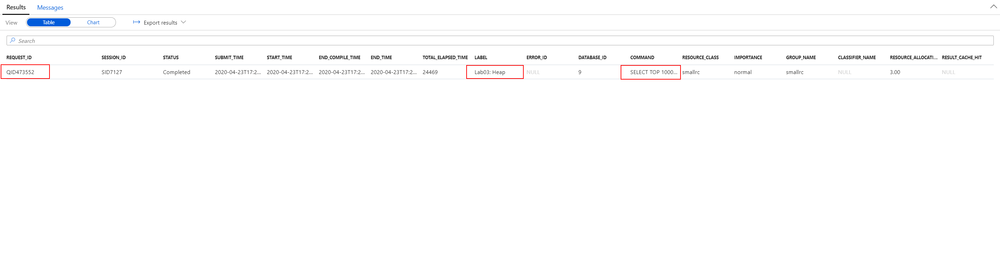

6. With the query id from the previous step (`QID6366` in this case), you can now investigate the individual steps of the query:

    ```sql
    SELECT
       *
    FROM
        sys.dm_pdw_request_steps
    WHERE
        request_id = 'QID6366'
    ORDER BY
       step_index
    ```

    The steps (indexed 0 to 4) are matching operations 2 to 6 from the query plan. Again, the culprit stands out: the step with index 2 describes the inter-partition data movement operation. By looking at the `TOTAL_ELAPSED_TIME` column one can clearly tell the largest part of the query time is generated by this step.

    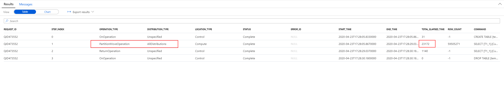

7. Get more details on the problematic step using the following SQL statement (replace the `request_id` and `step_index` values from the previous query results):

    ```sql
    SELECT
    *
    FROM
        sys.dm_pdw_sql_requests
    WHERE
        request_id = 'QID6366'
        AND step_index = 1
    ```

    The results of the statement provide details about what happens on each distribution within the SQL pool.

    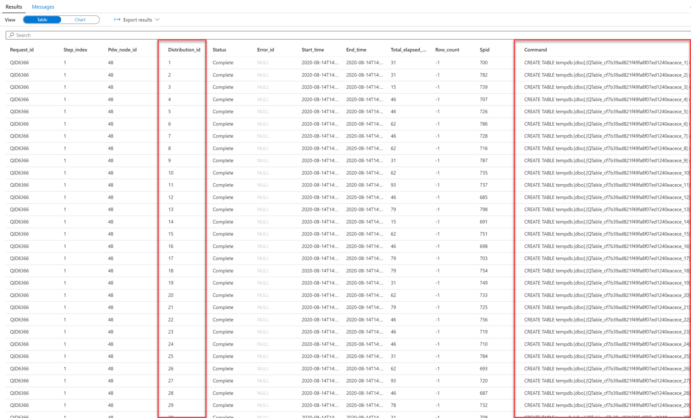

8. Finally, you can use the following SQL statement to investigate data movement on the distributed databases:

    ```sql
    SELECT
        *
    FROM
        sys.dm_pdw_dms_workers
    WHERE
        request_id = 'QID6366'
        AND step_index = 2
    ORDER BY
        distribution_id
    ```

    The results of the statement provide details about data being moved at each distribution. The `ROWS_PROCESSED` column is especially useful here to get an estimate of the magnitude of the data movement happening when the query is executed.

    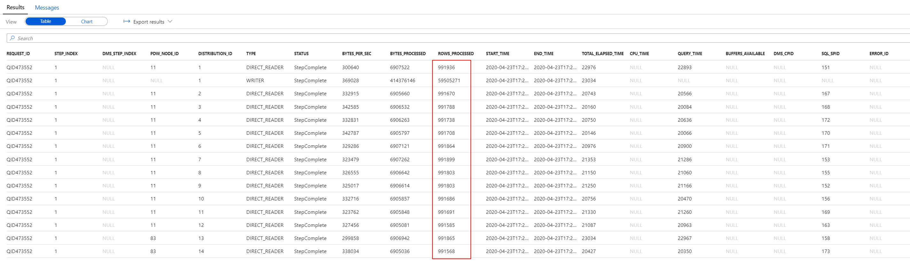

### Task 2 - Improve table structure with hash distribution and columnstore index

1. Create an improved version of the table using CTAS (Create Table As Select):

    ```sql
    CREATE TABLE [wwi_perf].[Sale_Hash]
    WITH
    (
        DISTRIBUTION = HASH ( [CustomerId] ),
        CLUSTERED COLUMNSTORE INDEX
    )
    AS
    SELECT
        *
    FROM
        [wwi_perf].[Sale_Heap]
    ```

    The query will take up to 5 minutes to complete.

    > **NOTE**
    >
    > CTAS is a more customizable version of the SELECT...INTO statement.
    > SELECT...INTO doesn't allow you to change either the distribution method or the index type as part of the operation. You create the new table by using the default distribution type of ROUND_ROBIN, and the default table structure of CLUSTERED COLUMNSTORE INDEX.
    >
    > With CTAS, on the other hand, you can specify both the distribution of the table data as well as the table structure type.

2. Run the query again to see the performance improvements:

    ```sql
    SELECT TOP 1000 * FROM
    (
        SELECT
            S.CustomerId
            ,SUM(S.TotalAmount) as TotalAmount
        FROM
            [wwi_perf].[Sale_Hash] S
        GROUP BY
            S.CustomerId
    ) T
    ```

3. Run the following EXPLAIN statement again to get the query plan (do not select `Query Plan` from the toolbar as it will try do download the query plan and open it in SQL Server Management Studio):

    ```sql
    EXPLAIN
    SELECT TOP 1000 * FROM
    (
        SELECT
            S.CustomerId
            ,SUM(S.TotalAmount) as TotalAmount
        FROM
            [wwi_perf].[Sale_Hash] S
        GROUP BY
            S.CustomerId
    ) T
    ```

    The resulting query plan is clearly much better than the previous one, as there is no more inter-distribution data movement involved.

    ```xml
    <?xml version="1.0" encoding="utf-8"?>
    <dsql_query number_nodes="1" number_distributions="60" number_distributions_per_node="60">
    <sql>SELECT TOP 1000 * FROM (SELECTS.CustomerId,SUM(S.TotalAmount) as TotalAmountFROM[wwi_perf].[Sale_Hash] SGROUP BYS.CustomerId ) T</sql>
    <dsql_operations total_cost="0" total_number_operations="1">
        <dsql_operation operation_type="RETURN">
        <location distribution="AllDistributions" />
        <select>SELECT [T1_1].[CustomerId] AS [CustomerId], [T1_1].[col] AS [col] FROM (SELECT TOP (CAST ((1000) AS BIGINT)) SUM([T2_1].[TotalAmount]) AS [col], [T2_1].[CustomerId] AS [CustomerId] FROM [SQLPool01].[wwi_perf].[Sale_Hash] AS T2_1 GROUP BY [T2_1].[CustomerId]) AS T1_1 OPTION (MAXDOP 4)</select>
        </dsql_operation>
    </dsql_operations>
    </dsql_query>
    ```

4. Try running a more complex query and investigate the execution plan and execution steps. Here is an example of a more complex query you can use:

    ```sql
    SELECT
        AVG(TotalProfit) as AvgMonthlyCustomerProfit
    FROM
    (
        SELECT
            S.CustomerId
            ,D.Year
            ,D.Month
            ,SUM(S.TotalAmount) as TotalAmount
            ,AVG(S.TotalAmount) as AvgAmount
            ,SUM(S.ProfitAmount) as TotalProfit
            ,AVG(S.ProfitAmount) as AvgProfit
        FROM
            [wwi_perf].[Sale_Partition01] S
            join [wwi].[Date] D on
                D.DateId = S.TransactionDateId
        GROUP BY
            S.CustomerId
            ,D.Year
            ,D.Month
    ) T
    ```

### Task 3 - Improve further the structure of the table with partitioning

Date columns are usually good candidates for partitioning tables at the distributions level. In the case of your sales data, partitioning based on the `TransactionDateId` column seems to be a good choice.

Your SQL pool already contains two versions of the `Sale` table that have been partitioned using `TransactionDateId`. These tables are `[wwi_perf].[Sale_Partition01]` and `[wwi_perf].[Sale_Partition02]`. Below are the CTAS queries that have been used to create these tables.

> **Note**
>
> These queries have already been run on the SQL pool. If you want to test the CTAS queries yourself, make sure you replace the table names with new ones.

```sql
CREATE TABLE [wwi_perf].[Sale_Partition01]
WITH
(
	DISTRIBUTION = HASH ( [CustomerId] ),
	CLUSTERED COLUMNSTORE INDEX,
	PARTITION
	(
		[TransactionDateId] RANGE RIGHT FOR VALUES (
            20190101, 20190201, 20190301, 20190401, 20190501, 20190601, 20190701, 20190801, 20190901, 20191001, 20191101, 20191201)
	)
)
AS
SELECT
	*
FROM	
	[wwi_perf].[Sale_Heap]
OPTION  (LABEL  = 'CTAS : Sale_Partition01')

CREATE TABLE [wwi_perf].[Sale_Partition02]
WITH
(
	DISTRIBUTION = HASH ( [CustomerId] ),
	CLUSTERED COLUMNSTORE INDEX,
	PARTITION
	(
		[TransactionDateId] RANGE RIGHT FOR VALUES (
            20190101, 20190401, 20190701, 20191001)
	)
)
AS
SELECT *
FROM
    [wwi_perf].[Sale_Heap]
OPTION  (LABEL  = 'CTAS : Sale_Partition02')
```

Notice the two partitioning strategies we've used here. The first partitioning scheme is month-based and the second is quarter-based. You will explore in Lab 04 the subtle differences between these and understand the potential performance implications resulting from these choices.

## Exercise 2 - Improve query performance

### Task 1 -  Improve COUNT performance

1. The following query attempts to find the TOP 100 of customers that have the most sale transactions:

    ```sql
    SELECT COUNT( DISTINCT CustomerId) from wwi_perf.Sale_Heap
    ```

    Query takes up to 20 seconds to execute. That is expected, since distinct counts are one of the most difficult to optimize types of queries.

2. Run the HyperLogLog approach:

    ```sql
    SELECT APPROX_COUNT_DISTINCT(CustomerId) from wwi_perf.Sale_Heap
    ```

    Query takes about half the time to execute.

### Task 2 - Use materialized views

As opposed to a standard view, a materialized view pre-computes, stores, and maintains its data in a Synapse SQL pool just like a table. Here is a basic comparison between standard and materialized views:

| Comparison                     | View                                         | Materialized View
|:-------------------------------|:---------------------------------------------|:-------------------------------------------------------------|
|View definition                 | Stored in Azure data warehouse.              | Stored in Azure data warehouse.
|View content                    | Generated each time when the view is used.   | Pre-processed and stored in Azure data warehouse during view creation. Updated as data is added to the underlying tables.
|Data refresh                    | Always updated                               | Always updated
|Speed to retrieve view data from complex queries     | Slow                                         | Fast  
|Extra storage                   | No                                           | Yes
|Syntax                          | CREATE VIEW                                  | CREATE MATERIALIZED VIEW AS SELECT

1. Execute the following query to get an approximation of its execution time:

    ```sql
    SELECT TOP 1000 * FROM
    (
        SELECT
            S.CustomerId
            ,D.Year
            ,D.Quarter
            ,SUM(S.TotalAmount) as TotalAmount
        FROM
            [wwi_perf].[Sale_Partition02] S
            join [wwi].[Date] D on
                S.TransactionDateId = D.DateId
        GROUP BY
            S.CustomerId
            ,D.Year
            ,D.Quarter
    ) T
    ```

2. Execute this query as well (notice the slight difference):

    ```sql
    SELECT TOP 1000 * FROM
    (
        SELECT
            S.CustomerId
            ,D.Year
            ,D.Month
            ,SUM(S.ProfitAmount) as TotalProfit
        FROM
            [wwi_perf].[Sale_Partition02] S
            join [wwi].[Date] D on
                S.TransactionDateId = D.DateId
        GROUP BY
            S.CustomerId
            ,D.Year
            ,D.Month
    ) T
    ```

3. Create a materialized view that can support both queries above:

    ```sql
    CREATE MATERIALIZED VIEW
        wwi_perf.mvCustomerSales
    WITH
    (
        DISTRIBUTION = HASH( CustomerId )
    )
    AS
    SELECT
        S.CustomerId
        ,D.Year
        ,D.Quarter
        ,D.Month
        ,SUM(S.TotalAmount) as TotalAmount
        ,SUM(S.ProfitAmount) as TotalProfit
    FROM
        [wwi_perf].[Sale_Partition02] S
        join [wwi].[Date] D on
            S.TransactionDateId = D.DateId
    GROUP BY
        S.CustomerId
        ,D.Year
        ,D.Quarter
        ,D.Month
    ```

4. Run the following query to get an estimated execution plan (do not select `Query Plan` from the toolbar as it will try do download the query plan and open it in SQL Server Management Studio):

    ```sql
    EXPLAIN
    SELECT TOP 1000 * FROM
    (
        SELECT
            S.CustomerId
            ,D.Year
            ,D.Quarter
            ,SUM(S.TotalAmount) as TotalAmount
        FROM
            [wwi_perf].[Sale_Partition02] S
            join [wwi].[Date] D on
                S.TransactionDateId = D.DateId
        GROUP BY
            S.CustomerId
            ,D.Year
            ,D.Quarter
    ) T
    ```

    The resulting execution plan shows how the newly created materialized view is used to optimize the execution. Note the `FROM [SQLPool01].[wwi_perf].[mvCustomerSales]` in the `<dsql_operations>` element.

    ```xml
    <?xml version="1.0" encoding="utf-8"?>
    <dsql_query number_nodes="1" number_distributions="60" number_distributions_per_node="60">
    <sql>SELECT TOP 1000 * FROM (SELECTS.CustomerId,D.Year,D.Quarter,SUM(S.TotalAmount) as TotalAmountFROM[wwi_perf].[Sale_Partition02] Sjoin [wwi].[Date] D onS.TransactionDateId = D.DateIdGROUP BYS.CustomerId,D.Year,D.Quarter ) T</sql>
    <dsql_operations total_cost="0" total_number_operations="1">
        <dsql_operation operation_type="RETURN">
        <location distribution="AllDistributions" />
        <select>SELECT [T1_1].[CustomerId] AS [CustomerId], [T1_1].[Year] AS [Year], [T1_1].[Quarter] AS [Quarter], [T1_1].[col] AS [col] FROM (SELECT TOP (CAST ((1000) AS BIGINT)) [T2_1].[CustomerId] AS [CustomerId], [T2_1].[Year] AS [Year], [T2_1].[Quarter] AS [Quarter], [T2_1].[col1] AS [col] FROM (SELECT ISNULL([T3_1].[col], CONVERT (BIGINT, 0, 0)) AS [col], [T3_1].[CustomerId] AS [CustomerId], [T3_1].[Year] AS [Year], [T3_1].[Quarter] AS [Quarter], [T3_1].[col1] AS [col1] FROM (SELECT SUM([T4_1].[cb]) AS [col], SUM([T4_1].[TotalAmount]) AS [col1], [T4_1].[CustomerId] AS [CustomerId], [T4_1].[Year] AS [Year], [T4_1].[Quarter] AS [Quarter] FROM (SELECT [T5_1].[CustomerId] AS [CustomerId], [T5_1].[TotalAmount] AS [TotalAmount], [T5_1].[cb] AS [cb], [T5_1].[Quarter] AS [Quarter], [T5_1].[Year] AS [Year] FROM [SQLPool01].[wwi_perf].[mvCustomerSales] AS T5_1) AS T4_1 GROUP BY [T4_1].[CustomerId], [T4_1].[Year], [T4_1].[Quarter]) AS T3_1) AS T2_1 WHERE ([T2_1].[col] != CAST ((0) AS BIGINT))) AS T1_1 OPTION (MAXDOP 4)</select>
        </dsql_operation>
    </dsql_operations>
    </dsql_query>
    ```

5. The same materialized view is also used to optimize the second query. Get its execution plan:

    ```sql
    EXPLAIN
    SELECT TOP 1000 * FROM
    (
        SELECT
            S.CustomerId
            ,D.Year
            ,D.Month
            ,SUM(S.ProfitAmount) as TotalProfit
        FROM
            [wwi_perf].[Sale_Partition02] S
            join [wwi].[Date] D on
                S.TransactionDateId = D.DateId
        GROUP BY
            S.CustomerId
            ,D.Year
            ,D.Month
    ) T
    ```

    The resulting execution plan shows the use of the same materialized view to optimize execution:

    ```xml
    <?xml version="1.0" encoding="utf-8"?>
    <dsql_query number_nodes="1" number_distributions="60" number_distributions_per_node="60">
    <sql>SELECT TOP 1000 * FROM (SELECTS.CustomerId,D.Year,D.Month,SUM(S.ProfitAmount) as TotalProfitFROM[wwi_perf].[Sale_Partition02] Sjoin [wwi].[Date] D onS.TransactionDateId = D.DateIdGROUP BYS.CustomerId,D.Year,D.Month ) T</sql>
    <dsql_operations total_cost="0" total_number_operations="1">
        <dsql_operation operation_type="RETURN">
        <location distribution="AllDistributions" />
        <select>SELECT [T1_1].[CustomerId] AS [CustomerId], [T1_1].[Year] AS [Year], [T1_1].[Month] AS [Month], [T1_1].[col] AS [col] FROM (SELECT TOP (CAST ((1000) AS BIGINT)) [T2_1].[CustomerId] AS [CustomerId], [T2_1].[Year] AS [Year], [T2_1].[Month] AS [Month], [T2_1].[col1] AS [col] FROM (SELECT ISNULL([T3_1].[col], CONVERT (BIGINT, 0, 0)) AS [col], [T3_1].[CustomerId] AS [CustomerId], [T3_1].[Year] AS [Year], [T3_1].[Month] AS [Month], [T3_1].[col1] AS [col1] FROM (SELECT SUM([T4_1].[cb]) AS [col], SUM([T4_1].[TotalProfit]) AS [col1], [T4_1].[CustomerId] AS [CustomerId], [T4_1].[Year] AS [Year], [T4_1].[Month] AS [Month] FROM (SELECT [T5_1].[CustomerId] AS [CustomerId], [T5_1].[TotalProfit] AS [TotalProfit], [T5_1].[cb] AS [cb], [T5_1].[Month] AS [Month], [T5_1].[Year] AS [Year] FROM [SQLPool01].[wwi_perf].[mvCustomerSales] AS T5_1) AS T4_1 GROUP BY [T4_1].[CustomerId], [T4_1].[Year], [T4_1].[Month]) AS T3_1) AS T2_1 WHERE ([T2_1].[col] != CAST ((0) AS BIGINT))) AS T1_1 OPTION (MAXDOP 4)</select>
        </dsql_operation>
    </dsql_operations>
    </dsql_query>
    ```

    >**Note**
    >
    >Even if the two queries have different aggregation levels, the query optimizer is able to infer the use of the materialized view. This happens because the materialized view covers both aggregation levels (`Quarter` and `Month`) as well as both aggregation measures (`TotalAmount` and `ProfitAmount`).

6. Check the materialized view overhead:

    ```sql
    DBCC PDW_SHOWMATERIALIZEDVIEWOVERHEAD ( 'wwi_perf.mvCustomerSales' )
    ```

    The results show that `BASE_VIEW_ROWS` are equal to `TOTAL_ROWS` (and hence `OVERHEAD_RATIO` is 1). The materialized view is perfectly aligned with the base view. This situation is expected to change once the underlying data starts to change.

7. Update the original data the materialized view was built on:

    ```sql
    UPDATE
        [wwi_perf].[Sale_Partition02]
    SET
        TotalAmount = TotalAmount * 1.01
        ,ProfitAmount = ProfitAmount * 1.01
    WHERE
        CustomerId BETWEEN 100 and 200
    ```

8. Check the materialized view overhead again:

    ```sql
    DBCC PDW_SHOWMATERIALIZEDVIEWOVERHEAD ( 'wwi_perf.mvCustomerSales' )
    ```

    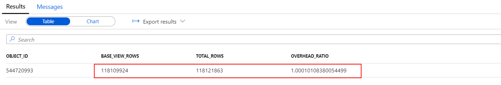

    There is now a delta stored by the materialized view which results in `TOTAL_ROWS` being greater than `BASE_VIEW_ROWS` and `OVERHEAD_RATIO` being greater than 1.

9. Rebuild the materialized view and check that the overhead ration went back to 1:

    ```sql
    ALTER MATERIALIZED VIEW [wwi_perf].[mvCustomerSales] REBUILD

    DBCC PDW_SHOWMATERIALIZEDVIEWOVERHEAD ( 'wwi_perf.mvCustomerSales' )
    ```

    

### Task 3 - Use result set caching

1. Check if result set caching is on in the current SQL pool:

    ```sql
    SELECT
        name
        ,is_result_set_caching_on
    FROM
        sys.databases
    ```

    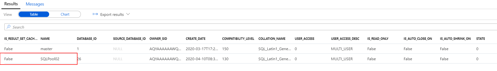

    If `False` is returned for your SQL pool, run the following query to activate it (you need to run it on the `master` database and replace `<sql_pool>` with the name of your SQL pool):

    ```sql
    ALTER DATABASE [<sql_pool>]
    SET RESULT_SET_CACHING ON
    ```

    >**Important**
    >
    >The operations to create result set cache and retrieve data from the cache happen on the control node of a Synapse SQL pool instance. When result set caching is turned ON, running queries that return large result set (for example, >1GB) can cause high throttling on the control node and slow down the overall query response on the instance. Those queries are commonly used during data exploration or ETL operations. To avoid stressing the control node and cause performance issue, users should turn OFF result set caching on the database before running those types of queries.

2. After activating result set caching, run a query and immediately check if it hit the cache (change the database back to your SQL Pool):

    ```sql
    SELECT
        D.Year
        ,D.Quarter
        ,D.Month
        ,SUM(S.TotalAmount) as TotalAmount
        ,SUM(S.ProfitAmount) as TotalProfit
    FROM
        [wwi_perf].[Sale_Partition02] S
        join [wwi].[Date] D on
            S.TransactionDateId = D.DateId
    GROUP BY
        D.Year
        ,D.Quarter
        ,D.Month
    OPTION (LABEL = 'Lab03: Result set caching')

    SELECT
        result_cache_hit
    FROM
        sys.dm_pdw_exec_requests
    WHERE
        request_id =
        (
            SELECT TOP 1
                request_id
            FROM
                sys.dm_pdw_exec_requests
            WHERE
                [label] = 'Lab03: Result set caching'
            ORDER BY
                start_time desc
        )
    ```

    As expected, the result is `False`. Still, you can identify that, while running the query, Synapse has also cached the result set. Run the following query to get the execution steps:

    ```sql
    SELECT
        step_index
        ,operation_type
        ,location_type
        ,status
        ,total_elapsed_time
        ,command
    FROM
        sys.dm_pdw_request_steps
    WHERE
        request_id =
        (
            SELECT TOP 1
                request_id
            FROM
                sys.dm_pdw_exec_requests
            WHERE
                [label] = 'Lab03: Result set caching'
            ORDER BY
                start_time desc
        )
    ```

    The execution plan reveals the building of the result set cache:

    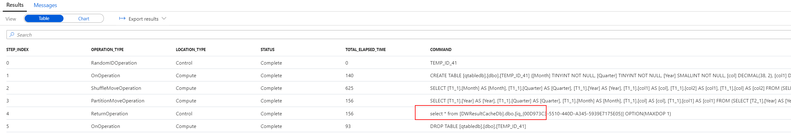

3. You can control at the user session level the use of the result set cache. The following query shows how to deactivate and activate the result cache:

    ```sql  
    SET RESULT_SET_CACHING OFF

    SELECT
        D.Year
        ,D.Quarter
        ,D.Month
        ,SUM(S.TotalAmount) as TotalAmount
        ,SUM(S.ProfitAmount) as TotalProfit
    FROM
        [wwi_perf].[Sale_Partition02] S
        join [wwi].[Date] D on
            S.TransactionDateId = D.DateId
    GROUP BY
        D.Year
        ,D.Quarter
        ,D.Month
    OPTION (LABEL = 'Lab03: Result set caching off')

    SET RESULT_SET_CACHING ON

    SELECT
        D.Year
        ,D.Quarter
        ,D.Month
        ,SUM(S.TotalAmount) as TotalAmount
        ,SUM(S.ProfitAmount) as TotalProfit
    FROM
        [wwi_perf].[Sale_Partition02] S
        join [wwi].[Date] D on
            S.TransactionDateId = D.DateId
    GROUP BY
        D.Year
        ,D.Quarter
        ,D.Month
    OPTION (LABEL = 'Lab03: Result set caching on')

    SELECT TOP 2
        request_id
        ,[label]
        ,result_cache_hit
    FROM
        sys.dm_pdw_exec_requests
    WHERE
        [label] in ('Lab03: Result set caching off', 'Lab03: Result set caching on')
    ORDER BY
        start_time desc
    ```

    The result of `SET RESULT_SET_CACHING OFF` is visible in the cache hit test results (The `result_cache_hit` column returns `1` for cache hit, `0` for cache miss, and *negative values* for reasons why result set caching was not used.):

    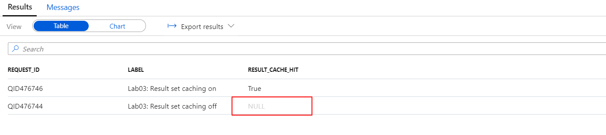

4. At any moment, you can check the space used by the results cache:

    ```sql
    DBCC SHOWRESULTCACHESPACEUSED
    ```

    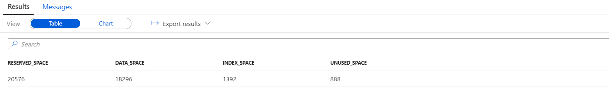

5. Clear the result set cache using:

    ```sql
    DBCC DROPRESULTSETCACHE
    ```

6. Finally, disable result set caching on the database using the following query (you need to run it on the `master` database and replace `<sql_pool> with the name of your SQL pool): (It can take up to a minute to disable Result Set Caching.)

    ```sql
    ALTER DATABASE [<sql_pool>]
    SET RESULT_SET_CACHING OFF
    ```

    >**Important**
    >
    >Make sure you disable result set caching on the SQL pool. Failing to do so will have a negative impact on the remainder of this lab, as it will skew execution times and defeat the purpose of several upcoming exercises.

    >**Note**
    >
    >The maximum size of result set cache is 1 TB per database. The cached results are automatically invalidated when the underlying query data change.
    >
    >The cache eviction is managed by SQL Analytics automatically following this schedule:
    >- Every 48 hours if the result set hasn't been used or has been invalidated.
    >- When the result set cache approaches the maximum size.
    >
    >Users can manually empty the entire result set cache by using one of these options:
    >- Turn OFF the result set cache feature for the database
    >- Run DBCC DROPRESULTSETCACHE while connected to the database
    >
    >Pausing a database won't empty cached result set.

### Task 4 - Create and update statistics

The more the SQL pool resource knows about your data, the faster it can execute queries. After loading data into SQL pool, collecting statistics on your data is one of the most important things you can do for query optimization.

The SQL pool query optimizer is a cost-based optimizer. It compares the cost of various query plans, and then chooses the plan with the lowest cost. In most cases, it chooses the plan that will execute the fastest.

For example, if the optimizer estimates that the date your query is filtering on will return one row it will choose one plan. If it estimates that the selected date will return 1 million rows, it will return a different plan.

1. Check if statistics are set to be automatically created in the database:

    ```sql
    SELECT name, is_auto_create_stats_on
    FROM sys.databases
    ```

2. See statistics that have been automatically created (change the database back to your SQL Pool):

    ```sql
    SELECT
        *
    FROM
        sys.dm_pdw_exec_requests
    WHERE
        Command like 'CREATE STATISTICS%'
    ```

    Notice the special name pattern used for automatically created statistics:

    

3. Check if there are any statistics created for `CustomerId` from the `wwi_perf.Sale_Has` table:

    ```sql
    DBCC SHOW_STATISTICS ('wwi_perf.Sale_Hash', CustomerId) WITH HISTOGRAM
    ```

    You should get an error stating that statistics for `CustomerId` does not exist.

4. Create statistics for `CustomerId`:

    ```sql
    CREATE STATISTICS Sale_Hash_CustomerId ON wwi_perf.Sale_Hash (CustomerId)
    ```

    Display the newly created statistics:

    ```sql
    DBCC SHOW_STATISTICS([wwi_perf.Sale_Hash], 'Sale_Hash_CustomerId')
    ```

    In the results pane, switch to `Chart` display and set the category column and the legend columns as presented below:

    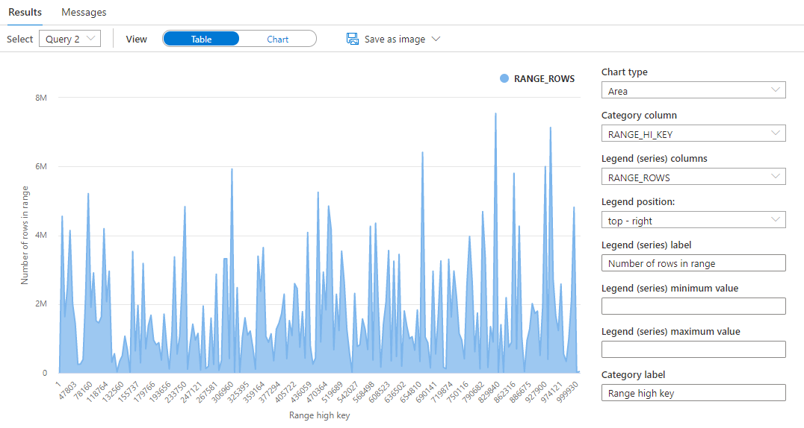

    You now have a visual on the statistics created for the `CustomerId` column.

    >**Important**
    >
    >The more SQL pool knows about your data, the faster it can execute queries against it. After loading data into SQL pool, collecting statistics on your data is one of the most important things you can do to optimize your queries.
    >
    >The SQL pool query optimizer is a cost-based optimizer. It compares the cost of various query plans, and then chooses the plan with the lowest cost. In most cases, it chooses the plan that will execute the fastest.
    >
    >For example, if the optimizer estimates that the date your query is filtering on will return one row it will choose one plan. If it estimates that the selected date will return 1 million rows, it will return a different plan.

### Task 5 - Create and update indexes

Clustered Columnstore Index vs. Heap vs. Clustered and Nonclustered

Clustered indexes may outperform clustered columnstore indexes when a single row needs to be quickly retrieved. For queries where a single or very few row lookup is required to perform with extreme speed, consider a cluster index or nonclustered secondary index. The disadvantage to using a clustered index is that only queries that benefit are the ones that use a highly selective filter on the clustered index column. To improve filter on other columns a nonclustered index can be added to other columns. However, each index which is added to a table adds both space and processing time to loads.

1. Retrieve information about a single customer from the table with CCI:

    ```sql
    SELECT
        *
    FROM
        [wwi_perf].[Sale_Hash]
    WHERE
        CustomerId = 500000
    ```

    Take a note of the execution time.

2. Retrieve information about a single customer from the table with a clustered index:

    ```sql
    SELECT
        *
    FROM
        [wwi_perf].[Sale_Index]
    WHERE
        CustomerId = 500000
    ```

    The execution time is similar to the one for the query above. Clustered columnstore indexes have no significant advantage over clustered indexes in the specific scenario of highly selective queries.

3. Retrieve information about multiple customers from the table with CCI:

    ```sql
    SELECT
        *
    FROM
        [wwi_perf].[Sale_Hash]
    WHERE
        CustomerId between 400000 and 400100
    ```

    and then retrieve the same information from the table with a clustered index:

    ```sql
    SELECT
        *
    FROM
        [wwi_perf].[Sale_Index]
    WHERE
        CustomerId between 400000 and 400100
    ```

    Run both queries several times to get a stable execution time. Under normal conditions, you should see that even with a relatively small number of customers, the CCI table starts yielding better results than the clustered index table.

4. Now add an extra condition on the query, one that refers to the `StoreId` column:

    ```sql
    SELECT
        *
    FROM
        [wwi_perf].[Sale_Index]
    WHERE
        CustomerId between 400000 and 400100
        and StoreId between 2000 and 4000
    ```

    Take a note of the execution time.

5. Create a non-clustered index on the `StoreId` column:

    ```sql
    CREATE INDEX Store_Index on wwi_perf.Sale_Index (StoreId)
    ```

    The creation of the index should complete in a few minutes. Once the index is created, run the previous query again. Notice the improvement in execution time resulting from the newly created non-clustered index.

    >**Note**
    >
    >Creating a non-clustered index on the `wwi_perf.Sale_Index` is based on the already existing clustered index. As a bonus exercise, try to create the same type of index on the `wwi_perf.Sale_Hash` table. Can you explain the difference in index creation time?

### Task 6 - Ordered Clustered Columnstore Indexes

By default, for each table created without an index option, an internal component (index builder) creates a non-ordered clustered columnstore index (CCI) on it. Data in each column is compressed into a separate CCI rowgroup segment. There's metadata on each segment's value range, so segments that are outside the bounds of the query predicate aren't read from disk during query execution. CCI offers the highest level of data compression and reduces the size of segments to read so queries can run faster. However, because the index builder doesn't sort data before compressing them into segments, segments with overlapping value ranges could occur, causing queries to read more segments from disk and take longer to finish.

When creating an ordered CCI, the Synapse SQL engine sorts the existing data in memory by the order key(s) before the index builder compresses them into index segments. With sorted data, segment overlapping is reduced allowing queries to have a more efficient segment elimination and thus faster performance because the number of segments to read from disk is smaller. If all data can be sorted in memory at once, then segment overlapping can be avoided. Due to large tables in data warehouses, this scenario doesn't happen often.

Queries with the following patterns typically run faster with ordered CCI:

- The queries have equality, inequality, or range predicates
- The predicate columns and the ordered CCI columns are the same.
- The predicate columns are used in the same order as the column ordinal of ordered CCI columns.

1. Run the following query to show the segment overlaps for the `Sale_Hash` table:

    ```sql
    select
        OBJ.name as table_name
        ,COL.name as column_name
        ,NT.distribution_id
        ,NP.partition_id
        ,NP.rows as partition_rows
        ,NP.data_compression_desc
        ,NCSS.segment_id
        ,NCSS.version
        ,NCSS.min_data_id
        ,NCSS.max_data_id
        ,NCSS.row_count
    from
        sys.objects OBJ
        JOIN sys.columns as COL ON
            OBJ.object_id = COL.object_id
        JOIN sys.pdw_table_mappings TM ON
            OBJ.object_id = TM.object_id
        JOIN sys.pdw_nodes_tables as NT on
            TM.physical_name = NT.name
        JOIN sys.pdw_nodes_partitions NP on
            NT.object_id = NP.object_id
            and NT.pdw_node_id = NP.pdw_node_id
            and substring(TM.physical_name, 40, 10) = NP.distribution_id
        JOIN sys.pdw_nodes_column_store_segments NCSS on
            NP.partition_id = NCSS.partition_id
            and NP.distribution_id = NCSS.distribution_id
            and COL.column_id = NCSS.column_id
    where
        OBJ.name = 'Sale_Hash'
        and COL.name = 'CustomerId'
        and TM.physical_name  not like '%HdTable%'
    order by
        NT.distribution_id
    ```

    Here is a short description of the tables involved in the query:

    Table Name | Description
    ---|---
    sys.objects | All objects in the database. Filtered to match only the `Sale_Hash` table.
    sys.columns | All columns in the database. Filtered to match only the `CustomerId` column of the `Sale_Hash` table.
    sys.pdw_table_mappings | Maps each table to local tables on physical nodes and distributions.
    sys.pdw_nodes_tables | Contains information on each local table in each distribution.
    sys.pdw_nodes_partitions | Contains information on each local partition of each local table in each distribution.
    sys.pdw_nodes_column_store_segments | Contains information on each CCI segment for each partition and distribution column of each local table in each distribution. Filtered to match only the `CustomerId` column of the `Sale_Hash` table.

    With this information on hand, take a look at the result:

    

    Browse through the result set and notice the significant overlap between segments. There is literally overlap in customer ids between every single pair of segments (`CustomerId` values in the data range from 1 to 1,000,000). The segment structure of this CCI is clearly inefficient and will result in a lot of unnecessary reads from storage.

2. Run the following query to show the segment overlaps for the `Sale_Hash_Ordered` table:

    ```sql
    select
        OBJ.name as table_name
        ,COL.name as column_name
        ,NT.distribution_id
        ,NP.partition_id
        ,NP.rows as partition_rows
        ,NP.data_compression_desc
        ,NCSS.segment_id
        ,NCSS.version
        ,NCSS.min_data_id
        ,NCSS.max_data_id
        ,NCSS.row_count
    from
        sys.objects OBJ
        JOIN sys.columns as COL ON
            OBJ.object_id = COL.object_id
        JOIN sys.pdw_table_mappings TM ON
            OBJ.object_id = TM.object_id
        JOIN sys.pdw_nodes_tables as NT on
            TM.physical_name = NT.name
        JOIN sys.pdw_nodes_partitions NP on
            NT.object_id = NP.object_id
            and NT.pdw_node_id = NP.pdw_node_id
            and substring(TM.physical_name, 40, 10) = NP.distribution_id
        JOIN sys.pdw_nodes_column_store_segments NCSS on
            NP.partition_id = NCSS.partition_id
            and NP.distribution_id = NCSS.distribution_id
            and COL.column_id = NCSS.column_id
    where
        OBJ.name = 'Sale_Hash_Ordered'
        and COL.name = 'CustomerId'
        and TM.physical_name  not like '%HdTable%'
    order by
        NT.distribution_id
    ```

    The CTAS used to create the `wwi_perf.Sale_Hash_Ordered` table was the following:

    ```sql
    CREATE TABLE [wwi_perf].[Sale_Hash_Ordered]
    WITH
    (
        DISTRIBUTION = HASH ( [CustomerId] ),
        CLUSTERED COLUMNSTORE INDEX ORDER( [CustomerId] )
    )
    AS
    SELECT
        *
    FROM
        [wwi_perf].[Sale_Heap]
    OPTION  (LABEL  = 'CTAS : Sale_Hash', MAXDOP 1)
    ```

    Notice the creation of the ordered CCI with MAXDOP = 1. Each thread used for ordered CCI creation works on a subset of data and sorts it locally. There's no global sorting across data sorted by different threads. Using parallel threads can reduce the time to create an ordered CCI but will generate more overlapping segments than using a single thread. Currently, the MAXDOP option is only supported in creating an ordered CCI table using CREATE TABLE AS SELECT command. Creating an ordered CCI via CREATE INDEX or CREATE TABLE commands does not support the MAXDOP option.

    The results show significantly less overlap between segments:

    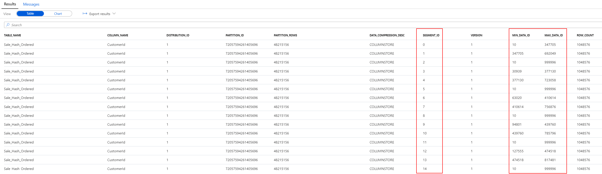

>**Note**
>
>You will learn more about the internal organization of the clustered columnstore indexes in the following lab.

## Cleanup: Pause the dedicated SQL pool

1. Navigate to the **Manage** hub.

    

2. From the center menu, select **SQL pools** from beneath the **Analytics pools** heading. Locate `SQLPool01`, and select the **Pause** button.

    

3. When prompted, select **Pause**.
