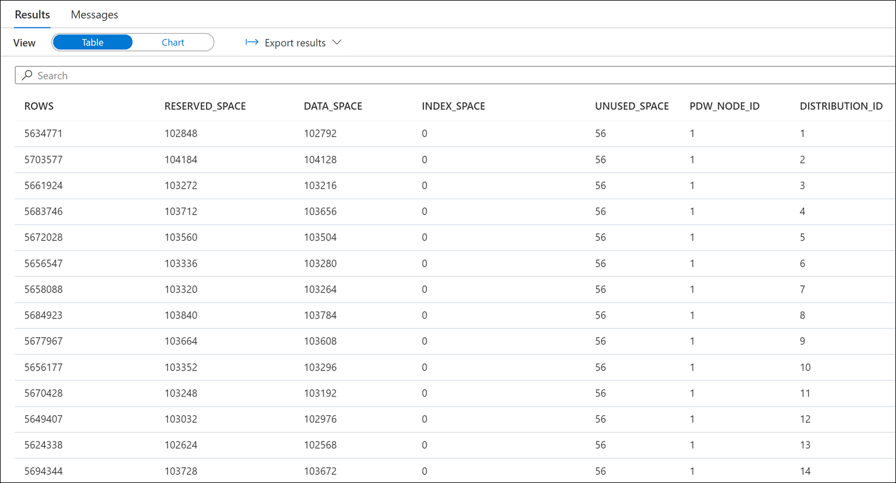
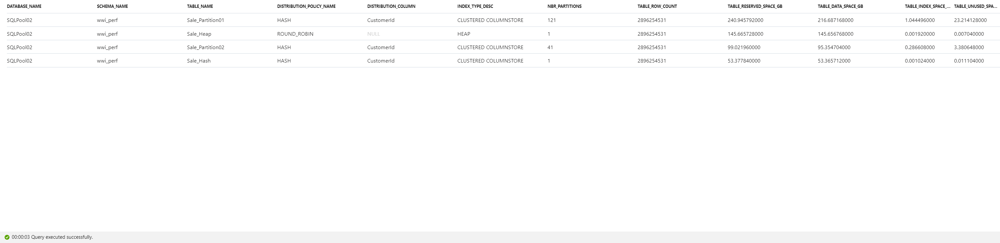
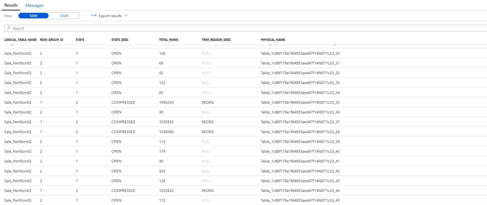

# DW Optimization Part 2

```
Build upon previous (with accelerator) 
Progressively build up complex query highlighting each feature
Have a fact table with query filtered by date time and  by customer ID
The had partitioned this
Telling a story of the storage system

```

`<TBA>`
Explicit instructions on scaling up to DW1500 before the lab and scaling back after Lab 04 is completed.
`</TBA>`

## Exercise 1 - Check for skewed data and space usage

### Task 1 - Analyze the space used by tables

1. Run the following DBCC command:

    ```sql
    DBCC PDW_SHOWSPACEUSED('wwi_perf.Sale_Hash');
    ```

    

2. Analyze the number of rows in each distribution. Those numbers should be as even as possible.

### Task 2 - Use a more advanced approach to understand table space usage

1. Run the following script to create the `vTableSizes` view:

    ```sql
    CREATE VIEW [wwi_perf].[vTableSizes]
    AS
    WITH base
    AS
    (
    SELECT
    GETDATE()                                                             AS  [execution_time]
    , DB_NAME()                                                            AS  [database_name]
    , s.name                                                               AS  [schema_name]
    , t.name                                                               AS  [table_name]
    , QUOTENAME(s.name)+'.'+QUOTENAME(t.name)                              AS  [two_part_name]
    , nt.[name]                                                            AS  [node_table_name]
    , ROW_NUMBER() OVER(PARTITION BY nt.[name] ORDER BY (SELECT NULL))     AS  [node_table_name_seq]
    , tp.[distribution_policy_desc]                                        AS  [distribution_policy_name]
    , c.[name]                                                             AS  [distribution_column]
    , nt.[distribution_id]                                                 AS  [distribution_id]
    , i.[type]                                                             AS  [index_type]
    , i.[type_desc]                                                        AS  [index_type_desc]
    , nt.[pdw_node_id]                                                     AS  [pdw_node_id]
    , pn.[type]                                                            AS  [pdw_node_type]
    , pn.[name]                                                            AS  [pdw_node_name]
    , di.name                                                              AS  [dist_name]
    , di.position                                                          AS  [dist_position]
    , nps.[partition_number]                                               AS  [partition_nmbr]
    , nps.[reserved_page_count]                                            AS  [reserved_space_page_count]
    , nps.[reserved_page_count] - nps.[used_page_count]                    AS  [unused_space_page_count]
    , nps.[in_row_data_page_count]
        + nps.[row_overflow_used_page_count]
        + nps.[lob_used_page_count]                                        AS  [data_space_page_count]
    , nps.[reserved_page_count]
    - (nps.[reserved_page_count] - nps.[used_page_count])
    - ([in_row_data_page_count]
            + [row_overflow_used_page_count]+[lob_used_page_count])       AS  [index_space_page_count]
    , nps.[row_count]                                                      AS  [row_count]
    from
        sys.schemas s
    INNER JOIN sys.tables t
        ON s.[schema_id] = t.[schema_id]
    INNER JOIN sys.indexes i
        ON  t.[object_id] = i.[object_id]
        AND i.[index_id] <= 1
    INNER JOIN sys.pdw_table_distribution_properties tp
        ON t.[object_id] = tp.[object_id]
    INNER JOIN sys.pdw_table_mappings tm
        ON t.[object_id] = tm.[object_id]
    INNER JOIN sys.pdw_nodes_tables nt
        ON tm.[physical_name] = nt.[name]
    INNER JOIN sys.dm_pdw_nodes pn
        ON  nt.[pdw_node_id] = pn.[pdw_node_id]
    INNER JOIN sys.pdw_distributions di
        ON  nt.[distribution_id] = di.[distribution_id]
    INNER JOIN sys.dm_pdw_nodes_db_partition_stats nps
        ON nt.[object_id] = nps.[object_id]
        AND nt.[pdw_node_id] = nps.[pdw_node_id]
        AND nt.[distribution_id] = nps.[distribution_id]
    LEFT OUTER JOIN (select * from sys.pdw_column_distribution_properties where distribution_ordinal = 1) cdp
        ON t.[object_id] = cdp.[object_id]
    LEFT OUTER JOIN sys.columns c
        ON cdp.[object_id] = c.[object_id]
        AND cdp.[column_id] = c.[column_id]
    WHERE pn.[type] = 'COMPUTE'
    )
    , size
    AS
    (
    SELECT
    [execution_time]
    ,  [database_name]
    ,  [schema_name]
    ,  [table_name]
    ,  [two_part_name]
    ,  [node_table_name]
    ,  [node_table_name_seq]
    ,  [distribution_policy_name]
    ,  [distribution_column]
    ,  [distribution_id]
    ,  [index_type]
    ,  [index_type_desc]
    ,  [pdw_node_id]
    ,  [pdw_node_type]
    ,  [pdw_node_name]
    ,  [dist_name]
    ,  [dist_position]
    ,  [partition_nmbr]
    ,  [reserved_space_page_count]
    ,  [unused_space_page_count]
    ,  [data_space_page_count]
    ,  [index_space_page_count]
    ,  [row_count]
    ,  ([reserved_space_page_count] * 8.0)                                 AS [reserved_space_KB]
    ,  ([reserved_space_page_count] * 8.0)/1000                            AS [reserved_space_MB]
    ,  ([reserved_space_page_count] * 8.0)/1000000                         AS [reserved_space_GB]
    ,  ([reserved_space_page_count] * 8.0)/1000000000                      AS [reserved_space_TB]
    ,  ([unused_space_page_count]   * 8.0)                                 AS [unused_space_KB]
    ,  ([unused_space_page_count]   * 8.0)/1000                            AS [unused_space_MB]
    ,  ([unused_space_page_count]   * 8.0)/1000000                         AS [unused_space_GB]
    ,  ([unused_space_page_count]   * 8.0)/1000000000                      AS [unused_space_TB]
    ,  ([data_space_page_count]     * 8.0)                                 AS [data_space_KB]
    ,  ([data_space_page_count]     * 8.0)/1000                            AS [data_space_MB]
    ,  ([data_space_page_count]     * 8.0)/1000000                         AS [data_space_GB]
    ,  ([data_space_page_count]     * 8.0)/1000000000                      AS [data_space_TB]
    ,  ([index_space_page_count]  * 8.0)                                   AS [index_space_KB]
    ,  ([index_space_page_count]  * 8.0)/1000                              AS [index_space_MB]
    ,  ([index_space_page_count]  * 8.0)/1000000                           AS [index_space_GB]
    ,  ([index_space_page_count]  * 8.0)/1000000000                        AS [index_space_TB]
    FROM base
    )
    SELECT *
    FROM size
    ```

2. Run the following script to view the details about the structure of the tables in the `wwi_perf` schema:

    ```sql
    SELECT
        database_name
    ,    schema_name
    ,    table_name
    ,    distribution_policy_name
    ,      distribution_column
    ,    index_type_desc
    ,    COUNT(distinct partition_nmbr) as nbr_partitions
    ,    SUM(row_count)                 as table_row_count
    ,    SUM(reserved_space_GB)         as table_reserved_space_GB
    ,    SUM(data_space_GB)             as table_data_space_GB
    ,    SUM(index_space_GB)            as table_index_space_GB
    ,    SUM(unused_space_GB)           as table_unused_space_GB
    FROM
        [wwi_perf].[vTableSizes]
    WHERE
        schema_name = 'wwi_perf'
    GROUP BY
        database_name
    ,    schema_name
    ,    table_name
    ,    distribution_policy_name
    ,      distribution_column
    ,    index_type_desc
    ORDER BY
        table_reserved_space_GB desc
    ```

3. Notice the results:

    

    Notice the significant difference between the space used by `ROUND_ROBIN` and `HASH` tables.

## Exercise 2 - Understand column store storage details

### Task 1 - Create view for column store row group stats

1. Run the following query to create the `vColumnStoreRowGroupStats`:

    ```sql
    create view [wwi_perf].[vColumnStoreRowGroupStats]
    as
    with cte
    as
    (
    select   tb.[name]                    AS [logical_table_name]
    ,        rg.[row_group_id]            AS [row_group_id]
    ,        rg.[state]                   AS [state]
    ,        rg.[state_desc]              AS [state_desc]
    ,        rg.[total_rows]              AS [total_rows]
    ,        rg.[trim_reason_desc]        AS trim_reason_desc
    ,        mp.[physical_name]           AS physical_name
    FROM    sys.[schemas] sm
    JOIN    sys.[tables] tb               ON  sm.[schema_id]          = tb.[schema_id]
    JOIN    sys.[pdw_table_mappings] mp   ON  tb.[object_id]          = mp.[object_id]
    JOIN    sys.[pdw_nodes_tables] nt     ON  nt.[name]               = mp.[physical_name]
    JOIN    sys.[dm_pdw_nodes_db_column_store_row_group_physical_stats] rg      ON  rg.[object_id]     = nt.[object_id]
                                                                                AND rg.[pdw_node_id]   = nt.[pdw_node_id]
                                            AND rg.[distribution_id]    = nt.[distribution_id]
    )
    select *
    from cte;
    ```

2. Explore the statistics of the column store for the `Sale_Partition02` table using the following statement:

    ```sql
    select * from [wwi_perf].[vColumnStoreRowGroupStats] where Logical_Table_Name = 'Sale_Partition02'
    ```

3. Explore the results of the query:

    

    Notice the `COMPRESSED` and `OPEN` states of some of the row groups.

    `<TBA>`
    Detailed explanation about how did the row groups end up like shown above.
    `</TBA>`

## Exercise 3 - Study the impact of wrong choices for column data types

## Exercise 4 - Study the impact of materialized views

```
Use of a nested subquery aligns to limits of MV
Create the MV of the subquery, and see improved perf
```
## Exercise 5 - Avoid extensive logging

## Exercise 6 - Correlate replication and distribution strategies across multiple tables