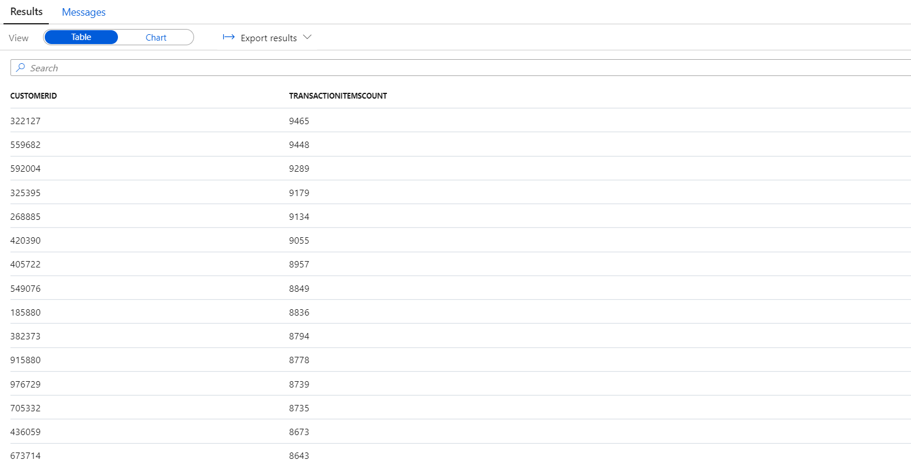
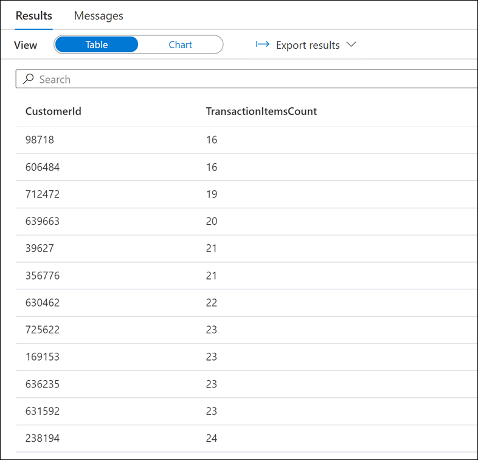
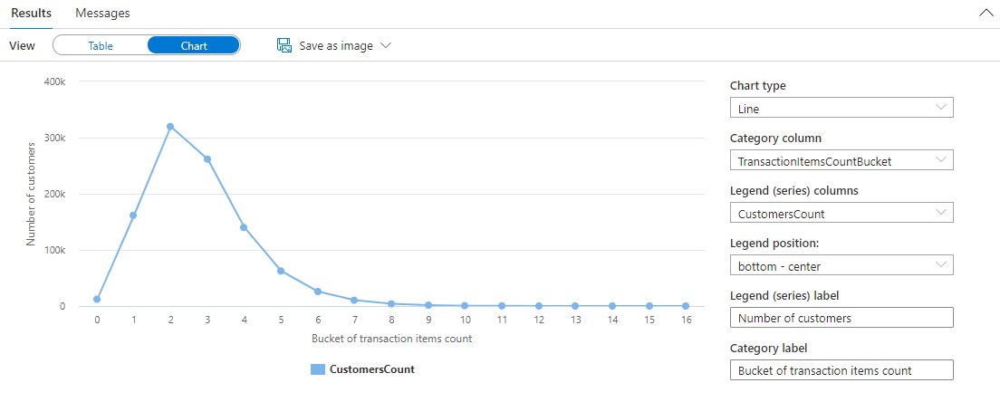
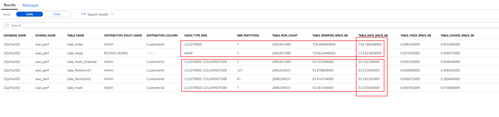
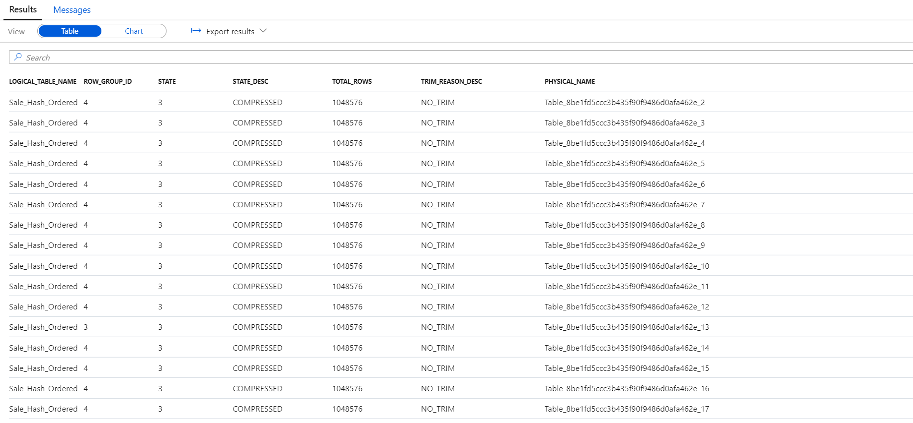

# DW Optimization Part 2

## Exercise 1 - Check for skewed data and space usage

### Task 1 - Analyze the space used by tables

1. Run the following DBCC command:

    ```sql
    DBCC PDW_SHOWSPACEUSED('wwi_perf.Sale_Hash');
    ```

    

2. Analyze the number of rows in each distribution. Those numbers should be as even as possible. You can see from the results that rows are equally distributed across distributions. Let's dive a bit more into this analysis. Use the following query to get customers with the most sale transaction items:

    ```sql
    SELECT TOP 1000
        CustomerId,
        count(*) as TransactionItemsCount
    FROM
        [wwi_perf].[Sale_Hash]
    GROUP BY
        CustomerId
    ORDER BY
        count(*) DESC
    ```

    

    Now find the customers with the least sale transaction items:

    ```sql
    SELECT TOP 1000
        CustomerId,
        count(*) as TransactionItemsCount
    FROM
        [wwi_perf].[Sale_Hash]
    GROUP BY
        CustomerId
    ORDER BY
        count(*) ASC
    ```

    

    Notice the largest number of transaction items is 69 and the smallest is 16.

    Let's find now the distribution of per-customer transaction item counts. Run the following query:

    ```sql
    SELECT
        T.TransactionItemsCountBucket
        ,count(*) as CustomersCount
    FROM
        (
            SELECT
                CustomerId,
                (count(*) - 16) / 100 as TransactionItemsCountBucket
            FROM
                [wwi_perf].[Sale_Hash]
            GROUP BY
                CustomerId
        ) T
    GROUP BY
        T.TransactionItemsCountBucket
    ORDER BY
        T.TransactionItemsCountBucket
    ```

    In the `Results` pane, switch to the `Chart` view and configure it as follows (see the options set on the right side):

    

    Without diving too much into the mathematical and statistical aspects of it, this histogram displays the reason why there is virtually no skew in the data distribution of the `Sale_Hash` table. If you haven't figured it out yet, the reason we are talking about is the quasi-normal distribution of the per-customer transaction items counts.

### Task 2 - Use a more advanced approach to understand table space usage

1. Run the following script to create the `vTableSizes` view:

    ```sql
    CREATE VIEW [wwi_perf].[vTableSizes]
    AS
    WITH base
    AS
    (
    SELECT
        GETDATE()                                                              AS  [execution_time]
        , DB_NAME()                                                            AS  [database_name]
        , s.name                                                               AS  [schema_name]
        , t.name                                                               AS  [table_name]
        , QUOTENAME(s.name)+'.'+QUOTENAME(t.name)                              AS  [two_part_name]
        , nt.[name]                                                            AS  [node_table_name]
        , ROW_NUMBER() OVER(PARTITION BY nt.[name] ORDER BY (SELECT NULL))     AS  [node_table_name_seq]
        , tp.[distribution_policy_desc]                                        AS  [distribution_policy_name]
        , c.[name]                                                             AS  [distribution_column]
        , nt.[distribution_id]                                                 AS  [distribution_id]
        , i.[type]                                                             AS  [index_type]
        , i.[type_desc]                                                        AS  [index_type_desc]
        , nt.[pdw_node_id]                                                     AS  [pdw_node_id]
        , pn.[type]                                                            AS  [pdw_node_type]
        , pn.[name]                                                            AS  [pdw_node_name]
        , di.name                                                              AS  [dist_name]
        , di.position                                                          AS  [dist_position]
        , nps.[partition_number]                                               AS  [partition_nmbr]
        , nps.[reserved_page_count]                                            AS  [reserved_space_page_count]
        , nps.[reserved_page_count] - nps.[used_page_count]                    AS  [unused_space_page_count]
        , nps.[in_row_data_page_count]
            + nps.[row_overflow_used_page_count]
            + nps.[lob_used_page_count]                                        AS  [data_space_page_count]
        , nps.[reserved_page_count]
        - (nps.[reserved_page_count] - nps.[used_page_count])
        - ([in_row_data_page_count]
                + [row_overflow_used_page_count]+[lob_used_page_count])        AS  [index_space_page_count]
        , nps.[row_count]                                                      AS  [row_count]
    FROM
        sys.schemas s
    INNER JOIN sys.tables t
        ON s.[schema_id] = t.[schema_id]
    INNER JOIN sys.indexes i
        ON  t.[object_id] = i.[object_id]
        AND i.[index_id] <= 1
    INNER JOIN sys.pdw_table_distribution_properties tp
        ON t.[object_id] = tp.[object_id]
    INNER JOIN sys.pdw_table_mappings tm
        ON t.[object_id] = tm.[object_id]
    INNER JOIN sys.pdw_nodes_tables nt
        ON tm.[physical_name] = nt.[name]
    INNER JOIN sys.dm_pdw_nodes pn
        ON  nt.[pdw_node_id] = pn.[pdw_node_id]
    INNER JOIN sys.pdw_distributions di
        ON  nt.[distribution_id] = di.[distribution_id]
    INNER JOIN sys.dm_pdw_nodes_db_partition_stats nps
        ON nt.[object_id] = nps.[object_id]
        AND nt.[pdw_node_id] = nps.[pdw_node_id]
        AND nt.[distribution_id] = nps.[distribution_id]
    LEFT OUTER JOIN (select * from sys.pdw_column_distribution_properties where distribution_ordinal = 1) cdp
        ON t.[object_id] = cdp.[object_id]
    LEFT OUTER JOIN sys.columns c
        ON cdp.[object_id] = c.[object_id]
        AND cdp.[column_id] = c.[column_id]
    WHERE pn.[type] = 'COMPUTE'
    )
    , size
    AS
    (
    SELECT
    [execution_time]
    ,  [database_name]
    ,  [schema_name]
    ,  [table_name]
    ,  [two_part_name]
    ,  [node_table_name]
    ,  [node_table_name_seq]
    ,  [distribution_policy_name]
    ,  [distribution_column]
    ,  [distribution_id]
    ,  [index_type]
    ,  [index_type_desc]
    ,  [pdw_node_id]
    ,  [pdw_node_type]
    ,  [pdw_node_name]
    ,  [dist_name]
    ,  [dist_position]
    ,  [partition_nmbr]
    ,  [reserved_space_page_count]
    ,  [unused_space_page_count]
    ,  [data_space_page_count]
    ,  [index_space_page_count]
    ,  [row_count]
    ,  ([reserved_space_page_count] * 8.0)                                 AS [reserved_space_KB]
    ,  ([reserved_space_page_count] * 8.0)/1000                            AS [reserved_space_MB]
    ,  ([reserved_space_page_count] * 8.0)/1000000                         AS [reserved_space_GB]
    ,  ([reserved_space_page_count] * 8.0)/1000000000                      AS [reserved_space_TB]
    ,  ([unused_space_page_count]   * 8.0)                                 AS [unused_space_KB]
    ,  ([unused_space_page_count]   * 8.0)/1000                            AS [unused_space_MB]
    ,  ([unused_space_page_count]   * 8.0)/1000000                         AS [unused_space_GB]
    ,  ([unused_space_page_count]   * 8.0)/1000000000                      AS [unused_space_TB]
    ,  ([data_space_page_count]     * 8.0)                                 AS [data_space_KB]
    ,  ([data_space_page_count]     * 8.0)/1000                            AS [data_space_MB]
    ,  ([data_space_page_count]     * 8.0)/1000000                         AS [data_space_GB]
    ,  ([data_space_page_count]     * 8.0)/1000000000                      AS [data_space_TB]
    ,  ([index_space_page_count]  * 8.0)                                   AS [index_space_KB]
    ,  ([index_space_page_count]  * 8.0)/1000                              AS [index_space_MB]
    ,  ([index_space_page_count]  * 8.0)/1000000                           AS [index_space_GB]
    ,  ([index_space_page_count]  * 8.0)/1000000000                        AS [index_space_TB]
    FROM base
    )
    SELECT *
    FROM size
    ```

    Take a moment to analyze the script above. You have encountered already some of the tables in the previous lab. Here is a short description of the tables and DMVs involved in the query:

    Table Name | Description
    ---|---
    sys.schemas | All schemas in the database.
    sys.tables | All tables in the database.
    sys.indexes | All indexes in the database.
    sys.columns | All columns in the database.
    sys.pdw_table_mappings | Maps each table to local tables on physical nodes and distributions.
    sys.pdw_nodes_tables | Contains information on each local table in each distribution.
    sys.pdw_table_distribution_properties | Holds distribution information for tables (the type of distribution tables have).
    sys.pdw_column_distribution_properties | Holds distribution information for columns. Filtered to include only columns used to distribute their parent tables (`distribution_ordinal` = 1).
    sys.pdw_distributions |  Holds information about the distributions from the SQL pool.
    sys.dm_pdw_nodes | Holds information about the nodes from the SQL pool. Filtered to include only compute nodes (`type` = `COMPUTE`).
    sys.dm_pdw_nodes_db_partition_stats | Returns page and row-count information for every partition in the current database.

2. Run the following script to view the details about the structure of the tables in the `wwi_perf` schema:

    ```sql
    SELECT
        database_name
    ,    schema_name
    ,    table_name
    ,    distribution_policy_name
    ,      distribution_column
    ,    index_type_desc
    ,    COUNT(distinct partition_nmbr) as nbr_partitions
    ,    SUM(row_count)                 as table_row_count
    ,    SUM(reserved_space_GB)         as table_reserved_space_GB
    ,    SUM(data_space_GB)             as table_data_space_GB
    ,    SUM(index_space_GB)            as table_index_space_GB
    ,    SUM(unused_space_GB)           as table_unused_space_GB
    FROM
        [wwi_perf].[vTableSizes]
    WHERE
        schema_name = 'wwi_perf'
    GROUP BY
        database_name
    ,    schema_name
    ,    table_name
    ,    distribution_policy_name
    ,      distribution_column
    ,    index_type_desc
    ORDER BY
        table_reserved_space_GB desc
    ```

    Analyze the results:

    

    Notice the significant difference between the space used by `CLUSTERED COLUMNSTORE` and `HEAP` or `CLUSTERED` tables. This provides a clear indication on the significant advantages columnstore indexes have.

    Also notice the slight increase of storage space for ordered CCI table (`Sale_Hash_Ordered`).

## Exercise 2 - Understand column store storage details

### Task 1 - Create view for column store row group stats

1. Run the following query to create the `vColumnStoreRowGroupStats`:

    ```sql
    create view [wwi_perf].[vColumnStoreRowGroupStats]
    as
    with cte
    as
    (
    select   tb.[name]                    AS [logical_table_name]
    ,        rg.[row_group_id]            AS [row_group_id]
    ,        rg.[state]                   AS [state]
    ,        rg.[state_desc]              AS [state_desc]
    ,        rg.[total_rows]              AS [total_rows]
    ,        rg.[trim_reason_desc]        AS trim_reason_desc
    ,        mp.[physical_name]           AS physical_name
    FROM    sys.[schemas] sm
    JOIN    sys.[tables] tb               ON  sm.[schema_id]          = tb.[schema_id]
    JOIN    sys.[pdw_table_mappings] mp   ON  tb.[object_id]          = mp.[object_id]
    JOIN    sys.[pdw_nodes_tables] nt     ON  nt.[name]               = mp.[physical_name]
    JOIN    sys.[dm_pdw_nodes_db_column_store_row_group_physical_stats] rg      ON  rg.[object_id]     = nt.[object_id]
                                                                                AND rg.[pdw_node_id]   = nt.[pdw_node_id]
                                            AND rg.[distribution_id]    = nt.[distribution_id]
    )
    select *
    from cte;
    ```

    In this query we are using the `sys.dm_pdw_nodes_db_column_store_row_group_physical_stats` DMV which provides current rowgroup-level information about all of the columnstore indexes in the current database.

    The `state_desc` column provides useful information on the state of a row group:

    Name | Description
    ---|---
    `INVISIBLE` | A rowgroup which is being compressed.
    `OPEN` | A deltastore rowgroup that is accepting new rows. It is important to remember that an open rowgroup is still in rowstore format and has not been compressed to columnstore format.
    `CLOSED` | A deltastore rowgroup that contains the maximum number of rows, and is waiting for the tuple mover process to compress it to the columnstore.
    `COMPRESSED` | A row group that is compressed with columnstore compression and stored in the columnstore.
    `TOMBSTONE` | A row group that was formerly in the deltastore and is no longer used.

    The `trim_reason_desc` column describes the reason that triggered the `COMPRESSED` rowgroup to have less than the maximum number of rows:

    Name | Description
    ---|---
    `UNKNOWN_UPGRADED_FROM_PREVIOUS_VERSION` | Occurred when upgrading from the previous version of SQL Server.
    `NO_TRIM` | The row group was not trimmed. The row group was compressed with the maximum of 1,048,476 rows. The number of rows could be less if a subset of rows was deleted after delta rowgroup was closed.
    `BULKLOAD` | The bulk-load batch size limited the number of rows. This is what you should be looking for when optimizing data loading, as it is an indicator of resource starvation during the loading process.
    `REORG` | Forced compression as part of REORG command.
    `DICTIONARY_SIZE` | Dictionary size grew too large to compress all of the rows together.
    `MEMORY_LIMITATION` | Not enough available memory to compress all the rows together.
    `RESIDUAL_ROW_GROUP` | Closed as part of last row group with rows < 1 million during index build operation.

### Task 2 - Explore column store storage details

1. Explore the statistics of the columnstore for the `Sale_Partition01` table using the following query:

    ```sql
    SELECT
        *
    FROM
        [wwi_perf].[vColumnStoreRowGroupStats]
    WHERE
        Logical_Table_Name = 'Sale_Partition01'
    ```

2. Explore the results of the query:

    

    Browse through the results and get an overview of the rowgroup states. Notice the `COMPRESSED` and `OPEN` states of some of the row groups.

3. Explore the statistics of the columnstore for the `Sale_Hash_Ordered` table using the same query:

    ```sql
    SELECT
        *
    FROM
        [wwi_perf].[vColumnStoreRowGroupStats]
    WHERE
        Logical_Table_Name = 'Sale_Hash_Ordered'
    ```

4. Explore the results of the query:

    

    There is a significant difference in the rowgroup states from the previous one. This highlights one of the potential advantages of ordered CCIs.

## Exercise 3 - Study the impact of wrong choices for column data types

### Task 1 - Create and populate tables with optimal column data types

Use the following query to create two tables (`Sale_Hash_Projection` and `Sale_Hash_Projection2`) which contain a subset of the columns from `Sale_Heap`:

```sql
CREATE TABLE [wwi_perf].[Sale_Hash_Projection]
WITH
(
	DISTRIBUTION = HASH ( [CustomerId] ),
	HEAP
)
AS
SELECT
	[CustomerId]
	,[ProductId]
	,[Quantity]
FROM
	[wwi_perf].[Sale_Heap]

CREATE TABLE [wwi_perf].[Sale_Hash_Projection2]
WITH
(
	DISTRIBUTION = HASH ( [CustomerId] ),
	CLUSTERED COLUMNSTORE INDEX
)
AS
SELECT
	[CustomerId]
	,[ProductId]
	,[Quantity]
FROM
	[wwi_perf].[Sale_Heap]
```

The query should finish execution in a few minutes.

### Task 2 - Create and populate tables with sub-optimal column data types

Use the following query to create two additional tables (`Sale_Hash_Projection_Big` and `Sale_Hash_Projection_Big2`) that have the same columns, but with different (sub_optimal) data types:

```sql
CREATE TABLE [wwi_perf].[Sale_Hash_Projection_Big]
WITH
(
	DISTRIBUTION = HASH ( [CustomerId] ),
	HEAP
)
AS
SELECT
	[CustomerId]
	,CAST([ProductId] as bigint) as [ProductId]
	,CAST([Quantity] as bigint) as [Quantity]
FROM
	[wwi_perf].[Sale_Heap]

CREATE TABLE [wwi_perf].[Sale_Hash_Projection_Big2]
WITH
(
	DISTRIBUTION = HASH ( [CustomerId] ),
	CLUSTERED COLUMNSTORE INDEX
)
AS
SELECT
	[CustomerId]
	,CAST([ProductId] as bigint) as [ProductId]
	,CAST([Quantity] as bigint) as [Quantity]
FROM
	[wwi_perf].[Sale_Heap]
```

### Task 3 - Compare storage requirements

1. Verify that the four tables have the same number of rows (there should be 339,507,246 rows in each):

    ```sql
    SELECT 'Sale_Hash_Projection', COUNT_BIG(*) FROM [wwi_perf].[Sale_Hash_Projection]
    UNION
    SELECT 'Sale_Hash_Projection2', COUNT_BIG(*) FROM [wwi_perf].[Sale_Hash_Projection2]
    UNION
    SELECT 'Sale_Hash_Projection_Big', COUNT_BIG(*) FROM [wwi_perf].[Sale_Hash_Projection_Big]
    UNION
    SELECT 'Sale_Hash_Projection_Big2', COUNT_BIG(*) FROM [wwi_perf].[Sale_Hash_Projection_Big2]
    ```

2. Run the following query to compare the storage requirements for the three tables:

    ```sql
    SELECT
        database_name
    ,    schema_name
    ,    table_name
    ,    distribution_policy_name
    ,      distribution_column
    ,    index_type_desc
    ,    COUNT(distinct partition_nmbr) as nbr_partitions
    ,    SUM(row_count)                 as table_row_count
    ,    SUM(reserved_space_GB)         as table_reserved_space_GB
    ,    SUM(data_space_GB)             as table_data_space_GB
    ,    SUM(index_space_GB)            as table_index_space_GB
    ,    SUM(unused_space_GB)           as table_unused_space_GB
    FROM
        [wwi_perf].[vTableSizes]
    WHERE
        schema_name = 'wwi_perf'
        and table_name in ('Sale_Hash_Projection', 'Sale_Hash_Projection2',
            'Sale_Hash_Projection_Big', 'Sale_Hash_Projection_Big2')
    GROUP BY
        database_name
    ,    schema_name
    ,    table_name
    ,    distribution_policy_name
    ,      distribution_column
    ,    index_type_desc
    ORDER BY
        table_reserved_space_GB desc
    ```

3. Analyze the results:

    

    There are two important conclusions to draw here:
    - In the case of `HEAP` tables, the storage impact of using `BIGINT` instead of `SMALLINT`(for `ProductId`) and `TINYINT` (for `QUANTITY`) is almost 1 GB (0.8941 GB). We're talking here about only two columns and a moderate number of rows (2.9 billion).
    - Even in the case of `CLUSTERED COLUMNSTORE` tables, where compression will offset some of the differences, there is still a difference of 12.7 MB.

Minimizing the size of data types shortens the row length, which leads to better query performance. Use the smallest data type that works for your data:

- Avoid defining character columns with a large default length. For example, if the longest value is 25 characters, then define your column as VARCHAR(25).
- Avoid using [NVARCHAR][NVARCHAR] when you only need VARCHAR.
- When possible, use NVARCHAR(4000) or VARCHAR(8000) instead of NVARCHAR(MAX) or VARCHAR(MAX).

>**Note**
>
>If you are using PolyBase external tables to load your SQL pool tables, the defined length of the table row cannot exceed 1 MB. When a row with variable-length data exceeds 1 MB, you can load the row with BCP, but not with PolyBase.

## Exercise 4 - Study the impact of materialized views

### Task 1 - Analyze the execution plan of a query

1. Run again the query to find the number of customers in each bucket of per-customer transaction items counts:

    ```sql
    SELECT
        T.TransactionItemsCountBucket
        ,count(*) as CustomersCount
    FROM
        (
            SELECT
                CustomerId,
                (count(*) - 184) / 100 as TransactionItemsCountBucket
            FROM
                [wwi_perf].[Sale_Hash]
            GROUP BY
                CustomerId
        ) T
    GROUP BY
        T.TransactionItemsCountBucket
    ORDER BY
        T.TransactionItemsCountBucket
    ```

2. Improve the query by adding support to calculate the lower margin of the first per-customer transactions items count bucket:

    ```sql
    SELECT
        T.TransactionItemsCountBucket
        ,count(*) as CustomersCount
    FROM
        (
            SELECT
                CustomerId,
                (
                    COUNT(*) -
                    (
                        SELECT
                            MIN(TransactionItemsCount)
                        FROM
                        (
                            SELECT
                                COUNT(*) as TransactionItemsCount
                            FROM
                                [wwi_perf].[Sale_Hash]
                            GROUP BY
                                CustomerId
                        ) X
                    )
                ) / 100 as TransactionItemsCountBucket
            FROM
                [wwi_perf].[Sale_Hash]
            GROUP BY
                CustomerId
        ) T
    GROUP BY
        T.TransactionItemsCountBucket
    ORDER BY
        T.TransactionItemsCountBucket
    ```

### Task 2 - Improve the execution plan of the query with a materialized view

1. Run the query with the `EXPLAIN` directive (note the `WITH_RECOMMENDATIONS` option as well):

    ```sql
    EXPLAIN WITH_RECOMMENDATIONS
    SELECT
        T.TransactionItemsCountBucket
        ,count(*) as CustomersCount
    FROM
        (
            SELECT
                CustomerId,
                (
                    COUNT(*) - 
                    (
                        SELECT 
                            MIN(TransactionItemsCount)
                        FROM 
                        (
                            SELECT 
                                COUNT(*) as TransactionItemsCount
                            FROM 
                                [wwi_perf].[Sale_Hash] 
                            GROUP BY 
                                CustomerId 
                        ) X 
                    )
                ) / 100 as TransactionItemsCountBucket
            FROM
                [wwi_perf].[Sale_Hash]
            GROUP BY
                CustomerId
        ) T
    GROUP BY
        T.TransactionItemsCountBucket
    ORDER BY
        T.TransactionItemsCountBucket
    ```

2. Analyze the resulting execution plan. Take a close look to the `<materialized_view_candidates>` section which suggests possible materialized views you can create to improve the performance of the query.

    ```xml
    <?xml version="1.0" encoding="utf-8"?>
    <dsql_query number_nodes="5" number_distributions="60" number_distributions_per_node="12">
    <sql>SELECT
        T.TransactionItemsCountBucket
        ,count(*) as CustomersCount
    FROM
        (
            SELECT
                CustomerId,
                (
                    COUNT(*) -
                    (
                        SELECT
                            MIN(TransactionItemsCount)
                        FROM
                        (
                            SELECT
                                COUNT(*) as TransactionItemsCount
                            FROM
                                [wwi_perf].[Sale_Hash]
                            GROUP BY
                                CustomerId
                        ) X
                    )
                ) / 100 as TransactionItemsCountBucket
            FROM
                [wwi_perf].[Sale_Hash]
            GROUP BY
                CustomerId
        ) T
    GROUP BY
        T.TransactionItemsCountBucket
    ORDER BY
        T.TransactionItemsCountBucket</sql>
    <materialized_view_candidates>
        <materialized_view_candidates with_constants="False">CREATE MATERIALIZED VIEW View1 WITH (DISTRIBUTION = HASH([Expr0])) AS
    SELECT [SQLPool01].[wwi_perf].[Sale_Hash].[CustomerId] AS [Expr0],
        COUNT(*) AS [Expr1]
    FROM [wwi_perf].[Sale_Hash]
    GROUP BY [SQLPool01].[wwi_perf].[Sale_Hash].[CustomerId]</materialized_view_candidates>
    </materialized_view_candidates>
    <dsql_operations total_cost="0.0242811172881356" total_number_operations="9">
        <dsql_operation operation_type="RND_ID">
        <identifier>TEMP_ID_99</identifier>
        </dsql_operation>
        <dsql_operation operation_type="ON">
        <location permanent="false" distribution="AllComputeNodes" />
        <sql_operations>
            <sql_operation type="statement">CREATE TABLE [qtabledb].[dbo].[TEMP_ID_99] ([col] INT ) WITH(DISTRIBUTED_MOVE_FILE='');</sql_operation>
        </sql_operations>
        </dsql_operation>
        <dsql_operation operation_type="BROADCAST_MOVE">
        <operation_cost cost="0.00096" accumulative_cost="0.00096" average_rowsize="4" output_rows="1" GroupNumber="69" />
        <source_statement>SELECT [T1_1].[col] AS [col] FROM (SELECT MIN([T2_1].[col]) AS [col] FROM (SELECT COUNT(CAST ((0) AS INT)) AS [col], 0 AS [col1] FROM [SQLPool01].[wwi_perf].[Sale_Hash] AS T3_1 GROUP BY [T3_1].[CustomerId]) AS T2_1 GROUP BY [T2_1].[col1]) AS T1_1
    OPTION (MAXDOP 6, MIN_GRANT_PERCENT = [MIN_GRANT], DISTRIBUTED_MOVE(N''))</source_statement>
        <destination_table>[TEMP_ID_99]</destination_table>
        </dsql_operation>
        <dsql_operation operation_type="RND_ID">
        <identifier>TEMP_ID_100</identifier>
        </dsql_operation>
        <dsql_operation operation_type="ON">
        <location permanent="false" distribution="AllDistributions" />
        <sql_operations>
            <sql_operation type="statement">CREATE TABLE [qtabledb].[dbo].[TEMP_ID_100] ([col] INT, [col1] BIGINT ) WITH(DISTRIBUTED_MOVE_FILE='');</sql_operation>
        </sql_operations>
        </dsql_operation>
        <dsql_operation operation_type="SHUFFLE_MOVE">
        <operation_cost cost="0.0233211172881356" accumulative_cost="0.0242811172881356" average_rowsize="12" output_rows="95.5518" GroupNumber="75" />
        <source_statement>SELECT [T1_1].[col1] AS [col], [T1_1].[col] AS [col1] FROM (SELECT COUNT_BIG(CAST ((0) AS INT)) AS [col], [T2_1].[col] AS [col1] FROM (SELECT (([T3_2].[col] - [T3_1].[col]) / CAST ((100) AS INT)) AS [col] FROM (SELECT MIN([T4_1].[col]) AS [col] FROM [qtabledb].[dbo].[TEMP_ID_99] AS T4_1) AS T3_1 INNER JOIN
    (SELECT COUNT(CAST ((0) AS INT)) AS [col] FROM [SQLPool01].[wwi_perf].[Sale_Hash] AS T4_1 GROUP BY [T4_1].[CustomerId]) AS T3_2
    ON (0 = 0)) AS T2_1 GROUP BY [T2_1].[col]) AS T1_1
    OPTION (MAXDOP 6, MIN_GRANT_PERCENT = [MIN_GRANT], DISTRIBUTED_MOVE(N''))</source_statement>
        <destination_table>[TEMP_ID_100]</destination_table>
        <shuffle_columns>col;</shuffle_columns>
        </dsql_operation>
        <dsql_operation operation_type="RETURN">
        <location distribution="AllDistributions" />
        <select>SELECT [T1_1].[col1] AS [col], [T1_1].[col] AS [col1] FROM (SELECT CONVERT (INT, [T2_1].[col], 0) AS [col], [T2_1].[col1] AS [col1] FROM (SELECT ISNULL([T3_1].[col], CONVERT (BIGINT, 0, 0)) AS [col], [T3_1].[col1] AS [col1] FROM (SELECT SUM([T4_1].[col1]) AS [col], [T4_1].[col] AS [col1] FROM [qtabledb].[dbo].[TEMP_ID_100] AS T4_1 GROUP BY [T4_1].[col]) AS T3_1) AS T2_1) AS T1_1 ORDER BY [T1_1].[col1] ASC
    OPTION (MAXDOP 6, MIN_GRANT_PERCENT = [MIN_GRANT])</select>
        </dsql_operation>
        <dsql_operation operation_type="ON">
        <location permanent="false" distribution="AllDistributions" />
        <sql_operations>
            <sql_operation type="statement">DROP TABLE [qtabledb].[dbo].[TEMP_ID_100]</sql_operation>
        </sql_operations>
        </dsql_operation>
        <dsql_operation operation_type="ON">
        <location permanent="false" distribution="AllComputeNodes" />
        <sql_operations>
            <sql_operation type="statement">DROP TABLE [qtabledb].[dbo].[TEMP_ID_99]</sql_operation>
        </sql_operations>
        </dsql_operation>
    </dsql_operations>
    </dsql_query>
    ```

3. Create the suggested materialized view:

    ```sql
    CREATE MATERIALIZED VIEW
        mvTransactionItemsCounts
    WITH
    (
        DISTRIBUTION = HASH([CustomerId])
    )
    AS
    SELECT
        CustomerId
        ,COUNT(*) AS ItemsCount
    FROM
        [wwi_perf].[Sale_Hash]
    GROUP BY
        CustomerId
    ```

4. Check the execution plan again:

    ```sql
    EXPLAIN WITH_RECOMMENDATIONS
    SELECT
        T.TransactionItemsCountBucket
        ,count(*) as CustomersCount
    FROM
        (
            SELECT
                CustomerId,
                (
                    COUNT(*) - 
                    (
                        SELECT 
                            MIN(TransactionItemsCount)
                        FROM 
                        (
                            SELECT 
                                COUNT(*) as TransactionItemsCount
                            FROM 
                                [wwi_perf].[Sale_Hash] 
                            GROUP BY 
                                CustomerId 
                        ) X 
                    )
                ) / 100 as TransactionItemsCountBucket
            FROM
                [wwi_perf].[Sale_Hash]
            GROUP BY
                CustomerId
        ) T
    GROUP BY
        T.TransactionItemsCountBucket
    ORDER BY
        T.TransactionItemsCountBucket
    ```

    The resulting execution plan indicates now the use of the `mvTransactionItemsCounts` (the `BROADCAST_MOVE` distributed SQL operation) materialized view which provides improvements to the query execution time:

    ```xml
    <?xml version="1.0" encoding="utf-8"?>
    <dsql_query number_nodes="5" number_distributions="60" number_distributions_per_node="12">
    <sql>SELECT
        T.TransactionItemsCountBucket
        ,count(*) as CustomersCount
    FROM
        (
            SELECT
                CustomerId,
                (
                    COUNT(*) -
                    (
                        SELECT
                            MIN(TransactionItemsCount)
                        FROM
                        (
                            SELECT
                                COUNT(*) as TransactionItemsCount
                            FROM
                                [wwi_perf].[Sale_Hash]
                            GROUP BY
                                CustomerId
                        ) X
                    )
                ) / 100 as TransactionItemsCountBucket
            FROM
                [wwi_perf].[Sale_Hash]
            GROUP BY
                CustomerId
        ) T
    GROUP BY
        T.TransactionItemsCountBucket
    ORDER BY
        T.TransactionItemsCountBucket</sql>
    <materialized_view_candidates>
        <materialized_view_candidates with_constants="False">CREATE MATERIALIZED VIEW View1 WITH (DISTRIBUTION = HASH([Expr0])) AS
    SELECT [SQLPool01].[wwi_perf].[Sale_Hash].[CustomerId] AS [Expr0],
        COUNT(*) AS [Expr1]
    FROM [wwi_perf].[Sale_Hash]
    GROUP BY [SQLPool01].[wwi_perf].[Sale_Hash].[CustomerId]</materialized_view_candidates>
    </materialized_view_candidates>
    <dsql_operations total_cost="0.0242811172881356" total_number_operations="9">
        <dsql_operation operation_type="RND_ID">
        <identifier>TEMP_ID_111</identifier>
        </dsql_operation>
        <dsql_operation operation_type="ON">
        <location permanent="false" distribution="AllComputeNodes" />
        <sql_operations>
            <sql_operation type="statement">CREATE TABLE [qtabledb].[dbo].[TEMP_ID_111] ([col] INT ) WITH(DISTRIBUTED_MOVE_FILE='');</sql_operation>
        </sql_operations>
        </dsql_operation>
        <dsql_operation operation_type="BROADCAST_MOVE">
        <operation_cost cost="0.00096" accumulative_cost="0.00096" average_rowsize="4" output_rows="1" GroupNumber="134" />
        <source_statement>SELECT [T1_1].[col] AS [col] FROM (SELECT MIN([T2_1].[col]) AS [col] FROM (SELECT CONVERT (INT, [T3_1].[col], 0) AS [col], 0 AS [col1] FROM (SELECT ISNULL([T4_1].[col], CONVERT (BIGINT, 0, 0)) AS [col] FROM (SELECT SUM([T5_1].[ItemsCount]) AS [col] FROM (SELECT [T6_1].[CustomerId] AS [CustomerId], [T6_1].[ItemsCount] AS [ItemsCount] FROM [SQLPool01].[dbo].[mvTransactionItemsCounts] AS T6_1) AS T5_1 GROUP BY [T5_1].[CustomerId]) AS T4_1) AS T3_1 WHERE ([T3_1].[col] != CAST ((0) AS BIGINT))) AS T2_1 GROUP BY [T2_1].[col1]) AS T1_1
    OPTION (MAXDOP 6, MIN_GRANT_PERCENT = [MIN_GRANT], DISTRIBUTED_MOVE(N''))</source_statement>
        <destination_table>[TEMP_ID_111]</destination_table>
        </dsql_operation>
        <dsql_operation operation_type="RND_ID">
        <identifier>TEMP_ID_112</identifier>
        </dsql_operation>
        <dsql_operation operation_type="ON">
        <location permanent="false" distribution="AllDistributions" />
        <sql_operations>
            <sql_operation type="statement">CREATE TABLE [qtabledb].[dbo].[TEMP_ID_112] ([col] INT, [col1] BIGINT ) WITH(DISTRIBUTED_MOVE_FILE='');</sql_operation>
        </sql_operations>
        </dsql_operation>
        <dsql_operation operation_type="SHUFFLE_MOVE">
        <operation_cost cost="0.0233211172881356" accumulative_cost="0.0242811172881356" average_rowsize="12" output_rows="95.5518" GroupNumber="140" />
        <source_statement>SELECT [T1_1].[col1] AS [col], [T1_1].[col] AS [col1] FROM (SELECT COUNT_BIG(CAST ((0) AS INT)) AS [col], [T2_1].[col] AS [col1] FROM (SELECT (([T3_2].[col] - [T3_1].[col]) / CAST ((100) AS INT)) AS [col] FROM (SELECT MIN([T4_1].[col]) AS [col] FROM [qtabledb].[dbo].[TEMP_ID_111] AS T4_1) AS T3_1 INNER JOIN
    (SELECT CONVERT (INT, [T4_1].[col], 0) AS [col] FROM (SELECT ISNULL([T5_1].[col], CONVERT (BIGINT, 0, 0)) AS [col] FROM (SELECT SUM([T6_1].[ItemsCount]) AS [col] FROM (SELECT [T7_1].[CustomerId] AS [CustomerId], [T7_1].[ItemsCount] AS [ItemsCount] FROM [SQLPool01].[dbo].[mvTransactionItemsCounts] AS T7_1) AS T6_1 GROUP BY [T6_1].[CustomerId]) AS T5_1) AS T4_1 WHERE ([T4_1].[col] != CAST ((0) AS BIGINT))) AS T3_2
    ON (0 = 0)) AS T2_1 GROUP BY [T2_1].[col]) AS T1_1
    OPTION (MAXDOP 6, MIN_GRANT_PERCENT = [MIN_GRANT], DISTRIBUTED_MOVE(N''))</source_statement>
        <destination_table>[TEMP_ID_112]</destination_table>
        <shuffle_columns>col;</shuffle_columns>
        </dsql_operation>
        <dsql_operation operation_type="RETURN">
        <location distribution="AllDistributions" />
        <select>SELECT [T1_1].[col1] AS [col], [T1_1].[col] AS [col1] FROM (SELECT CONVERT (INT, [T2_1].[col], 0) AS [col], [T2_1].[col1] AS [col1] FROM (SELECT ISNULL([T3_1].[col], CONVERT (BIGINT, 0, 0)) AS [col], [T3_1].[col1] AS [col1] FROM (SELECT SUM([T4_1].[col1]) AS [col], [T4_1].[col] AS [col1] FROM [qtabledb].[dbo].[TEMP_ID_112] AS T4_1 GROUP BY [T4_1].[col]) AS T3_1) AS T2_1) AS T1_1 ORDER BY [T1_1].[col1] ASC
    OPTION (MAXDOP 6, MIN_GRANT_PERCENT = [MIN_GRANT])</select>
        </dsql_operation>
        <dsql_operation operation_type="ON">
        <location permanent="false" distribution="AllDistributions" />
        <sql_operations>
            <sql_operation type="statement">DROP TABLE [qtabledb].[dbo].[TEMP_ID_112]</sql_operation>
        </sql_operations>
        </dsql_operation>
        <dsql_operation operation_type="ON">
        <location permanent="false" distribution="AllComputeNodes" />
        <sql_operations>
            <sql_operation type="statement">DROP TABLE [qtabledb].[dbo].[TEMP_ID_111]</sql_operation>
        </sql_operations>
        </dsql_operation>
    </dsql_operations>
    </dsql_query>
    ```

## Exercise 5 - Avoid extensive logging

### Task 1 - Explore rules for minimally logged operations

The following operations are capable of being minimally logged:

- CREATE TABLE AS SELECT (CTAS)
- INSERT..SELECT
- CREATE INDEX
- ALTER INDEX REBUILD
- DROP INDEX
- TRUNCATE TABLE
- DROP TABLE
- ALTER TABLE SWITCH PARTITION

**Minimal logging with bulk load**
  
CTAS and INSERT...SELECT are both bulk load operations. However, both are influenced by the target table definition and depend on the load scenario. The following table explains when bulk operations are fully or minimally logged:  

| Primary Index | Load Scenario | Logging Mode |
| --- | --- | --- |
| Heap |Any |**Minimal** |
| Clustered Index |Empty target table |**Minimal** |
| Clustered Index |Loaded rows do not overlap with existing pages in target |**Minimal** |
| Clustered Index |Loaded rows overlap with existing pages in target |Full |
| Clustered Columnstore Index |Batch size >= 102,400 per partition aligned distribution |**Minimal** |
| Clustered Columnstore Index |Batch size < 102,400 per partition aligned distribution |Full |

It is worth noting that any writes to update secondary or non-clustered indexes will always be fully logged operations.

> **IMPORTANT**
> 
> A Synapse Analytics SQL pool has 60 distributions. Therefore, assuming all rows are evenly distributed and landing in a single partition, your batch will need to contain 6,144,000 rows or larger to be minimally logged when writing to a Clustered Columnstore Index. If the table is partitioned and the rows being inserted span partition boundaries, then you will need 6,144,000 rows per partition boundary assuming even data distribution. Each partition in each distribution must independently exceed the 102,400 row threshold for the insert to be minimally logged into the distribution.

Loading data into a non-empty table with a clustered index can often contain a mixture of fully logged and minimally logged rows. A clustered index is a balanced tree (b-tree) of pages. If the page being written to already contains rows from another transaction, then these writes will be fully logged. However, if the page is empty then the write to that page will be minimally logged.

### Task 2 - Optimizing a delete operation

1. Check the number of transaction items for customers with ids lower than 900000 using the following query:

    ```sql
    SELECT
        COUNT_BIG(*) as TransactionItemsCount
    FROM
        [wwi_perf].[Sale_Hash]
    WHERE
        CustomerId < 900000
    ```

2. Implement a minimal logging approach to delete transaction items for customers with ids lower than 900000. Use the following CTAS query to isolate the transaction items that should be kept:

    ```sql
    CREATE TABLE [wwi_perf].[Sale_Hash_v2]
    WITH
    (
        DISTRIBUTION = ROUND_ROBIN,
        HEAP
    )
    AS
    SELECT
        *
    FROM
        [wwi_perf].[Sale_Hash]
    WHERE
        CustomerId >= 900000
    ```

    The query should execute within a few minutes. All that would remain to complete the process would be to delete the `Sale_Heap` table and rename `Sale_Heap_v2` to `Sale_Heap`.

3. Compare the previous operation with a classical delete:

    ```sql
    DELETE
        [wwi_perf].[Sale_Hash]
    WHERE
        CustomerId < 900000
    ```

    >**Note**
    >
    >The query will run for a potentially long time. Once the time exceeds significantly the time to run the previous CTAS query, you can cancel it (as you can already see the benefit of the CTAS-based approach).
