# End-to-end security with Azure Synapse Analytics

Wide World Importers is host to a plethora of data coming from many disparate sources. The idea of bringing all of their data together into Azure Synapse Analytics for them to query, gain insights, and consume in ways they have never done before is exhilarating! As much as it is an exciting game-changer for this business, it opens up a large amount of surface area for potential attack. Security must be established in the forefront at the time of design of this solution.

This lab will guide you through all the security-related steps that cover an end-to-end security story for Azure Synapse Analytics. Some key take-aways from this lab are:

1. Clearly define job functions and the access that each requires to Azure resources - keeping in mind the principle of least privilege. Define Azure Security Groups to match these functions and assign users to these groups, and not to specific resources directly. On Azure resources, grant permissions to Azure Security Groups, and not individual users.

2. Leverage a private Virtual Network for all Azure resources, create private endpoints/links wherever possible to enable private network communication over the Azure backend network.

    > **Note**: You must enable ASA Managed VNet at the time of creation of your Azure Synapse Analytics workspace, this can't be added after the fact.

3. Leverage Azure Key Vault to store sensitive connection information, such as access keys and passwords for linked services as well as in pipelines.

4. Introspect the data that is contained within the SQL Pools in the context of potential sensitive/confidential data disclosure. Identify the columns representing sensitive data, then secure them by adding column-level security. Determine at the table level what data should be hidden from specific groups of users then define security predicates to apply row level security (filters) on the table. If desired, you also have the option of applying Dynamic Data Masking to mask sensitive data returned in queries on a column by column basis.

- [End-to-end security with Azure Synapse Analytics](#end-to-end-security-with-azure-synapse-analytics)
  - [Resource naming throughout this lab](#resource-naming-throughout-this-lab)
  - [Exercise 1 - Securing Azure Synapse Analytics supporting infrastructure](#exercise-1---securing-azure-synapse-analytics-supporting-infrastructure)
    - [Task 1 - Configure Azure Active Directory security groups](#task-1---configure-azure-active-directory-security-groups)
    - [Task 2 - Secure the Azure Synapse Workspace storage account](#task-2---secure-the-azure-synapse-workspace-storage-account)
    - [Task 4 - Set the SQL Active Directory admin](#task-4---set-the-sql-active-directory-admin)
    - [Task 5 - Add IP firewall rules](#task-5---add-ip-firewall-rules)
    - [Task 6 - Managed VNet](#task-6---managed-vnet)
    - [Task 7 - Private Endpoints](#task-7---private-endpoints)
  - [Exercise 2 - Securing the Azure Synapse Analytics workspace and managed services](#exercise-2---securing-the-azure-synapse-analytics-workspace-and-managed-services)
    - [Task 1 - Secure your Synapse workspace](#task-1---secure-your-synapse-workspace)
    - [Task 2 - Managing secrets with Azure Key Vault](#task-2---managing-secrets-with-azure-key-vault)
    - [Task 3 - Use Azure Key Vault for secrets when creating Linked Services](#task-3---use-azure-key-vault-for-secrets-when-creating-linked-services)
    - [Task 4 - Secure workspace pipeline runs](#task-4---secure-workspace-pipeline-runs)
    - [Task 5 - Access Control to Synapse SQL Serverless Endpoints](#task-5---access-control-to-synapse-sql-serverless-endpoints)
    - [Task 6 - Secure Azure Synapse Analytics SQL Pools](#task-6---secure-azure-synapse-analytics-sql-pools)
    - [Task 7 - Secure Azure Synapse Analytics Spark pools](#task-7---secure-azure-synapse-analytics-spark-pools)
  - [Exercise 3 - Securing Azure Synapse Analytics workspace data](#exercise-3---securing-azure-synapse-analytics-workspace-data)
    - [Task 1 - Setting granular permissions in the data lake with POSIX-style access control lists](#task-1---setting-granular-permissions-in-the-data-lake-with-posix-style-access-control-lists)
    - [Task 2 - Column Level Security](#task-2---column-level-security)
    - [Task 3 - Row level security](#task-3---row-level-security)
    - [Task 4 - Dynamic data masking](#task-4---dynamic-data-masking)
  - [Reference](#reference)
  - [Other Resources](#other-resources)

## Resource naming throughout this lab

For the remainder of this guide, the following terms will be used for various ASA-related resources (make sure you replace them with actual names and values):

| Azure Synapse Analytics Resource  | To be referred to                                                                  |
|-----------------------------------|------------------------------------------------------------------------------------|
| Workspace resource group          | `WorkspaceResourceGroup`                                                           |
| Workspace / workspace name        | `Workspace`                                                                        |
| Primary Storage Account           | `PrimaryStorage`                                                                   |
| Default file system container     | `DefaultFileSystem`                                                                |
| SQL Pool                          | `SqlPool01`                                                                        |
| SQL Serverless Endpoint           | `SqlServerless01`                                                                  |
| Active Directory Principal of  New User         | `user@domain.com`                                                    |
| SQL username of New User          | `newuser`                                                                          |
| Azure Key Vault                   | `KeyVault01`                                                                       |
| Azure Key Vault Private Endpoint Name  | `KeyVaultPrivateEndpointName`                                                 |
| Azure Subscription                | `WorkspaceSubscription`                                                            |
| Azure Region                      | `WorkspaceRegion`                                                                  |

## Exercise 1 - Securing Azure Synapse Analytics supporting infrastructure

Azure Synapse Analytics (ASA) is a powerful solution that handles security for many of the resources that it creates and manages. In order to run ASA, however, some foundational security measures need to be put in place to ensure the infrastructure that it relies upon is secure. In this exercise, we will walk through securing the supporting infrastructure of ASA.

### Task 1 - Configure Azure Active Directory security groups

As with many Azure resources, Azure Synapse Analytics has the ability to leverage Azure Active Directory for security. Begin the security implementation by defining appropriate security groups in Azure Active Directory. Each security group will represent a job function in Azure Synapse Analytics and will be granted the necessary permissions to fulfill its function. Individual users will then be assigned to their respective group based on their role in the organization. Structuring security in such a way makes it easier to provision users and admins.

As a general guide, create an Azure Active Directory Security Group for the following Synapse-specific job functions:

| Group                             | Description                                                                        |
|-----------------------------------|------------------------------------------------------------------------------------|
| Synapse_`Workspace`_Users         | All workspace users.                                                               |
| Synapse_`Workspace`_Admins        | Workspace administrators, for users that need complete control over the workspace. |
| Synapse_`Workspace`_SQLAdmins     | For users that need complete control over the SQL aspects of the workspace.        |
| Synapse_`Workspace`_SparkAdmins   | For users that need complete control over the Spark aspects of the workspace.      |

The lab environment has already been provisioned with the above groups. In a production scenario, you would also need to define additional security groups matching job functions in your organization. When designing these groups, keep in mind the principle of least privilege. Permissions to specific Azure resources will be granted to these groups and not directly to users - users will only be assigned to security groups.

The Synapse AAD Security groups have permissions that build upon one another. Approaching security groups as an inheritance hierarchy avoids duplicating permissions for every single group. For instance, by adding the **Synapse_`Workspace`_Admins** group as a member of the **Synapse_`Workspace`_Users** group, the admin group will automatically inherit the permissions assigned to the Users group. The admin group will add *only* the permissions specific to the admin role that do not exist in the 'base' Users group it inherited. The membership of the groups are as follows:

| Group                           | Members                                                                                |
|---------------------------------|----------------------------------------------------------------------------------------|
| Synapse_`Workspace`_Users       | Synapse_`Workspace`_Admins, Synapse_`Workspace`_SQLAdmins, Synapse_`Workspace`_SparkAdmins |
| Synapse_`Workspace`_SparkAdmins | Synapse_`Workspace`_Admins                                                               |
| Synapse_`Workspace`_SQLAdmins   | Synapse_`Workspace`_Admins                                                               |

The lab environment has already been provisioned with the above security group hierarchy.

For WWI in particular, in Activity 1, it was determined that they require four additional security groups.

| Group                             | Description                                                                        |
|-----------------------------------|------------------------------------------------------------------------------------|
| wwi-history-owners                | Users that have full access to all raw sales data                                  |
| wwi-2020-contributors             | Security group that allows full access to the current year raw sales data. This group will only contain other security groups, it is not meant for individual user assignment.         |
| wwi-current-contributors          | For users that need complete control over the current year raw sales data.         |
| wwi-readers                       | Read-only access to all raw sales data.      |

The inheritance hierarchy for the WWI groups is as follows:

| Group                           | Members                                                                                |
|---------------------------------|----------------------------------------------------------------------------------------|
| wwi-2020-contributors           | wwi-current-contributors                                                               |
| wwi-current-contributors        | wwi-readers                                                                            |

> **Note**: You may review the Security Group setup by accessing Azure Active Directory from the Azure Portal, and selecting **Groups** from the AAD menu.

### Task 2 - Secure the Azure Synapse Workspace storage account

One of the benefits of using Azure Storage Accounts is that all data at rest is encrypted. Azure Storage automatically encrypts and decrypts data transparently using 256-bit AES encryption and is FPS 140-2 compliant. In addition to encrypted data at rest, Role Based Access Control is available to further secure storage accounts and containers.

Role-based Access Control (RBAC) uses role assignments to apply permission sets to security principals; a principal may be a user, group, service principal, or any managed identity that exists in the Azure Active Directory. So far in this lab, we have defined and configured security groups that represent the various job functions that we need in Azure Synapse Analytics. It is recommended that individual user principals be added only to these Active Directory Security groups. These users will in turn be granted permissions based on the security group (role) that they belong to. All RBAC permissions in this lab will be assigned to security groups, and never to an individual user principal.

When the Azure Synapse Workspace was created, it required the selection of an Azure Data Lake Storage Gen 2 account (`PrimaryStorage`) and the creation of a default filesystem container: `DefaultFileSystem`. The groups we've created in this lab will require access to this container. We also need to ensure the Synapse workspace has the access it needs. Verify that the workspace **Managed Service Identity (MSI)** has the proper access to the default file system container. A managed identity is an Azure Active Directory feature that provides a built in identity for Azure Resources so that they can authenticate to one another. The Azure Synapse managed identity is used to orchestrate pipelines and needs permissions to perform the operations in those pipelines. See [managed identities for azure resources](https://docs.microsoft.com/en-us/azure/active-directory/managed-identities-azure-resources/overview) to learn more.

1. In the **Azure Portal**, open the `WorkspaceResourceGroup` and from the list of resources and select the `PrimaryStorage` account that you selected when creating the Azure Synapse Analytics Workspace.

2. On the **Storage Account Overview** page, select the **Containers** tile.

    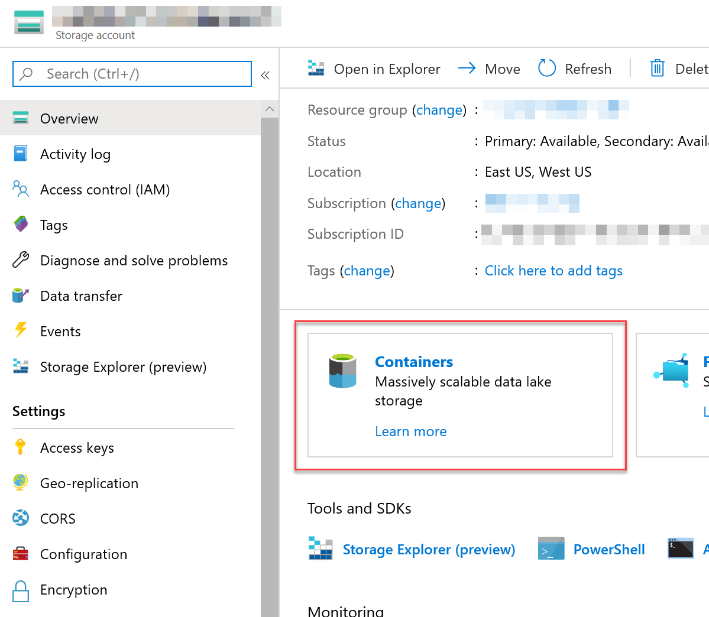

3. Select `DefaultFileSystem` from the list of containers.
  
   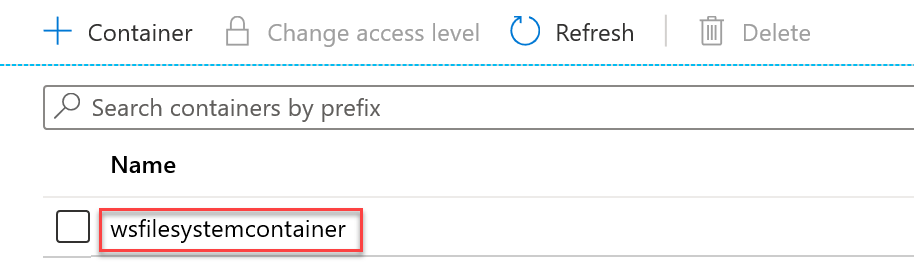

4. From the left menu, select **Access Control (IAM)**, then select **Role assignments** to verify **Synapse_`Workspace`_Users** and the Managed Service Identity of the workspace (has the same name as the workspace) is listed as a **Contributor**.

    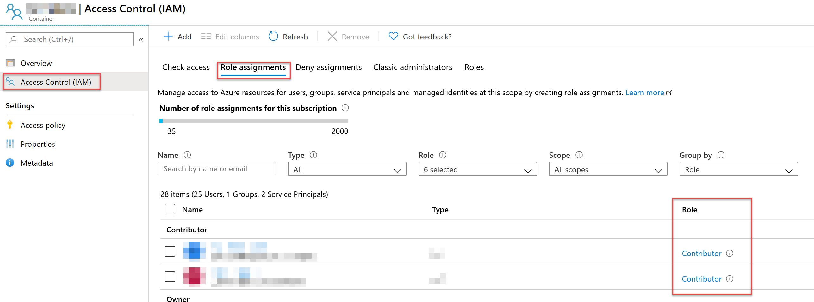

 > **Note**: Additional security precautions can be taken such as enabling **Advanced Threat detection** on all Storage accounts. When this feature is enabled, the Azure Security Center will monitor all traffic to and from the storage account and is able to identify suspicious activity. When such an event occurs, an email is sent out indicating the details of the anomaly along with potential causes and remediation recommendations. These events are also available for review in the **Azure Security Center**. [See this article](https://docs.microsoft.com/en-us/azure/security-center/security-center-intro) for more information about Azure Security Center.

### Task 4 - Set the SQL Active Directory admin

In order to take advantage of the security group structure, we need to ensure the **Synapse_`Workspace`_SQLAdmins** group has administrative permissions to the SQL Pools contained in the workspace. In this lab

1. In the **Azure Portal**, open the `WorkspaceResourceGroup` and from the list of resources open your Synapse `Workspace` resource (do not launch Synapse Studio).

2. From the left menu, select **SQL Active Directory admin** and ensure the **Synapse_`Workspace`_SQLAdmins** is listed as a SQL Active Directory Admin.

    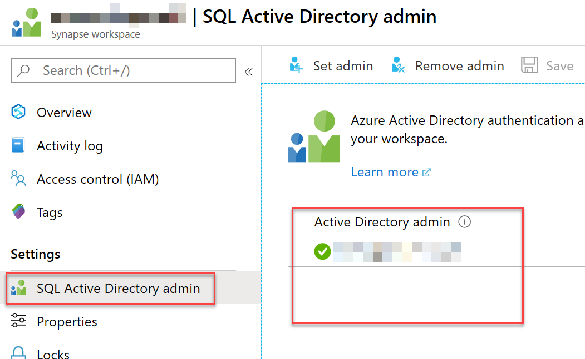

### Task 5 - Add IP firewall rules

Having robust Internet security is a must for every technology system. One way to mitigate internet threat vectors is by reducing the number of public IP addresses that can access the Azure Synapse Analytics Workspace through the use of IP firewall rules. The Azure Synapse Analytics workspace will then delegate those same rules to all managed public endpoints of the workspace, including those for SQL pools and SQL Serverless endpoints.

> Note: This is an alternative to Managed VNet, mentioned in the next step.

1. Define the IP range that should have access to the workspace.

2. In the **Azure Portal**,  open the `Workspace` resource (do not launch Studio).

3. From the left menu of the **Azure Synapse Analytics** page, select **Firewalls**.

   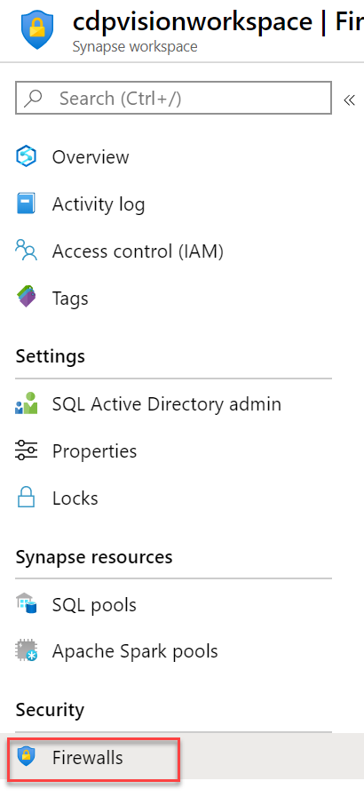

4. Create an IP Firewall Rule by selecting **+ Add Client IP** from the taskbar menu.

    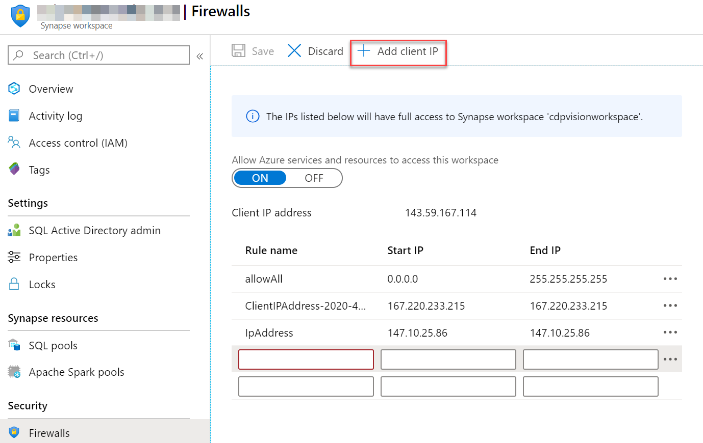  

5. Add a new IP firewall rule into the table as follows, then select the **Save** button.

   1. **Rule name**: Type a value that makes sense to represent your organization IP Range.

   2. **Start IP**: Type the beginning IPv4 value of your IP range.

   3. **End IP**: Type the end IPv4 value of your IP range.

   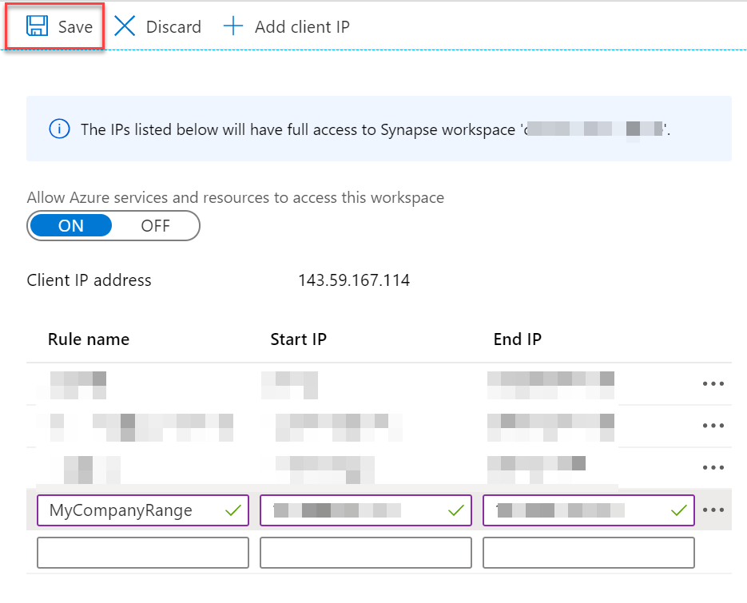

> **Note**: When connecting to Synapse from your local network, certain ports need to be open. To support the functions of Synapse Studio, ensure outgoing TCP ports 80, 443, and 1143, and UDP port 53 are open.

### Task 6 - Managed VNet

When creating an Azure Synapse Analytics workspace, you are given the option of associating it with a VNet. Doing so shifts the management of the VNet to Azure Synapse. Once associated with Synapse, the VNet is then referred to as a **Managed workspace VNet**. Azure Synapse takes on the responsibility of creating subnets for each Spark Cluster as well as configuring Network Security Group (NSG) rules to harden the security of all managed Synapse resources.

Leveraging the Managed workspace VNet provides network isolation from other ASA workspaces. All data integration and Spark resources are deployed within the confines of the associated VNet as well. In addition to network isolation, user-level isolation is obtained for Spark Clusters, as Synapse automatically deploys them to their own subnet. A Managed workspace VNet combined with the use of managed private endpoints (covered in depth in the next task) ensures that all traffic between the workspace and external (to the Managed VNet) Azure resources traverses entirely over the Azure backbone network. These external resources are those multi-tenant/shared resources that reside outside the VNet including: Storage Accounts, Cosmos DB, SQL Pools and SQL Serverless.

> **Note**: Managed private endpoints are only available on workspaces that have a Managed workspace VNet. Verify if your workspace resource has a managed virtual network by opening the `Workspace` resource and selecting the **Overview** tab.

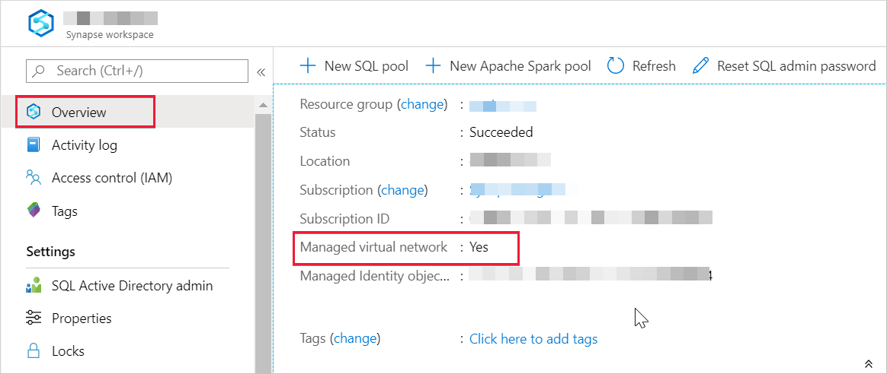

1. When creating an Azure Synapse workspace, select the **Security + networking** tab, and check the **Enable managed virtual network** checkbox.

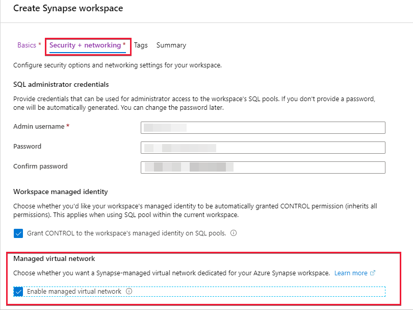

### Task 7 - Private Endpoints

In the previous task, you were introduced to the concept of managed private endpoints. Azure Synapse Analytics manages these endpoints to ensure all traffic to other Azure resources remains on the private Azure backbone network - protecting against the risk of data theft by eliminating public communication over the internet. Under the hood, a private endpoint assigns a private IP address from the Managed workspace VNet and maps it to the external Azure resource, bringing that service into the VNet.

If the user creating the private endpoint is also an Owner on the requested Azure resource (RBAC), then the private IP address is assigned to the resource and its [Private Link](https://docs.microsoft.com/en-us/azure/private-link/private-link-overview
) established so that it can start being used to send data. Otherwise, it enters a pending state until an Owner of the Azure resource approves of the connection. Only upon approval will the private link be established. To demonstrate the concept of establishing a private endpoint, we will create a new Storage Account and leverage Azure Synapse Analytics to create a managed private endpoint.

## Exercise 2 - Securing the Azure Synapse Analytics workspace and managed services

### Task 1 - Secure your Synapse workspace

Azure Synapse Analytics provides three built-in roles with varying access throughout the workspace. These roles and their associated permissions within the workspace are outlined as follows:

| Task | Workspace Admins | Spark admins | SQL admins |
| --- | --- | --- | --- |
| Open Synapse Studio | YES | YES | YES |
| View Home hub | YES | YES | YES |
| View Data Hub | YES | YES | YES |
| Data Hub / See linked ADLSGen2 accounts and containers | YES [1] | YES[1] | YES[1] |
| Data Hub / See Databases | YES | YES | YES |
| Data Hub / See objects in databases | YES | YES | YES |
| Data Hub / Access data in SQL pool databases | YES   | NO   | YES   |
| Data Hub / Access data in SQL Serverless databases | YES [2]  | NO  | YES [2]  |
| Data Hub / Access data in Spark databases | YES [2] | YES [2] | YES [2] |
| Use the Develop hub | YES | YES | YES |
| Develop Hub / author SQL Scripts | YES | NO | YES |
| Develop Hub / author Spark Job Definitions | YES | YES | NO |
| Develop Hub / author Notebooks | YES | YES | NO |
| Develop Hub / author Dataflows | YES | NO | NO |
| Use the Orchestrate hub | YES | YES | YES |
| Orchestrate hub / use Pipelines | YES | NO | NO |
| Use the Manage Hub | YES | YES | YES |
| Manage Hub / SQL pools | YES | NO | YES |
| Manage Hub / Spark pools | YES | YES | NO |
| Manage Hub / Triggers | YES | NO | NO |
| Manage Hub / Linked services | YES | YES | YES |
| Manage Hub / Access Control (assign users to Synapse workspace roles) | YES | NO | NO |
| Manage Hub / Integration runtimes | YES | YES | YES |

[1] Access to data in containers depends on the access control in ADLSGen2

[2] SQL OD tables and Spark tables store their data in ADLSGen2 and access requires the appropriate permissions on ADLSGen2.

We will now associate the Azure Active Directory groups that we've created with these roles as follows:

| Synapse Analytics Role | Azure Active Directory Group      |
|------------------------|-----------------------------------|
| Workspace admin        | Synapse_`Workspace`_Admins      |
| Apache Spark admin     | Synapse_`Workspace`_SparkAdmins |
| SQL admin              | Synapse_`Workspace`_SQLAdmins   |

1. In the **Azure Portal**, open the `Workspace` and Launch **Synapse Studio**.

2. Expand the left menu and select **Manage**.

    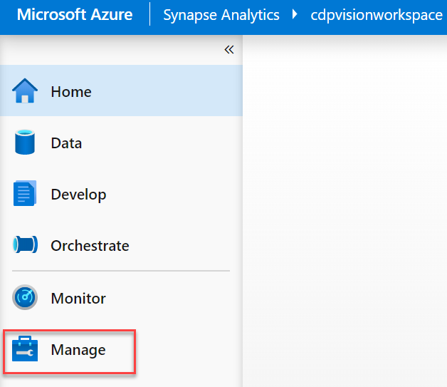

3. From the **Manage** screen left menu, select **Access control**.

   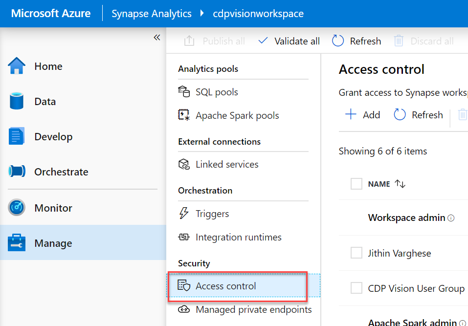

4. From the Access control screen toolbar menu, select **+ Add**.

   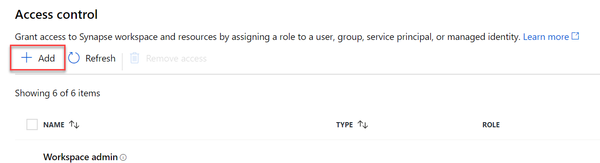

5. In the **Add role assignment** blade, populate the form with the following values and select the **Apply** button on the bottom of the blade:

   1. **Role**: Select **Workspace admin**.

   2. **Select user**: Type **Synapse** to filter the list of users, and select **Synapse_`Workspace`_Admins**.

6. Repeat Steps 4 and 5 for the remaining Azure Active Directory group assignments described in the table found in the task description.

### Task 2 - Managing secrets with Azure Key Vault

When dealing with connectivity to external data sources and services, sensitive connection information such as passwords and access keys should be properly handled. It is recommended that this type of information be stored in an Azure Key Vault. Leveraging Azure Key Vault not only protects against secrets being compromised, it also serves as a central source of truth; meaning that if a secret value needs to be updated (such as when cycling access keys on a storage account), it can be changed in one place and all services consuming this key will start pulling the new value immediately. Azure Key Vault encrypts and decrypts information transparently using 256-bit AES encryption, which is FIPS 140-2 compliant.

Azure Key Vault supports private endpoints. By establishing a private endpoint in the workspace managed VNet, all communication with the key vault from the workspace will occur on the private Azure network backbone.

1. In **Azure Portal**, from the left menu select **+ Create a resource**.

   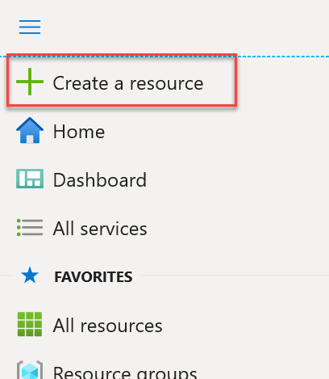

2. Search for **Key Vault** in the search box, and select it from the search results.

3. On the **Key Vault** resource overview screen, select the **Create** button.

4. On the **Create key vault** screen, on the **Basics** tab, fill out the fields as follows:

   1. **Subscription**: Select `WorkspaceSubscription`.

   2. **Resource group**: Select `WorkspaceResourceGroup`.

   3. **Key vault name**: Enter `KeyVault01`

   4. **Soft delete**: Select **Disable** (for this lab, in production you may choose to leave this enabled).

   5. **Region**: Select `WorkspaceRegion`.

    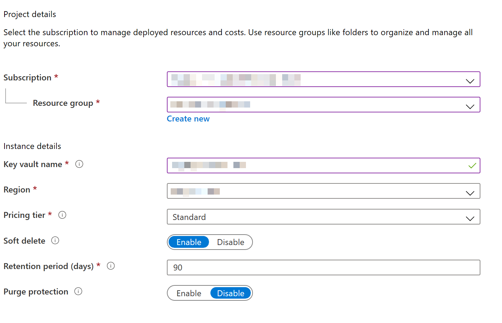

5. Select the **Next:Access policy >** button.

6. On the **Access policy** tab, select the **+ Add Access Policy** link.

    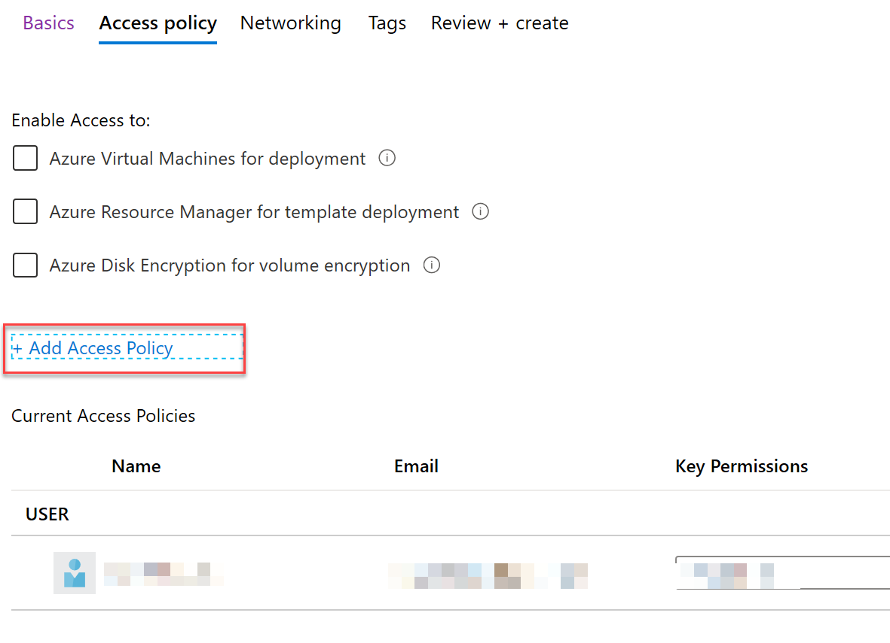

7. On the **Add policy** screen, fill the form as follows, and select **Add**:

   1. **Secret permissions**: Select **Get** and **List**.

   2. **Select principal**: Select the MSI (Managed Service Identity) that has the same name as your `Workspace`.

   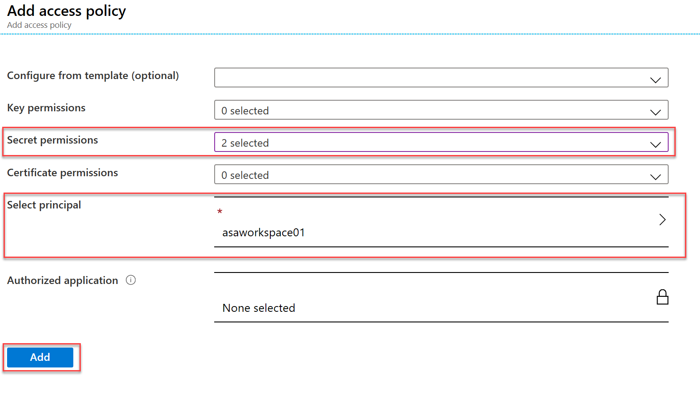

8. Select **Review + create**.

9. Select **Create** once validation completes.

> **Note**: For additional security when using Azure Key Vault you can also leverage VNets as well as private endpoints. These may be added to the Key Vault at any time.

### Task 3 - Use Azure Key Vault for secrets when creating Linked Services

Linked Services are synonymous with connection strings in Azure Synapse Analytics. Azure Synapse Analytics linked services provides the ability to connect to nearly 100 different types of external services ranging from Azure Storage Accounts to Amazon S3 and more. When connecting to external services, having secrets related to connection information is guaranteed. The best place to store these secrets is the Azure Key Vault. Azure Synapse Analytics provides the ability to configure all linked service connections with values from Azure Key Vault.

In order to leverage Azure Key Vault in linked services, you must first add `KeyVault01` as a linked service in Azure Synapse Analytics.

1. In **Azure Synapse Studio**, select **Manage** from the left menu.

2. Beneath **External Connections**, select **Linked Services**, then select the **+ New** button from the toolbar menu.

   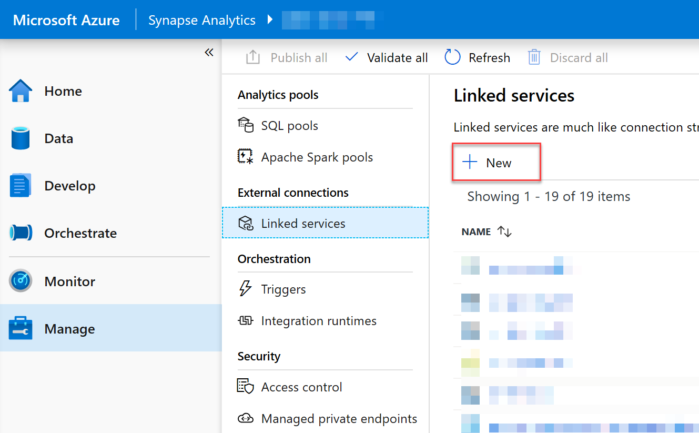

3. In the **New linked service** blade, search for **Azure Key Vault** and select it from the search results then press **Continue**.

   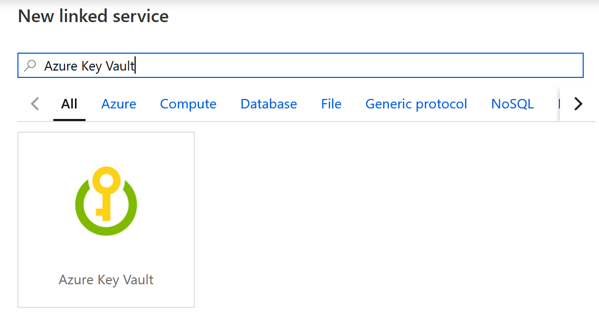

4. Fill out the **New linked service (Azure Key Vault)** form as follows, then select **Create**:

   1. **Name**: Enter `KeyVault01`

   2. **Description**: Enter **Key Vault for Linked Service Secrets**.

   3. **Azure key vault selection method**: Select **From Azure subscription**.

   4. **Azure subscription**: Select `WorkspaceSubscription`.

   5. **Azure key vault name**: Select `KeyVault01`.

    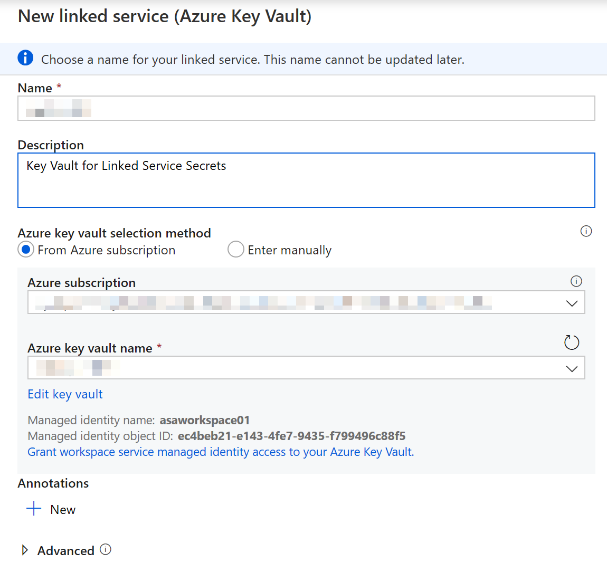

Now that we have the Azure Key Vault setup as a linked service, we can now leverage it when defining new linked services. Every New linked service provides the option to retrieve secrets from Azure Key Vault. The form requests the selection of the Azure Key Vault linked service, the secret name, and (optional) specific version of the secret.

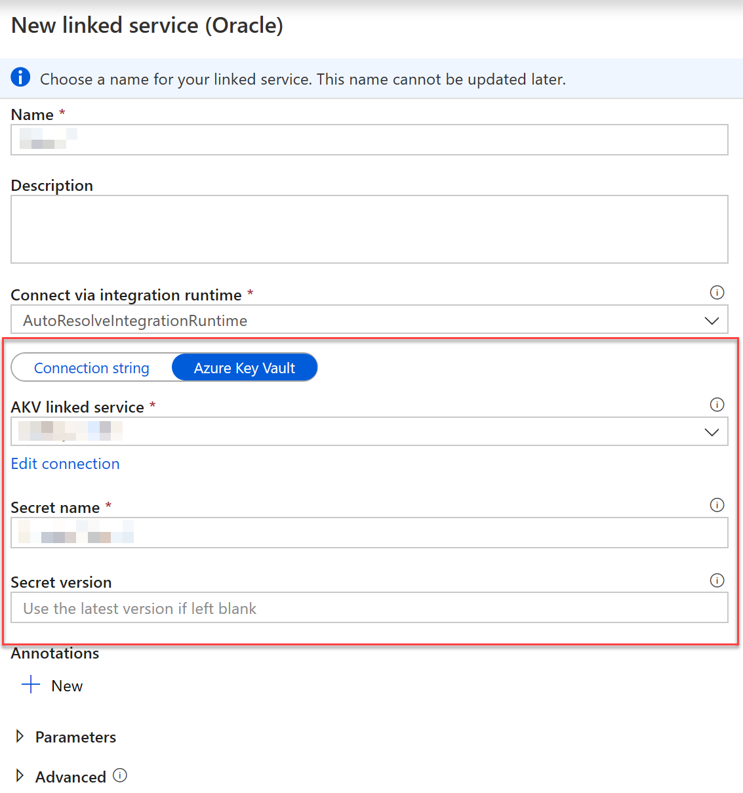

### Task 4 - Secure workspace pipeline runs

To successfully run pipelines that include datasets or activities that reference a SQL pool, the workspace Managed Identity needs to be granted access to the SQL pool directly.

1. In **Azure Synapse Studio**, select **Develop** from the left menu.

   

2. From the **Develop** menu, select the **+** button and choose **SQL Script** from the context menu.

   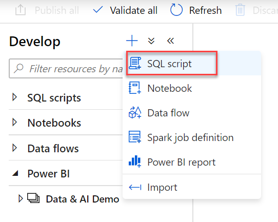

3. In the toolbar menu, connect to the database on which you want to execute the query.

    

4. In the query window, replace the script with the following (documented inline, replace \<Workspace\> and \<SQLPool01\> accordingly):

    ```sql
    -- Step 1: Create user in DB
    CREATE USER [<Workspace>] FROM EXTERNAL PROVIDER;

    -- Step 2: Granting permission to the identity
    GRANT CONTROL ON DATABASE:: <SQLPool01> TO <Workspace>;
    ```

    > **Note**: When using Polybase in your pipelines, it requires CONTROL permission while the COPY activity does not.

5. Select **Run** from the toolbar menu to execute the SQL command.

   

6. You may now close the query tab, when prompted choose **Discard all changes**.

It is recommended to store any secrets that are part of your pipeline in Azure Key Vault, you will be able to retrieve these values using a Web activity. The second part of this task demonstrates using a Web activity in the pipeline to retrieve a secret from the Key Vault.

1. Open the `KeyVault01` resource, and select **Secrets** from the left menu. From the top toolbar, select **+ Generate/Import**.

   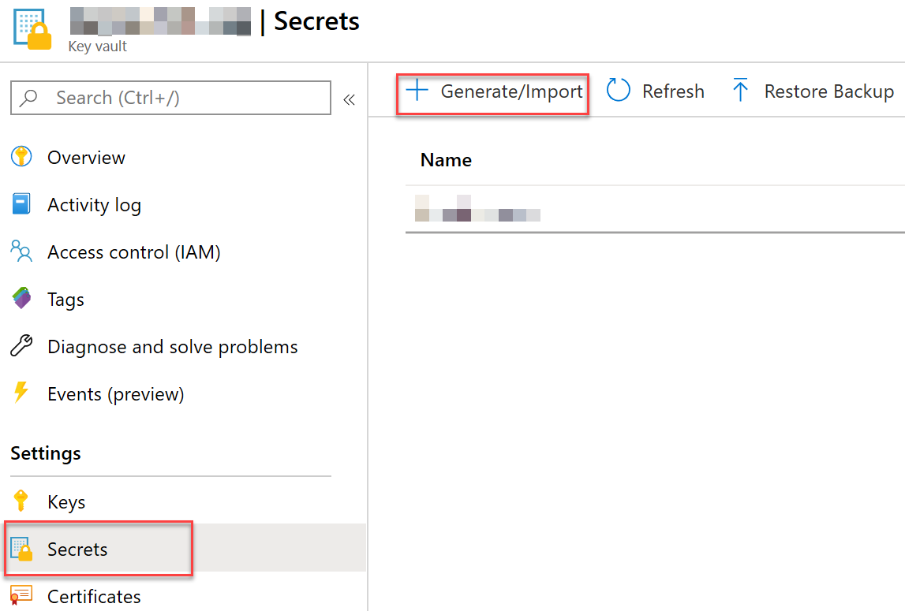

2. Create a secret, with the name **PipelineSecret** and assign it a value of **IsNotASecret**, and select the **Create** button.

   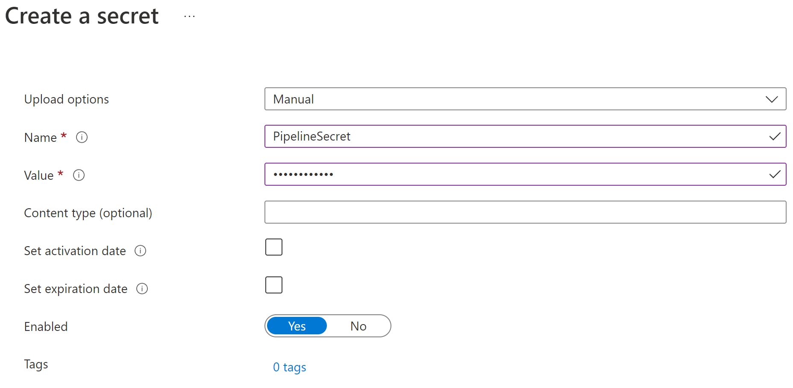

3. Open the secret that you just created, drill into the current version, and copy the value in the Secret Identifier field. Save this value in a text editor, or retain it in your clipboard for a future step.

    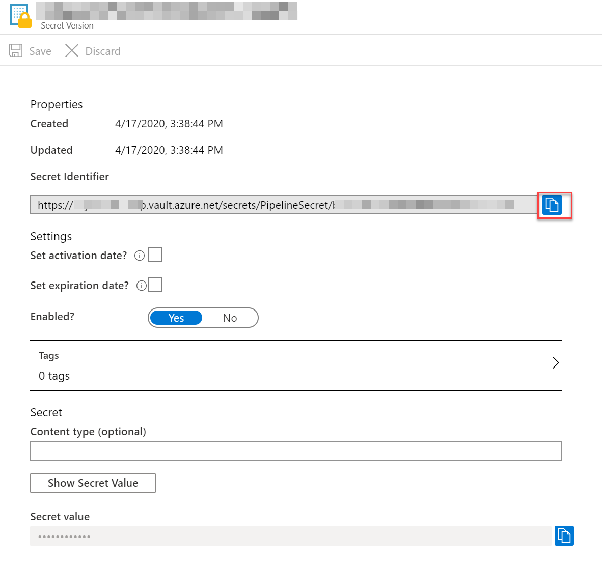

4. Open the Azure Synapse Analytics Studio, select **Orchestrate** from the left menu.

    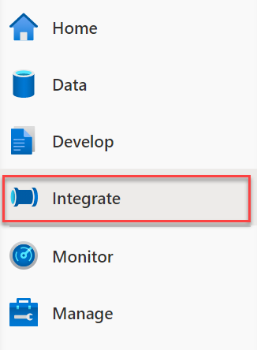

5. From the **Orchestrate** blade, select the **+** button and add a new **Pipeline**.

    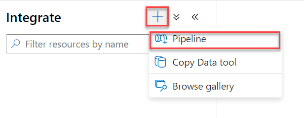

6. On the **Pipeline** tab, in the **Activities** pane search for **Web** and then drag an instance of a **Web** activity to the design area.

    

7. Select the **Web1** web activity, and select the **Settings** tab. Fill out the form as follows:

    1. **URL**: Paste the Secret Identifier value for the secret **append** `?api-version=7.0` to this value.
  
    2. **Method**: Select **Get**.

    3. Expand the **Advanced** section, and for **Authentication** select **MSI**. We have already established an Access Policy for the Managed Service Identity of our `Workspace`, this means that the pipeline activity has permissions to access the key vault via an HTTP call.
  
    4. **Resource**: Enter **<https://vault.azure.net>**

    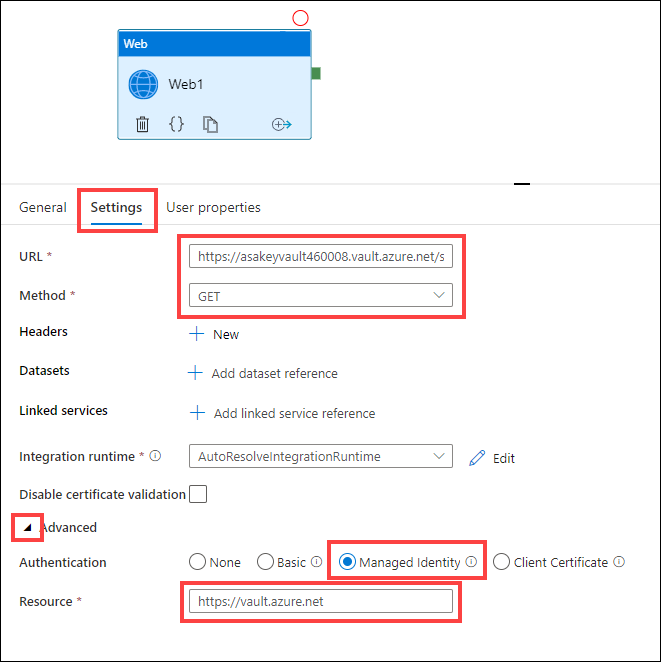

8. Repeat Step 6, but this time add a **Set variable** activity to the design surface of the pipeline.

9. On the design surface of the pipeline, select the **Web1** activity and drag a **Success** activity pipeline connection (green box) to the **Set variable1** activity.

10. With the pipeline selected in the designer, select the **Variables** tab and add a new **String** parameter named **SecretValue**.

      

11. Select the **Set variable1** activity and select the **Variables** tab. Fill out the form as follows:

    1. **Name**: Select **SecretValue** (the variable that we just created on our pipeline).

    2. **Value**: Enter  **@activity('Web1').output.value**

    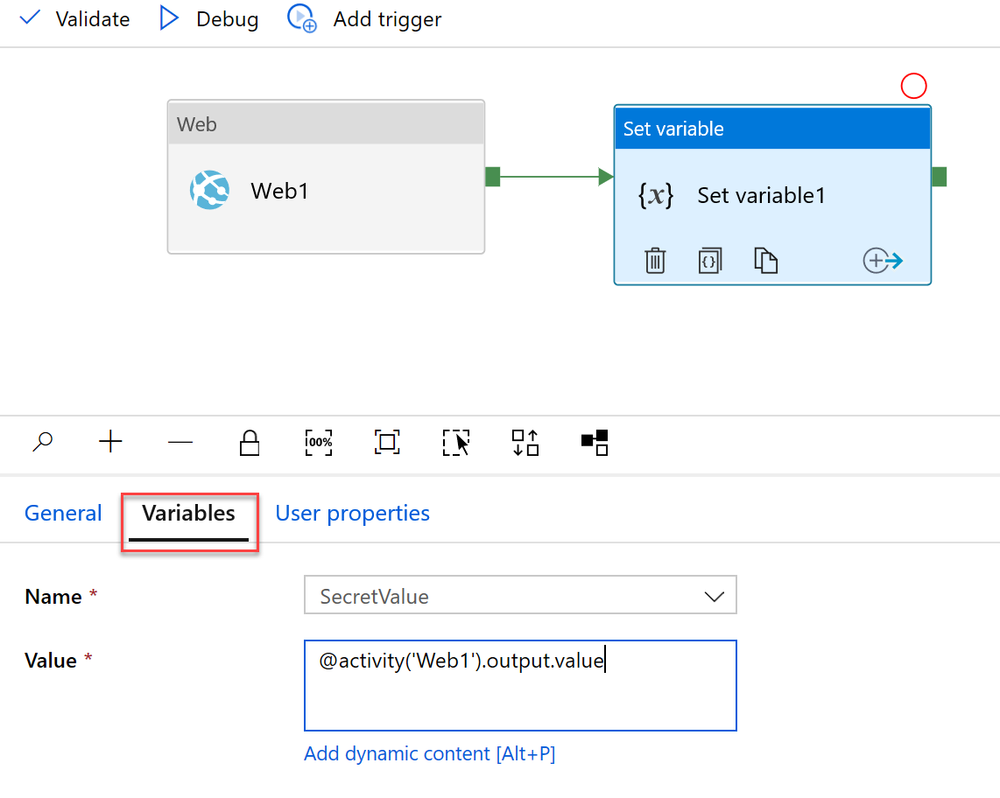

12. Debug the pipeline by selecting **Debug** from the toolbar menu. When it runs observe the inputs and outputs of both activities.

    

    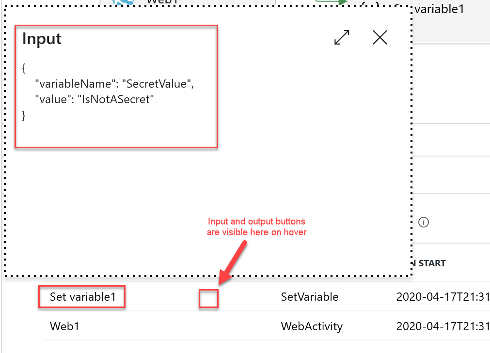

    > **Note**: On the **Web1** activity, on the **General** tab there is a **Secure Output** checkbox that when checked will prevent the secret value from being logged in plain text, for instance in the pipeline run, you would see a masked value ***** instead of the actual value retrieved from the Key vault. Any activity that consumes this value should also have their **Secure Input** checkbox checked.

### Task 5 - Access Control to Synapse SQL Serverless Endpoints

When creating a new SQL Serverless endpoint, you will need to ensure that it has sufficient rights to read/query the primary workspace storage account. Execute the following SQL script to grant this access:

```sql
-- Replace <PrimaryStorage> with the workspace default storage account name.
CREATE CREDENTIAL [https://<PrimaryStorage>.dfs.core.windows.net]
WITH IDENTITY='User Identity';
```

When provisioning new users to the workspace, in addition to adding them to one of the workspace security groups, they can also be added with direct user access to the SQL Serverless databases. You have the ability to manually add users to SQL Serverless endpoints on a per endpoint basis. If a user needs to be added to multiple SQL Serverless endpoints, these steps must be repeated for each one.

1. In **Azure Synapse Studio**, select **Develop** from the left menu.

   

2. From the **Develop** menu, select the **+** button and choose **SQL Script** from the context menu.

   

3. In the toolbar menu, connect to the endpoint on which you want to execute the query.

    

4. In the query window, replace the script with the following (documented inline):

    ```sql
    -- Step 1: Create Login - replace <user@domain.com> accordingly - this is the desired Azure Active Directory
    --  principal name of the New user.
    use master
    go
    CREATE LOGIN [<user@domain.com>] FROM EXTERNAL PROVIDER;
    go

    -- Step 2: Create User, replace <SqlServerless01> and <newuser> accordingly
    use <SqlServerless01>
    go
    CREATE USER <newuser> FROM LOGIN [<user@domain.com>];

    -- Step 3: Add User to appropriate role
    go
    alter role db_owner Add member <newuser>
    ```

5. Select **Run** from the toolbar menu to execute the SQL command.

   

6. You may now close the query tab, when prompted choose **Discard all changes**.

### Task 6 - Secure Azure Synapse Analytics SQL Pools

Transparent Data Encryption (TDE) is a feature of SQL Server that provides encryption and decryption of data at rest, this includes: databases, log files, and back ups. When using this feature with ASA SQL Pools, it will use a built in symmetric Database Encryption Key (DEK) that is provided by the pool itself. With TDE, all stored data is encrypted on disk, when the data is requested, TDE will decrypt this data at the page level as it's read into memory, and vice-versa encrypting in-memory data before it gets written back to disk. As with the name, this happens transparently without affecting any application code. When creating a SQL Pool through ASA, Transparent Data Encryption is not enabled. The first part of this task will show you how to enable this feature.

1. In the **Azure Portal**, locate and open the `SqlPool01` resource.

2. On the **SQL pool** resource screen, select **Transparent data encryption** from the left menu.
   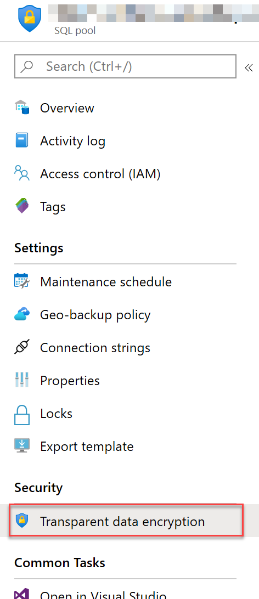

3. If your SQL Pool is not currently taking advantage of TDE, slide the **Data encryption** slider to the **ON** position, and select **Save**.

    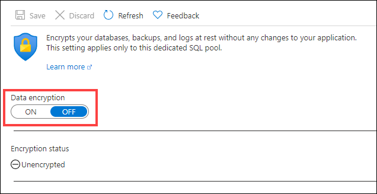

When provisioning new users to the workspace, in addition to adding them to one of the workspace security groups, they can also be added with direct user access to the SQL pools. You have the ability to manually add users to SQL databases on a per database basis. If a user needs to be added to multiple databases, these steps must be repeated for each one.

1. In **Azure Synapse Studio**, select **Develop** from the left menu.

   

2. From the **Develop** menu, select the **+** button and choose **SQL Script** from the context menu.

   

3. In the toolbar menu, connect to the database on which you want to execute the query.

    

4. In the query window, replace the script with the following (documented inline), replace <user@domain.com> accordingly:

    ```sql
    -- Step 1: Create user in SQL DB
    CREATE USER [<user@domain.com>] FROM EXTERNAL PROVIDER;
    -- Step 2: Add role to user in SQL DB
    EXEC sp_addrolemember 'db_owner', '<user@domain.com>';
    ```

5. Select **Run** from the toolbar menu to execute the SQL command.

   

6. You may now close the query tab, when prompted choose **Discard all changes**.

> **Note**: db_datareader and db_datawriter roles can work for read/write if you are not comfortable granting db_owner permissions. However, for a Spark user to read and write directly from Spark into/from a SQL pool, db_owner permission is required.

### Task 7 - Secure Azure Synapse Analytics Spark pools

Azure Synapse Analytics manages the creation and security of new Apache Spark Pools. It is recommended that when creating the Azure Synapse Workspace in the **Networking + Security** tab that you enable a managed VNet. Doing so will increase the security of the Spark Pools by ensuring both network isolation at the Synapse workspace level, but also at the user isolation level as each pool will be created in its own subnet. Be sure to add Spark users to the **Synapse_`Workspace`_SparkAdmins** group to ensure they have the appropriate permissions within Synapse.

## Exercise 3 - Securing Azure Synapse Analytics workspace data

### Task 1 - Setting granular permissions in the data lake with POSIX-style access control lists

Earlier, we secured the default workspace storage account and file system container using RBAC. In addition to RBAC, you can further define POSIX-style ACLs. POSIX-style ACLs are available on all Azure Data Lake Storage 2 accounts that have the Hierarchical Namespace feature enabled. Unlike RBAC, permissions are not inherited using POSIX ACLs. With the POSIX-style model, permissions are stored on the item itself, meaning that if its parent permissions change, those permissions are not automatically inherited. The only time permissions are inherited from the parent is if default permissions have been set on the parent prior to the creation of the child item. See the Access control in [Data Lake Storage Gen2](https://docs.microsoft.com/en-us/azure/storage/blobs/data-lake-storage-access-control) article to learn more about the POSIX access control model.

Possible POSIX access permissions are as follows:
| Numeric Form | Short Form | Description            |
|--------------|------------|------------------------|
| 7            | RWX        | Read + Write + Execute |
| 5            | R-X        | Read + Execute         |
| 4            | R--        | Read                   |
| 0            | ---        | No permissions         |

On the first day, in Activity 1, you were introduced to the concept of the security surrounding storage account containers and files. As part of that exercise, the **wwi-2020-contributors** Active Directory Group is to be granted Read, Write and Execute privileges on the current year's data stored in CSV files located in storage.

1. In **Synapse Analytics Studio**, select the **Data** item from the left menu.

    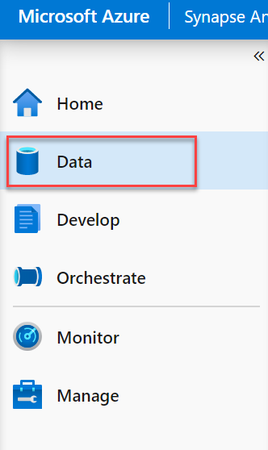

2. Expand **Storage accounts**, expand the `PrimaryStorage` account, and choose the **wwi** container.

    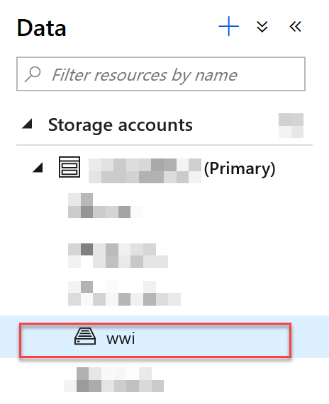

3. On the **wwi** tab, navigate into the **factsale-csv** directory, then navigate into the current year directory (if the current year is not present, navigate into the folder representing the newest year).

    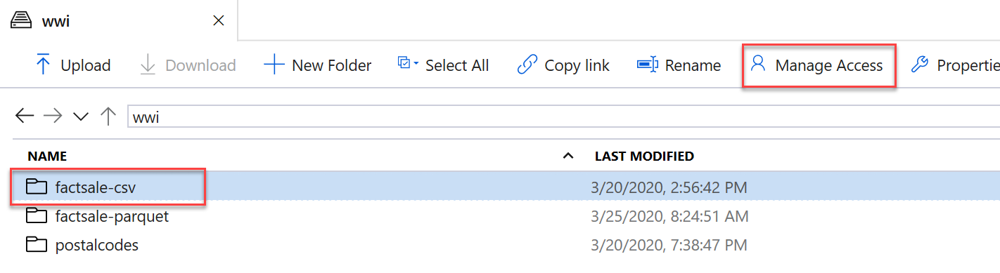

4. On the **Manage Access** blade, select the individual principals from the top table and review their permissions in the permissions section below.

   

5. In order to add a user group or permission, you would need to first enter the User Principal Name (UPN) or Object ID for the principal and select the **Add** button. As an example, we will obtain the Object ID for the **wwi-2020-contributors** security group.

   1. In Azure Portal, expand the left menu and select **Azure Active Directory**.

        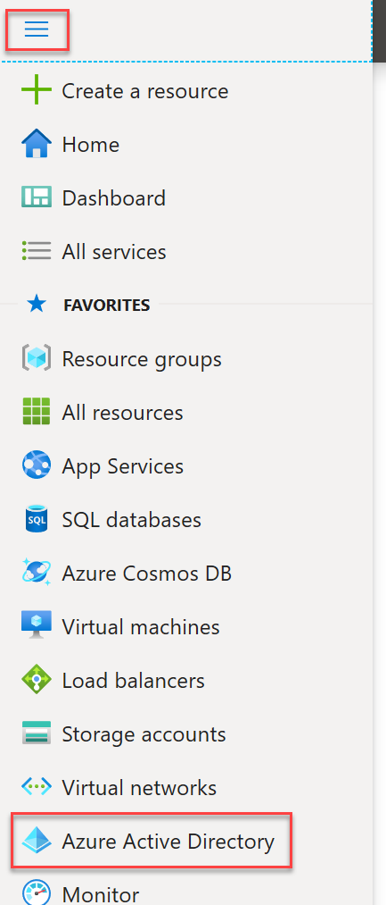

   2. On the **Azure Active Directory** screen left menu, select **Groups**.

        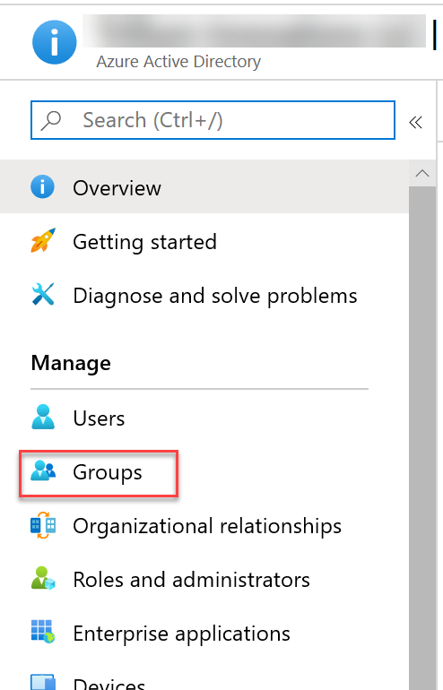

   3. In the search box, type **wwi-2020-writers**, then select the group from the search results.

   4. On the **Overview** screen, use the **Copy** button next to the Object Id textbox to copy the value to the clipboard.

        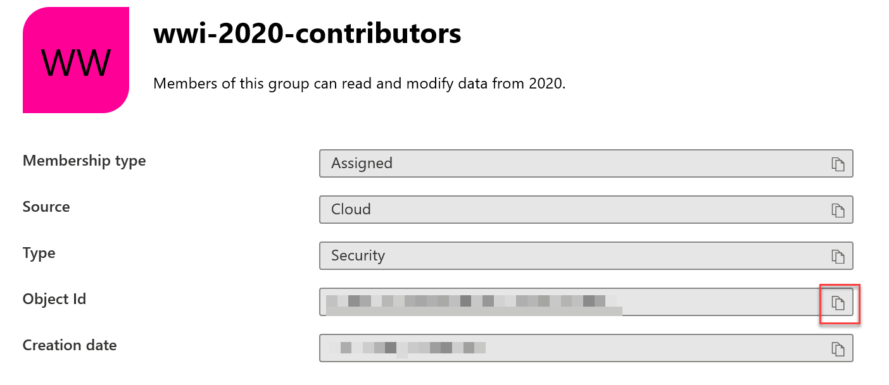

6. In the **Manage Access** blade, paste the Object ID value of the **wwi-2020-contributors** group into the **Add user, group, or service principal** field.

7. Select the **Add** button to add **wwi-2020-contributors** to the ACL list.

8. With **wwi-2020-contributors** selected, check the **Access** checkbox, along with the **Read**, **Write**, and **Execute** permissions, then select the **Save** button.

   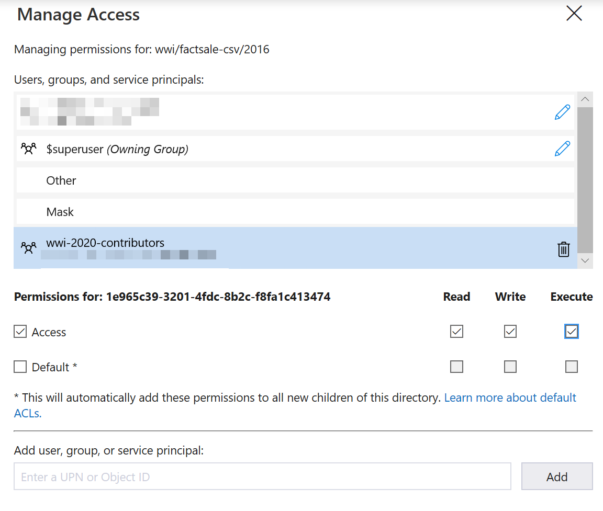

9. You can also provide POSIX ACL security at the individual file level. All you would have to do is repeat steps 3-8 and observe a similar experience when selecting an individual file rather than a directory.

> **Note**: When adding permissions at the directory level, there is an additional **Default** checkbox in the permissions table. By checking this box, you are able to set default permissions that will be automatically applied to any new children (directories or files) created within this directory.

In future years, all WWI will need to do is remove the **wwi-current-contributors** group from the **wwi-2020-contributors** group to revoke write privileges to the 2020 year. Members of the **wwi-readers** will still be able to continue to read 2020 data because they have RBAC access to read all raw data (See Exercise #1). A new current year folder should be created to hold the new raw data csv files, along with a new security group - **wwi-2021-contributors**. This new security group should be given the same ACL privileges to the 2021 folder just as we did in this task. The **wwi-current-contributors** should also be added as a member to this new group so that they have full access to the current year data.

> **Note**: **wwi-readers** do have write access to the current year data.

### Task 2 - Column Level Security

It is important to identify data columns of that hold sensitive information. Types of sensitive could be social security numbers, email addresses, credit card numbers, financial totals, and more. Azure Synapse Analytics allows you define permissions that prevent users or roles select privileges on specific columns.

1. In **Azure Synapse Studio**, select **Develop** from the left menu.

   

2. From the **Develop** menu, expand the **SQL scripts** section, and select **ASAL400 - Lab 05 - Exercise 3 - Column Level Security**.

   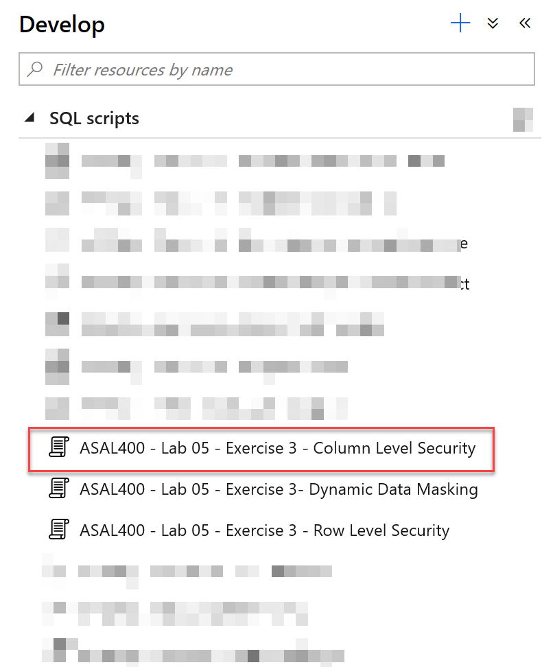

3. In the toolbar menu, connect to the database on which you want to execute the query, `SQLPool01`.

    

4. In the query window, run each step individually by highlighting the statement(s) in the step in the query window, and selecting the **Run** button from the toolbar.

   

5. You may now close the script tab, when prompted choose to **Discard all changes**.

### Task 3 - Row level security

1. In **Azure Synapse Studio**, select **Develop** from the left menu.

   

2. From the **Develop** menu, expand the **SQL scripts** section, and select **ASAL400 - Lab05 - Exercise 3 - Row Level Security**.

    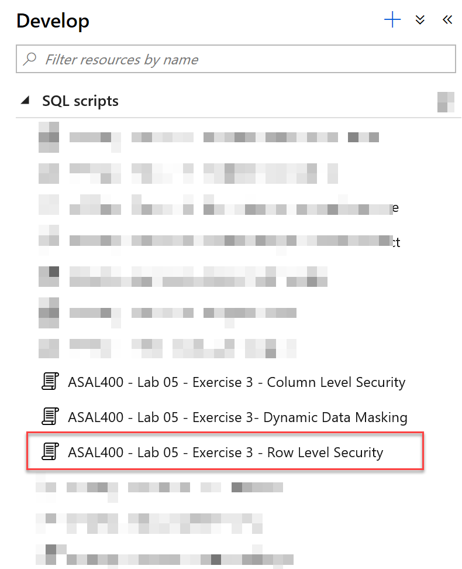

3. In the toolbar menu, connect to the database on which you want to execute the query, `SQLPool01`.

    

4. In the query window, run each step individually by highlighting the statement(s) for the step in the query window, and selecting the **Run** button from the toolbar.

   

5. You may now close the script tab, when prompted choose to **Discard all changes**.

### Task 4 - Dynamic data masking

1. In **Azure Synapse Studio**, select **Develop** from the left menu.

   

2. From the **Develop** menu, expand the **SQL scripts** section, and select **ASAL400 - Lab05 - Exercise 3 - Dynamic Data Masking**.
  
   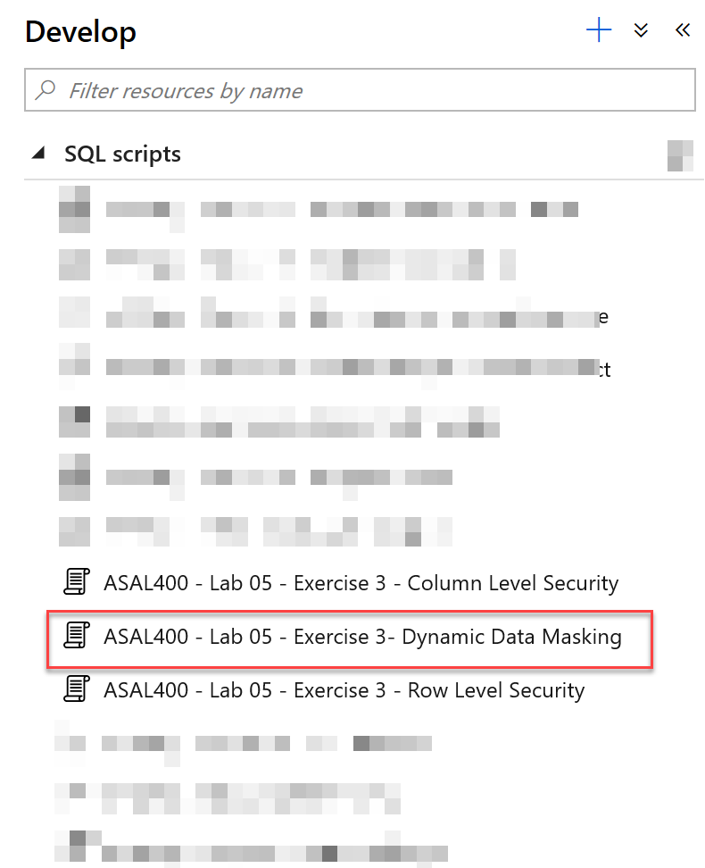

3. In the toolbar menu, connect to the database on which you want to execute the query, `SQLPool01`.

    

4. In the query window, run each step individually by highlighting the statement(s) for the step in the query window, and selecting the **Run** button from the toolbar.

   

5. You may now close the script tab, when prompted choose to **Discard all changes**.

## Reference

- [IP Firewalls](https://github.com/Azure/azure-synapse-analytics/blob/master/docs/security/synapse-workspace-ip-firewall.md)
- [Synapse Workspace Managed Identity](https://github.com/Azure/azure-synapse-analytics/blob/master/docs/securitsynapse-workspace-managed-identity.md)
- [Synapse Managed VNet](https://github.com/Azure/azure-synapse-analytics/blob/master/docs/securitsynapse-workspace-managed-vnet.md)
- [Synapse Managed Private Endpoints](https://github.com/Azure/azure-synapse-analytics/blob/master/docs/securitsynapse-workspace-managed-private-endpoints.md)
- [Setting up Access Control](https://github.com/Azure/azure-synapse-analytics/blob/master/docs/securithow-to-set-up-access-control.md)
- [Connect to Synapse Workspace using Private Endpoints](https://github.com/Azure/azure-synapse-analytics/blob/master/docsecurity/how-to-connect-to-workspace-with-private-links.md)
- [Create Managed Private Endpoints](https://github.com/Azure/azure-synapse-analytics/blob/master/docs/securithow-to-create-managed-private-endpoints.md)
- [Granting Permissions to Workspace Managed Identity](https://github.com/Azure/azure-synapse-analytics/blob/master/docsecurity/how-to-grant-worspace-managed-identity-permissions.md)

## Other Resources

- [Managing access to workspaces, data and pipelines](https://github.com/Azure/azure-synapse-analytics/blob/master/onboarding/synapse-manage-access-workspace.md)
- [Easily read and write safely with Spark into/from SQL Pool](https://github.com/Azure/azure-synapse-analytics/blob/master/docs/previewchecklist/tutorial_4_modern_prep_and_transform.md)
- [Connect SQL Serverless with Power BI desktop](https://github.com/Azure/azure-synapse-analytics/blob/master/sql-analytics/tutorial-power-bi-professional.md)
- [Control storage account access for SQL Analytics Serverless](https://github.com/Azure/azure-synapse-analytics/blob/master/sql-analytics/development-storage-files-storage-access-control.md)
