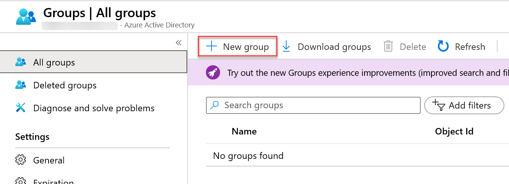
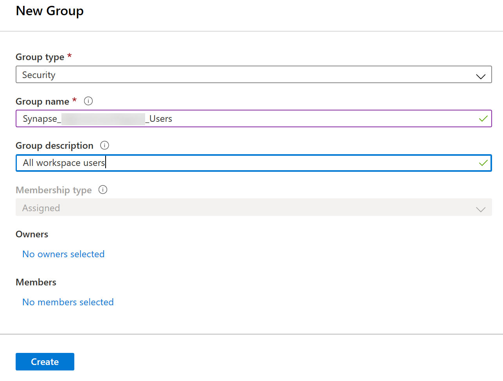
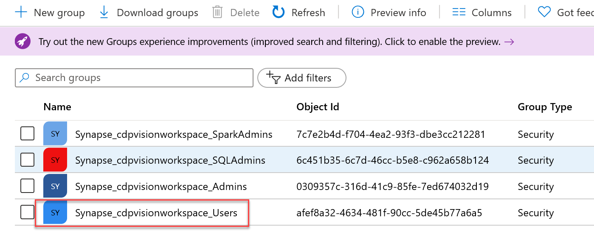
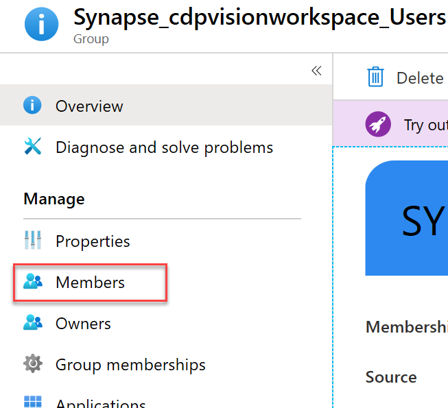
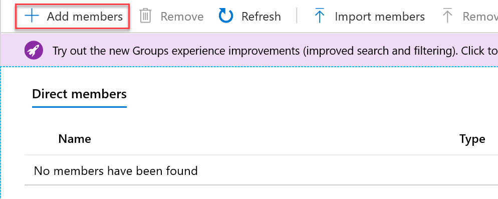
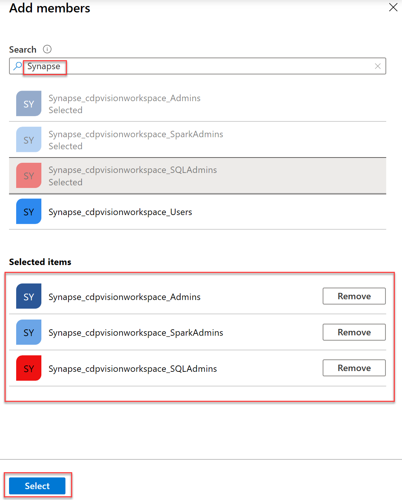
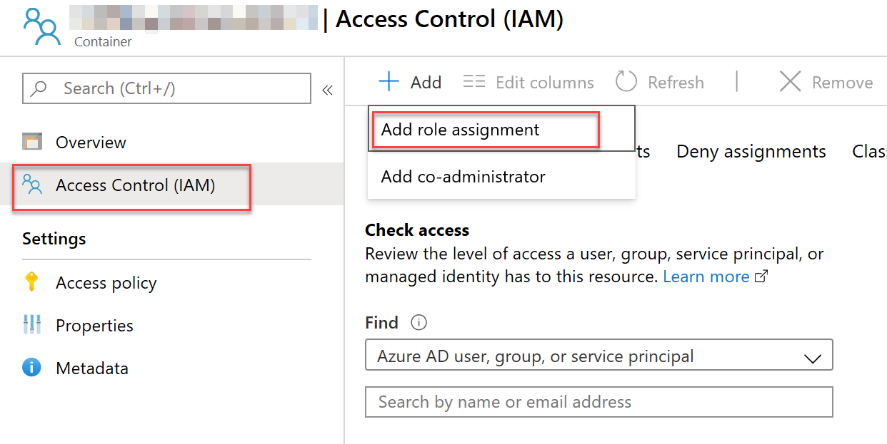
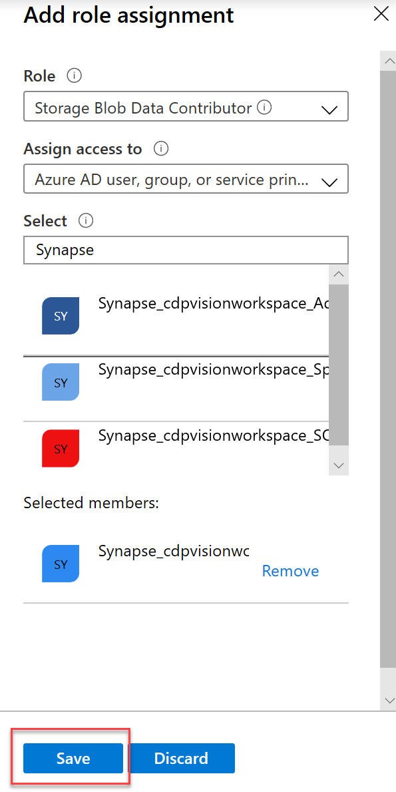

# Security

This lab will guide you through all the security-related steps that cover and end-to-end security story for Azure Synapse Analytics.

```
TBD: Data discovery and classification features in SQL Pools
```

- [Security](#security)
  - [Task 1 - Create Azure Active Directory security groups](#task-1---create-azure-active-directory-security-groups)
  - [Task 2 - Implement Security Group Inheritance in Azure Active Directory](#task-2---implement-security-group-inheritance-in-azure-active-directory)
  - [Task 3 - Secure the Azure Synapse Workspace storage account](#task-3---secure-the-azure-synapse-workspace-storage-account)
  - [Task 4 - Secure your Synapse workspace](#task-4---secure-your-synapse-workspace)
  - [Task 5 - Setting granular permissions in the data lake with Azure role-based access control](#task-5---setting-granular-permissions-in-the-data-lake-with-azure-role-based-access-control)
  - [Task 6 - Setting granular permissions in the data lake with POSIX-style access control lists](#task-6---setting-granular-permissions-in-the-data-lake-with-posix-style-access-control-lists)
  - [Task 7 - Secure Synapse SQL Pools](#task-7---secure-synapse-sql-pools)
  - [Task 8 - Column level security](#task-8---column-level-security)
  - [Task 9 - Row level security](#task-9---row-level-security)
  - [Task 10 - Dynamic data masking](#task-10---dynamic-data-masking)
  - [Task 11 - Secure Synapse SQL Serverless](#task-11---secure-synapse-sql-serverless)
  - [Task 12 - Secure Synapse Spark pools](#task-12---secure-synapse-spark-pools)
  - [Task 13 - Secure data flows and pipelines](#task-13---secure-data-flows-and-pipelines)
  - [Task 14 - Secure Power BI reports](#task-14---secure-power-bi-reports)
  - [Other Resources:](#other-resources)

## Task 1 - Create Azure Active Directory security groups

As with many Azure resources, Azure Synapse Analytics has the ability to leverage Azure Active Directory for security. Begin the security implementation by defining appropriate security groups in Azure Active Directory. Each security group will represent a job function in Azure Synapse Analytics and will be granted the necessary permissions to fulfill its function. Individual users will then be assigned to their respective group based on their role in the organization. Structuring security in this way makes it easier to provision users and admins.

As a general guide, create an Azure Active Directory Security Group for the following job functions, replacing **WORKSPACENAME** with the name of your workspace:

| Group                             | Description                                                                        |
|-----------------------------------|------------------------------------------------------------------------------------|
| Synapse_WORKSPACENAME_Users       | General non-administrative users.                                                  |
| Synapse_WORKSPACENAME_Admins      | Workspace administrators, for users that need complete control over the workspace. |
| Synapse_WORKSPACENAME_SQLAdmins   | For users that need complete control over the SQL aspects of the workspace.        |
| Synapse_WORKSPACENAME_SparkAdmins | For users that need complete control over the Spark aspects of the workspace.      |

1. In the [Azure Portal](https://portal.azure.com), expand the left menu by selecting the menu icon in the upper left corner. From the menu that appears, select the **Azure Active Directory** item.

    

2. From the left menu of the **Azure Active Directory** resource page, select **Groups**.

    

3. On the **Groups** page, select **+ New group** from the top toolbar menu.

   

4. In the **New Group** form, fill out the form for the first group from the table in the task description as follows, then select the **Create** button at the bottom of the screen:

   1. **Group type**: Select **Security**.

   2. **Group name**: Type `Synapse_WORKSPACENAME_Users`

   3. **Group description**: Type `General non-administrative users.`

    

5. Repeat Steps 3 and 4 for the remaining groups listed in the table located in the task description.

## Task 2 - Implement Security Group Inheritance in Azure Active Directory

Some of the groups that we created in the first task will have permissions that build upon one another. Approaching security groups as an inheritance hierarchy avoids duplicating permissions for every single group. For instance, by adding the **Synapse_WORKSPACE_Admins** group as a member of the **Synapse_WORKSPACE_Users** group, the admin group will automatically inherit the permissions assigned to the Users group. The admin group will add *only* the permissions specific to the admin role that do not exist in the 'base' Users group it inherited. The membership of the groups that we defined in Task 1 are as follows:

| Group                             | Members                                                                                          |
|-----------------------------------|--------------------------------------------------------------------------------------------------|
| Synapse_WORKSPACENAME_Users       | Synapse_WORKSPACENAME_Admins, Synapse_WORKSPACENAME_SQLAdmins, Synapse_WORKSPACENAME_SparkAdmins |
| Synapse_WORKSPACENAME_SQLAdmins   | Synapse_WORKSPACENAME_Admins                                                                     |
| Synapse_WORKSPACENAME_SparkAdmins | Synapse_WORKSPACENAME_Admins                                                                     |

1. In the Active Directory **Groups** page, select **Synapse_WORKSPACENAME_Users** from the list of groups.

   

2. In the left hand menu of the **Group** page, select **Members**.

   

3. From the top toolbar menu of the **Members** page, select the **+ Add members** button.

   

4. In the **Add members** blade, enter `Synapse` into the Search box and press <kbd>Enter</kbd> to filter the list of options. Select the **Synapse_WORKSPACENAME_Admins**, **Synapse_WORKSPACENAME_SQLAdmins**, and **Synapse_WORKSPACENAME_SparkAdmins** security groups, and choose the **Select** button at the bottom of the blade.

   

5. Repeat Steps 1 - 4 for each of the remaining groups listed in the table found in the description of this task.

## Task 3 - Secure the Azure Synapse Workspace storage account

Role-based Access Control (RBAC) uses role assignments to apply permission sets to security principals; a principal may be a user, group, service principal, or any managed identity that exists in the Azure Active Directory. So far in this lab, we have defined and configured security groups that represent the various job functions that we need in Azure Synapse Analytics. It is recommended that individual user principals be added only to these Active Directory Security groups. These users will in turn be granted permissions based on the security group (role) that they belong to. All RBAC permissions in this lab will be assigned to security groups, never to an individual user principal.

When the Azure Synapse Workspace was created, it required the selection of an Azure Data Lake Storage Gen 2 account and the creation of a default 'filesystem' container (we will refer to as **wsfilesystemcontainer**). The groups we've created in this lab will require access to this container.

1. In the Azure Portal, open the list of resources and select the  Azure Data Lake Storage Gen 2 account that you selected when creating the Azure Synapse Analytics Workspace.

2. On the **Storage Account Overview** page, select the **Containers** tile.

    

3. Select **wsfilesystemcontainer** from the list of containers.
  
   

4. From the **Container** screen left menu, select **Access Control (IAM)**. From the top toolbar menu select **+ Add**, then choose **Add role assignment**.

    

5. In the **Add role assignment** blade, complete it as follows then select the **Save** button at the bottom of the blade:

   1. **Role**: Select **Storage Blob Data Contributor**.  

   2. **Assign access to**: Select **Azure AD user, group, or service principal**.

   3. **Select**: Type `Synapse` , then select **Synapse_WORKSPACENAME_Admins**, **Synapse_WORKSPACENAME_SQLAdmins**, and **Synapse_WORKSPACE_SparkAdmins** from the filtered list.

    

## Task 4 - Secure your Synapse workspace

## Task 5 - Setting granular permissions in the data lake with Azure role-based access control

## Task 6 - Setting granular permissions in the data lake with POSIX-style access control lists

## Task 7 - Secure Synapse SQL Pools

## Task 8 - Column level security

```sql
/*  Column-level security feature in Azure Synapse simplifies the design and coding of security in application. 
    It ensures column level security by restricting column access to protect sensitive data. */

--Step 1: Let us see how this feature in Azure Synapse works. Before that let us have a look at the Campaign table. 
select  Top 100 * from Campaign_Analytics 
where City is not null and state is not null

/*  Consider a scenario where there are two users. 
    A CEO, who is an authorized  personnel with access to all the information in the database 
    and a Data Analyst, to whom only required information should be presented.*/

-- Step:2 We look for the names “CEO” and “DataAnalystMiami” present in the Datawarehouse. 
SELECT Name as [User1] FROM sys.sysusers WHERE name = N'CEO'
SELECT Name as [User2] FROM sys.sysusers WHERE name = N'DataAnalystMiami'


-- Step:3 Now let us enforcing column level security for the DataAnalystMiami. 
/*  Let us see how.
    The Campaign_Analytics table in the warehouse has information like Region, Country, Product_Category, Campaign_Name, City,State,Revenue_Target , and Revenue.
    Of all the information, Revenue generated from every campaign is a classified one and should be hidden from DataAnalystMiami.
    To conceal this information, we execute the following query: */

GRANT SELECT ON Campaign_Analytics([Region],[Country],[Product_Category],[Campaign_Name],[Revenue_Target],
[City],[State]) TO DataAnalystMiami;
-- This provides DataAnalystMiami access to all the columns of the Campaign_Analytics table but Revenue.

-- Step:4 Then, to check if the security has been enforced, we execute the following query with current User As 'DataAnalystMiami'
EXECUTE AS USER ='DataAnalystMiami'
select * from Campaign_Analytics
---
EXECUTE AS USER ='DataAnalystMiami'
select [Region],[Country],[Product_Category],[Campaign_Name],[Revenue_Target],
[City],[state] from Campaign_Analytics

/*  And look at that, when the user logged in as DataAnalystMiami tries to view all the columns from the Campaign_Analytics table, 
    he is prompted with a ‘permission denied error’ on Revenue column.*/

-- Step:5 Whereas, the CEO of the company should be authorized with all the information present in the warehouse.To do so, we execute the following query.
Revert;
GRANT SELECT ON Campaign_Analytics TO CEO;  --Full access to all columns.

-- Step:6 Let us check if our CEO user can see all the information that is present. Assign Current User As 'CEO' and the execute the query
EXECUTE AS USER ='CEO'
select * from Campaign_Analytics
Revert;
```

## Task 9 - Row level security

```sql
/*	Row level Security (RLS) in Azure Synapse enables us to use group membership to control access to rows in a table.
	Azure Synapse applies the access restriction every time the data access is attempted from any user. 
	Let see how we can implement row level security in Azure Synapse.*/

----------------------------------Row-Level Security (RLS), 1: Filter predicates------------------------------------------------------------------
-- Step:1 The FactSales table has two Analyst values i.e. DataAnalystMiami and DataAnalystSanDiego
SELECT * FROM FactSales order by Analyst ;

/* Moving ahead, we Create a new schema, and an inline table-valued function. 
The function returns 1 when a row in the Analyst column is the same as the user executing the query (@Analyst = USER_NAME())
 or if the user executing the query is the CEO user (USER_NAME() = 'CEO').
*/

-- Demonstrate the existing security predicates already deployed to the database
SELECT * FROM sys.security_predicates

--Step:2 To set up RLS, the following query creates three login users :  CEO, DataAnalystMiami, DataAnalystSanDiego
EXEC dbo.Sp_rls;
GO
CREATE SCHEMA Security
GO
CREATE FUNCTION Security.fn_securitypredicate(@Analyst AS sysname)  
    RETURNS TABLE  
WITH SCHEMABINDING  
AS  
    RETURN SELECT 1 AS fn_securitypredicate_result
    WHERE @Analyst = USER_NAME() OR USER_NAME() = 'CEO'
GO
-- Now we define security policy that allows users to filter rows based on thier login name.
CREATE SECURITY POLICY SalesFilter  
ADD FILTER PREDICATE Security.fn_securitypredicate(Analyst)
ON dbo.FactSales
WITH (STATE = ON);
------ Allow SELECT permissions to the fn_securitypredicate function.------
GRANT SELECT ON security.fn_securitypredicate TO CEO, DataAnalystMiami, DataAnalystSanDiego;

-- Step:3 Let us now test the filtering predicate, by selecting data from the FactSales table as 'DataAnalystMiami' user.
EXECUTE AS USER = 'DataAnalystMiami' 
SELECT * FROM FactSales;
revert;
-- As we can see, the query has returned rows here Login name is DataAnalystMiami

-- Step:4 Let us test the same for  'DataAnalystSanDiego' user.
EXECUTE AS USER = 'DataAnalystSanDiego'; 
SELECT * FROM FactSales;
revert;
-- RLS is working indeed.

-- Step:5 The CEO should be able to see all rows in the table.
EXECUTE AS USER = 'CEO';  
SELECT * FROM FactSales;
revert;
-- And he can.

--Step:6 To disable the security policy we just created above, we execute the following.
ALTER SECURITY POLICY SalesFilter  
WITH (STATE = OFF);

DROP SECURITY POLICY SalesFilter;
DROP FUNCTION Security.fn_securitypredicate;
DROP SCHEMA Security;
```

## Task 10 - Dynamic data masking

```sql
-------------------------------------------------------------------------Dynamic Data Masking (DDM)----------------------------------------------------------------------------------------------------------
/*  Dynamic data masking helps prevent unauthorized access to sensitive data by enabling customers
    to designate how much of the sensitive data to reveal with minimal impact on the application layer. 
    Let see how */

-- Step:1 Let us first get a view of CustomerInfo table. 
SELECT TOP (100) * FROM CustomerInfo;

-- Step:2 Let's confirm that there are no Dynamic Data Masking (DDM) applied on columns.
SELECT c.name, tbl.name as table_name, c.is_masked, c.masking_function  
FROM sys.masked_columns AS c  
JOIN sys.tables AS tbl   
    ON c.[object_id] = tbl.[object_id]  
WHERE is_masked = 1 
    AND tbl.name = 'CustomerInfo';
-- No results returned verify that no data masking has been done yet.

-- Step:3 Now lets mask 'CreditCard' and 'Email' Column of 'CustomerInfo' table.
ALTER TABLE CustomerInfo  
ALTER COLUMN [CreditCard] ADD MASKED WITH (FUNCTION = 'partial(0,"XXXX-XXXX-XXXX-",4)');
GO
ALTER TABLE CustomerInfo 
ALTER COLUMN Email ADD MASKED WITH (FUNCTION = 'email()');
GO
-- The columns are sucessfully masked.

-- Step:4 Let's see Dynamic Data Masking (DDM) applied on the two columns.
SELECT c.name, tbl.name as table_name, c.is_masked, c.masking_function  
FROM sys.masked_columns AS c  
JOIN sys.tables AS tbl   
    ON c.[object_id] = tbl.[object_id]  
WHERE is_masked = 1 
    AND tbl.name ='CustomerInfo';

-- Step:5 Now, let us grant SELECT permission to 'DataAnalystMiami' on the 'CustomerInfo' table.
SELECT Name as [User] 
FROM sys.sysusers 
WHERE name = N'DataAnalystMiami'
GRANT SELECT ON CustomerInfo TO DataAnalystMiami;  

-- Step:6 Logged in as  'DataAnalystMiami' let us execute the select query and view the result.
EXECUTE AS USER =N'DataAnalystMiami';  
SELECT * FROM CustomerInfo; 

-- Step:7 Let us remove the data masking using UNMASK permission
GRANT UNMASK TO DataAnalystMiami
EXECUTE AS USER = 'DataAnalystMiami';  
SELECT * 
FROM CustomerInfo; 
revert;
REVOKE UNMASK TO DataAnalystMiami;  

----step:8 Reverting all the changes back to as it was.
ALTER TABLE CustomerInfo
ALTER COLUMN CreditCard DROP MASKED;
GO
ALTER TABLE CustomerInfo
ALTER COLUMN Email DROP MASKED;
GO
```

## Task 11 - Secure Synapse SQL Serverless

## Task 12 - Secure Synapse Spark pools

## Task 13 - Secure data flows and pipelines

## Task 14 - Secure Power BI reports


  - [IP Firewalls](https://github.com/Azure/azure-synapse-analytics/blob/master/docs/security/synapse-workspace-ip-firewall.md)
  - [Synapse Workspace Managed Identity](https://github.com/Azure/azure-synapse-analytics/blob/master/docs/security/synapse-workspace-managed-identity.md)
  - [Synapse Managed VNet](https://github.com/Azure/azure-synapse-analytics/blob/master/docs/security/synapse-workspace-managed-vnet.md)
  - [Synapse Managed Private Endpoints](https://github.com/Azure/azure-synapse-analytics/blob/master/docs/security/synapse-workspace-managed-private-endpoints.md)
  - [Setting up Access Control](https://github.com/Azure/azure-synapse-analytics/blob/master/docs/security/how-to-set-up-access-control.md)
  - [Connect to Synapse Workspace using Private Endpoints](https://github.com/Azure/azure-synapse-analytics/blob/master/docs/security/how-to-connect-to-workspace-with-private-links.md)
  - [Create Managed Private Endpoints](https://github.com/Azure/azure-synapse-analytics/blob/master/docs/security/how-to-create-managed-private-endpoints.md)
  - [Granting Permissions to Workspace Managed Identity](https://github.com/Azure/azure-synapse-analytics/blob/master/docs/security/how-to-grant-worspace-managed-identity-permissions.md)


## Other Resources:

- [Managing access to workspaces, data and pipelines](https://github.com/Azure/azure-synapse-analytics/blob/master/onboarding/synapse-manage-access-workspace.md)
- [Easily read and write safely with Spark into/from SQL Pool](https://github.com/Azure/azure-synapse-analytics/blob/master/docs/previewchecklist/tutorial_4_modern_prep_and_transform.md)
- [Connect SQL on-demand with Power BI desktop](https://github.com/Azure/azure-synapse-analytics/blob/master/sql-analytics/tutorial-power-bi-professional.md)
- [Control storage account access for SQL Analytics on-demand](https://github.com/Azure/azure-synapse-analytics/blob/master/sql-analytics/development-storage-files-storage-access-control.md)