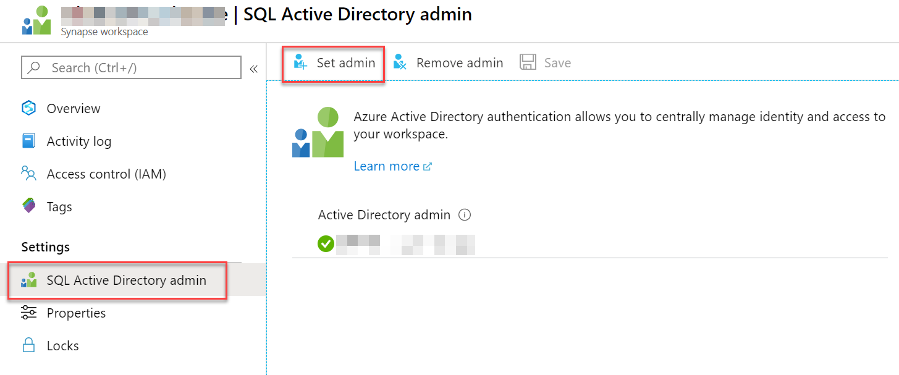
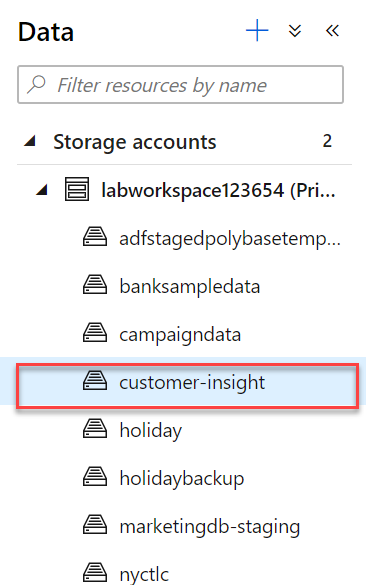
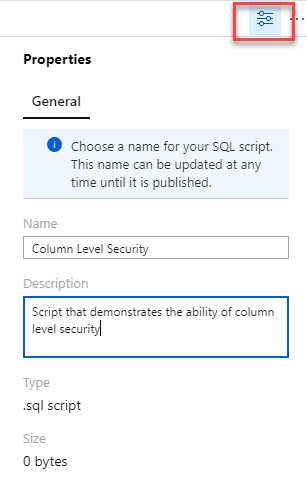
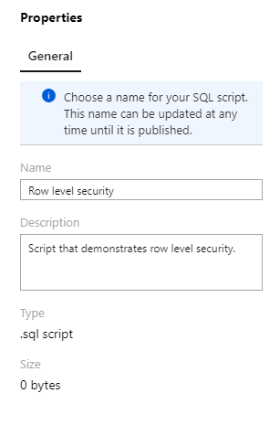
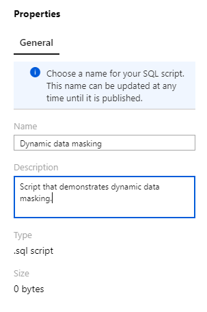

# Security

This lab will guide you through all the security-related steps that cover and end-to-end security story for Azure Synapse Analytics.

```text
TBD: Data discovery and classification features in SQL Pools
```

> **Question**: Should this document also cover security recommendations for when creating linked services as well?
> Sql AAD Admin account for sql pools and account keys for storage accounts.

- [Security](#security)
  - [Task 1 - Create Azure Active Directory security groups](#task-1---create-azure-active-directory-security-groups)
  - [Task 2 - Implement Security Group Inheritance in Azure Active Directory](#task-2---implement-security-group-inheritance-in-azure-active-directory)
  - [Task 3 - Secure the Azure Synapse Workspace storage account](#task-3---secure-the-azure-synapse-workspace-storage-account)
  - [Task 4 - Access control to workspace pipeline runs](#task-4---access-control-to-workspace-pipeline-runs)
  - [Task 5 - Secure your Synapse workspace](#task-5---secure-your-synapse-workspace)
  - [Task 6 - Set the SQL Active Directory admin](#task-6---set-the-sql-active-directory-admin)
  - [Task 7 - Access Control to Synapse SQL on-demand](#task-7---access-control-to-synapse-sql-on-demand)
  - [Task 8 - Access Control to Synapse SQL Pools](#task-8---access-control-to-synapse-sql-pools)
  - [Task 9 - Secure Synapse Spark pools](#task-9---secure-synapse-spark-pools)
  - [Task 10 - Secure Power BI reports](#task-10---secure-power-bi-reports)
  - [Task 11 - Setting granular permissions in the data lake with POSIX-style access control lists](#task-11---setting-granular-permissions-in-the-data-lake-with-posix-style-access-control-lists)
  - [Task 12 - Column level security](#task-12---column-level-security)
  - [Task 13 - Row level security](#task-13---row-level-security)
  - [Task 14 - Dynamic data masking](#task-14---dynamic-data-masking)
  - [Task 15 - Add IP firewall rules](#task-15---add-ip-firewall-rules)
  - [Task 16 - Managed VNet](#task-16---managed-vnet)
  - [Task 17 - Private Endpoints](#task-17---private-endpoints)
  - [Reference](#reference)
  - [Other Resources](#other-resources)

## Task 1 - Create Azure Active Directory security groups

As with many Azure resources, Azure Synapse Analytics has the ability to leverage Azure Active Directory for security. Begin the security implementation by defining appropriate security groups in Azure Active Directory. Each security group will represent a job function in Azure Synapse Analytics and will be granted the necessary permissions to fulfill its function. Individual users will then be assigned to their respective group based on their role in the organization. Structuring security in this way makes it easier to provision users and admins.

As a general guide, create an Azure Active Directory Security Group for the following job functions, replacing **WORKSPACENAME** with the name of your workspace:

| Group                             | Description                                                                        |
|-----------------------------------|------------------------------------------------------------------------------------|
| Synapse_WORKSPACENAME_Users       | All workspace users.                                                               |
| Synapse_WORKSPACENAME_Admins      | Workspace administrators, for users that need complete control over the workspace. |
| Synapse_WORKSPACENAME_SQLAdmins   | For users that need complete control over the SQL aspects of the workspace.        |
| Synapse_WORKSPACENAME_SparkAdmins | For users that need complete control over the Spark aspects of the workspace.      |

1. In the [Azure Portal](https://portal.azure.com), expand the left menu by selecting the menu icon in the upper left corner. From the menu that appears, select the **Azure Active Directory** item.

    

2. From the left menu of the **Azure Active Directory** resource page, select **Groups**.

    

3. On the **Groups** page, select **+ New group** from the top toolbar menu.

   

4. In the **New Group** form, fill out the form for the first group from the table in the task description as follows, then select the **Create** button at the bottom of the screen:

   1. **Group type**: Select **Security**.

   2. **Group name**: Type `Synapse_WORKSPACENAME_Users`

   3. **Group description**: Type `All workspace users.`

    

5. Repeat Steps 3 and 4 for the remaining groups listed in the table located in the task description.

> **Note**: When you want to add a user to the Synapse Workspace, assign them to one of these security groups.

## Task 2 - Implement Security Group Inheritance in Azure Active Directory

Some of the groups that we created in the first task will have permissions that build upon one another. Approaching security groups as an inheritance hierarchy avoids duplicating permissions for every single group. For instance, by adding the **Synapse_WORKSPACE_Admins** group as a member of the **Synapse_WORKSPACE_Users** group, the admin group will automatically inherit the permissions assigned to the Users group. The admin group will add *only* the permissions specific to the admin role that do not exist in the 'base' Users group it inherited. The membership of the groups that we defined in Task 1 are as follows:

| Group                             | Members                                                                                          |
|-----------------------------------|--------------------------------------------------------------------------------------------------|
| Synapse_WORKSPACENAME_Users       | Synapse_WORKSPACENAME_Admins, Synapse_WORKSPACENAME_SQLAdmins, Synapse_WORKSPACENAME_SparkAdmins |
| Synapse_WORKSPACENAME_SQLAdmins   | Synapse_WORKSPACENAME_Admins                                                                     |
| Synapse_WORKSPACENAME_SparkAdmins | Synapse_WORKSPACENAME_Admins                                                                     |

1. In the Active Directory **Groups** page, select **Synapse_WORKSPACENAME_Users** from the list of groups.

   

2. In the left hand menu of the **Group** page, select **Members**.

   

3. From the top toolbar menu of the **Members** page, select the **+ Add members** button.

   

4. In the **Add members** blade, enter `Synapse` into the Search box and press **Enter** to filter the list of options. Select the **Synapse_WORKSPACENAME_Admins**, **Synapse_WORKSPACENAME_SQLAdmins**, and **Synapse_WORKSPACENAME_SparkAdmins** security groups, and choose the **Select** button at the bottom of the blade.

   

5. Repeat Steps 1 - 4 for each of the remaining groups listed in the table found in the description of this task.

## Task 3 - Secure the Azure Synapse Workspace storage account

One of the benefits of using Azure Storage Accounts is that all data at rest is encrypted. Azure Storage encrypts and decrypts data transparently using 256-bit AES encryption and is FPS 140-2 compliant. In addition to encrypted data at rest, Role Based Access Control is available to further secure storage accounts and containers.

Role-based Access Control (RBAC) uses role assignments to apply permission sets to security principals; a principal may be a user, group, service principal, or any managed identity that exists in the Azure Active Directory. So far in this lab, we have defined and configured security groups that represent the various job functions that we need in Azure Synapse Analytics. It is recommended that individual user principals be added only to these Active Directory Security groups. These users will in turn be granted permissions based on the security group (role) that they belong to. All RBAC permissions in this lab will be assigned to security groups, never to an individual user principal.

When the Azure Synapse Workspace was created, it required the selection of an Azure Data Lake Storage Gen 2 account and the creation of a default 'filesystem' container (we will refer to as **wsfilesystemcontainer**). The groups we've created in this lab will require access to this container.

1. In the Azure Portal, open the list of resources and select the  Azure Data Lake Storage Gen 2 account that you selected when creating the Azure Synapse Analytics Workspace.

2. On the **Storage Account Overview** page, select the **Containers** tile.

    

3. Select **wsfilesystemcontainer** from the list of containers.
  
   

4. From the **Container** screen left menu, select **Access Control (IAM)**. From the top toolbar menu select **+ Add**, then choose **Add role assignment**.

    

5. In the **Add role assignment** blade, complete it as follows then select the **Save** button at the bottom of the blade:

   1. **Role**: Select **Storage Blob Data Contributor**.  

   2. **Assign access to**: Select **Azure AD user, group, or service principal**.

   3. **Select**: Type `Synapse` , then select **Synapse_WORKSPACENAME_Users** from the filtered list.

    

6. Remain on the **Container** **Access Control (IAM)** screen. The last step in ensuring the Synapse workspace has the access it needs is to verify that its **Managed Service Identity (MSI)** has the proper access to the default container. A managed identity is an Azure Active Directory feature that provides a built in identity for Azure Resources so that they can authenticate to one another. The Azure Synapse managed identity is used to orchestrate pipelines and needs permissions to perform the operations in those pipelines. See [managed identities for azure resources](https://docs.microsoft.com/en-us/azure/active-directory/managed-identities-azure-resources/overview) to learn more.

   1. Select the **Role assignments** tab.

   2. Ensure the MSI with the same name as your workspace is listed as a **Contributor**. If it isn't listed, please add it now following the instruction in Step 5.

    **** TODO: NEED A SCREENSHOT, the default container for the workspace (tempdata in labworkspace123654) doesn't allow me to add role assignments and the MSI isn't listed as a contributor ****

## Task 4 - Access control to workspace pipeline runs

In the previous task, we discussed the Managed Identity of the workspace. To successfully run pipelines that include datasets or activities that reference a SQL pool, the workspace identity needs to be granted access to the SQL pool directly.

1. In Azure Synapse Studio, select **Develop** from the left menu.

   

2. From the **Develop** menu, select the **+** button and choose **SQL Script** from the context menu.

   

3. In the toolbar menu, connect to the database on which you want to execute the query.

    

4. In the query window, replace the script with the following (documented inline, replace \<workspacename\> and \<SQLpoolname\> accordingly):

    ```sql
    -- Step 1: Create user in DB
    CREATE USER [<workspacename>] FROM EXTERNAL PROVIDER;

    -- Step 2: Granting permission to the identity
    GRANT CONTROL ON DATABASE::<SQLpoolname> TO <workspacename>;
    ```

5. Select **Run** from the toolbar menu to execute the SQL command.

   

6. You may now close the query tab, when prompted choose **Discard all changes**.

## Task 5 - Secure your Synapse workspace

Now that we've secured the foundational storage account, we can move on to securing the Synapse workspace. Azure Synapse Analytics provides three built-in roles with varying access throughout the workspace. These roles and their associated permissions within the workspace are outlined as follows:

| Task | Workspace Admins | Spark admins | SQL admins |
| --- | --- | --- | --- |
| Open Synapse Studio | YES | YES | YES |
| View Home hub | YES | YES | YES |
| View Data Hub | YES | YES | YES |
| Data Hub / See linked ADLSGen2 accounts and containers | YES [1] | YES[1] | YES[1] |
| Data Hub / See Databases | YES | YES | YES |
| Data Hub / See objects in databases | YES | YES | YES |
| Data Hub / Access data in SQL pool databases | YES   | NO   | YES   |
| Data Hub / Access data in SQL on-demand databases | YES [2]  | NO  | YES [2]  |
| Data Hub / Access data in Spark databases | YES [2] | YES [2] | YES [2] |
| Use the Develop hub | YES | YES | YES |
| Develop Hub / author SQL Scripts | YES | NO | YES |
| Develop Hub / author Spark Job Definitions | YES | YES | NO |
| Develop Hub / author Notebooks | YES | YES | NO |
| Develop Hub / author Dataflows | YES | NO | NO |
| Use the Orchestrate hub | YES | YES | YES |
| Orchestrate hub / use Pipelines | YES | NO | NO |
| Use the Manage Hub | YES | YES | YES |
| Manage Hub / SQL pools | YES | NO | YES |
| Manage Hub / Spark pools | YES | YES | NO |
| Manage Hub / Triggers | YES | NO | NO |
| Manage Hub / Linked services | YES | YES | YES |
| Manage Hub / Access Control (assign users to Synapse workspace roles) | YES | NO | NO |
| Manage Hub / Integration runtimes | YES | YES | YES |

[1] Access to data in containers depends on the access control in ADLSGen2

[2] SQL OD tables and Spark tables store their data in ADLSGen2 and access requires the appropriate permissions on ADLSGen2.

We will now associate the Azure Active Directory groups that we've created with these roles as follows:

| Synapse Analytics Role | Azure Active Directory Group      |
|------------------------|-----------------------------------|
| Workspace admin        | Synapse_WORKSPACENAME_Admins      |
| Apache Spark admin     | Synapse_WORKSPACENAME_SparkAdmins |
| SQL admin              | Synapse_WORKSPACENAME_SQLAdmins   |

1. Open the Synapse workspace in Synapse Studio.

2. Expand the left menu and select **Manage**.

    

3. From the **Manage** screen left menu, select **Access control**.

   

4. From the Access control screen toolbar menu, select **+ Add**.

   

5. In the **Add role assignment** blade, populate the form with the following values and select the **Apply** button on the bottom of the blade:

   1. **Role**: Select **Workspace admin**.

   2. **Select user**: Type `Synapse` to filter the list of users, and select **Synapse_WORKSPACENAME_Admins**

    **** TODO: NEED A SCREENSHOT, unable to get one due to not having AAD permissions on the Azure Account to create the security groups ****

6. Repeat Steps 4 and 5 for the remaining Azure Active Directory group assignments described in the table found in the task description.

## Task 6 - Set the SQL Active Directory admin

In order to take advantage of the security group structure we've created, we need to ensure the **Synapse_WORKSPACENAME_SQLAdmins** group has administrative permissions to the SQL Pools contained in the workspace.

1. In the Azure Portal, open your Synapse workspace resource (do not open Synapse Studio).

2. From the left menu, select **SQL Active Directory admin** and select the **+ Set admin** button from the toolbar menu.

   

3. In the **Active Directory admin** blade, filter the list by typing in `Synapse`, and selecting **Synapse_WORKSPACENAME_SQLAdmins**.

4. Select the **Select** button at the bottom of the form.

   **** TODO: NEED A SCREENSHOT, unable to get one due to not having AAD permissions on the Azure Account to create the security groups ****

## Task 7 - Access Control to Synapse SQL on-demand

When creating a new SQL on-demand pool, you will need to ensure that it has sufficient rights to read/query the primary workspace storage account. Execute the following SQL script to grant the on-demand pool this access:

```sql
-- Replace <primary_storage> with the workspace default storage account name.
CREATE CREDENTIAL [https://<primary_storage>.dfs.core.windows.net]
WITH IDENTITY='User Identity';
```

When provisioning new users to the workspace, in addition to adding them to one our workspace security groups, they can also be added with direct user access to the SQL on-demand databases. You have the ability to manually add users to SQL on-demand databases on a per database basis. If a user needs to be added to multiple databases, these steps must be repeated for each one.

1. In Azure Synapse Studio, select **Develop** from the left menu.

   

2. From the **Develop** menu, select the **+** button and choose **SQL Script** from the context menu.

   

3. In the toolbar menu, connect to the database on which you want to execute the query.

    

4. In the query window, replace the script with the following (documented inline):

    ```sql
    -- Step 1: Create Login - replace the email with the desired Azure Active Directory
    --  principal name.
    use master
    go
    CREATE LOGIN [alias@domain.com] FROM EXTERNAL PROVIDER;
    go

    -- Step 2: Create User, using 'joyce' as an example, replace OnDemandPool with
    --      the name of the SQL on-demand database
    use OnDemandPool
    go
    CREATE USER joyce FROM LOGIN [alias@domain.com];

    -- Step 3: Add User to appropriate role
    go
    alter role db_owner Add member joyce -- Type USER name from step 2
    ```

5. Select **Run** from the toolbar menu to execute the SQL command.

   

6. You may now close the query tab, when prompted choose **Discard all changes**.

## Task 8 - Access Control to Synapse SQL Pools

When provisioning new users to the workspace, in addition to adding them to one our workspace security groups, they can also be added with direct user access to the SQL pools. You have the ability to manually add users to SQL databases on a per database basis. If a user needs to be added to multiple databases, these steps must be repeated for each one.

1. In Azure Synapse Studio, select **Develop** from the left menu.

   

2. From the **Develop** menu, select the **+** button and choose **SQL Script** from the context menu.

   

3. In the toolbar menu, connect to the database on which you want to execute the query.

    

4. In the query window, replace the script with the following (documented inline), replace <alias@domain.com> with the desired Azure Active Directory principal name of the user:

    ```sql
    -- Step 1: Create user in SQL DB
    CREATE USER [<alias@domain.com>] FROM EXTERNAL PROVIDER;
    -- Step 2: Add role to user in SQL DB
    EXEC sp_addrolemember 'db_owner', '<alias@domain.com>';
    ```

5. Select **Run** from the toolbar menu to execute the SQL command.

   

6. You may now close the query tab, when prompted choose **Discard all changes**.

> **Note**: db_datareader and db_datawriter roles can work for read/write if you are not comfortable granting db_owner permissions. However, for a Spark user to read and write directly from Spark into/from a SQL pool, db_owner permission is required.

## Task 9 - Secure Synapse Spark pools

*** Question: it doesn't look like you can bring existing Spark pools into the workspace, the pools are managed directory through Synapse. I am not seeing additional guidance that recommends additional security configuration here. Maybe remove this task altogether since it's technically covered in task 16.

Azure Synapse manages the creation of new Apache Spark Pools. It is recommended that when creating the Azure Synapse Workspace in the **Networking + Security** tab that you enable a managed VNet. Doing so will increase the security of the Spark Pools by ensuring both network isolation at the Synapse workspace level, but also at the User-isolation level as each pool will be created in its own subnet. We will learn more about this in Task 16.

## Task 10 - Secure Power BI reports

*** Question: I am thinking that this is established when adding a link (Manage -> Linked Services). There is a limit to one Power BI linked service, so I didn't walk through a new one. I am making note of this item -> <https://github.com/solliancenet/azure-synapse-analytics-day/blob/master/00-setup-workspace.md#task-5---configure-power-bi> that says in the Power BI Portal to authenticate to the pool using the asa.sql.admin account (I am guessing this needs to be created manually or is it built-in?). Any new user added to the workspace must also be set as a Contributor on the Power BI workspace (can do this through adding Synapse_WORKSPACE_Users). I don't have sufficient access in the demo lab to see the Users in the Power BI Admin portal, but going through some of the motions on my personal account, it looks like all users need managed through O365. I can see where my custom AAD security groups are listed, but not how to add the Synapse_Workspace_Users to the Power BI Contributor role. I see in the Power BI Admin portal, the Tenant settings has some security things listed, but nothing like simply adding a group to a role.

## Task 11 - Setting granular permissions in the data lake with POSIX-style access control lists

In Task 3, we secured the default workspace storage account and file system container using RBAC. In addition to RBAC, you can further define POSIX-style ACLs. POSIX-style ACLs are available on all Azure Data Lake Storage 2 accounts that have the Hierarchical Namespace feature enabled. Unlike RBAC, permissions are not inherited using POSIX ACLs. With the POSIX-style model, permissions are stored on the item itself, meaning that if its parent permissions change, those permissions are not automatically inherited. The only time permissions are inherited from the parent is if default permissions have been set on the parent prior to the creation of the child item. See the Access control in [Data Lake Storage Gen2](https://docs.microsoft.com/en-us/azure/storage/blobs/data-lake-storage-access-control) article to learn more about the POSIX access control model.

Possible POSIX access permissions are as follows:
| Numeric Form | Short Form | Description            |
|--------------|------------|------------------------|
| 7            | RWX        | Read + Write + Execute |
| 5            | R-X        | Read + Execute         |
| 4            | R--        | Read                   |
| 0            | ---        | No permissions         |

*** Question: should I dive deeper here on POSIX concepts like super-users, owning group, mask, etc.? It is covered very well in the link I put at the end of the task intro.

1. In Synapse Analytics Studio, select the **Data** item from the left menu.

    

2. Expand **Storage accounts**, expand the default workspace storage account, and choose the **customer-insight** container.

    

3. On the **customer-insight** tab, select any directory, then from the toolbar menu select the **Manage Access** item.

    

4. On the **Manage Access** blade, select the individual principals from the top table and review their permissions in the permissions section below.

   

5. In order to add a user group or permission, you would need to first enter the User Principal Name (UPN) or Object ID for the principal and select the **Add** button. As an example, we will obtain the Object ID for the **Synapse_WORKSPACE_Users** security group.

   1. In Azure Portal, expand the left menu and select **Azure Active Directory**.

        

   2. On the **Azure Active Directory** screen left menu, select **Groups**.

        

   3. From the listing of Groups, select the **Synapse_WORKSPACE_Users** group.

   4. On the **Overview** screen, use the **Copy** button next to the Object Id textbox to copy the value to the clipboard.

        

   5. Return to Synapse Analytics Studio, and paste this value into the **Add user, group, or service principal** field.

   6. Do **not** select the **Add** button, we are not setting additional permissions at this time.

6. Repeat steps 3-5 and observe a similar experience when selecting an individual file rather than a directory.

> **Note**: When adding permissions at the directory level, there is an additional **Default** checkbox in the permissions table. By checking this box, you are able to set default permissions that will be automatically applied to any new children (directories or files) created within this directory.

*** TODO: Screenshot of putting the object id in the textbox (didn't have access to create groups so didn't have a valid object id to validate on the form)

## Task 12 - Column level security

1. In Azure Synapse Studio, select **Develop** from the left menu.

   

2. From the **Develop** menu, select the **+** button and choose **SQL Script** from the context menu.

   

3. In the toolbar menu, connect to the database on which you want to execute the query.

    

4. In the query window, replace the script with the following script (documented inline). Run each step individually by highlighting the statement(s) in the step in the query window, and selecting the **Run** button from the toolbar.

   

    ```sql
    /*  Column-level security feature in Azure Synapse simplifies the design and coding of security in application.
        It ensures column level security by restricting column access to protect sensitive data. */

    --Step 1: Let us see how this feature in Azure Synapse works. Before that let us have a look at the Campaign table.
    select  Top 100 * from Campaign_Analytics
    where City is not null and state is not null

    /*  Consider a scenario where there are two users.
        A CEO, who is an authorized  personnel with access to all the information in the database
        and a Data Analyst, to whom only required information should be presented.*/

    -- Step:2 We look for the names “CEO” and “DataAnalystMiami” present in the Datawarehouse.
    SELECT Name as [User1] FROM sys.sysusers WHERE name = N'CEO'
    SELECT Name as [User2] FROM sys.sysusers WHERE name = N'DataAnalystMiami'


    -- Step:3 Now let us enforcing column level security for the DataAnalystMiami.
    /*  Let us see how.
        The Campaign_Analytics table in the warehouse has information like Region, Country, Product_Category, Campaign_Name, City,State,Revenue_Target , and Revenue.
        Of all the information, Revenue generated from every campaign is a classified one and should be hidden from DataAnalystMiami.
        To conceal this information, we execute the following query: */

    GRANT SELECT ON Campaign_Analytics([Region],[Country],[Product_Category],[Campaign_Name],[Revenue_Target],
    [City],[State]) TO DataAnalystMiami;
    -- This provides DataAnalystMiami access to all the columns of the Campaign_Analytics table but Revenue.

    -- Step:4 Then, to check if the security has been enforced, we execute the following query with current User As 'DataAnalystMiami'
    EXECUTE AS USER ='DataAnalystMiami'
    select * from Campaign_Analytics
    ---
    EXECUTE AS USER ='DataAnalystMiami'
    select [Region],[Country],[Product_Category],[Campaign_Name],[Revenue_Target],
    [City],[state] from Campaign_Analytics

    /*  And look at that, when the user logged in as DataAnalystMiami tries to view all the columns from the Campaign_Analytics table,
        he is prompted with a ‘permission denied error’ on Revenue column.*/

    -- Step:5 Whereas, the CEO of the company should be authorized with all the information present in the warehouse.To do so, we execute the following query.
    Revert;
    GRANT SELECT ON Campaign_Analytics TO CEO;  --Full access to all columns.

    -- Step:6 Let us check if our CEO user can see all the information that is present. Assign Current User As 'CEO' and the execute the query
    EXECUTE AS USER ='CEO'
    select * from Campaign_Analytics
    Revert;
    ```

5. Once complete, you may choose to save this script by selecting the Properties icon located toward the right side of the toolbar menu, and assigning it a name and description.

    

6. Now the script has a Name and Description, all that is left to do is to publish it to the workspace. Press the **Publish** button from the query toolbar menu.

    

## Task 13 - Row level security

1. In Azure Synapse Studio, select **Develop** from the left menu.

   

2. From the **Develop** menu, select the **+** button and choose **SQL Script** from the context menu.

   

3. In the toolbar menu, connect to the database on which you want to execute the query.

    

4. In the query window, replace the script with the following script (documented inline). Run each step individually by highlighting the statement(s) of the step in the query window, and selecting the **Run** button from the toolbar.

   

    ```sql
    /*  Row level Security (RLS) in Azure Synapse enables us to use group membership to control access to rows in a table.
        Azure Synapse applies the access restriction every time the data access is attempted from any user.
        Let see how we can implement row level security in Azure Synapse.*/

    ----------------------------------Row-Level Security (RLS), 1: Filter predicates------------------------------------------------------------------
    -- Step:1 The FactSales table has two Analyst values i.e. DataAnalystMiami and DataAnalystSanDiego
    SELECT * FROM FactSales order by Analyst ;

    /* Moving ahead, we Create a new schema, and an inline table-valued function.
    The function returns 1 when a row in the Analyst column is the same as the user executing the query (@Analyst = USER_NAME())
    or if the user executing the query is the CEO user (USER_NAME() = 'CEO').
    */

    -- Demonstrate the existing security predicates already deployed to the database
    SELECT * FROM sys.security_predicates

    --Step:2 To set up RLS, the following query creates three login users :  CEO, DataAnalystMiami, DataAnalystSanDiego
    EXEC dbo.Sp_rls;
    GO
    CREATE SCHEMA Security
    GO
    CREATE FUNCTION Security.fn_securitypredicate(@Analyst AS sysname)  
        RETURNS TABLE  
    WITH SCHEMABINDING  
    AS  
        RETURN SELECT 1 AS fn_securitypredicate_result
        WHERE @Analyst = USER_NAME() OR USER_NAME() = 'CEO'
    GO
    -- Now we define security policy that allows users to filter rows based on thier login name.
    CREATE SECURITY POLICY SalesFilter  
    ADD FILTER PREDICATE Security.fn_securitypredicate(Analyst)
    ON dbo.FactSales
    WITH (STATE = ON);
    ------ Allow SELECT permissions to the fn_securitypredicate function.------
    GRANT SELECT ON security.fn_securitypredicate TO CEO, DataAnalystMiami, DataAnalystSanDiego;

    -- Step:3 Let us now test the filtering predicate, by selecting data from the FactSales table as 'DataAnalystMiami' user.
    EXECUTE AS USER = 'DataAnalystMiami'
    SELECT * FROM FactSales;
    revert;
    -- As we can see, the query has returned rows here Login name is DataAnalystMiami

    -- Step:4 Let us test the same for  'DataAnalystSanDiego' user.
    EXECUTE AS USER = 'DataAnalystSanDiego';
    SELECT * FROM FactSales;
    revert;
    -- RLS is working indeed.

    -- Step:5 The CEO should be able to see all rows in the table.
    EXECUTE AS USER = 'CEO';  
    SELECT * FROM FactSales;
    revert;
    -- And he can.

    --Step:6 To disable the security policy we just created above, we execute the following.
    ALTER SECURITY POLICY SalesFilter  
    WITH (STATE = OFF);

    DROP SECURITY POLICY SalesFilter;
    DROP FUNCTION Security.fn_securitypredicate;
    DROP SCHEMA Security;
    ```

5. Once complete, you may choose to save this script by selecting the Properties icon located toward the right side of the toolbar menu, and assigning it a name and description.

    

6. Now the script has a Name and Description, all that is left to do is to publish it to the workspace. Press the **Publish** button from the query toolbar menu.

    

## Task 14 - Dynamic data masking

1. In Azure Synapse Studio, select **Develop** from the left menu.

   

2. From the **Develop** menu, select the **+** button and choose **SQL Script** from the context menu.

   

3. In the toolbar menu, connect to the database on which you want to execute the query.

    

4. In the query window, replace the script with the following script (documented inline). Run each step individually by highlighting the statement(s) of the step in the query window, and selecting the **Run** button from the toolbar.

   

    ```sql
    -------------------------------------------------------------------------Dynamic Data Masking (DDM)----------------------------------------------------------------------------------------------------------
    /*  Dynamic data masking helps prevent unauthorized access to sensitive data by enabling customers
        to designate how much of the sensitive data to reveal with minimal impact on the application layer.
        Let see how */

    -- Step:1 Let us first get a view of CustomerInfo table.
    SELECT TOP (100) * FROM CustomerInfo;

    -- Step:2 Let's confirm that there are no Dynamic Data Masking (DDM) applied on columns.
    SELECT c.name, tbl.name as table_name, c.is_masked, c.masking_function  
    FROM sys.masked_columns AS c  
    JOIN sys.tables AS tbl
        ON c.[object_id] = tbl.[object_id]  
    WHERE is_masked = 1
        AND tbl.name = 'CustomerInfo';
    -- No results returned verify that no data masking has been done yet.

    -- Step:3 Now lets mask 'CreditCard' and 'Email' Column of 'CustomerInfo' table.
    ALTER TABLE CustomerInfo  
    ALTER COLUMN [CreditCard] ADD MASKED WITH (FUNCTION = 'partial(0,"XXXX-XXXX-XXXX-",4)');
    GO
    ALTER TABLE CustomerInfo
    ALTER COLUMN Email ADD MASKED WITH (FUNCTION = 'email()');
    GO
    -- The columns are sucessfully masked.

    -- Step:4 Let's see Dynamic Data Masking (DDM) applied on the two columns.
    SELECT c.name, tbl.name as table_name, c.is_masked, c.masking_function  
    FROM sys.masked_columns AS c  
    JOIN sys.tables AS tbl
        ON c.[object_id] = tbl.[object_id]  
    WHERE is_masked = 1
        AND tbl.name ='CustomerInfo';

    -- Step:5 Now, let us grant SELECT permission to 'DataAnalystMiami' on the 'CustomerInfo' table.
    SELECT Name as [User]
    FROM sys.sysusers
    WHERE name = N'DataAnalystMiami'
    GRANT SELECT ON CustomerInfo TO DataAnalystMiami;  

    -- Step:6 Logged in as  'DataAnalystMiami' let us execute the select query and view the result.
    EXECUTE AS USER =N'DataAnalystMiami';  
    SELECT * FROM CustomerInfo;

    -- Step:7 Let us remove the data masking using UNMASK permission
    GRANT UNMASK TO DataAnalystMiami
    EXECUTE AS USER = 'DataAnalystMiami';  
    SELECT *
    FROM CustomerInfo;
    revert;
    REVOKE UNMASK TO DataAnalystMiami;  

    ----step:8 Reverting all the changes back to as it was.
    ALTER TABLE CustomerInfo
    ALTER COLUMN CreditCard DROP MASKED;
    GO
    ALTER TABLE CustomerInfo
    ALTER COLUMN Email DROP MASKED;
    GO
    ```

5. Once complete, you may choose to save this script by selecting the Properties icon located toward the right side of the toolbar menu, and assigning it a name and description.

    

6. Now the script has a Name and Description, all that is left to do is to publish it to the workspace. Press the **Publish** button from the query toolbar menu.

    

## Task 15 - Add IP firewall rules

Azure Synapse Analytics can also be secured at the transport layer using IP firewall rules. When applied at the workspace level, these rules will be applied to all public endpoints of the workspace (SQL pools, SQL on-demand, and Development).

1. Define the IP range that should have access to the workspace.

2. In the Azure Portal, open the Azure Synapse Analytics workspace resource (Do not open Studio).

3. From the left menu of the Azure Synapse Analytics page, select **Firewalls**.

   

4. Create an IP Firewall Rule by selecting **+ Add Client IP** from the taskbar menu.

      

5. Add a new IP firewall rule into the table as follows, then select the **Save** button.

   1. **Rule name**: Type a value that makes sense to represent your organization IP Range.

   2. **Start IP**: Type the beginning IPv4 value of your IP range.

   3. **End IP**: Type the end IPv4 value of your IP range.

   

> **Note**: When connecting to Synapse from your local network, certain ports need to be open. To support the functions of Synapse Studio, ensure outgoing TCP ports 80, 443, and 1143, and UDP port 53 are open.

## Task 16 - Managed VNet

*** TODO: clarify what is needed here, this is a setting that can't be changed after a workspace is created. The choice to associate a managed workspace vnet is only available as a network option during the workspace creation process.

When creating an Azure Synapse Analytics workspace, you are given the option of associating it with a VNet. Doing so shifts the management of the VNet to Azure Synapse. Once associated with Synapse, the VNet is then referred to as a **Managed workspace VNet**. Azure Synapse takes on the responsibility of creating subnets for Spark Clusters as well as configuring Network Security Group (NSG) rules to avoid service disruption.

Leveraging the Managed workspace VNet provides network isolation from other workspaces. All data integration and Spark resources are deployed within the confines of the associated VNet. User-level isolation is obtained for Spark Clusters, as the Managed workspace VNet automatically deploys them to their own subnet. A Managed workspace VNet combined with the usage managed private endpoints (covered in depth in the next task) ensure that all traffic between the workspace and external Azure resources traverses entirely over the Azure backbone network. These external resources are those multi-tenant/shared resources that reside outside the VNet including: Storage Accounts, Cosmos DB, SQL Pools and SQL on-demand.

> **Note**: Managed private endpoints are only available on workspaces that have a Managed workspace VNet.

1. When creating an Azure Synapse workspace, select the **Security + networking** tab, and check the **Enable managed virtual network** checkbox.

*** TODO: Screenshot needed

## Task 17 - Private Endpoints

In the previous task, you were introduced to the concept of managed private endpoints. Azure Synapse Analytics manages these endpoints to ensure all traffic to other Azure resources remains on the Azure backbone network - protecting against data exfiltration risks. Under the hood, a private endpoint assigns a private IP address from the Managed workspace VNet and maps it to the external resource, effectively bringing that service into the VNet.

When a private endpoint is first created, it enters a pending state until the owner of the Azure resource that is being connected to approves of the connection. Only upon approval will the private link be established and be used to send data. To demonstrate the concept of establishing a private endpoint, we will create a new Storage Account and leverage Azure Synapse Analytics to create a managed private endpoint.

*** TODO: demo environment has workspace created without a managed VNet so creating private endpoints is not available.

## Reference

- [IP Firewalls](https://github.com/Azure/azure-synapse-analytics/blob/master/docs/security/synapse-workspace-ip-firewall.md)
- [Synapse Workspace Managed Identity](https://github.com/Azure/azure-synapse-analytics/blob/master/docs/securitsynapse-workspace-managed-identity.md)
- [Synapse Managed VNet](https://github.com/Azure/azure-synapse-analytics/blob/master/docs/securitsynapse-workspace-managed-vnet.md)
- [Synapse Managed Private Endpoints](https://github.com/Azure/azure-synapse-analytics/blob/master/docs/securitsynapse-workspace-managed-private-endpoints.md)
- [Setting up Access Control](https://github.com/Azure/azure-synapse-analytics/blob/master/docs/securithow-to-set-up-access-control.md)
- [Connect to Synapse Workspace using Private Endpoints](https://github.com/Azure/azure-synapse-analytics/blob/master/docsecurity/how-to-connect-to-workspace-with-private-links.md)
- [Create Managed Private Endpoints](https://github.com/Azure/azure-synapse-analytics/blob/master/docs/securithow-to-create-managed-private-endpoints.md)
- [Granting Permissions to Workspace Managed Identity](https://github.com/Azure/azure-synapse-analytics/blob/master/docsecurity/how-to-grant-worspace-managed-identity-permissions.md)

## Other Resources

- [Managing access to workspaces, data and pipelines](https://github.com/Azure/azure-synapse-analytics/blob/master/onboarding/synapse-manage-access-workspace.md)
- [Easily read and write safely with Spark into/from SQL Pool](https://github.com/Azure/azure-synapse-analytics/blob/master/docs/previewchecklist/tutorial_4_modern_prep_and_transform.md)
- [Connect SQL on-demand with Power BI desktop](https://github.com/Azure/azure-synapse-analytics/blob/master/sql-analytics/tutorial-power-bi-professional.md)
- [Control storage account access for SQL Analytics on-demand](https://github.com/Azure/azure-synapse-analytics/blob/master/sql-analytics/development-storage-files-storage-access-control.md)
