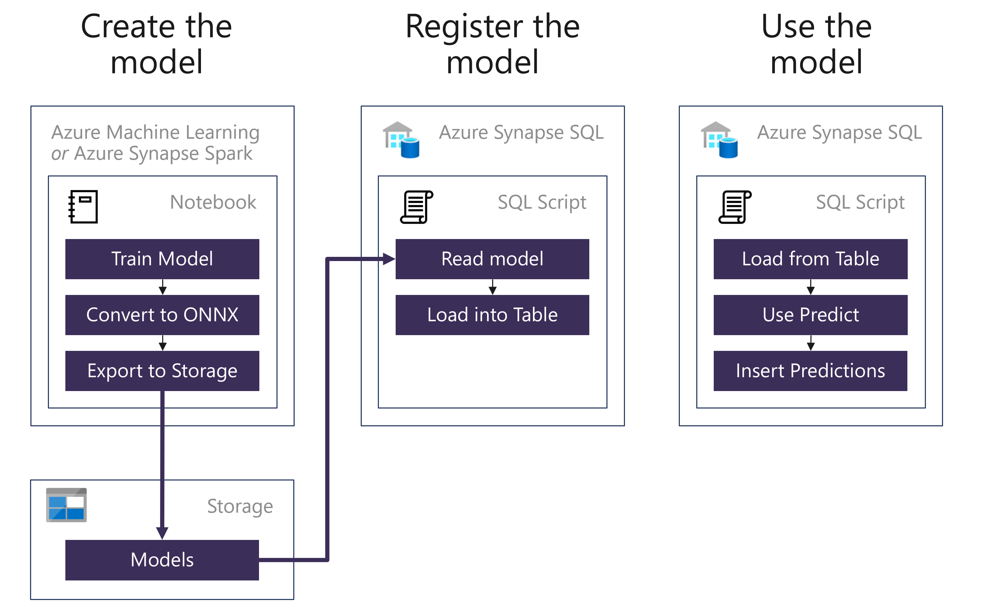
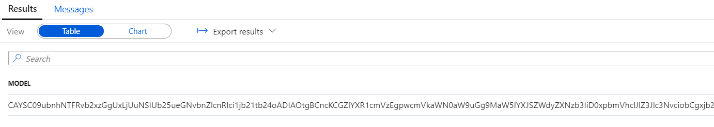

# Machine Learning

Azure Synapse Analytics provides a unified environment for both data science and data engineering. What this means in practice, is that your data scientists can train and deploy models using Azure Synapse Analytics and your data engineers can write T-SQL queries that use those models to make predictions against tabular data stored in a SQL Pool database table.

In this lab, you will create several machine learning models and use them to make predictions using the T-SQL `Predict` statement.

For context, the following are the high level steps taken to create a Spark ML based model and deploy it so it is ready for use from T-SQL.



All of the steps are performed within your Azure Synapse Analytics Studio.

- Within a notebook, a data scientist will:

  a. Train a model using Spark ML, the machine learning library included with Apache Spark. Models can also be trained using other approaches, including by using Azure Machine Learning automated ML. The main requirement is that the model format must be supported by ONNX.

  b. Convert the model to the ONNX format using the `onnxml` tools.

  c. Save a hexadecimal encoded version of the ONNX model to a table in the SQL Pool database. This is an interim step while this feature is in preview.

- To use the model for making predictions, in a SQL Script a data engineer will:

  a. Read the model into a binary variable by querying it from the table in which it was stored.

  b. Execute a query using the `FROM PREDICT` statement as you would a table. This statement defines both the model to use and the query to execute that will provide the data used for prediction. You can then take these predictions and insert them into a table for use by downstream analytics applications.

> What is ONNX? [ONNX](https://onnx.ai/) is an acronym for the Open Neural Network eXchange and is an open format built to represent machine learning models, regardless of what frameworks were used to create the model. This enables model portability, as models in the ONNX format can be run using a wide variety of frameworks, tools, runtimes and platforms. Think of it like a universal file format for machine learning models.

## Exercise 1 - Training models

Open the `Lab 06 - Machine Learning` notebook (located in the `Develop` hub, under `Notebooks` in Synapse Studio) and run it step by step to complete this exercise. Some of the most important tasks you will perform are:

- Exploratory data analysis (basic stats)
- Use PCA for dimensionality reduction
- Train ensemble of trees classifier (using XGBoost)
- Train classifier using Auto ML

Please note that each of these tasks will be addressed through several cells in the notebook.

## Exercise 2 - Registering and using models in Synapse Analytics

### Task 1 - Registering the models with Azure Synapse Analytics

In this task, you will explore the model registration process in Azure Synapse Analytics that enables trained model for use from T-SQL. This task picks up where you left off, with the ONNX model being made available in Azure Storage.

1. One step that is not shown by the notebook is an offline step that converts the ONNX model to hexadecimal. The resulting hex encoded model is also upload to Azure Storage. This conversion is currently performed with [this PowerShell script](../artifacts/day-03/lab-06-machine-learning/convert-to-hex.ps1), but could be automated using any scripting platform.

2. Open Synapse Analytics Studio, and then navigate to the `Data` hub.

3. Expand the Databases listing, right click your SQL Pool and then select `New SQL Script`, and then `Empty script`.

   

4. Replace the contents of this script with following:

    ```sql
    SELECT
        *
    FROM
        [wwi_ml].[MLModelExt]
    ```

    The result shows your persisted ONNX model in hexadecimal format:

    

5. `MLModelExt` is an external table that maps to the data lake location where the trained model was persisted (and then converted to hexadecimal format). Take a moment to read through the code that was used to create the external table (you don't need to run this code as it was already run during the deployment of your environment):

    ``` sql
    CREATE MASTER KEY
    GO

    -- Replace <data_lake_account_key> with the key of the primary data lake account

    CREATE DATABASE SCOPED CREDENTIAL StorageCredential
    WITH
    IDENTITY = 'SHARED ACCESS SIGNATURE'
    ,SECRET = '<data_lake_account_key>'

    -- Create an external data source with CREDENTIAL option.
    -- Replace <data_lake_account_name> with the actual name of the primary data lake account

    CREATE EXTERNAL DATA SOURCE ModelStorage
    WITH
    ( 
        LOCATION = 'wasbs://wwi-02@<data_lake_account_name>.blob.core.windows.net'
        ,CREDENTIAL = StorageCredential
        ,TYPE = HADOOP
    )

    CREATE EXTERNAL FILE FORMAT csv
    WITH (
        FORMAT_TYPE = DELIMITEDTEXT,
        FORMAT_OPTIONS (
            FIELD_TERMINATOR = ',',
            STRING_DELIMITER = '',
            DATE_FORMAT = '',
            USE_TYPE_DEFAULT = False
        )
    );

    CREATE EXTERNAL TABLE [wwi_ml].[MLModelExt]
    (
    [Model] [varbinary](max) NULL
    )
    WITH
    (
        LOCATION='/ml/onnx-hex' ,
        DATA_SOURCE = ModelStorage ,
        FILE_FORMAT = csv ,
        REJECT_TYPE = VALUE ,
        REJECT_VALUE = 0
    )
    GO

    CREATE TABLE [wwi_ml].[MLModel]
    (
        [Id] [int] IDENTITY(1,1) NOT NULL,
        [Model] [varbinary](max) NULL,
        [Description] [varchar](200) NULL
    )
    WITH
    (
        DISTRIBUTION = REPLICATE,
        HEAP
    )
    GO
    ```

6. Import the persisted ONNX model in hexadecimal format into the main models table (to be later used with the `PREDICT` function):

    ```sql
    -- Register the model by inserting it into the table.

    INSERT INTO
        [wwi_ml].[MLModel]
    SELECT
        Model, 'Product Seasonality Classifier'
    FROM
        [wwi_ml].[MLModelExt]
    ```

## Task 2 - Making predictions with the registered models

In this task, you will author a T-SQL query that uses the previously trained model to make predictions.

1. Open Synapse Analytics Studio, and then navigate to the `Data` hub.

2. Expand the Databases listing, right click your SQL Pool and then select `New SQL Script`, and then `Empty script`.

   

3. Replace the contents of this script with following:

    ```sql
    SELECT TOP 100
        *
    FROM
        [wwi_ml].[ProductPCA]
    WHERE
        ProductId > 4500
    ```

    This is the input data you will use to make the predictions.

    >**NOTE**:
    > Due to capacity constraints limiting the number of environments that can be whitelisted to use the `PREDICT` function, the final three steps in this exercise cannot be executed. They are provided below to help you understand the use of the `PREDICT` function in T-SQL.
    >

4. Select **Run** from the menubar.

   

5. Create another new SQL script and replace the contents with the following:

   ```sql
   -- Retrieve the latest hex encoded ONNX model from the table
   DECLARE @model varbinary(max) = (SELECT Model FROM [wwi_ml].[MLModel] WHERE Id = (SELECT Top(1) max(ID) FROM [wwi_ml].[MLModel]));

   -- Run a prediction query
   SELECT d.*, p.*
   FROM PREDICT(MODEL = @model, DATA = [wwi_ml].[ProductPCA] AS d) WITH (prediction real) AS p;
   ```

6. Run the script and view the results, notice that the `Prediction` column is the model's prediction of the `Seasonality` property of each product.

   
