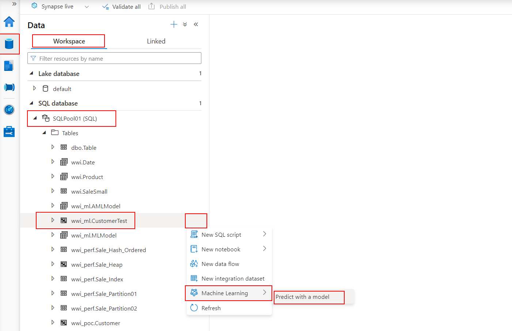
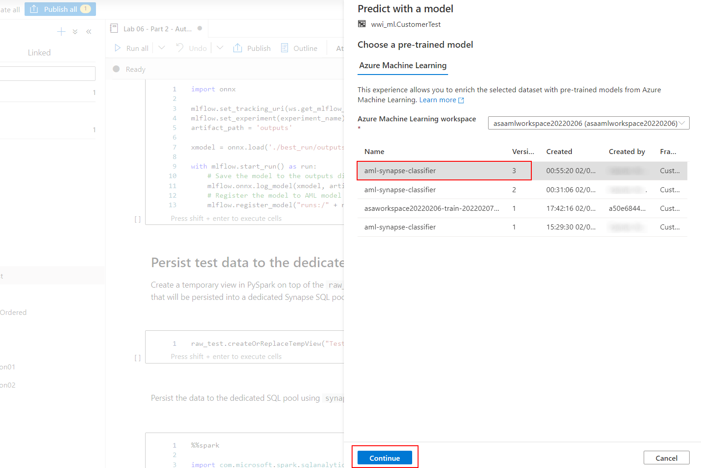
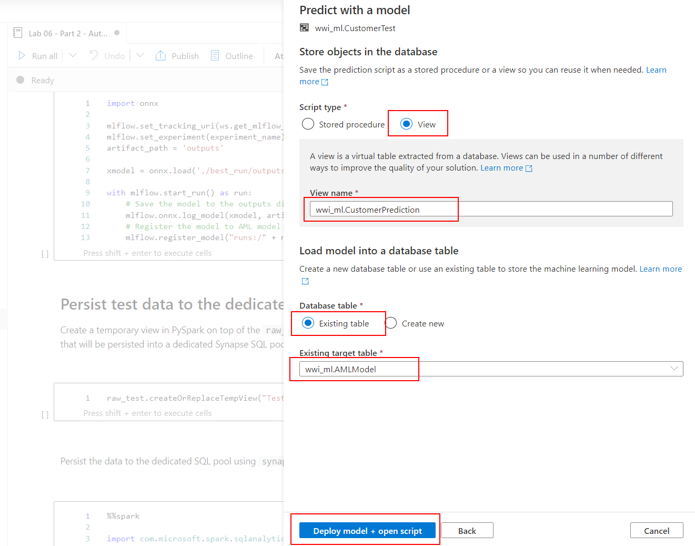
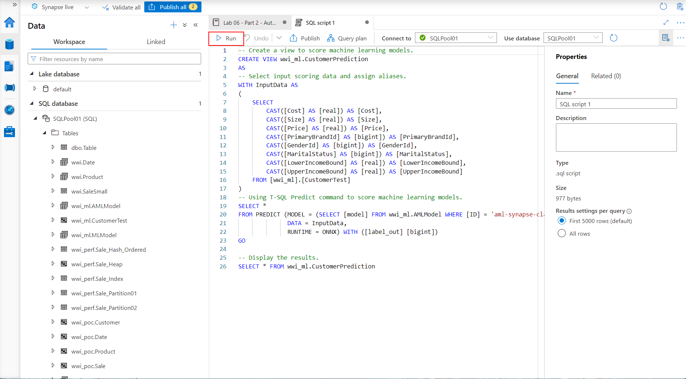
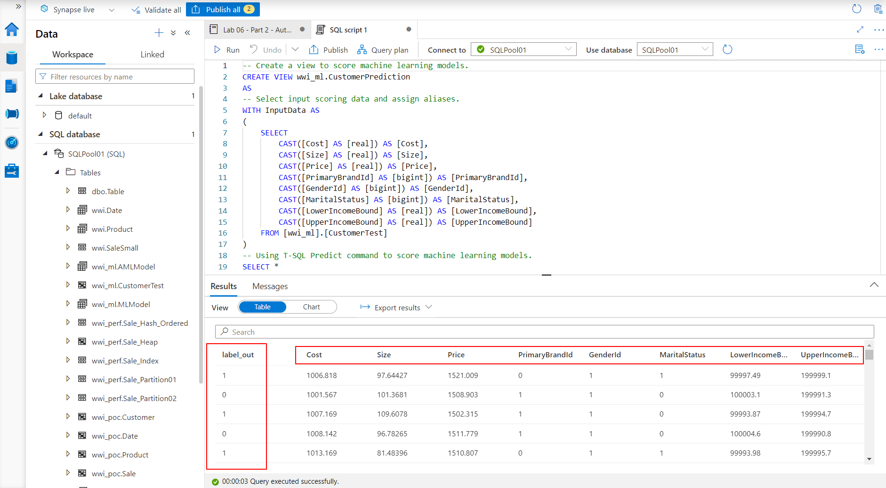

# Machine Learning

## Lab pre-requisite

Start the SQL Pool in your lab environment.

1. Open the Synapse Studio workspace and navigate to the **Manage** hub.

    

2. From the center menu, select **SQL pools** from beneath the **Analytics pools** heading. Locate `SQLPool01`, and select the **Resume** button.

    

## Lab overview

Azure Synapse Analytics provides a unified environment for both data science and data engineering. What this means in practice, is that your data scientists can train and deploy models using Azure Synapse Analytics and your data engineers can write T-SQL queries that use those models to make predictions against tabular data stored in a SQL Pool database table.

In this lab, you will create several machine learning models using AutoML with Spark compute and Spark libraries like Synapse Machine Learning (Synapse ML). You will also experience the integration between Synapse ML and Cognitive Services. Finally, you will use one of the models registered in Azure Machine Learning to make predictions using the T-SQL `Predict` statement.

For context, the following are the high level steps taken to create a Spark ML based model and deploy it so it is ready for use from T-SQL.

All of the steps are performed within Synapse Studio.

- Within a notebook, a data scientist will:

  a. Train a model using Synapse ML, the machine learning library included with Apache Spark. Models can also be trained using other approaches, including by using Azure Machine Learning Automated ML. The main requirement is that the model format must be supported by ONNX.

  b. Deploy the ONNX model to a table in the SQL Pool database using Synapse Studio.

- To use the model for making predictions, in a SQL Script a data engineer will:

  a. Read the model into a binary variable by querying it from the table in which it was stored.

  b. Execute a query using the `FROM PREDICT` statement as you would a table. This statement defines both the model to use and the query to execute that will provide the data used for prediction. You can then take these predictions and insert them into a table for use by downstream analytics applications.

> What is ONNX? [ONNX](https://onnx.ai/) is an acronym for the Open Neural Network eXchange and is an open format built to represent machine learning models, regardless of what frameworks were used to create the model. This enables model portability, as models in the ONNX format can be run using a wide variety of frameworks, tools, runtimes and platforms. Think of it like a universal file format for machine learning models.

## Exercise 1 - Synapse Machine Learning in action

Open the `Lab 06 - Part 1 - Synapse ML` notebook (located in the `Develop` hub, under `Notebooks` in Synapse Studio) and run it step by step to complete this exercise. Some of the most important tasks you will perform are:

- Install Synapse ML in a Spark session
- Use Synapse ML to perform Entity Recognition with Cognitive Services
- Prepare and analyze data
- Train classifier using Synapse ML and LightGBMClassifier
- Perform predictions and analyze classifier performance

Please note that each of these tasks will be addressed through several cells in the notebook.

## Exercise 2 - Training and registering models with AutoML

Open the `Lab 06 - Part 2 - AutoML with Spark` notebook (located in the `Develop` hub, under `Notebooks` in Synapse Studio) and run it step by step to complete this exercise. Some of the most important tasks you will perform are:

- Use Azure Machine Learning AutoML with Synapse Spark compute to train a classification model (the local Spark session of the notebook is used as a compute resource by AutoML)
- Register the ONNX version of the model in the AML model registry using MLFlow
- Persist test data to the dedicated Synapse SQL pool

Please note that each of these tasks will be addressed through several cells in the notebook.

## Exercise 3 - Using registered models in Synapse Analytics

>**NOTE**:
>
>Successfully completing Exercise 2 is a prerequisite for this exercise.

In this exercise you will use the model registered in Exercise 2 to perform predictions using the AML integration features of Synapse Studio.

1. In Synapse Studio, select the `Data` hub, `Workspace` section, `SQLPool01` SQL database, and locate the `wwi_ml.CustomerTest` table (the one created at the end of Exercise 2).

2. Select the context menu of the table and then select `Machine Learning` -> `Predict with a model`.

    

3. In the `Choose a pre-trained model` dialog, select the highest version of the model named `aml-synapse-classifier` and then select `Continue`.

    

4. Leave the column mappings unchanged and select `Continue`.

    >**NOTE**:
    >
    >The model schema generated with MLFlow and used to register the model enables Synapse Studio to suggest the mappings.

    

5. In the `Store objects in the database` dialog, select the following:

    - Script type: View
    - View name: enter `wwi_ml.CustomerPrediction`
    - Database table: Existing table
    - Existing target table: select the `wwi_ml.AMLModel` table

    Select `Deploy model + open script` to continue. Synapse Studio will deploy the model into the `AMLModel` table and create SQL scoring script for you.

    

6. Run the generated SQL script.

    

7. Observe the results of the prediction.

    
