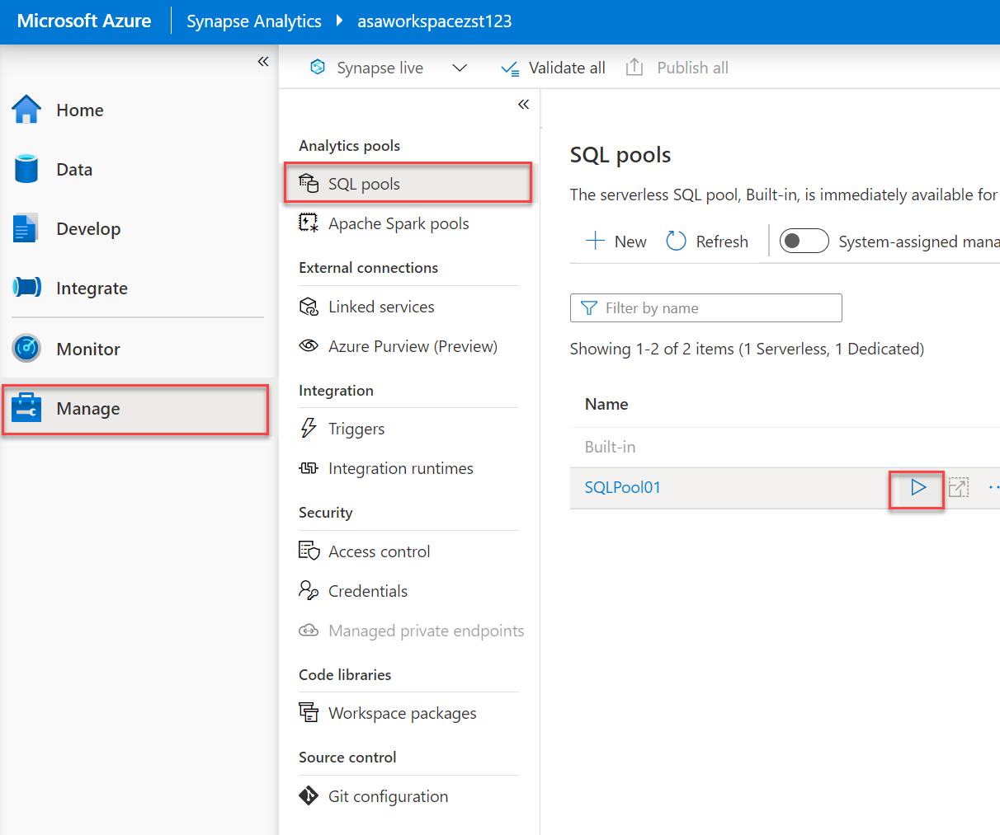

# Machine Learning with Spark

## Lab pre-requisite

Start the SQL Pool in your lab environment.

1. Open the Synapse Studio workspace and navigate to the **Manage** hub.

    

2. From the center menu, select **SQL pools** from beneath the **Analytics pools** heading. Locate `SQLPool01`, and select the **Resume** button.

    

## Exercise 1 - Training and batch scoring with a recommender

In this exercise you will train a model to recommend the top 5 products to users.

### Task 1 - Using the Spark ML ALS algorithm

In this task, you will train a recommender model using the ALS algorithm from Spark ML.

1. Open Synapse Analytics Studio, and then navigate to the `Develop` hub.

2. Under **Notebooks**, select the notebook called `Lab 07 - Spark ML `.

3. Read through the notebook and execute the cells as instructed in the notebook. When you have finished in the notebook, you have completed this lab.

## Cleanup: Pause the dedicated SQL pool

1. Navigate to the **Manage** hub.

    

2. From the center menu, select **SQL pools** from beneath the **Analytics pools** heading. Locate `SQLPool01`, and select the **Pause** button.

    

3. When prompted, select **Pause**.
