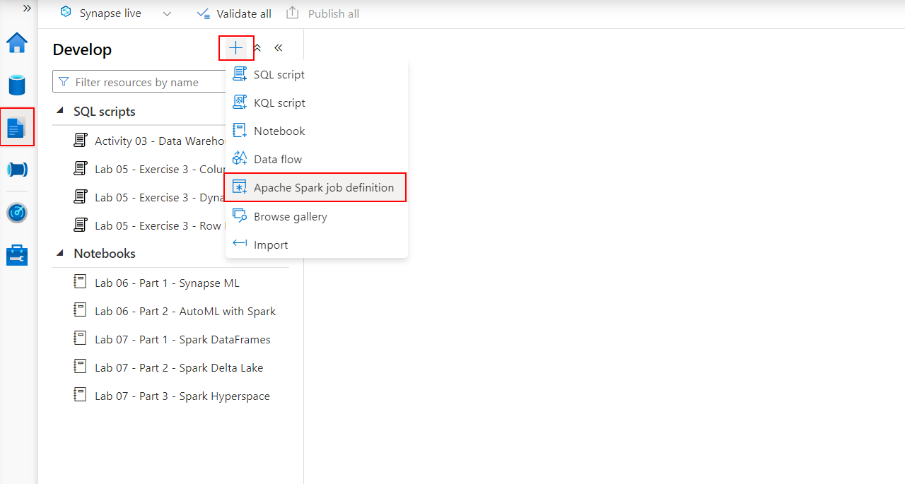
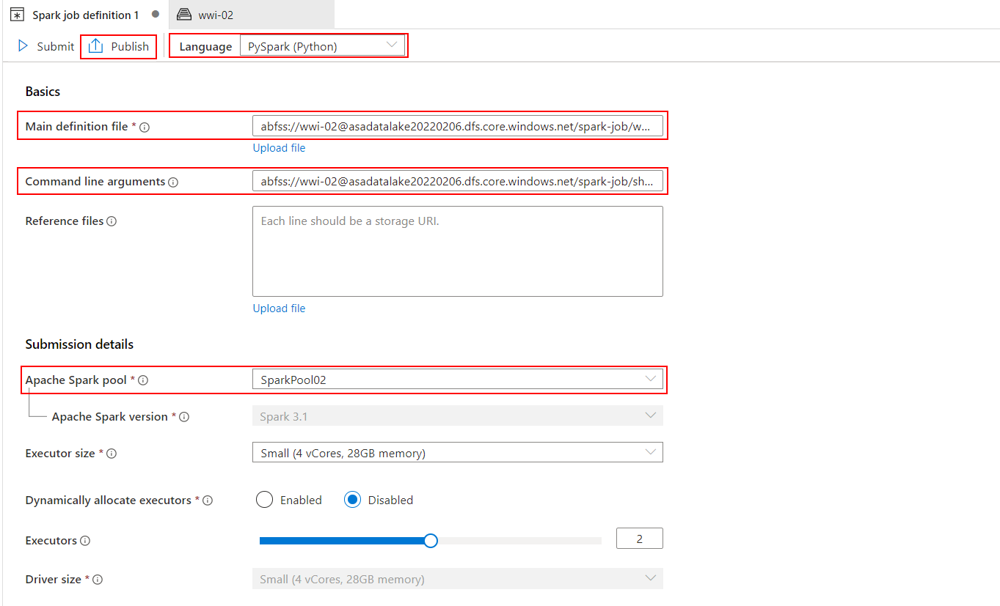
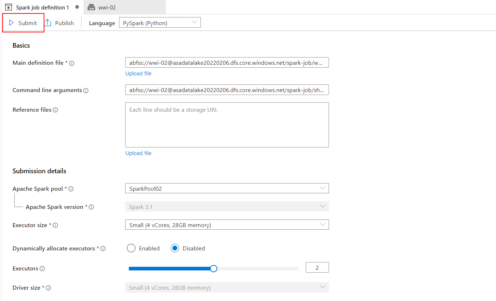
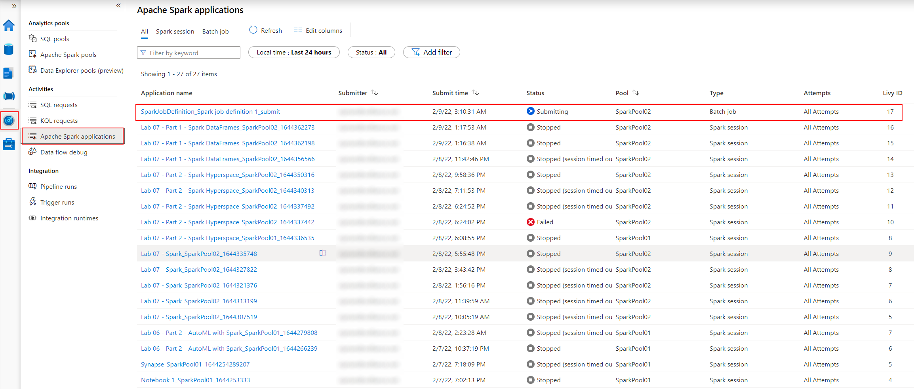
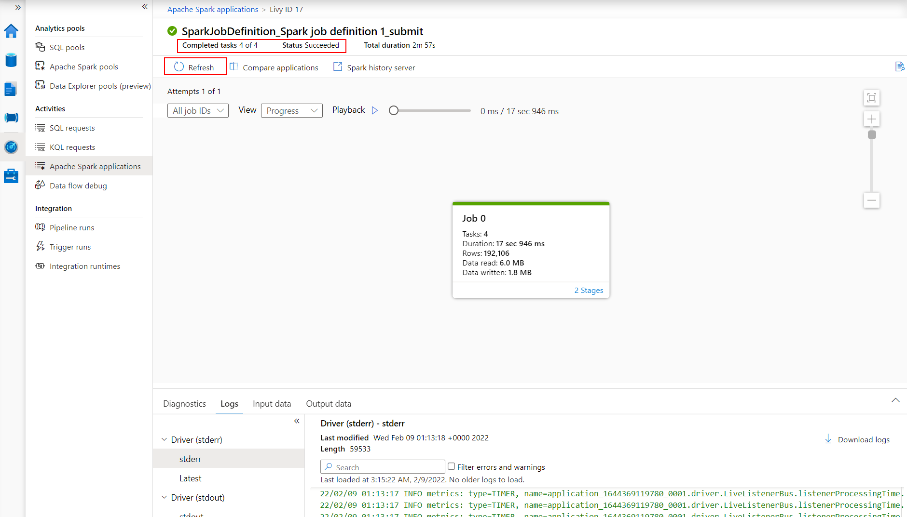

# Working with Synapse Spark

## Lab pre-requisite

Start the SQL Pool in your lab environment.

1. Open the Synapse Studio workspace and navigate to the **Manage** hub.

    

2. From the center menu, select **SQL pools** from beneath the **Analytics pools** heading. Locate `SQLPool01`, and select the **Resume** button.

    

## Exercise 1 - Working with Spark DataFrames in Synapse Spark

In this exercise you will learn how to work with Spark DataFrames in Synapse Spark, including:

- Working with schemas and lake databases
- Performing dataframe operations
- Working with dataframe partitions

1. Open Synapse Analytics Studio, and then navigate to the `Develop` hub.

2. Under **Notebooks**, select the notebook called `Lab 07 - Part 1 - Spark DataFrames`.

3. Read through the notebook and execute the cells as instructed in the notebook. When you have finished in the notebook, you have completed this lab.

>**IMPORTANT!**
>
>Once you complete the steps in the notebook, make sure you stop the Spark session when closing the notebook. This will free up the necessary compute resources to start the Spark sessions for the other exercises in this lab.

## Exercise 2 - Delta Lake features in Synapse Spark

In this exercise you will learn how to work with Delta Lake and `mssparkutils` in Synapse Spark.

1. Open Synapse Analytics Studio, and then navigate to the `Develop` hub.

2. Under **Notebooks**, select the notebook called `Lab 07 - Part 2 - Spark Delta Lake`.

3. Read through the notebook and execute the cells as instructed in the notebook. When you have finished in the notebook, you have completed this lab.

>**IMPORTANT!**
>
>Once you complete the steps in the notebook, make sure you stop the Spark session when closing the notebook. This will free up the necessary compute resources to start the Spark sessions for the other exercises in this lab.

## Exercise 3 - Indexing in Synapse Spark with Hyperspace

In this exercise you will learn how to work with Hyperspace in Synapse Spark.

1. Open Synapse Analytics Studio, and then navigate to the `Develop` hub.

2. Under **Notebooks**, select the notebook called `Lab 07 - Part 3 - Spark Hyperspace`.

3. Read through the notebook and execute the cells as instructed in the notebook. When you have finished in the notebook, you have completed this lab.

>**IMPORTANT!**
>
>Once you complete the steps in the notebook, make sure you stop the Spark session when closing the notebook. This will free up the necessary compute resources to start the Spark sessions for the other exercises in this lab.

## Exercise 4 - Working with Synapse Spark job definitions

In this exercise you will learn how to create and run a Spark job in Synapse Spark. The job will perform the task of counting the words in a text file stored in the Synapse workspace data lake storage.

1. Open Synapse Analytics Studio, and then navigate to the `Develop` hub.

2. Select `+` and then select `Apache Spark job definition` to initiate the creation of a new Spark job.

    

3. In the Spark job definition form, fill in the following properties:

    - Language: `PySpark (Python)`
    - Main definition file: `abfss://wwi-02@<your_data_lake_account_name>.dfs.core.windows.net/spark-job/wordcount.py` (where `<your_data_lake_account_name>` is the name of the Synapse workspace data lake account configured in your environment)
    - Command line arguments: `abfss://wwi-02@<your_data_lake_account_name>.dfs.core.windows.net/spark-job/shakespeare.txt abfss://wwi-02@<your_data_lake_account_name>.dfs.core.windows.net/spark-job/result` (where `<your_data_lake_account_name>` is the name of the Synapse workspace data lake account configured in your environment)
    - Apake Spark pool: `SparkPool02`

    Once all the properties mentioned above are filled in, select `Publish` to publish the new Spark job.

    

4. When the publishing is finished, select `Submit` to start the new Spark job.

    

5. Navigate to the `Monitor` hub and select the `Apache Spark applications` section. Identify the Spark application corresponding to your Spark job.

    

6. Select the Spark application corresponding to your job and wait until it finishes (you might need to select `Refresh` every minute or so to update the status).

    

7. Once the Spark job finishes successfully, check the `/spark-job/result` folder located in the `wwi-02` container on the Synapse workspace data lake storage account. The files in the folder are text files containing the word counting results.

## Cleanup: Pause the dedicated SQL pool

1. Navigate to the **Manage** hub.

    

2. From the center menu, select **SQL pools** from beneath the **Analytics pools** heading. Locate `SQLPool01`, and select the **Pause** button.

    

3. When prompted, select **Pause**.
