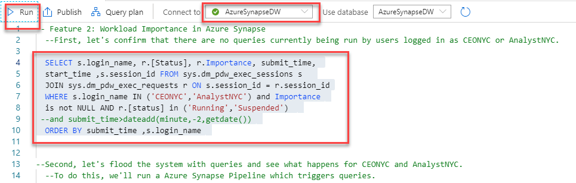
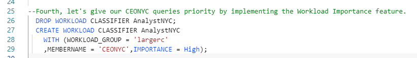
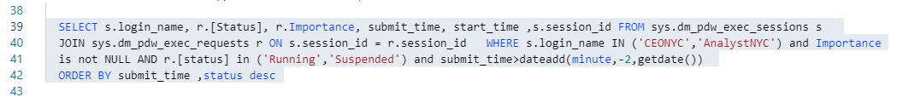
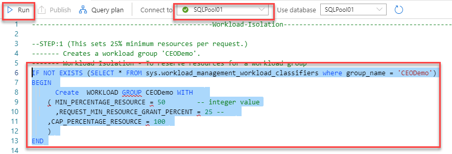
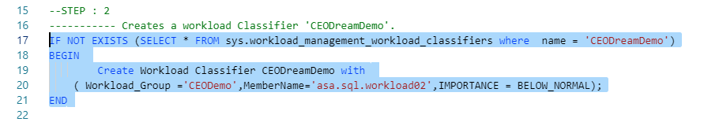
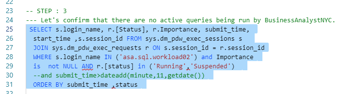
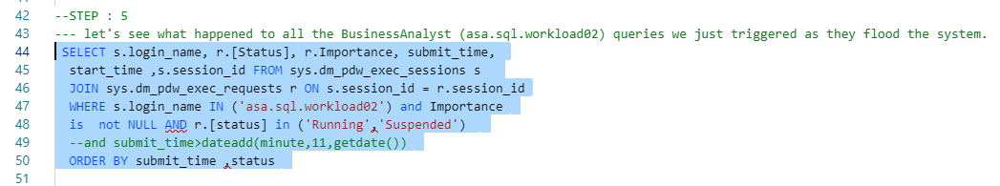
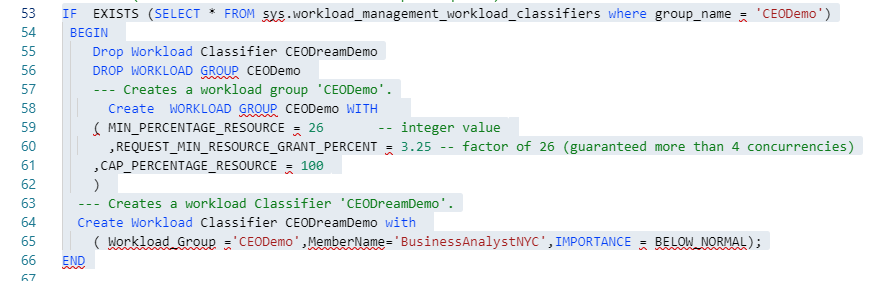
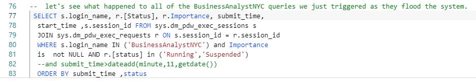
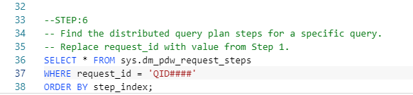

# Monitoring

Azure Synapse Analytics provides a rich monitoring experience within the Azure portal to surface insights regarding your data warehouse workload. The Azure portal is the recommended tool when monitoring your data warehouse as it provides configurable retention periods, alerts, recommendations, and customizable charts and dashboards for metrics and logs. The portal also enables you to integrate with other Azure monitoring services such as Azure Monitor (logs) with Log analytics to provide a holistic monitoring experience for not only your data warehouse but also your entire Azure analytics platform for an integrated monitoring experience. 

You can monitor active SQL requests using the SQL requests area of the Monitor Hub. This includes details like the pool, submitter, duration, queued duration, workload group assigned, importance and the request content.

Pipeline runs can be monitored using the Monitor Hub and selecting Pipeline runs. Here you can filter pipeline runs and drill in to view the activity runs associated with the pipeline run and monitor the running of in-progress pipelines.

The execution of Spark applications representing the execution of notebooks and jobs can be monitored within the Monitor Hub, selecting Spark applications. Selecting a Spark application to view its progress and to launch the Spark UI to examine a running Spark job and stage details, or the Spark history server to examine a completed application.

- [Exercise 1 - Workload Management](#exercise-1---workload-management)
  - [Task 1 - Workload Importance](#task-1---workload-importance)
  - [Task 2 - Workload Isolation](#task-2---workload-isolation)
- [Exercise 2 - Workload Monitoring](#exercise-2---workload-monitoring)
  - [Task 1 - Monitoring with Dynamic Management Views](#task-1---monitoring-with-dynamic-management-views)

## Exercise 1 - Workload Management

Running mixed workloads can pose resource challenges on busy systems. Solution Architects seek ways to separate classic data warehousing activities (such as loading, transforming and querying data) to ensure that enough resources exist to hit SLAs.

Synapse SQL pool workload management in Azure Synapse consists of three high-level concepts: Workload Classification, Workload Importance and Workload Isolation. These capabilities give you more control over how your workload utilizes system resources.

Workload importance influences the order in which a request gets access to resources. On a busy system, a request with higher importance has first access to resources. Importance can also ensure ordered access to locks.

Workload isolation reserves resources for a workload group. Resources reserved in a workload group are held exclusively for that workload group to ensure execution. Workload groups also allow you to define the amount of resources that are assigned per request, much like resource classes do. Workload groups give you the ability to reserve or cap the amount of resources a set of requests can consume. Finally, workload groups are a mechanism to apply rules, such as query timeout, to requests.

## Task 1 - Workload Importance

Often in a data warehouse scenario you have users who need their queries to run quickly. The user could be executives of the company who need to run reports or the user could be an analyst running an adhoc query. 

Setting importance in Synapse SQL for Azure Synapse allows you to influence the scheduling of queries. Queries with higher importance will be scheduled to run before queries with lower importance. To assign importance to queries, you need to create a workload classifier.

1. Open Synapse Analytics Studio, and then navigate to the `Develop` hub. Then open `Lab 08 - Exercise 1 - WorkLoad Importance` from the list of SQL Scripts. 

2. Select `SQLPool01` under `Connect To` and highlight the first SQL Command shown below. Select `Run` to confirm that there are no queries currently being run by users logged in as `asa.sql.workload01` represeting the CEO of the organization or `asa.sql.workload02` representing the data analyst working on the project.

3. You will flood the system with queries and see what happens for `asa.sql.workload01` and `asa.sql.workload02`. To do this, we'll run a Azure Synapse Pipeline which triggers queries. Select the `Orchestrate` Tab. **Run** `ExecuteDataAnalystAndCEOQueries` Pipeline, which will run / trigger the `asa.sql.workload01` and `asa.sql.workload02` queries.

4. Let's see what happened to all the queries we just triggered as they flood the system. **Select** the SQL Command between lines #18-21 and run the query.

5. We will give our `asa.sql.workload01` user queries priority by implementing the **Workload Importance** feature. In order to do that, **select** the SQL Command between lines #24-27 and run the query.

6. Let's flood the system again with queries and see what happens this time for `asa.sql.workload01` and `asa.sql.workload02` queries. To do this, we'll run a Azure Synapse Pipeline which triggers queries. **Select** the `Orchestrate` Tab, **run** `ExecuteDataAnalystAndCEOQueries` Pipeline, which will run / trigger the `asa.sql.workload01` and `asa.sql.workload02` queries. 

7. Run the SQL Command between lines #37-40 to see what happens to the `asa.sql.workload01` queries this time.

## Task 2 - Workload Isolation

Workload isolation means resources are reserved, exclusively, for a workload group. Workload groups are containers for a set of requests and are the basis for how workload management, including workload isolation, is configured on a system. A simple workload management configuration can manage data loads and user queries. 

In the absence of workload isolation, requests operate in the shared pool of resources. Access to resources in the shared pool is not guaranteed and is assigned on an importance basis.

Configuring workload isolation should be done with caution as the resources are allocated to the workload group even if there are no active requests in the workload group. Over-configuring isolation can lead to diminished overall system utilization.

Users should avoid a workload management solution that configures 100% workload isolation: 100% isolation is achieved when the sum of `min_percentage_resource` configured across all workload groups equals 100%. This type of configuration is overly restrictive and rigid, leaving little room for resource requests that are accidentally mis-classified. There is a provision to allow one request to execute from workload groups not configured for isolation.

1. Open Synapse Analytics Studio, and then navigate to the `Develop` hub. Then open `Lab 08 - Exercise 2 - Workload Isolation` from the list of SQL Scripts. 

2. Select `SQLPool01` under `Connect To` and highlight the first SQL Command shown below. 

The code creates a workload group called `CEODemo` to reserve resources exclusively for the workload group. In this example, a workload group with a `MIN_PERCENTAGE_RESOURCE` set to 50% and `REQUEST_MIN_RESOURCE_GRANT_PERCENT` set to 25% is guaranteed 2 concurrency.

3. **select** the SQL Command between lines #17-21 and **run** the query to create a workload Classifier called `CEODreamDemo` that would assigning a workload group and importance to incoming requests.

4. Let's confirm that there are no active queries being run by `BusinessAnalystNYC`.  **select** the SQL Command between lines #25-31 and **run**.

5. Let's flood the system with queries and see what happens for `BusinessAnalystNYC`. To do this, we will run a Azure Synapse Pipeline which triggers queries. Select the `Orchestrate` Tab. **Run** `Execute BusinessAnalystNYC Script` Pipeline, which will run / trigger  `BusinessAnalystNYC` queries.

6. Let us see what happened to all the `BusinessAnalystNYC` queries we just triggered as they flood the system. **select** the SQL Command between lines #44-50 and **run**.

7. In this step, we will set 3.25% minimum resources per request. **select** the SQL Command between lines #53-66 and **run**.

> **Note**: Configuring workload containment implicitly defines a maximum level of concurrency. With a CAP_PERCENTAGE_RESOURCE set to 60% and a REQUEST_MIN_RESOURCE_GRANT_PERCENT set to 1%, up to a 60-concurrency level is allowed for the workload group. Consider the method included below for determining the maximum concurrency:
> 
> [Max Concurrency] = [CAP_PERCENTAGE_RESOURCE] / [REQUEST_MIN_RESOURCE_GRANT_PERCENT]

8. Let's flood the system again and see what happens for `BusinessAnalystNYC`. To do this, we will run a Azure Synapse Pipeline which triggers queries. Select the `Orchestrate` Tab. **Run** `Execute BusinessAnalystNYC Script` Pipeline, which will run / trigger  `BusinessAnalystNYC` queries.

9. Let's see what happened to all of the `BusinessAnalystNYC` queries we just triggered as they flood the system. **select** the SQL Command between lines #77-83 and **run**.

## Exercise 2 - Workload Monitoring

Azure Synapse Analytics provides a rich monitoring experience within the Azure portal to surface insights regarding your data warehouse workload. The Azure portal is the recommended tool when monitoring your data warehouse as it provides configurable retention periods, alerts, recommendations, and customizable charts and dashboards for metrics and logs. The portal also enables you to integrate with other Azure monitoring services such as Azure Monitor (logs) with Log analytics to provide a holistic monitoring experience for not only your data warehouse but also your entire Azure analytics platform for an integrated monitoring experience. 

For a programmatic experience when monitoring SQL Analytics via T-SQL, the service provides a set of Dynamic Management Views (DMVs). These views are useful when actively troubleshooting and identifying performance bottlenecks with your workload.

## Task 1 - Monitoring with Dynamic Management Views

All logins to your data warehouse are logged to `sys.dm_pdw_exec_sessions`. This DMV contains the last 10,000 logins. The `session_id` is the primary key and is assigned sequentially for each new logon.

1. Open Synapse Analytics Studio, and then navigate to the `Develop` hub. Then open `Lab 08 - Exercise 3 - Monitor Workload` from the list of SQL Scripts. 

2. Select `SQLPool01` under `Connect To` and highlight the first SQL Command shown below. Run it to see active connections.

All queries executed on SQL pool are logged to `sys.dm_pdw_exec_requests`. This DMV contains the last 10,000 queries executed. The `request_id` uniquely identifies each query and is the primary key for this DMV. The `request_id` is assigned sequentially for each new query and is prefixed with `QID`, which stands for query ID. Querying this DMV for a given `session_id` shows all queries for a given logon.

3. Let's flood the system with queries to create operations to monitor. To do this, we will run a Azure Synapse Pipeline which triggers queries. Select the `Orchestrate` Tab. **Run** `Execute BusinessAnalystNYC Script` Pipeline, which will run / trigger  `BusinessAnalystNYC` queries.

4. **select** the SQL Command between lines #7-11 and **run** the query and from the query results, note the `Request_ID` of the query that you would like to investigate. 

As an alternative you can run the SQL Command between lines #15-17 to find the top 10 longest running queries.

5. To simplify the lookup of a query in the `sys.dm_pdw_exec_requests` table, use `LABEL` to assign a comment to your query, which can be looked up in the `sys.dm_pdw_exec_requests` view. To test labels **select** the SQL Command between lines #21-24 and **run** the query with the label `My Query`.

6. **select** the SQL Command between lines #29-31 and **run** the query filtering with result with the label `My Query`.

7. **Replace** the `QID#####` with the `Request_ID` you noted in Step 4. **select** the SQL Command between lines #36-38 and run it to retrieve the query's distributed SQL (DSQL) plan from `sys.dm_pdw_request_steps`.

When a DSQL plan is taking longer than expected, the cause can be a complex plan with many DSQL steps or just one step taking a long time. If the plan is many steps with several move operations, consider optimizing your table distributions to reduce data movement. 

## Resources

- [Workload Group Isolation (Preview)](https://docs.microsoft.com/en-us/azure/synapse-analytics/sql-data-warehouse/sql-data-warehouse-workload-isolation)
- [Workload Isolation](https://docs.microsoft.com/en-us/azure/synapse-analytics/sql-data-warehouse/sql-data-warehouse-workload-isolation)
- [Workload Importance](https://docs.microsoft.com/en-us/azure/synapse-analytics/sql-data-warehouse/sql-data-warehouse-workload-importance)
- [Workload Classification](https://docs.microsoft.com/en-us/azure/synapse-analytics/sql-data-warehouse/sql-data-warehouse-workload-classification)
- [Monitoring workload using DMVs](https://docs.microsoft.com/en-us/azure/synapse-analytics/sql-data-warehouse/sql-data-warehouse-manage-monitor)