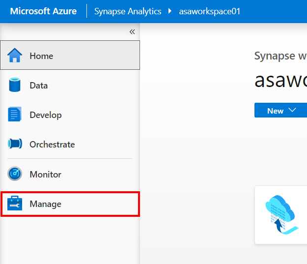
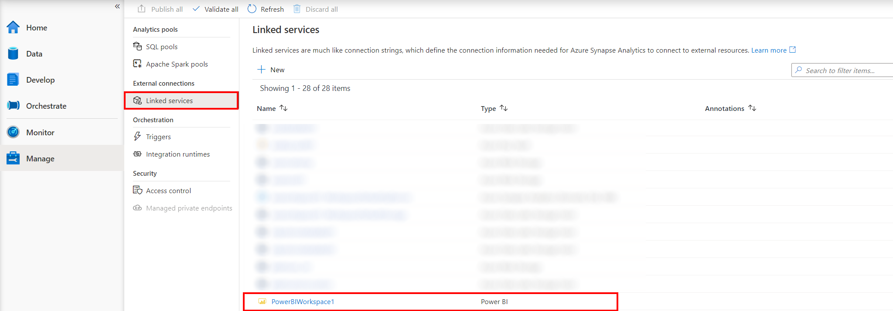
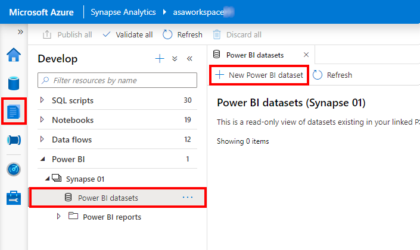
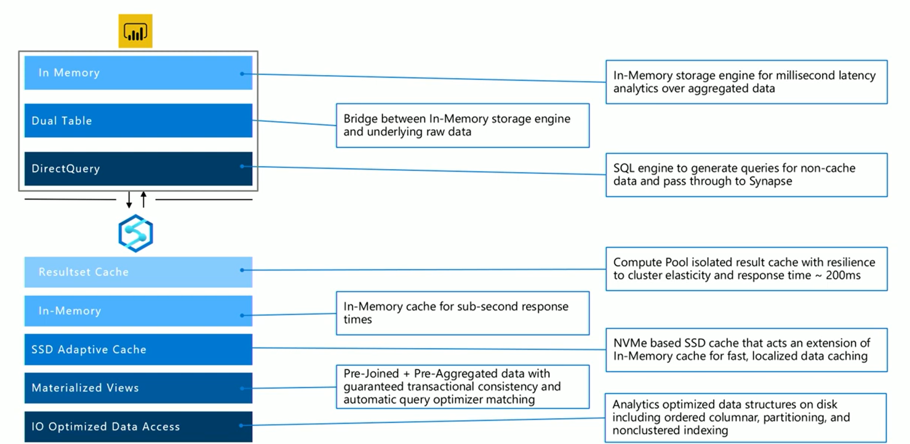

# Power BI in Synapse Analytics

## Resource naming throughout this lab

For the remainder of this guide, the following terms will be used for various ASA-related resources (make sure you replace them with actual names and values):

| Azure Synapse Analytics Resource  | To be referred to |
| --- | --- |
| Workspace resource group | `WorkspaceResourceGroup` |
| Workspace / workspace name | `Workspace` |
| Power BI workspace name | `PowerBIWorkspace` |
| Primary Storage Account | `PrimaryStorage` |
| Default file system container | `DefaultFileSystem` |
| SQL Pool | `SqlPool01` |
| Lab schema name | `_poc_` |

## Exercise 1 - Power BI and Synapse workspace integration

### Task 1 - Explore the Power BI linked service in Synapse Studio

1. Start from  [**Azure Synapse Studio**](<https://web.azuresynapse.net/>) and open the **Manage** hub from the left menu.


2. Beneath **External Connections**, select **Linked Services**, observe that a Linked Service pointing to a precreated Power BI workspace has already been configured in the environment.



Once your Azure Synapse and Power BI workspaces are linked, you can browse your Power BI datasets, edit/create new Power BI Reports directly from the Synapse Studio.

3. In  [**Azure Synapse Studio**](<https://web.azuresynapse.net/>) and navigate to the **Develop** hub using the left menu option.
   


4. Under **Power BI**, select the linked workspace (**Synapse 01** in the picture bellow) and observe that you have now access to your Power BI datasets and reports, directly from the Synapse Studio.


New reports can be created by selecting **+** at the top of the **Develop** tab. Existing reports can be edited by selecting the report name. Any saved changes will be written back to the Power BI workspace.
Next, let's explore the linked workspace in Power BI Portal

5. Sign in to the  [**Power BI Portal**](<https://app.powerbi.com/>) and select **Workspaces** from the left menu to check the existence of the Power BI workspace you have configured in the Synapse portal.


TODO: Architectural diagram of integration

### Task 4 - Create a new datasource with Power BI Desktop

1. In [**Azure Synapse Studio**](<https://web.azuresynapse.net/>), select **Develop** from the left menu.

2. Beneath **Power BI**, under the linked Power BI workspace, select **Power BI datasets**.

3. Select **New Power BI dataset** from the top actions menu.



4. Select **Start** and make sure you have Power BI Desktop installed on your environment machine.


5. Next, select **SQLPool01** as the data source for your Power BI report. You'll be able to select tables from this pool when creating your dataset.


6. Select **Download** to save the **01SQLPool01.pbids** file on your local drive and then select **Continue**.
 


7. Select **Close and refresh** to close the publishing dialog.


### Task 5 - Create a new Power BI report in Synapse Studio

1. In [**Azure Synapse Studio**](<https://web.azuresynapse.net/>), select **Develop** from the left menu. Select **+** to create a new SQL Script. Execute the following query to get an approximation of its execution time. This will be the query we'll use to bring data in the Power BI report you'll build later in this exercise.
   
```sql
SELECT count(*) FROM
(
    SELECT
        FS.CustomerID
        ,P.Seasonality
        ,D.Year
        ,D.Quarter
        ,D.Month
        ,avg(FS.TotalAmount) as AvgTotalAmount
        ,avg(FS.ProfitAmount) as AvgProfitAmount
        ,sum(FS.TotalAmount) as TotalAmount
        ,sum(FS.ProfitAmount) as ProfitAmount
    FROM
            wwi.SaleSmall FS
            JOIN wwi_poc.Product P ON P.ProductId = FS.ProductId
            JOIN wwi_poc.Date D ON FS.TransactionDateId = D.DateId
    GROUP BY
        FS.CustomerID
        ,P.Seasonality
        ,D.Year
        ,D.Quarter
        ,D.Month
) T
 ```

2. To connect to your datasource, open the downloaded .pbids file  in Power BI Desktop. Select the **Microsoft account** option on the left, **Sign in** (with the provided credentials for connecting to the Synapse workspace) and click **Connect**.
   


3. In the Navigator dialog, just select for now the `wwi_pbi.Customer` and  `wwi.SaleSmall` tables, since next we'll replace this option with the query we built earlier, on the first step of this exercise. Next, click on **Transform data**.


4. Select the **Direct Query** option in the connection settings dialog, since our intention is not to bring a copy of the data into Power BI, but to be able to query the datasource while working with the report visualizations. Click **OK** and wait a few seconds while the connection is configured.


5. In the editor, first select the wwi.SalesSmall table, then open the settings page of the first step in the query. Expand the **Advanced options** section, paste the following query and click **OK**. 
   
```sql
SELECT count(*) FROM
(
    SELECT
        FS.CustomerID
        ,P.Seasonality
        ,D.Year
        ,D.Quarter
        ,D.Month
        ,avg(FS.TotalAmount) as AvgTotalAmount
        ,avg(FS.ProfitAmount) as AvgProfitAmount
        ,sum(FS.TotalAmount) as TotalAmount
        ,sum(FS.ProfitAmount) as ProfitAmount
    FROM
            wwi.SaleSmall FS
            JOIN wwi_poc.Product P ON P.ProductId = FS.ProductId
            JOIN wwi_poc.Date D ON FS.TransactionDateId = D.DateId
    GROUP BY
        FS.CustomerID
        ,P.Seasonality
        ,D.Year
        ,D.Quarter
        ,D.Month
) T
```


Note that this step will take at least 30-40 seconds to execute, since it submits the query on the Synapse pool configured connection.

6. Delete the second step in the applied steps, since it was initially querying the entire SalesSmall table. 
   


7. Select **Close & Apply** on the topmost left corner of the editor window to apply the query and fetch the initial schema in the Power BI designer window.


8. Back to the Power BI report editor, expand the **Visualizations** menu on the right, and drag a **Line and stacked column chart** on the report canvas.


9. Select the newly created chart to expand it's properties pane. Using the expanded **Fields** menu, configure the visualization as follows:
     - Shared axis: Year, Quarter
     - Column series: Seasonality
     - Column values: Toatalmount
     - Line values: ProfitAmount


10.  Switching back to the Azure Synapse Studio, you can check the query executed while configuring the visualization in the Power BI Desktop application. Open the **Monitor** hub, and under the **Activities** section, open the **SQL requests** monitor. Make sure you select **SQLPool01** in the Pool filter.
     


11. Identify the query behind your visualization in the topmost requests you see in the log and observe the duration which is about 30 seconds. Use the **Request content** option to look into the actual query submited from Power BI Desktop.


12.  Back to the Power BI Desktop application, Save and Publish the created report. Make sure that, in Power BI Desktop you are signed in  with the same account you use in the Power BI portal and in Azure Synapse. You can switch to the proper account from the right topmost corner of the window. In the **Publish to Power BI** dialog, select the workspace you linked to Synapse, named **Synapse 01** in our demonstration.
   


After the operation completes with success, you should be able to see this report published in the Power BI portal, as well as in the Synapse Studio, Develop hub, under the Power BI reports node.

## Exercise 2 - Optimizing integration with Power BI

### Task 1 - Explore Power BI optimization options

Let's recall the performance optimization options we have when integrating Power BI reports in Azure Synapse Analytics, among which we'll demonstrate the use of Result-set caching and materialzed views options later in this exercise.




### Task 2 - Improve performance with materialized views

1. In [**Azure Synapse Studio**](<https://web.azuresynapse.net/>), select **Develop** from the left menu. Select **+** to create a new SQL Script. Execute the following query to get an approximation of its execution time:

2. Run the following query to get an estimated execution plan and observe the total cost and number of operations.

```sql
EXPLAIN
SELECT * FROM
(
    SELECT
    FS.CustomerID
    ,P.Seasonality
    ,D.Year
    ,D.Quarter
    ,D.Month
    ,avg(FS.TotalAmount) as AvgTotalAmount
    ,avg(FS.ProfitAmount) as AvgProfitAmount
    ,sum(FS.TotalAmount) as TotalAmount
    ,sum(FS.ProfitAmount) as ProfitAmount
FROM
        wwi.SaleSmall FS
        JOIN wwi_poc.Product P ON P.ProductId = FS.ProductId
        JOIN wwi_poc.Date D ON FS.TransactionDateId = D.DateId
    GROUP BY
        FS.CustomerID
        ,P.Seasonality
        ,D.Year
        ,D.Quarter
        ,D.Month
) T
```

3. The results should look like this:

  ```xml
  <?xml version="1.0" encoding="utf-8"?>
  <dsql_query number_nodes="1" number_distributions="60" number_distributions_per_node="60">
    <sql>SELECT count(*) FROM
  (
      SELECT
      FS.CustomerID
      ,P.Seasonality
      ,D.Year
      ,D.Quarter
      ,D.Month
      ,avg(FS.TotalAmount) as AvgTotalAmount
      ,avg(FS.ProfitAmount) as AvgProfitAmount
      ,sum(FS.TotalAmount) as TotalAmount
      ,sum(FS.ProfitAmount) as ProfitAmount
  FROM
          wwi.SaleSmall FS
          JOIN wwi_poc.Product P ON P.ProductId = FS.ProductId
          JOIN wwi_poc.Date D ON FS.TransactionDateId = D.DateId
      GROUP BY
          FS.CustomerID
          ,P.Seasonality
          ,D.Year
          ,D.Quarter
          ,D.Month
  ) T</sql>
    <dsql_operations total_cost="10.61376" total_number_operations="12">
  ```

4. Create a materialized view that can support the above query:

  ```sql
  CREATE MATERIALIZED VIEW
  wwi_pbi.mvCustomerSales
  WITH
  (
      DISTRIBUTION = HASH( CustomerId )
  )
  AS
  SELECT
      FS.CustomerID
      ,P.Seasonality
      ,D.Year
      ,D.Quarter
      ,D.Month
      ,sum(FS.TotalAmount) as TotalAmount
      ,sum(FS.ProfitAmount) as ProfitAmount
  FROM
      wwi.SaleSmall FS
      JOIN wwi_poc.Product P ON P.ProductId = FS.ProductId
      JOIN wwi_poc.Date D ON FS.TransactionDateId = D.DateId
  GROUP BY
      FS.CustomerID
      ,P.Seasonality
      ,D.Year
      ,D.Quarter
      ,D.Month
  ```

5. Run the following query to get an estimated execution plan:

```sql
EXPLAIN
SELECT * FROM
(
  SELECT
  FS.CustomerID
  ,P.Seasonality
  ,D.Year
  ,D.Quarter
  ,D.Month
  ,avg(FS.TotalAmount) as AvgTotalAmount
  ,avg(FS.ProfitAmount) as AvgProfitAmount
  ,sum(FS.TotalAmount) as TotalAmount
  ,sum(FS.ProfitAmount) as ProfitAmount
  FROM
      wwi_pbi.SaleSmall FS
      JOIN wwi_pbi.Product P ON P.ProductId = FS.ProductId
      JOIN wwi_pbi.Date D ON FS.TransactionDateId = D.DateId
  GROUP BY
      FS.CustomerID
      ,P.Seasonality
      ,D.Year
      ,D.Quarter
      ,D.Month
  ) T

```


### Task 3 - Improve performance with result-set caching

-use report from exercise 1 with direct query
- take note of execution time and query plan
- activate result-set caching
- take note of improved execution time and query plan
  (lab 3 or 4 to check)