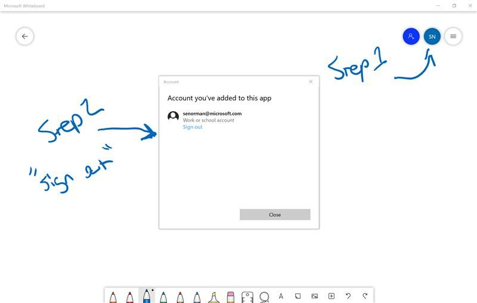

# Attendee Experience FAQ

### **Q**: _I'm on a Mac. Can I access the whiteboard?_

**A**: If you use the whiteboard link for your table group, you should be able to log in via the web experience that runs in the browser. In this experience, you will be unable to add text or move shapes but will be able to watch and draw with your mouse or touch input.

---

### **Q**: _I don’t see the whiteboard content when I log in_

**A**: You might be logged in with your personal account.

- Click the circular icon with your current login
- Click sign out
- Sign in with the cloud lab login using the "other work / school" option

---

### **Q**:  _Are there any materials related to the activities?_

**A**: For group activities with supplemental material, we have prepared a GitHub site with these resources: https://github.com/solliancenet/data-ai-technical-bootcamp.

---

### **Q**: _The performance of Azure Synapse looks terrible. Things are prolonged. The instruction says 2 min execution, but my runs are over 9 min! This is slowing down the progress with the labs! ADF operations on large files are timing out and can't continue!_

**A**: If you are executing your lab and experiencing challenges in any resource execution for the exercises or tasks, please note that during these Covid19 times, Azure capacity is optimized for our customer's end workloads. We realize that this may impact a bit of our performance today as some resources have had to be distributed across regions and DW resource types. Please note that our primary goal is NOT negatively to impact our customers, and we appreciate your patience during this training if we do face some performance challenges. 

If you come across performance challenges, please note this in the "Need help - Ask here" so we can keep track accordingly.

---

### **Q**: _Where can the participants find the answers to their whiteboarding session?_

**A**: The answers are available in the student guide at https://github.com/solliancenet/data-ai-technical-bootcamp.

---

### **Q**: _I don't see Azure Synapse Analytics Preview in my subscription._

**A**: The labs do not require your subscription. We have specially whitelisted preview functionality on our lab subscription while we are still in private preview. Stay tuned on public preview release timing and access updates through our global communities (ex: WW Data & AI CSAs) as more information is released throughout the month.

---

