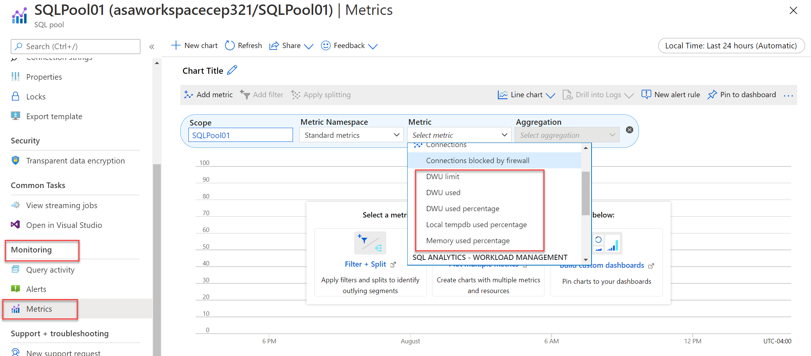
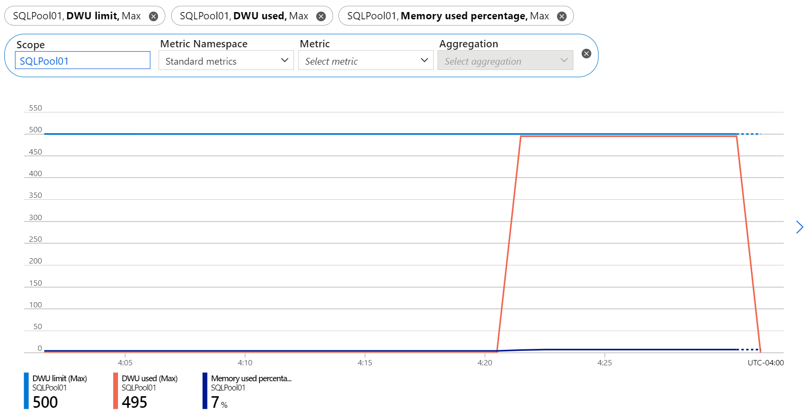
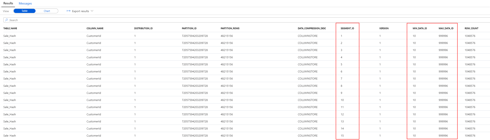
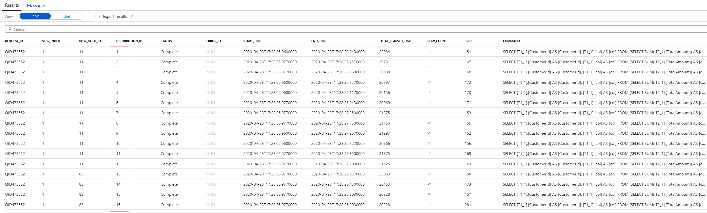
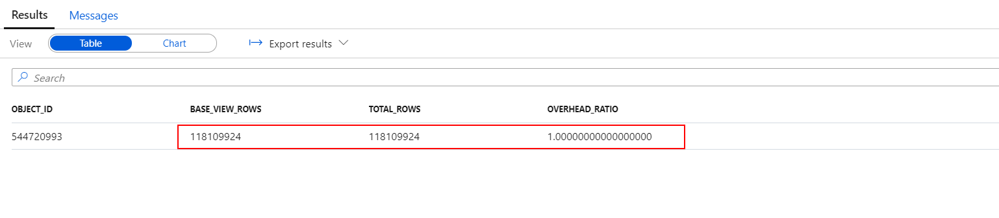
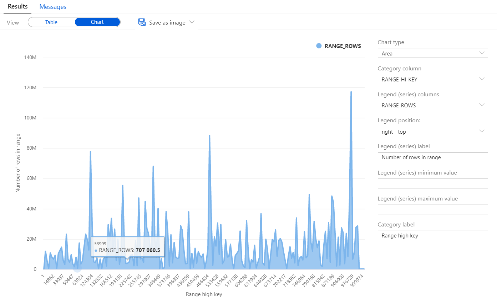
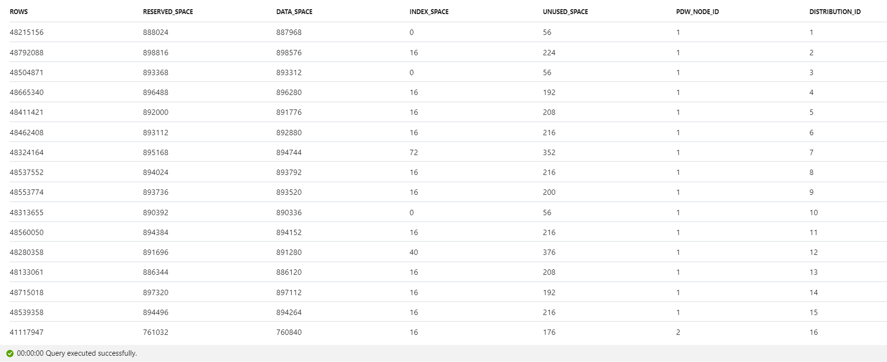
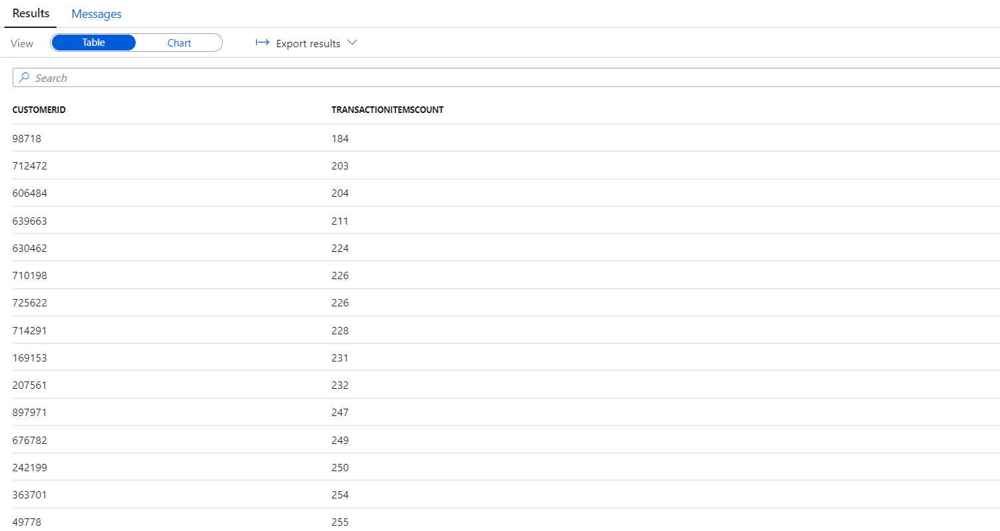

# 3. Optimizing SQL Pools

- [3. Optimizing SQL Pools](#3-optimizing-sql-pools)
  - [3.1. Sizing and resource allocation (DWUs)](#31-sizing-and-resource-allocation-dwus)
    - [3.1.1. Memory Usage](#311-memory-usage)
    - [3.1.2. Transaction log size](#312-transaction-log-size)
    - [3.1.3. Tempdb usage](#313-tempdb-usage)
    - [3.1.4. Azure Synapse SQL pool metrics](#314-azure-synapse-sql-pool-metrics)
  - [3.2. Manage indexes](#32-manage-indexes)
    - [3.2.1. Create and update indexes](#321-create-and-update-indexes)
    - [3.2.2. Ordered Clustered Columnstore Indexes](#322-ordered-clustered-columnstore-indexes)
  - [3.3. Table structure](#33-table-structure)
    - [3.3.1. Improve table structure with distribution](#331-improve-table-structure-with-distribution)
    - [3.3.2. Improve table structure with partitioning](#332-improve-table-structure-with-partitioning)
  - [3.4. Query performance](#34-query-performance)
    - [3.4.1. Improve query performance with approximate count](#341-improve-query-performance-with-approximate-count)
    - [3.4.2. Improve query performance with materialized views](#342-improve-query-performance-with-materialized-views)
    - [3.4.3. Improve query performance with result set caching](#343-improve-query-performance-with-result-set-caching)
  - [3.5. Manage statistics](#35-manage-statistics)
  - [3.6. Monitor space usage](#36-monitor-space-usage)
    - [3.6.1. Analyze space used by tables](#361-analyze-space-used-by-tables)
    - [3.6.2. Advanced space usage analysis](#362-advanced-space-usage-analysis)
  - [3.7. Monitor column store storage](#37-monitor-column-store-storage)
  - [3.8. Choose the right data types](#38-choose-the-right-data-types)
    - [Task 3 - Compare storage requirements](#task-3---compare-storage-requirements)
  - [3.9. Avoid extensive logging](#39-avoid-extensive-logging)
  - [3.10. Best practices](#310-best-practices)

## 3.1. Sizing and resource allocation (DWUs)

A Synapse SQL Pool Data Warehousing Unit (DWU) is a **high-level representation of usage** that consists of a combination of CPU, memory, and IO resources. To determine the number of DWUs to select is to strike a balance between price and performance. When creating or scaling a SQL Pool, you can select from a range of 100 cDWU (DW100c) up to 30,000 cDWU (DW30000c). (`cDWU` is defined as compute Data Warehouse Unit.)

The general guidance is to start small, monitor your workload, and adjust as needed. You can surface valuable performance metrics by leveraging the monitoring `Metrics` feature of the SQL Pool, as well as by taking advantage of a series of `Dynamic Management Views (DMVs)`. Using these tools will help you monitor your SQL workload and provide the insight necessary to make an educated decision on whether scaling your SQL Pool would be beneficial.

### 3.1.1. Memory Usage

Inadequate memory allocation is a common source of performance issues. You are able to compare current memory usage versus total memory available in the SQL Pool through the use of the `sys.dm_pdw_nodes_os_performance_counters` DMV. If you see the memory usage approaching the limit, it is time to scale up.

    ```sql
    -- Memory consumption
    SELECT
        pc1.cntr_value as Curr_Mem_KB,
        pc1.cntr_value/1024.0 as Curr_Mem_MB,
        (pc1.cntr_value/1048576.0) as Curr_Mem_GB,
        pc2.cntr_value as Max_Mem_KB,
        pc2.cntr_value/1024.0 as Max_Mem_MB,
        (pc2.cntr_value/1048576.0) as Max_Mem_GB,
        pc1.cntr_value * 100.0/pc2.cntr_value AS Memory_Utilization_Percentage,
        pc1.pdw_node_id
    FROM
        -- pc1: current memory
        sys.dm_pdw_nodes_os_performance_counters AS pc1
        -- pc2: total memory allowed for this SQL instance
        JOIN sys.dm_pdw_nodes_os_performance_counters AS pc2
            ON pc1.object_name = pc2.object_name AND pc1.pdw_node_id = pc2.pdw_node_id
    WHERE
        pc1.counter_name = 'Total Server Memory (KB)'
        AND pc2.counter_name = 'Total Server Memory (KB)'
    ```

### 3.1.2. Transaction log size

Another aspect that should be monitored is the size of the transaction log. If it is determined that a log file is reaching 160 GB in size, you should consider scaling up or reducing the transaction size of your workload. You can monitor the transaction log size through the `sys.dm_pdw_nodes_os_performance_counters` DMV.

    ```sql
    -- Transaction log size
    SELECT
        instance_name as distribution_db,
        cntr_value*1.0/1048576 as log_file_size_used_GB,
        pdw_node_id
    FROM 
        sys.dm_pdw_nodes_os_performance_counters
    WHERE
        instance_name like 'Distribution_%'
        AND counter_name = 'Log File(s) Used Size (KB)'
    ```

### 3.1.3. Tempdb usage

`Tempdb` is used to hold intermediate results during query execution. For each 100 cDWUs allocated in your pool, there is 399 GB of tempdb space available. By using several DMVs in conjunction with the `microsoft.vw_sql_requests` view from the [`Microsoft Toolkit for SQL`](https://github.com/Microsoft/sql-data-warehouse-samples/tree/master/solutions/monitoring), you can determine if the workload you are running is trending toward capacity.

    ```sql
    -- Monitor tempdb
    SELECT
        sr.request_id,
        ssu.session_id,
        ssu.pdw_node_id,
        sr.command,
        sr.total_elapsed_time,
        es.login_name AS 'LoginName',
        DB_NAME(ssu.database_id) AS 'DatabaseName',
        (es.memory_usage * 8) AS 'MemoryUsage (in KB)',
        (ssu.user_objects_alloc_page_count * 8) AS 'Space Allocated For User Objects (in KB)',
        (ssu.user_objects_dealloc_page_count * 8) AS 'Space Deallocated For User Objects (in KB)',
        (ssu.internal_objects_alloc_page_count * 8) AS 'Space Allocated For Internal Objects (in KB)',
        (ssu.internal_objects_dealloc_page_count * 8) AS 'Space Deallocated For Internal Objects (in KB)',
        CASE es.is_user_process
        WHEN 1 THEN 'User Session'
        WHEN 0 THEN 'System Session'
        END AS 'SessionType',
        es.row_count AS 'RowCount'
    FROM sys.dm_pdw_nodes_db_session_space_usage AS ssu
        INNER JOIN sys.dm_pdw_nodes_exec_sessions AS es ON ssu.session_id = es.session_id AND ssu.pdw_node_id = es.pdw_node_id
        INNER JOIN sys.dm_pdw_nodes_exec_connections AS er ON ssu.session_id = er.session_id AND ssu.pdw_node_id = er.pdw_node_id
        INNER JOIN microsoft.vw_sql_requests AS sr ON ssu.session_id = sr.spid AND ssu.pdw_node_id = sr.pdw_node_id
    WHERE DB_NAME(ssu.database_id) = 'tempdb'
        AND es.session_id <> @@SPID
        AND es.login_name <> 'sa'
        ORDER BY sr.request_id;
    ```

### 3.1.4. Azure Synapse SQL pool metrics

As an alternative to using the DMVs, you can also access the `Metrics` feature of the SQL Pool to obtain insight into DWU, tempdb, and memory usage. Access the `Metrics` feature by navigating to your SQL Pool resource in the Azure Portal, then from the left menu beneath the `Monitoring` heading, you will find the `Metrics` item. Here, you are able to create your own dashboards and compose useful chart visualizations.

    

    

Scaling the size of your SQL Pool is definitely one way to improve the performance. It is critical, however, to also look into other root causes that may be affecting performance. Evaluating table structure, indexes, result set caching, etc. can also provide valuable insight into performance issues that may be solved without incurring the additional cost of scaling the pool.

## 3.2. Manage indexes

### 3.2.1. Create and update indexes

Clustered Columnstore Index vs. Heap vs. Clustered and Nonclustered

Clustered indexes may outperform clustered columnstore indexes when a single row needs to be quickly retrieved. For queries where a single or very few row lookup is required to perform with extreme speed, consider a cluster index or nonclustered secondary index. The disadvantage to using a clustered index is that only queries that benefit are the ones that use a highly selective filter on the clustered index column. To improve filter on other columns a nonclustered index can be added to other columns. However, each index which is added to a table adds both space and processing time to loads.

1. Retrieve information about a single customer from the table with CCI:

    ```sql
    SELECT
        *
    FROM
        [wwi_perf].[Sale_Hash]
    WHERE
        CustomerId = 500000
    ```

    Take a note of the execution time.

2. Retrieve information about a single customer from the table with a clustered index:

    ```sql
    SELECT
        *
    FROM
        [wwi_perf].[Sale_Index]
    WHERE
        CustomerId = 500000
    ```

    The execution time is similar to the one for the query above. Clustered columnstore indexes have no significant advantage over clustered indexes in the specific scenario of highly selective queries.

3. Retrieve information about multiple customers from the table with CCI:

    ```sql
    SELECT
        *
    FROM
        [wwi_perf].[Sale_Hash]
    WHERE
        CustomerId between 400000 and 400100
    ```

    and then retrive the same information from the table with a clustered index:

    ```sql
    SELECT
        *
    FROM
        [wwi_perf].[Sale_Index]
    WHERE
        CustomerId between 400000 and 400020
    ```

    Run both queries several times to get a stable execution time. Under normal conditions, you should see that even with a relatively small number of customers, the CCI table starts yielding better results than the clustered index table.

4. Now add an extra condition on the query, one that refers to the `StoreId` column:

    ```sql
    SELECT
        *
    FROM
        [wwi_perf].[Sale_Index]
    WHERE
        CustomerId between 400000 and 400020
        and StoreId between 2000 and 4000
    ```

    Take a note of the execution time.

5. Create a non-clustered index on the `StoreId` column:

    ```sql
    CREATE INDEX Store_Index on wwi_perf.Sale_Index (StoreId)
    ```

    The creation of the index should complete in a few minutes. Once the index is created, run the previous query again. Notice the improvement in execution time resulting from the newly created non-clustered index.

    >**Note**
    >
    >Creating a non-clustered index on the `wwi_perf.Sale_Index` is based on the already existing clustered index. As a bonus exercise, try to create the same type of index on the `wwi_perf.Sale_Hash` table. Can you explain the difference in index creation time?

### 3.2.2. Ordered Clustered Columnstore Indexes

By default, for each table created without an index option, an internal component (index builder) creates a non-ordered clustered columnstore index (CCI) on it. Data in each column is compressed into a separate CCI rowgroup segment. There's metadata on each segment's value range, so segments that are outside the bounds of the query predicate aren't read from disk during query execution. CCI offers the highest level of data compression and reduces the size of segments to read so queries can run faster. However, because the index builder doesn't sort data before compressing them into segments, segments with overlapping value ranges could occur, causing queries to read more segments from disk and take longer to finish.

When creating an ordered CCI, the Synapse SQL engine sorts the existing data in memory by the order key(s) before the index builder compresses them into index segments. With sorted data, segment overlapping is reduced allowing queries to have a more efficient segment elimination and thus faster performance because the number of segments to read from disk is smaller. If all data can be sorted in memory at once, then segment overlapping can be avoided. Due to large tables in data warehouses, this scenario doesn't happen often.

Queries with the following patterns typically run faster with ordered CCI:

- The queries have equality, inequality, or range predicates
- The predicate columns and the ordered CCI columns are the same.
- The predicate columns are used in the same order as the column ordinal of ordered CCI columns.

1. Run the following query to show the segment overlaps for the `Sale_Hash` table:

    ```sql
    select
        OBJ.name as table_name
        ,COL.name as column_name
        ,NT.distribution_id
        ,NP.partition_id
        ,NP.rows as partition_rows
        ,NP.data_compression_desc
        ,NCSS.segment_id
        ,NCSS.version
        ,NCSS.min_data_id
        ,NCSS.max_data_id
        ,NCSS.row_count
    from 
        sys.objects OBJ
        JOIN sys.columns as COL ON
            OBJ.object_id = COL.object_id
        JOIN sys.pdw_table_mappings TM ON
            OBJ.object_id = TM.object_id
        JOIN sys.pdw_nodes_tables as NT on
            TM.physical_name = NT.name
        JOIN sys.pdw_nodes_partitions NP on
            NT.object_id = NP.object_id
            and NT.pdw_node_id = NP.pdw_node_id
            and substring(TM.physical_name, 40, 10) = NP.distribution_id
        JOIN sys.pdw_nodes_column_store_segments NCSS on
            NP.partition_id = NCSS.partition_id
            and NP.distribution_id = NCSS.distribution_id
            and COL.column_id = NCSS.column_id
    where
        OBJ.name = 'Sale_Hash'
        and COL.name = 'CustomerId'
        and TM.physical_name  not like '%HdTable%'
    order by
        NT.distribution_id
    ```

    Here is a short description of the tables involved in the query:

    Table Name | Description
    ---|---
    sys.objects | All objects in the database. Filtered to match only the `Sale_Hash` table.
    sys.columns | All columns in the database. Filtered to match only the `CustomerId` column of the `Sale_Hash` table.
    sys.pdw_table_mappings | Maps each table to local tables on physical nodes and distributions.
    sys.pdw_nodes_tables | Contains information on each local table in each distribution.
    sys.pdw_nodes_partitions | Contains information on each local partition of each local table in each distribution.
    sys.pdw_nodes_column_store_segments | Contains information on each CCI segment for each partition and distribution column of each local table in each distribution. Filtered to match only the `CustomerId` column of the `Sale_Hash` table.

    With this information on hand, take a look at the result:

    

    Browse through the result set and notice the significant overlap between segments. There is literally overlap in customer ids between every single pair of segments (`CustomerId` values in the data range from 1 to 1,000,000). The segment structure of this CCI is clearly inefficient and will result in a lot of unnecessary reads from storage.

2. Run the following query to show the segment overlaps for the `Sale_Hash_Ordered` table:

    ```sql
    select 
        OBJ.name as table_name
        ,COL.name as column_name
        ,NT.distribution_id
        ,NP.partition_id
        ,NP.rows as partition_rows
        ,NP.data_compression_desc
        ,NCSS.segment_id
        ,NCSS.version
        ,NCSS.min_data_id
        ,NCSS.max_data_id
        ,NCSS.row_count
    from 
        sys.objects OBJ
        JOIN sys.columns as COL ON
            OBJ.object_id = COL.object_id
        JOIN sys.pdw_table_mappings TM ON
            OBJ.object_id = TM.object_id
        JOIN sys.pdw_nodes_tables as NT on
            TM.physical_name = NT.name
        JOIN sys.pdw_nodes_partitions NP on
            NT.object_id = NP.object_id
            and NT.pdw_node_id = NP.pdw_node_id
            and substring(TM.physical_name, 40, 10) = NP.distribution_id
        JOIN sys.pdw_nodes_column_store_segments NCSS on
            NP.partition_id = NCSS.partition_id
            and NP.distribution_id = NCSS.distribution_id
            and COL.column_id = NCSS.column_id
    where
        OBJ.name = 'Sale_Hash_Ordered'
        and COL.name = 'CustomerId'
        and TM.physical_name  not like '%HdTable%'
    order by
        NT.distribution_id
    ```

    The CTAS used to create the `wwi_perf.Sale_Hash_Ordered` table was the following:

    ```sql
    CREATE TABLE [wwi_perf].[Sale_Hash_Ordered]
    WITH
    (
        DISTRIBUTION = HASH ( [CustomerId] ),
        CLUSTERED COLUMNSTORE INDEX ORDER( [CustomerId] )
    )
    AS
    SELECT
        *
    FROM	
        [wwi_perf].[Sale_Heap]
    OPTION  (LABEL  = 'CTAS : Sale_Hash', MAXDOP 1)
    ```

    Notice the creation of the ordered CCI with MAXDOP = 1. Each thread used for ordered CCI creation works on a subset of data and sorts it locally. There's no global sorting across data sorted by different threads. Using parallel threads can reduce the time to create an ordered CCI but will generate more overlapping segments than using a single thread. Currently, the MAXDOP option is only supported in creating an ordered CCI table using CREATE TABLE AS SELECT command. Creating an ordered CCI via CREATE INDEX or CREATE TABLE commands does not support the MAXDOP option.

    The results show significantly less overlap between segments:

    

>**Note**
>
>You will learn more about the internal organization of the clustered columnstore indexes in the following lab.

## 3.3. Table structure

The structure of your tables plays a critical role in the overall performance of a data warehouse. Appropriate table distribution and partitioning are vital to performance.

A distributed table appears as a single table, but behind the scenes its rows are stored across 60 distributions. Factors that decide the best table distribution are its size and how often the data in the table changes. In Azure Synapse Analytics the options for distributed tables are Hash-distributed, round-robin, and replicated.

In a hash-distributed model, rows are distributed across distribution using a deterministic hash function applied on a specific column value. This means identical values will always be stored in the same distribution. Using this intrinsic knowledge, the SQL pool is able to minimize data movement and improve query performance. Hash-distributed tables are best for large fact tables that are greater than 2 GB in size and experiences frequent changes. When defining a hash-distributed table, choosing an appropriate distribution column is essential. Consider these factors when deciding on a distribution column:

    - choose a column whose data will distribute evenly and has many unique values. Remember these rows are being stored across 60 distributions, if the hash results in a large percentage of values being assigned to a single distribution, it will impact performance.
    - choose a column that has no or very few NULL values    
    - choose a column that is commonly used in JOIN, GROUP BY, DISTINCT, OVER and HAVING clauses
    - avoid columns **not** being used in WHERE clauses
    - avoid date columns (if many users are filtering by common date ranges it would negate the benefits of the distribution)

If none of the columns of the table seem to be an ideal candidate for a distribution column. Consider creating a new column that is a composite of two or more column values. If this is the approach taken, take care to include the composite column in JOIN queries to minimize data movement.

A round-robin distributed table has all of its rows evenly distributed across all 60 distributions. Identical values are not guaranteed to fall into the same distribution, and it is more common-place for data movement to occur in the process of executing a query, which may affect performance. Consider round-robin distribution when:

    - there is no obvious joining key, or the join is less significant
    - there isn't an adequate candidate column for hash-distribution
    - the table is a temporary staging table

A replicated table should be reserved for smaller, commonly used lookup tables that are less than 1.5 GB in size.

Proper table partitioning can also provide improved performance. A partition divides data into smaller groups. Partitioning is supported on all Synapse SQL pool table types and distributions. Partitions are defined by a single column which is most commonly a date column. When loading large amounts of data, leveraging partitions reduces the amount of transaction logging, thus improving performance. The same can be said when deleting large amounts of data. Deleting data by partition is substantially faster than deleting a large amount of data row-by-row. As for querying performance, using a partition column in query filters limits the scan to that single partition, avoiding costly full table scans.

As an example, we'll walk through the following example scenario to demonstrate how to investigate and identify performance issues.

Identifying there is a problem is the first step in rectifying it. For instance, consider the following query:

    ```sql
    SELECT  
        COUNT_BIG(*)
    FROM
        [wwi_perf].[Sale_Heap]
    ```

This simple query took about 30 seconds to execute and returned a count of approximately 340 million rows from the table. That isn't too bad, there doesn't seem to be a problem. However, this next query which is executed on the same table took a couple minutes to return:

    ```sql
    SELECT TOP 1000 * FROM
    (
        SELECT
            S.CustomerId
            ,SUM(S.TotalAmount) as TotalAmount
        FROM
            [wwi_perf].[Sale_Heap] S
        GROUP BY
            S.CustomerId
    ) T
    OPTION (LABEL = 'Lab03: Heap')
    ```

There is clearly something wrong with the `Sale_Heap` table that induces the performance hit.

    > **Note**: the OPTION clause used in the statement. This comes in handy when you're looking to identify your query in the [sys.dm_pdw_exec_requests](https://docs.microsoft.com/en-us/sql/relational-databases/system-dynamic-management-views/sys-dm-pdw-exec-requests-transact-sql) DMV.
    >
    >```sql
    >SELECT  *
    >FROM    sys.dm_pdw_exec_requests
    >WHERE   [label] = 'Lab03: Heap';
    >```

The `Sale_Heap` table was created as a `HEAP` table with a `ROUND_ROBIN` distribution.

    ```sql
    CREATE TABLE [wwi_perf].[Sale_Heap]
    (
        [TransactionId] [uniqueidentifier]  NOT NULL,
        [CustomerId] [int]  NOT NULL,
        [ProductId] [smallint]  NOT NULL,
        [Quantity] [smallint]  NOT NULL,
        [Price] [decimal](9,2)  NOT NULL,
        [TotalAmount] [decimal](9,2)  NOT NULL,
        [TransactionDateId] [int]  NOT NULL,
        [ProfitAmount] [decimal](9,2)  NOT NULL,
        [Hour] [tinyint]  NOT NULL,
        [Minute] [tinyint]  NOT NULL,
        [StoreId] [smallint]  NOT NULL
    )
    WITH
    (
        DISTRIBUTION = ROUND_ROBIN,
        HEAP
    )
    ```

You can immediately spot at least two reasons for the performance hit:

    - The `ROUND_ROBIN` distribution
    - The `HEAP` structure of the table

    > **NOTE**: In this case, when we are looking for fast query response times, the heap structure is not a good choice as we will see in a moment. Still, there are cases where using a heap table can be beneficial to performance rather than hurting it. A beneficial application of a heap table is when we're looking to ingest large amounts of data into the SQL pool.

To gain further insight into the degradation of performance, we can issue the same query with the `EXPLAIN WITH_RECOMMENDATIONS` clause. The `EXPLAIN WITH_RECOMMENDATIONS` clause returns the query plan for an Azure Synapse Analytics SQL statement without actually running the statement. Use this query plan to preview which operations will require data movement and to view the estimated costs of the query operations. By default, you will get the execution plan in XML format, but you can also export to other formats like CSV or JSON.

    > **TIP**: Do not select `Query Plan` from the toolbar as it will try do download the query plan and open it in SQL Server Management Studio. 

If we run the longer executing script from our scenario, but this time with the `EXPLAIN WITH_RECOMMENDATIONS` clause:

    ```sql
    EXPLAIN WITH_RECOMMENDATIONS
    SELECT TOP 1000 * FROM
    (
        SELECT
            S.CustomerId
            ,SUM(S.TotalAmount) as TotalAmount
        FROM
            [wwi_perf].[Sale_Heap] S
        GROUP BY
            S.CustomerId
    ) T
    ```

The query will return:

    ```xml
    <?xml version=""1.0"" encoding=""utf-8""?>
    <dsql_query number_nodes=""4"" number_distributions=""60"" number_distributions_per_node=""15"">
    <sql>SELECT TOP 1000 * FROM
    (
        SELECT
            S.CustomerId
            ,SUM(S.TotalAmount) as TotalAmount
        FROM
            [wwi_perf].[Sale_Heap] S
        GROUP BY
            S.CustomerId
    ) T</sql>
    <materialized_view_candidates>
        <materialized_view_candidates with_constants=""False"">CREATE MATERIALIZED VIEW View1 WITH (DISTRIBUTION = HASH([Expr0])) AS
    SELECT [S].[CustomerId] AS [Expr0],
        SUM([S].[TotalAmount]) AS [Expr1]
    FROM [wwi_perf].[Sale_Heap]
    GROUP BY [S].[CustomerId]</materialized_view_candidates>
    </materialized_view_candidates>
    <dsql_operations total_cost=""8.583172"" total_number_operations=""5"">
        <dsql_operation operation_type=""RND_ID"">
        <identifier>TEMP_ID_76</identifier>
        </dsql_operation>
        <dsql_operation operation_type=""ON"">
        <location permanent=""false"" distribution=""AllDistributions"" />
        <sql_operations>
            <sql_operation type=""statement"">CREATE TABLE [qtabledb].[dbo].[TEMP_ID_76] ([CustomerId] INT NOT NULL, [col] DECIMAL(38, 2) NOT NULL ) WITH(DISTRIBUTED_MOVE_FILE='');</sql_operation>
        </sql_operations>
        </dsql_operation>
        <dsql_operation operation_type=""SHUFFLE_MOVE"">
        <operation_cost cost=""8.583172"" accumulative_cost=""8.583172"" average_rowsize=""13"" output_rows=""41265.25"" GroupNumber=""11"" />
        <source_statement>SELECT [T1_1].[CustomerId] AS [CustomerId], [T1_1].[col] AS [col] FROM (SELECT SUM([T2_1].[TotalAmount]) AS [col], [T2_1].[CustomerId] AS [CustomerId] FROM [SQLPool02].[wwi_perf].[Sale_Heap] AS T2_1 GROUP BY [T2_1].[CustomerId]) AS T1_1
    OPTION (MAXDOP 4, MIN_GRANT_PERCENT = [MIN_GRANT], DISTRIBUTED_MOVE(N''))</source_statement>
        <destination_table>[TEMP_ID_76]</destination_table>
        <shuffle_columns>CustomerId;</shuffle_columns>
        </dsql_operation>
        <dsql_operation operation_type=""RETURN"">
        <location distribution=""AllDistributions"" />
        <select>SELECT [T1_1].[CustomerId] AS [CustomerId], [T1_1].[col] AS [col] FROM (SELECT TOP (CAST ((1000) AS BIGINT)) SUM([T2_1].[col]) AS [col], [T2_1].[CustomerId] AS [CustomerId] FROM [qtabledb].[dbo].[TEMP_ID_76] AS T2_1 GROUP BY [T2_1].[CustomerId]) AS T1_1
    OPTION (MAXDOP 4, MIN_GRANT_PERCENT = [MIN_GRANT])</select>
        </dsql_operation>
        <dsql_operation operation_type=""ON"">
        <location permanent=""false"" distribution=""AllDistributions"" />
        <sql_operations>
            <sql_operation type=""statement"">DROP TABLE [qtabledb].[dbo].[TEMP_ID_76]</sql_operation>
        </sql_operations>
        </dsql_operation>
    </dsql_operations>
    </dsql_query>
    ```

Notice the details of the internal layout of the MPP system:

`<dsql_query number_nodes=""4"" number_distributions=""60"" number_distributions_per_node=""15"">`

This layout is given by the current Date Warehouse Units (DWU) setting. In the setup used for the example above, we were running at `DW2000c` which means that there are 4 physical nodes to service the 60 distributions, giving a number of 15 distributions per physical node. Depending on your own DWU settings, these numbers will vary.

The query plan indicates data movement is required. This is indicated by the `SHUFFLE_MOVE` distributed SQL operation. Data movement is an operation where parts of the distributed tables are moved to different nodes during query execution. This operation is required where the data is not available on the target node, most commonly when the tables do not share the distribution key. The most common data movement operation is shuffle. During shuffle, for each input row, Synapse computes a hash value using the join columns and then sends that row to the node that owns that hash value. Either one or both sides of join can participate in the shuffle. The diagram below displays shuffle to implement join between tables T1 and T2 where neither of the tables is distributed on the join column col2.


Let's dive into the details provided by the query plan to understand some of the problems of our current approach. The following table contains the description of every operation mentioned in the query plan:

Operation | Operation Type | Description
---|---|---
1 | RND_ID | Identifies an object that will be created. In our case, it's the `TEMP_ID_76` internal table.
2 | ON | Specifies the location (nodes or distributions) where the operation will occur. `AllDistributions` means here the operation will be performed on each of the 60 distributions of the SQL pool. The operation will be a SQL operation (specified via `<sql_operations>`) that will create the  `TEMP_ID_76` table.
3 | SHUFFLE_MOVE | The list of shuffle columns contains only one column which is `CustomerId` (specified via `<shuffle_columns>`). The values will be distributed to the hash owning distributions and saved locally in the `TEMP_ID_76` tables. The operation will output an estimated number of 41265.25 rows (specified via `<operation_cost>`). According to the same section, the average resulting row size is 13 bytes.
4 | RETURN | Data resulting from the shuffle operation will be collected from all distributions (see `<location>`) by querying the internal temporary table `TEMP_ID_76`.
5 | ON | The `TEMP_ID_76` will be deleted from all distributions.

It becomes clear now what is the root cause of the performance problem: the inter-distribution data movements. This is actually one of the simplest examples given the small size of the data that needs to be shuffled. You can image how much worse things become when the shuffled row size becomes larger.

You can learn more about the structure of the query plan generated by the EXPLAIN statement [here](https://docs.microsoft.com/en-us/sql/t-sql/queries/explain-transact-sql?view=azure-sqldw-latest).

1. Besides the `EXPLAIN` statement, you can also understand the plan details using the `sys.dm_pdw_request_steps` DMV.

    Query the `sys.dm_pdw_exec_requests` DMW to find your query id (this is for the query you executed previously at step 2):

    ```sql
    SELECT  
        *
    FROM    
        sys.dm_pdw_exec_requests
    WHERE   
        [label] = 'Lab03: Heap'
    ```

    The result contains, among other things, the query id, the label, and the original SQL statement:

    

2. With the query id (`QID473552` in this case) you can now investigate the individual steps of the query:

    ```sql
    SELECT
       *
    FROM
        sys.dm_pdw_request_steps
    WHERE
        request_id = 'QID473552'
    ORDER BY
       step_index
    ```

    The steps (indexed 0 to 3) are matching operations 2 to 5 from the query plan. Again, the culprit stands out: the step with index 1 describes the inter-partition data movement operation. By looking at the `TOTAL_ELAPSED_TIME` column one can clearly tell the largest part of the query time is generated by this step.

    

3. Get more details on the problematic step using the following SQL statement:

    ```sql
    SELECT
    *
    FROM
        sys.dm_pdw_sql_requests
    WHERE 
        request_id = 'QID473552'
        AND step_index = 1
    ```

    The results of the statement provide details about what happens on each distribution within the SQL pool.

    

6. Finally, you can use the following SQL statement to investigate data movement on the distributed databases:

    ```sql
    SELECT
        *
    FROM
        sys.dm_pdw_dms_workers
    WHERE
        request_id = 'QID473552'
        AND step_index = 1
    ORDER BY
        distribution_id
    ```

    The results of the statement provide details about data being moved at each distribution. The `ROWS_PROCESSED` column is especially useful here to get an estimate of the magnitude of the data movement happening when the query is executed.

    

### 3.3.1. Improve table structure with distribution

Improve table structure with hash distribution and columnstore index

1. Create an improved version of the table using CTAS (Create Table As Select):

    ```sql
    CREATE TABLE [wwi_perf].[Sale_Hash]
    WITH
    (
        DISTRIBUTION = HASH ( [CustomerId] ),
        CLUSTERED COLUMNSTORE INDEX
    )
    AS
    SELECT
        *
    FROM	
        [wwi_perf].[Sale_Heap]
    ```

    The query will take about 10 minutes to complete.

    >Note:
    >CTAS is a more customizable version of the SELECT...INTO statement.
    >SELECT...INTO doesn't allow you to change either the distribution method or the index type as part of the operation. You create the new table by using the >default distribution type of ROUND_ROBIN, and the default table structure of CLUSTERED COLUMNSTORE INDEX.
    >
    >With CTAS, on the other hand, you can specify both the distribution of the table data as well as the table structure type.

2. Run the query again to see the performance improvements:

    ```sql
    SELECT TOP 1000 * FROM
    (
        SELECT
            S.CustomerId
            ,SUM(S.TotalAmount) as TotalAmount
        FROM
            [wwi_perf].[Sale_Hash] S
        GROUP BY
            S.CustomerId
    ) T
    ```

3. Run the following EXPLAIN statement again to get the query plan (do not select `Query Plan` from the toolbar as it will try do download the query plan and open it in SQL Server Management Studio):

    ```sql
    EXPLAIN
    SELECT TOP 1000 * FROM
    (
        SELECT
            S.CustomerId
            ,SUM(S.TotalAmount) as TotalAmount
        FROM
            [wwi_perf].[Sale_Hash] S
        GROUP BY
            S.CustomerId
    ) T
    ```

    The resulting query plan is clearly much better than the previous one, as there is no more inter-distribution data movement involved.

    ```xml
    <?xml version="1.0" encoding="utf-8"?>
    <dsql_query number_nodes="5" number_distributions="60" number_distributions_per_node="12">
    <sql>SELECT TOP 1000 * FROM
    (
        SELECT
            S.CustomerId
            ,SUM(S.TotalAmount) as TotalAmount
        FROM
            [wwi_perf].[Sale_Hash] S
        GROUP BY
            S.CustomerId
    ) T</sql>
    <dsql_operations total_cost="0" total_number_operations="1">
        <dsql_operation operation_type="RETURN">
        <location distribution="AllDistributions" />
        <select>SELECT [T1_1].[CustomerId] AS [CustomerId], [T1_1].[col] AS [col] FROM (SELECT TOP (CAST ((1000) AS BIGINT)) SUM([T2_1].[TotalAmount]) AS [col], [T2_1].[CustomerId] AS [CustomerId] FROM [SQLPool02].[wwi_perf].[Sale_Hash] AS T2_1 GROUP BY [T2_1].[CustomerId]) AS T1_1
    OPTION (MAXDOP 6)</select>
        </dsql_operation>
    </dsql_operations>
    </dsql_query>
    ```

4. Try running a more complex query and investigate the execution plan and execution steps. Here is an example of a more complex query you can use:

    ```sql
    SELECT 
        AVG(TotalProfit) as AvgMonthlyCustomerProfit
    FROM
    (
        SELECT
            S.CustomerId
            ,D.Year
            ,D.Month
            ,SUM(S.TotalAmount) as TotalAmount
            ,AVG(S.TotalAmount) as AvgAmount
            ,SUM(S.ProfitAmount) as TotalProfit
            ,AVG(S.ProfitAmount) as AvgProfit
        FROM
            [wwi_perf].[Sale_Partition01] S
            join [wwi].[Date] D on 
                D.DateId = S.TransactionDateId
        GROUP BY
            S.CustomerId
            ,D.Year
            ,D.Month
    ) T
    ```

### 3.3.2. Improve table structure with partitioning

Improve further the structure of the table with partitioning

Date columns are usually good candidates for partitioning tables at the distributions level. In the case of your sales data, partitioning based on the `TransactionDateId` column seems to be a good choice.

Your SQL pool already contains two versions of the `Sale` table that have been partitioned using `TransactionDateId`. These tables are `[wwi_perf].[Sale_Partition01]` annd `[wwi_perf].[Sale_Partition02]`. Below are the CTAS queries that have been used to create these tables.

>**Note**
>
>These queries have already been run on the SQL pool. If you want to test the CTAS queries yourself, make sure you replace the table names with new ones.

```sql
CREATE TABLE [wwi_perf].[Sale_Partition01]
WITH
(
    DISTRIBUTION = HASH ( [CustomerId] ),
    CLUSTERED COLUMNSTORE INDEX,
    PARTITION
    (
        [TransactionDateId] RANGE RIGHT FOR VALUES (
            20190101, 20190201, 20190301, 20190401, 20190501, 20190601, 20190701, 20190801, 20190901, 20191001, 20191101, 20191201)
    )
)
AS
SELECT
    *
FROM	
    [wwi_perf].[Sale_Heap]
OPTION  (LABEL  = 'CTAS : Sale_Partition01')

CREATE TABLE [wwi_perf].[Sale_Partition02]
WITH
(
    DISTRIBUTION = HASH ( [CustomerId] ),
    CLUSTERED COLUMNSTORE INDEX,
    PARTITION
    (
        [TransactionDateId] RANGE RIGHT FOR VALUES (
            20190101, 20190401, 20190701, 20191001)
    )
)
AS
SELECT
    *
FROM	
    [wwi_perf].[Sale_Heap]
OPTION  (LABEL  = 'CTAS : Sale_Partition02')
```

Notice the two partitioning strategies we've used here. The first partitioning scheme is month-based and the second is quarter-based. You will explore in Lab 04 the subtle differences between these and understand the potential performance implications resulting from these choices.
  
## 3.4. Query performance

### 3.4.1. Improve query performance with approximate count

Improve COUNT performance

1. The following query attempts to find the TOP 100 of customers that have the most sale transactions:

    ```sql
    SELECT COUNT( DISTINCT CustomerId) from wwi_perf.Sale_Heap
    ```

    Query takes up to 20 seconds to execute. That is expected, since distinct counts are one of the most difficult to optimize types of queries.

2. Run the HyperLogLog approach:

    ```sql
    SELECT APPROX_COUNT_DISTINCT(CustomerId) from wwi_perf.Sale_Heap 
    ```

    Query takes about half the time to execute.

### 3.4.2. Improve query performance with materialized views

Use materialized views

As opposed to a standard view, a materialized view pre-computes, stores, and maintains its data in a Synapse SQL pool just like a table. Here is a basic comparison between standard and materialized views:

| Comparison                     | View                                         | Materialized View             
|:-------------------------------|:---------------------------------------------|:--------------------------------------------------------------| 
|View definition                 | Stored in Azure data warehouse.              | Stored in Azure data warehouse.    
|View content                    | Generated each time when the view is used.   | Pre-processed and stored in Azure data warehouse during view creation. Updated as data is added to the underlying tables.                                             
|Data refresh                    | Always updated                               | Always updated                          
|Speed to retrieve view data from complex queries     | Slow                                         | Fast  
|Extra storage                   | No                                           | Yes                             
|Syntax                          | CREATE VIEW                                  | CREATE MATERIALIZED VIEW AS SELECT     

1. Execute the following query to get an approximation of its execution time:

    ```sql
    SELECT TOP 1000 * FROM
    (
        SELECT
            S.CustomerId
            ,D.Year
            ,D.Quarter
            ,SUM(S.TotalAmount) as TotalAmount
        FROM
            [wwi_perf].[Sale_Partition02] S
            join [wwi].[Date] D on
                S.TransactionDateId = D.DateId
        GROUP BY
            S.CustomerId
            ,D.Year
            ,D.Quarter
    ) T
    ```

2. Execute this query as well (notice the slight difference):

    ```sql
    SELECT TOP 1000 * FROM
    (
        SELECT
            S.CustomerId
            ,D.Year
            ,D.Month
            ,SUM(S.ProfitAmount) as TotalProfit
        FROM
            [wwi_perf].[Sale_Partition02] S
            join [wwi].[Date] D on
                S.TransactionDateId = D.DateId
        GROUP BY
            S.CustomerId
            ,D.Year
            ,D.Month
    ) T
    ```

3. Create a materialized view that can support both queries above:

    ```sql
    CREATE MATERIALIZED VIEW
        wwi_perf.mvCustomerSales
    WITH
    (
        DISTRIBUTION = HASH( CustomerId )
    )
    AS
    SELECT
        S.CustomerId
        ,D.Year
        ,D.Quarter
        ,D.Month
        ,SUM(S.TotalAmount) as TotalAmount
        ,SUM(S.ProfitAmount) as TotalProfit
    FROM
        [wwi_perf].[Sale_Partition02] S
        join [wwi].[Date] D on
            S.TransactionDateId = D.DateId
    GROUP BY
        S.CustomerId
        ,D.Year
        ,D.Quarter
        ,D.Month
    ```

4. Run the following query to get an estimated execution plan (do not select `Query Plan` from the toolbar as it will try do download the query plan and open it in SQL Server Management Studio):

    ```sql
    EXPLAIN
    SELECT TOP 1000 * FROM
    (
        SELECT
            S.CustomerId
            ,D.Year
            ,D.Quarter
            ,SUM(S.TotalAmount) as TotalAmount
        FROM
            [wwi_perf].[Sale_Partition02] S
            join [wwi].[Date] D on
                S.TransactionDateId = D.DateId
        GROUP BY
            S.CustomerId
            ,D.Year
            ,D.Quarter
    ) T
    ```

    The resulting execution plan shows how the newly created materialized view is used to optimize the execution. Note the `FROM [SQLPool02].[wwi_perf].[mvCustomerSales]` in the `<dsql_operations>` element.

    ```xml
    <?xml version="1.0" encoding="utf-8"?>
    <dsql_query number_nodes="5" number_distributions="60" number_distributions_per_node="12">
    <sql>SELECT TOP 1000 * FROM
    (
        SELECT
            S.CustomerId
            ,D.Year
            ,D.Quarter
            ,SUM(S.TotalAmount) as TotalAmount
        FROM
            [wwi_perf].[Sale_Partition02] S
            join [wwi].[Date] D on
                S.TransactionDateId = D.DateId
        GROUP BY
            S.CustomerId
            ,D.Year
            ,D.Quarter
    ) T</sql>
    <dsql_operations total_cost="0" total_number_operations="1">
        <dsql_operation operation_type="RETURN">
        <location distribution="AllDistributions" />
        <select>SELECT [T1_1].[CustomerId] AS [CustomerId], [T1_1].[Year] AS [Year], [T1_1].[Quarter] AS [Quarter], [T1_1].[col] AS [col] FROM (SELECT TOP (CAST ((1000) AS BIGINT)) [T2_1].[CustomerId] AS [CustomerId], [T2_1].[Year] AS [Year], [T2_1].[Quarter] AS [Quarter], [T2_1].[col1] AS [col] FROM (SELECT ISNULL([T3_1].[col1], CONVERT (BIGINT, 0, 0)) AS [col], [T3_1].[CustomerId] AS [CustomerId], [T3_1].[Year] AS [Year], [T3_1].[Quarter] AS [Quarter], [T3_1].[col] AS [col1] FROM (SELECT SUM([T4_1].[TotalAmount]) AS [col], SUM([T4_1].[cb]) AS [col1], [T4_1].[CustomerId] AS [CustomerId], [T4_1].[Year] AS [Year], [T4_1].[Quarter] AS [Quarter] FROM (SELECT [T5_1].[CustomerId] AS [CustomerId], [T5_1].[TotalAmount] AS [TotalAmount], [T5_1].[cb] AS [cb], [T5_1].[Quarter] AS [Quarter], [T5_1].[Year] AS [Year] FROM [SQLPool02].[wwi_perf].[mvCustomerSales] AS T5_1) AS T4_1 GROUP BY [T4_1].[CustomerId], [T4_1].[Year], [T4_1].[Quarter]) AS T3_1) AS T2_1 WHERE ([T2_1].[col] != CAST ((0) AS BIGINT))) AS T1_1
    OPTION (MAXDOP 6)</select>
        </dsql_operation>
    </dsql_operations>
    </dsql_query>
    ```

5. The same materialized view is also used to optimize the second query. Get its execution plan:

    ```sql
    EXPLAIN
    SELECT TOP 1000 * FROM
    (
        SELECT
            S.CustomerId
            ,D.Year
            ,D.Month
            ,SUM(S.ProfitAmount) as TotalProfit
        FROM
            [wwi_perf].[Sale_Partition02] S
            join [wwi].[Date] D on
                S.TransactionDateId = D.DateId
        GROUP BY
            S.CustomerId
            ,D.Year
            ,D.Month
    ) T
    ```

    The resulting execution plan shows the use of the same materialized view to optimize execution:

    ```xml
    <?xml version="1.0" encoding="utf-8"?>
    <dsql_query number_nodes="5" number_distributions="60" number_distributions_per_node="12">
    <sql>SELECT TOP 1000 * FROM
    (
        SELECT
            S.CustomerId
            ,D.Year
            ,D.Month
            ,SUM(S.ProfitAmount) as TotalProfit
        FROM
            [wwi_perf].[Sale_Partition02] S
            join [wwi].[Date] D on
                S.TransactionDateId = D.DateId
        GROUP BY
            S.CustomerId
            ,D.Year
            ,D.Month
    ) T</sql>
    <dsql_operations total_cost="0" total_number_operations="1">
        <dsql_operation operation_type="RETURN">
        <location distribution="AllDistributions" />
        <select>SELECT [T1_1].[CustomerId] AS [CustomerId], [T1_1].[Year] AS [Year], [T1_1].[Month] AS [Month], [T1_1].[col] AS [col] FROM (SELECT TOP (CAST ((1000) AS BIGINT)) [T2_1].[CustomerId] AS [CustomerId], [T2_1].[Year] AS [Year], [T2_1].[Month] AS [Month], [T2_1].[col1] AS [col] FROM (SELECT ISNULL([T3_1].[col1], CONVERT (BIGINT, 0, 0)) AS [col], [T3_1].[CustomerId] AS [CustomerId], [T3_1].[Year] AS [Year], [T3_1].[Month] AS [Month], [T3_1].[col] AS [col1] FROM (SELECT SUM([T4_1].[TotalProfit]) AS [col], SUM([T4_1].[cb]) AS [col1], [T4_1].[CustomerId] AS [CustomerId], [T4_1].[Year] AS [Year], [T4_1].[Month] AS [Month] FROM (SELECT [T5_1].[CustomerId] AS [CustomerId], [T5_1].[TotalProfit] AS [TotalProfit], [T5_1].[cb] AS [cb], [T5_1].[Month] AS [Month], [T5_1].[Year] AS [Year] FROM [SQLPool02].[wwi_perf].[mvCustomerSales] AS T5_1) AS T4_1 GROUP BY [T4_1].[CustomerId], [T4_1].[Year], [T4_1].[Month]) AS T3_1) AS T2_1 WHERE ([T2_1].[col] != CAST ((0) AS BIGINT))) AS T1_1
    OPTION (MAXDOP 6)</select>
        </dsql_operation>
    </dsql_operations>
    </dsql_query>
    ```

    >**Note**
    >
    >Even if the two queries have different aggregation levels, the query optimizer is able to infer the use of the materialized view. This happens because the materialized view covers both aggregation levels (`Quarter` and `Month`) as well as both aggregation measures (`TotalAmount` and `ProfitAmount`).

6. Check the materialized view overhead:

    ```sql
    DBCC PDW_SHOWMATERIALIZEDVIEWOVERHEAD ( 'wwi_perf.mvCustomerSales' )
    ```

    The results show that `BASE_VIEW_ROWS` are equal to `TOTAL_ROWS` (and hence `OVERHEAD_RATIO` is 1). The materialized view is perfectly aligned with the base view. This situation is expected to change once the underlying data starts to change.

7. Update the original data the materialized view was built on:

    ```sql
    UPDATE
        [wwi_perf].[Sale_Partition02]
    SET
        TotalAmount = TotalAmount * 1.01
        ,ProfitAmount = ProfitAmount * 1.01
    WHERE
        CustomerId BETWEEN 100 and 200
    ```

8. Check the materialized view overhead again:

    ```sql
    DBCC PDW_SHOWMATERIALIZEDVIEWOVERHEAD ( 'wwi_perf.mvCustomerSales' )
    ```

    

    There is now a delta stored by the materialized view which results in `TOTAL_ROWS` being greater than `BASE_VIEW_ROWS` and `OVERHEAD_RATIO` being greater than 1.

9. Rebuild the materialized view and check that the overhead ration went back to 1:

    ```sql
    ALTER MATERIALIZED VIEW [wwi_perf].[mvCustomerSales] REBUILD

    DBCC PDW_SHOWMATERIALIZEDVIEWOVERHEAD ( 'wwi_perf.mvCustomerSales' )
    ```

    

**Study the impact of materialized views**

Analyze the execution plan of a query

1. Run again the query to find the number of customers in each bucket of per-customer transaction items counts:

    ```sql
    SELECT
        T.TransactionItemsCountBucket
        ,count(*) as CustomersCount
    FROM
        (
            SELECT
                CustomerId,
                (count(*) - 184) / 100 as TransactionItemsCountBucket
            FROM
                [wwi_perf].[Sale_Hash]
            GROUP BY
                CustomerId
        ) T
    GROUP BY
        T.TransactionItemsCountBucket
    ORDER BY
        T.TransactionItemsCountBucket
    ```

2. Improve the query by adding support to calculate the lower margin of the first per-customer transactions items count bucket:

    ```sql
    SELECT
        T.TransactionItemsCountBucket
        ,count(*) as CustomersCount
    FROM
        (
            SELECT
                CustomerId,
                (
                    COUNT(*) -
                    (
                        SELECT
                            MIN(TransactionItemsCount)
                        FROM
                        (
                            SELECT
                                COUNT(*) as TransactionItemsCount
                            FROM
                                [wwi_perf].[Sale_Hash]
                            GROUP BY
                                CustomerId
                        ) X
                    )
                ) / 100 as TransactionItemsCountBucket
            FROM
                [wwi_perf].[Sale_Hash]
            GROUP BY
                CustomerId
        ) T
    GROUP BY
        T.TransactionItemsCountBucket
    ORDER BY
        T.TransactionItemsCountBucket
    ```

Improve the execution plan of the query with a materialized view

1. Run the query with the `EXPLAIN` directive (note the `WITH_RECOMMENDATIONS` option as well):

    ```sql
    EXPLAIN WITH_RECOMMENDATIONS
    SELECT
        T.TransactionItemsCountBucket
        ,count(*) as CustomersCount
    FROM
        (
            SELECT
                CustomerId,
                (
                    COUNT(*) - 
                    (
                        SELECT 
                            MIN(TransactionItemsCount)
                        FROM 
                        (
                            SELECT 
                                COUNT(*) as TransactionItemsCount
                            FROM 
                                [wwi_perf].[Sale_Hash] 
                            GROUP BY 
                                CustomerId 
                        ) X 
                    )
                ) / 100 as TransactionItemsCountBucket
            FROM
                [wwi_perf].[Sale_Hash]
            GROUP BY
                CustomerId
        ) T
    GROUP BY
        T.TransactionItemsCountBucket
    ORDER BY
        T.TransactionItemsCountBucket
    ```

2. Analyze the resulting execution plan. Take a close look to the `<materialized_view_candidates>` section which suggests possible materialized views you can create to improve the performance of the query.

    ```xml
    <?xml version="1.0" encoding="utf-8"?>
    <dsql_query number_nodes="5" number_distributions="60" number_distributions_per_node="12">
    <sql>SELECT
        T.TransactionItemsCountBucket
        ,count(*) as CustomersCount
    FROM
        (
            SELECT
                CustomerId,
                (
                    COUNT(*) -
                    (
                        SELECT
                            MIN(TransactionItemsCount)
                        FROM
                        (
                            SELECT
                                COUNT(*) as TransactionItemsCount
                            FROM
                                [wwi_perf].[Sale_Hash]
                            GROUP BY
                                CustomerId
                        ) X
                    )
                ) / 100 as TransactionItemsCountBucket
            FROM
                [wwi_perf].[Sale_Hash]
            GROUP BY
                CustomerId
        ) T
    GROUP BY
        T.TransactionItemsCountBucket
    ORDER BY
        T.TransactionItemsCountBucket</sql>
    <materialized_view_candidates>
        <materialized_view_candidates with_constants="False">CREATE MATERIALIZED VIEW View1 WITH (DISTRIBUTION = HASH([Expr0])) AS
    SELECT [SQLPool02].[wwi_perf].[Sale_Hash].[CustomerId] AS [Expr0],
        COUNT(*) AS [Expr1]
    FROM [wwi_perf].[Sale_Hash]
    GROUP BY [SQLPool02].[wwi_perf].[Sale_Hash].[CustomerId]</materialized_view_candidates>
    </materialized_view_candidates>
    <dsql_operations total_cost="0.0242811172881356" total_number_operations="9">
        <dsql_operation operation_type="RND_ID">
        <identifier>TEMP_ID_99</identifier>
        </dsql_operation>
        <dsql_operation operation_type="ON">
        <location permanent="false" distribution="AllComputeNodes" />
        <sql_operations>
            <sql_operation type="statement">CREATE TABLE [qtabledb].[dbo].[TEMP_ID_99] ([col] INT ) WITH(DISTRIBUTED_MOVE_FILE='');</sql_operation>
        </sql_operations>
        </dsql_operation>
        <dsql_operation operation_type="BROADCAST_MOVE">
        <operation_cost cost="0.00096" accumulative_cost="0.00096" average_rowsize="4" output_rows="1" GroupNumber="69" />
        <source_statement>SELECT [T1_1].[col] AS [col] FROM (SELECT MIN([T2_1].[col]) AS [col] FROM (SELECT COUNT(CAST ((0) AS INT)) AS [col], 0 AS [col1] FROM [SQLPool02].[wwi_perf].[Sale_Hash] AS T3_1 GROUP BY [T3_1].[CustomerId]) AS T2_1 GROUP BY [T2_1].[col1]) AS T1_1
    OPTION (MAXDOP 6, MIN_GRANT_PERCENT = [MIN_GRANT], DISTRIBUTED_MOVE(N''))</source_statement>
        <destination_table>[TEMP_ID_99]</destination_table>
        </dsql_operation>
        <dsql_operation operation_type="RND_ID">
        <identifier>TEMP_ID_100</identifier>
        </dsql_operation>
        <dsql_operation operation_type="ON">
        <location permanent="false" distribution="AllDistributions" />
        <sql_operations>
            <sql_operation type="statement">CREATE TABLE [qtabledb].[dbo].[TEMP_ID_100] ([col] INT, [col1] BIGINT ) WITH(DISTRIBUTED_MOVE_FILE='');</sql_operation>
        </sql_operations>
        </dsql_operation>
        <dsql_operation operation_type="SHUFFLE_MOVE">
        <operation_cost cost="0.0233211172881356" accumulative_cost="0.0242811172881356" average_rowsize="12" output_rows="95.5518" GroupNumber="75" />
        <source_statement>SELECT [T1_1].[col1] AS [col], [T1_1].[col] AS [col1] FROM (SELECT COUNT_BIG(CAST ((0) AS INT)) AS [col], [T2_1].[col] AS [col1] FROM (SELECT (([T3_2].[col] - [T3_1].[col]) / CAST ((100) AS INT)) AS [col] FROM (SELECT MIN([T4_1].[col]) AS [col] FROM [qtabledb].[dbo].[TEMP_ID_99] AS T4_1) AS T3_1 INNER JOIN
    (SELECT COUNT(CAST ((0) AS INT)) AS [col] FROM [SQLPool02].[wwi_perf].[Sale_Hash] AS T4_1 GROUP BY [T4_1].[CustomerId]) AS T3_2
    ON (0 = 0)) AS T2_1 GROUP BY [T2_1].[col]) AS T1_1
    OPTION (MAXDOP 6, MIN_GRANT_PERCENT = [MIN_GRANT], DISTRIBUTED_MOVE(N''))</source_statement>
        <destination_table>[TEMP_ID_100]</destination_table>
        <shuffle_columns>col;</shuffle_columns>
        </dsql_operation>
        <dsql_operation operation_type="RETURN">
        <location distribution="AllDistributions" />
        <select>SELECT [T1_1].[col1] AS [col], [T1_1].[col] AS [col1] FROM (SELECT CONVERT (INT, [T2_1].[col], 0) AS [col], [T2_1].[col1] AS [col1] FROM (SELECT ISNULL([T3_1].[col], CONVERT (BIGINT, 0, 0)) AS [col], [T3_1].[col1] AS [col1] FROM (SELECT SUM([T4_1].[col1]) AS [col], [T4_1].[col] AS [col1] FROM [qtabledb].[dbo].[TEMP_ID_100] AS T4_1 GROUP BY [T4_1].[col]) AS T3_1) AS T2_1) AS T1_1 ORDER BY [T1_1].[col1] ASC
    OPTION (MAXDOP 6, MIN_GRANT_PERCENT = [MIN_GRANT])</select>
        </dsql_operation>
        <dsql_operation operation_type="ON">
        <location permanent="false" distribution="AllDistributions" />
        <sql_operations>
            <sql_operation type="statement">DROP TABLE [qtabledb].[dbo].[TEMP_ID_100]</sql_operation>
        </sql_operations>
        </dsql_operation>
        <dsql_operation operation_type="ON">
        <location permanent="false" distribution="AllComputeNodes" />
        <sql_operations>
            <sql_operation type="statement">DROP TABLE [qtabledb].[dbo].[TEMP_ID_99]</sql_operation>
        </sql_operations>
        </dsql_operation>
    </dsql_operations>
    </dsql_query>
    ```

3. Create the suggested materialized view:

    ```sql
    CREATE MATERIALIZED VIEW
        mvTransactionItemsCounts
    WITH
    (
        DISTRIBUTION = HASH([CustomerId])
    )
    AS
    SELECT
        CustomerId
        ,COUNT(*) AS ItemsCount
    FROM
        [wwi_perf].[Sale_Hash]
    GROUP BY
        CustomerId
    ```

4. Check the execution plan again:

    ```sql
    EXPLAIN WITH_RECOMMENDATIONS
    SELECT
        T.TransactionItemsCountBucket
        ,count(*) as CustomersCount
    FROM
        (
            SELECT
                CustomerId,
                (
                    COUNT(*) - 
                    (
                        SELECT 
                            MIN(TransactionItemsCount)
                        FROM 
                        (
                            SELECT 
                                COUNT(*) as TransactionItemsCount
                            FROM 
                                [wwi_perf].[Sale_Hash] 
                            GROUP BY 
                                CustomerId 
                        ) X 
                    )
                ) / 100 as TransactionItemsCountBucket
            FROM
                [wwi_perf].[Sale_Hash]
            GROUP BY
                CustomerId
        ) T
    GROUP BY
        T.TransactionItemsCountBucket
    ORDER BY
        T.TransactionItemsCountBucket
    ```

    The resulting execution plan indicates now the use of the `mvTransactionItemsCounts` (the `BROADCAST_MOVE` distributed SQL operation) materialized view which provides improvements to the query execution time:

    ```xml
    <?xml version="1.0" encoding="utf-8"?>
    <dsql_query number_nodes="5" number_distributions="60" number_distributions_per_node="12">
    <sql>SELECT
        T.TransactionItemsCountBucket
        ,count(*) as CustomersCount
    FROM
        (
            SELECT
                CustomerId,
                (
                    COUNT(*) -
                    (
                        SELECT
                            MIN(TransactionItemsCount)
                        FROM
                        (
                            SELECT
                                COUNT(*) as TransactionItemsCount
                            FROM
                                [wwi_perf].[Sale_Hash]
                            GROUP BY
                                CustomerId
                        ) X
                    )
                ) / 100 as TransactionItemsCountBucket
            FROM
                [wwi_perf].[Sale_Hash]
            GROUP BY
                CustomerId
        ) T
    GROUP BY
        T.TransactionItemsCountBucket
    ORDER BY
        T.TransactionItemsCountBucket</sql>
    <materialized_view_candidates>
        <materialized_view_candidates with_constants="False">CREATE MATERIALIZED VIEW View1 WITH (DISTRIBUTION = HASH([Expr0])) AS
    SELECT [SQLPool02].[wwi_perf].[Sale_Hash].[CustomerId] AS [Expr0],
        COUNT(*) AS [Expr1]
    FROM [wwi_perf].[Sale_Hash]
    GROUP BY [SQLPool02].[wwi_perf].[Sale_Hash].[CustomerId]</materialized_view_candidates>
    </materialized_view_candidates>
    <dsql_operations total_cost="0.0242811172881356" total_number_operations="9">
        <dsql_operation operation_type="RND_ID">
        <identifier>TEMP_ID_111</identifier>
        </dsql_operation>
        <dsql_operation operation_type="ON">
        <location permanent="false" distribution="AllComputeNodes" />
        <sql_operations>
            <sql_operation type="statement">CREATE TABLE [qtabledb].[dbo].[TEMP_ID_111] ([col] INT ) WITH(DISTRIBUTED_MOVE_FILE='');</sql_operation>
        </sql_operations>
        </dsql_operation>
        <dsql_operation operation_type="BROADCAST_MOVE">
        <operation_cost cost="0.00096" accumulative_cost="0.00096" average_rowsize="4" output_rows="1" GroupNumber="134" />
        <source_statement>SELECT [T1_1].[col] AS [col] FROM (SELECT MIN([T2_1].[col]) AS [col] FROM (SELECT CONVERT (INT, [T3_1].[col], 0) AS [col], 0 AS [col1] FROM (SELECT ISNULL([T4_1].[col], CONVERT (BIGINT, 0, 0)) AS [col] FROM (SELECT SUM([T5_1].[ItemsCount]) AS [col] FROM (SELECT [T6_1].[CustomerId] AS [CustomerId], [T6_1].[ItemsCount] AS [ItemsCount] FROM [SQLPool02].[dbo].[mvTransactionItemsCounts] AS T6_1) AS T5_1 GROUP BY [T5_1].[CustomerId]) AS T4_1) AS T3_1 WHERE ([T3_1].[col] != CAST ((0) AS BIGINT))) AS T2_1 GROUP BY [T2_1].[col1]) AS T1_1
    OPTION (MAXDOP 6, MIN_GRANT_PERCENT = [MIN_GRANT], DISTRIBUTED_MOVE(N''))</source_statement>
        <destination_table>[TEMP_ID_111]</destination_table>
        </dsql_operation>
        <dsql_operation operation_type="RND_ID">
        <identifier>TEMP_ID_112</identifier>
        </dsql_operation>
        <dsql_operation operation_type="ON">
        <location permanent="false" distribution="AllDistributions" />
        <sql_operations>
            <sql_operation type="statement">CREATE TABLE [qtabledb].[dbo].[TEMP_ID_112] ([col] INT, [col1] BIGINT ) WITH(DISTRIBUTED_MOVE_FILE='');</sql_operation>
        </sql_operations>
        </dsql_operation>
        <dsql_operation operation_type="SHUFFLE_MOVE">
        <operation_cost cost="0.0233211172881356" accumulative_cost="0.0242811172881356" average_rowsize="12" output_rows="95.5518" GroupNumber="140" />
        <source_statement>SELECT [T1_1].[col1] AS [col], [T1_1].[col] AS [col1] FROM (SELECT COUNT_BIG(CAST ((0) AS INT)) AS [col], [T2_1].[col] AS [col1] FROM (SELECT (([T3_2].[col] - [T3_1].[col]) / CAST ((100) AS INT)) AS [col] FROM (SELECT MIN([T4_1].[col]) AS [col] FROM [qtabledb].[dbo].[TEMP_ID_111] AS T4_1) AS T3_1 INNER JOIN
    (SELECT CONVERT (INT, [T4_1].[col], 0) AS [col] FROM (SELECT ISNULL([T5_1].[col], CONVERT (BIGINT, 0, 0)) AS [col] FROM (SELECT SUM([T6_1].[ItemsCount]) AS [col] FROM (SELECT [T7_1].[CustomerId] AS [CustomerId], [T7_1].[ItemsCount] AS [ItemsCount] FROM [SQLPool02].[dbo].[mvTransactionItemsCounts] AS T7_1) AS T6_1 GROUP BY [T6_1].[CustomerId]) AS T5_1) AS T4_1 WHERE ([T4_1].[col] != CAST ((0) AS BIGINT))) AS T3_2
    ON (0 = 0)) AS T2_1 GROUP BY [T2_1].[col]) AS T1_1
    OPTION (MAXDOP 6, MIN_GRANT_PERCENT = [MIN_GRANT], DISTRIBUTED_MOVE(N''))</source_statement>
        <destination_table>[TEMP_ID_112]</destination_table>
        <shuffle_columns>col;</shuffle_columns>
        </dsql_operation>
        <dsql_operation operation_type="RETURN">
        <location distribution="AllDistributions" />
        <select>SELECT [T1_1].[col1] AS [col], [T1_1].[col] AS [col1] FROM (SELECT CONVERT (INT, [T2_1].[col], 0) AS [col], [T2_1].[col1] AS [col1] FROM (SELECT ISNULL([T3_1].[col], CONVERT (BIGINT, 0, 0)) AS [col], [T3_1].[col1] AS [col1] FROM (SELECT SUM([T4_1].[col1]) AS [col], [T4_1].[col] AS [col1] FROM [qtabledb].[dbo].[TEMP_ID_112] AS T4_1 GROUP BY [T4_1].[col]) AS T3_1) AS T2_1) AS T1_1 ORDER BY [T1_1].[col1] ASC
    OPTION (MAXDOP 6, MIN_GRANT_PERCENT = [MIN_GRANT])</select>
        </dsql_operation>
        <dsql_operation operation_type="ON">
        <location permanent="false" distribution="AllDistributions" />
        <sql_operations>
            <sql_operation type="statement">DROP TABLE [qtabledb].[dbo].[TEMP_ID_112]</sql_operation>
        </sql_operations>
        </dsql_operation>
        <dsql_operation operation_type="ON">
        <location permanent="false" distribution="AllComputeNodes" />
        <sql_operations>
            <sql_operation type="statement">DROP TABLE [qtabledb].[dbo].[TEMP_ID_111]</sql_operation>
        </sql_operations>
        </dsql_operation>
    </dsql_operations>
    </dsql_query>
    ```


### 3.4.3. Improve query performance with result set caching

Use result set caching

1. Check if result set caching is on in the current SQL pool:

    ```sql
    SELECT
        name
        ,is_result_set_caching_on
    FROM 
        sys.databases
    ```

    

    If `False` is returned for your SQL pool, run the following query to activate it (you need to run it on the `master` database and replace `<sql_pool> with the name of your SQL pool):

    ```sql
    ALTER DATABASE [<sql_pool>]
    SET RESULT_SET_CACHING ON
    ```

    >**Important**
    >
    >The operations to create result set cache and retrieve data from the cache happen on the control node of a Synapse SQL pool instance. When result set caching is turned ON, running queries that return large result set (for example, >1GB) can cause high throttling on the control node and slow down the overall query response on the instance. Those queries are commonly used during data exploration or ETL operations. To avoid stressing the control node and cause performance issue, users should turn OFF result set caching on the database before running those types of queries.

2. After activating result set caching, run a query and immediately check if it hit the cache:

    ```sql
    SELECT
        D.Year
        ,D.Quarter
        ,D.Month
        ,SUM(S.TotalAmount) as TotalAmount
        ,SUM(S.ProfitAmount) as TotalProfit
    FROM
        [wwi_perf].[Sale_Partition02] S
        join [wwi].[Date] D on
            S.TransactionDateId = D.DateId
    GROUP BY
        D.Year
        ,D.Quarter
        ,D.Month
    OPTION (LABEL = 'Lab03: Result set caching')

    SELECT 
        result_cache_hit
    FROM 
        sys.dm_pdw_exec_requests
    WHERE 
        request_id = 
        (
            SELECT TOP 1 
                request_id 
            FROM 
                sys.dm_pdw_exec_requests
            WHERE   
                [label] = 'Lab03: Result set caching'
            ORDER BY
                start_time desc
        )
    ```

    As expected, the result is `False`. Still, you can identify that, while running the query, Synapse has also cached the result set. Run the following query to get the execution steps:

    ```sql
    SELECT 
        step_index
        ,operation_type
        ,location_type
        ,status
        ,total_elapsed_time
        ,command
    FROM 
        sys.dm_pdw_request_steps
    WHERE 
        request_id =
        (
            SELECT TOP 1 
                request_id 
            FROM 
                sys.dm_pdw_exec_requests
            WHERE   
                [label] = 'Lab03: Result set caching'
            ORDER BY
                start_time desc
        )
    ```

    The execution plan reveals the building of the result set cache:

    

3. You can control at the user session level the use of the result set cache. The following query shows how to deactivate and activate the result cache:

    ```sql  
    SET RESULT_SET_CACHING OFF

    SELECT
        D.Year
        ,D.Quarter
        ,D.Month
        ,SUM(S.TotalAmount) as TotalAmount
        ,SUM(S.ProfitAmount) as TotalProfit
    FROM
        [wwi_perf].[Sale_Partition02] S
        join [wwi].[Date] D on
            S.TransactionDateId = D.DateId
    GROUP BY
        D.Year
        ,D.Quarter
        ,D.Month
    OPTION (LABEL = 'Lab03: Result set caching off')

    SET RESULT_SET_CACHING ON

    SELECT
        D.Year
        ,D.Quarter
        ,D.Month
        ,SUM(S.TotalAmount) as TotalAmount
        ,SUM(S.ProfitAmount) as TotalProfit
    FROM
        [wwi_perf].[Sale_Partition02] S
        join [wwi].[Date] D on
            S.TransactionDateId = D.DateId
    GROUP BY
        D.Year
        ,D.Quarter
        ,D.Month
    OPTION (LABEL = 'Lab03: Result set caching on')

    SELECT TOP 2
        request_id
        ,[label]
        ,result_cache_hit
    FROM 
        sys.dm_pdw_exec_requests
    WHERE   
        [label] in ('Lab03: Result set caching off', 'Lab03: Result set caching on')
    ORDER BY
        start_time desc
    ```

    The result of `SET RESULT_SET_CACHING OFF` is visible in the cache hit test results (`RESULT_CACHE_HIT` contains a `NULL` value):

    

4. At any moment, you can check the space used bythe results cache:

    ```sql
    DBCC SHOWRESULTCACHESPACEUSED
    ```

    

5. Clear the result set cache using:

    ```sql
    DBCC DROPRESULTSETCACHE
    ```

6. Finally, disable result set caching on the database using the following query (you need to run it on the `master` database and replace `<sql_pool> with the name of your SQL pool):

    ```sql
    ALTER DATABASE [<sql_pool>]
    SET RESULT_SET_CACHING OFF
    ```

    >**Important**
    >
    >Make sure you disable result set caching on the SQL pool. Failing to do so will have a negative imact on the remainder of this lab, as it will skew execution times and defeat the purpose of several upcoming exercises.

    >**Note**
    >
    >The maximum size of result set cache is 1 TB per database. The cached results are automatically invalidated when the underlying query data change.
    >
    >The cache eviction is managed by SQL Analytics automatically following this schedule:
    >- Every 48 hours if the result set hasn't been used or has been invalidated.
    >- When the result set cache approaches the maximum size.
    >
    >Users can manually empty the entire result set cache by using one of these options:
    >- Turn OFF the result set cache feature for the database
    >- Run DBCC DROPRESULTSETCACHE while connected to the database
    >
    >Pausing a database won't empty cached result set.

## 3.5. Manage statistics

Create and update statistics

The more the SQL pool resource knows about your data, the faster it can execute queries. After loading data into SQL pool, collecting statistics on your data is one of the most important things you can do for query optimization.

The SQL pool query optimizer is a cost-based optimizer. It compares the cost of various query plans, and then chooses the plan with the lowest cost. In most cases, it chooses the plan that will execute the fastest.

For example, if the optimizer estimates that the date your query is filtering on will return one row it will choose one plan. If it estimates that the selected date will return 1 million rows, it will return a different plan.

1. Check if statistics are set to be automatically created in the database:

    ```sql
    SELECT name, is_auto_create_stats_on
    FROM sys.databases
    ```

2. See statistics that have been automatically created:

    ```sql
    SELECT
        *
    FROM 
        sys.dm_pdw_exec_requests
    WHERE 
        Command like 'CREATE STATISTICS%'
    ```

    Notice the special name pattern used for automatically created statistics:

    

3. Check if there are any statistics created for `CustomerId` from the `wwi_perf.Sale_Has` table:

    ```sql
    DBCC SHOW_STATISTICS ('wwi_perf.Sale_Hash', CustomerId) WITH HISTOGRAM
    ```

    You should get an error stating that statistics for `CustomerId` does not exist.

4. Create statistics for `CustomerId`:

    ```sql
    CREATE STATISTICS Sale_Hash_CustomerId ON wwi_perf.Sale_Hash (CustomerId)
    ```

    Display the newly created statistics:

    ```sql
    DBCC SHOW_STATISTICS([wwi_perf.Sale_Hash], 'Sale_Hash_CustomerId')
    ```

    In the results pane, swhitch to `Chart` display and set the category column and the legend columns as presented below:

    

    You now have a visual on the statistics created for the `CustomerId` column.

    >**Important**
    >
    >The more SQL pool knows about your data, the faster it can execute queries against it. After loading data into SQL pool, collecting statistics on your data is one of the most important things you can do to optimize your queries.
    >
    >The SQL pool query optimizer is a cost-based optimizer. It compares the cost of various query plans, and then chooses the plan with the lowest cost. In most cases, it chooses the plan that will execute the fastest.
    >
    >For example, if the optimizer estimates that the date your query is filtering on will return one row it will choose one plan. If it estimates that the selected date will return 1 million rows, it will return a different plan.

## 3.6. Monitor space usage

Check for skewed data and space usage

### 3.6.1. Analyze space used by tables

Analyze the space used by tables

1. Run the following DBCC command:

    ```sql
    DBCC PDW_SHOWSPACEUSED('wwi_perf.Sale_Hash');
    ```

    

2. Analyze the number of rows in each distribution. Those numbers should be as even as possible. You can see from the results that rows are equally distributed across distributions. Let's dive a bit more into this analysis. Use the following query to get customers with the most sale transaction items:

    ```sql
    SELECT TOP 1000 
        CustomerId,
        count(*) as TransactionItemsCount
    FROM
        [wwi_perf].[Sale_Hash]
    GROUP BY
        CustomerId
    ORDER BY
        count(*) DESC
    ```

    

    Now find the customers with the least sale transaction items:

    ```sql
    SELECT TOP 1000 
        CustomerId,
        count(*) as TransactionItemsCount
    FROM
        [wwi_perf].[Sale_Hash]
    GROUP BY
        CustomerId
    ORDER BY
        count(*) ASC
    ```

    

    Notice the largest number of transaction items is 9465 and the smallest is 184.

    Let's find now the distribution of per-customer transaction item counts. Run the following query:

    ```sql
    SELECT
        T.TransactionItemsCountBucket
        ,count(*) as CustomersCount
    FROM
        (
            SELECT
                CustomerId,
                (count(*) - 184) / 100 as TransactionItemsCountBucket
            FROM
                [wwi_perf].[Sale_Hash]
            GROUP BY
                CustomerId
        ) T
    GROUP BY
        T.TransactionItemsCountBucket
    ORDER BY
        T.TransactionItemsCountBucket
    ```

    In the `Results` pane, switch to the `Chart` view and configure it as follows (see the options set on the right side):

    

    Without diving too much into the mathematical and statistical aspects of it, this histogram displays the reason why there is virtually no skew in the data distribution of the `Sale_Hash` table. If you haven't figured it out yet, the reason we are talking about is the cvasi-normal distribution of the per-customer transaction items counts.

### 3.6.2. Advanced space usage analysis

Use a more advanced approach to understand table space usage

1. Run the following script to create the `vTableSizes` view:

    ```sql
    CREATE VIEW [wwi_perf].[vTableSizes]
    AS
    WITH base
    AS
    (
    SELECT
        GETDATE()                                                              AS  [execution_time]
        , DB_NAME()                                                            AS  [database_name]
        , s.name                                                               AS  [schema_name]
        , t.name                                                               AS  [table_name]
        , QUOTENAME(s.name)+'.'+QUOTENAME(t.name)                              AS  [two_part_name]
        , nt.[name]                                                            AS  [node_table_name]
        , ROW_NUMBER() OVER(PARTITION BY nt.[name] ORDER BY (SELECT NULL))     AS  [node_table_name_seq]
        , tp.[distribution_policy_desc]                                        AS  [distribution_policy_name]
        , c.[name]                                                             AS  [distribution_column]
        , nt.[distribution_id]                                                 AS  [distribution_id]
        , i.[type]                                                             AS  [index_type]
        , i.[type_desc]                                                        AS  [index_type_desc]
        , nt.[pdw_node_id]                                                     AS  [pdw_node_id]
        , pn.[type]                                                            AS  [pdw_node_type]
        , pn.[name]                                                            AS  [pdw_node_name]
        , di.name                                                              AS  [dist_name]
        , di.position                                                          AS  [dist_position]
        , nps.[partition_number]                                               AS  [partition_nmbr]
        , nps.[reserved_page_count]                                            AS  [reserved_space_page_count]
        , nps.[reserved_page_count] - nps.[used_page_count]                    AS  [unused_space_page_count]
        , nps.[in_row_data_page_count]
            + nps.[row_overflow_used_page_count]
            + nps.[lob_used_page_count]                                        AS  [data_space_page_count]
        , nps.[reserved_page_count]
        - (nps.[reserved_page_count] - nps.[used_page_count])
        - ([in_row_data_page_count]
                + [row_overflow_used_page_count]+[lob_used_page_count])        AS  [index_space_page_count]
        , nps.[row_count]                                                      AS  [row_count]
    FROM
        sys.schemas s
    INNER JOIN sys.tables t
        ON s.[schema_id] = t.[schema_id]
    INNER JOIN sys.indexes i
        ON  t.[object_id] = i.[object_id]
        AND i.[index_id] <= 1
    INNER JOIN sys.pdw_table_distribution_properties tp
        ON t.[object_id] = tp.[object_id]
    INNER JOIN sys.pdw_table_mappings tm
        ON t.[object_id] = tm.[object_id]
    INNER JOIN sys.pdw_nodes_tables nt
        ON tm.[physical_name] = nt.[name]
    INNER JOIN sys.dm_pdw_nodes pn
        ON  nt.[pdw_node_id] = pn.[pdw_node_id]
    INNER JOIN sys.pdw_distributions di
        ON  nt.[distribution_id] = di.[distribution_id]
    INNER JOIN sys.dm_pdw_nodes_db_partition_stats nps
        ON nt.[object_id] = nps.[object_id]
        AND nt.[pdw_node_id] = nps.[pdw_node_id]
        AND nt.[distribution_id] = nps.[distribution_id]
    LEFT OUTER JOIN (select * from sys.pdw_column_distribution_properties where distribution_ordinal = 1) cdp
        ON t.[object_id] = cdp.[object_id]
    LEFT OUTER JOIN sys.columns c
        ON cdp.[object_id] = c.[object_id]
        AND cdp.[column_id] = c.[column_id]
    WHERE pn.[type] = 'COMPUTE'
    )
    , size
    AS
    (
    SELECT
    [execution_time]
    ,  [database_name]
    ,  [schema_name]
    ,  [table_name]
    ,  [two_part_name]
    ,  [node_table_name]
    ,  [node_table_name_seq]
    ,  [distribution_policy_name]
    ,  [distribution_column]
    ,  [distribution_id]
    ,  [index_type]
    ,  [index_type_desc]
    ,  [pdw_node_id]
    ,  [pdw_node_type]
    ,  [pdw_node_name]
    ,  [dist_name]
    ,  [dist_position]
    ,  [partition_nmbr]
    ,  [reserved_space_page_count]
    ,  [unused_space_page_count]
    ,  [data_space_page_count]
    ,  [index_space_page_count]
    ,  [row_count]
    ,  ([reserved_space_page_count] * 8.0)                                 AS [reserved_space_KB]
    ,  ([reserved_space_page_count] * 8.0)/1000                            AS [reserved_space_MB]
    ,  ([reserved_space_page_count] * 8.0)/1000000                         AS [reserved_space_GB]
    ,  ([reserved_space_page_count] * 8.0)/1000000000                      AS [reserved_space_TB]
    ,  ([unused_space_page_count]   * 8.0)                                 AS [unused_space_KB]
    ,  ([unused_space_page_count]   * 8.0)/1000                            AS [unused_space_MB]
    ,  ([unused_space_page_count]   * 8.0)/1000000                         AS [unused_space_GB]
    ,  ([unused_space_page_count]   * 8.0)/1000000000                      AS [unused_space_TB]
    ,  ([data_space_page_count]     * 8.0)                                 AS [data_space_KB]
    ,  ([data_space_page_count]     * 8.0)/1000                            AS [data_space_MB]
    ,  ([data_space_page_count]     * 8.0)/1000000                         AS [data_space_GB]
    ,  ([data_space_page_count]     * 8.0)/1000000000                      AS [data_space_TB]
    ,  ([index_space_page_count]  * 8.0)                                   AS [index_space_KB]
    ,  ([index_space_page_count]  * 8.0)/1000                              AS [index_space_MB]
    ,  ([index_space_page_count]  * 8.0)/1000000                           AS [index_space_GB]
    ,  ([index_space_page_count]  * 8.0)/1000000000                        AS [index_space_TB]
    FROM base
    )
    SELECT *
    FROM size
    ```

    Take a moment to analyze the script above. You have encountered already some of the tables in the previous lab. Here is a short description of the tables and DMVs involved in the query:

    Table Name | Description
    ---|---
    sys.schemas | All schemas in the database.
    sys.tables | All tables in the database.
    sys.indexes | All indexes in the database.
    sys.columns | All columns in the database.
    sys.pdw_table_mappings | Maps each table to local tables on physical nodes and distributions.
    sys.pdw_nodes_tables | Contains information on each local table in each distribution.
    sys.pdw_table_distribution_properties | Holds distribution information for tables (the type of distribution tables have).
    sys.pdw_column_distribution_properties | Holds distribution information for columns. Filtered to include only columns used to distribute their parent tables (`distribution_ordinal` = 1).
    sys.pdw_distributions |  Holds information about the distributions from the SQL pool.
    sys.dm_pdw_nodes | Holds information about the nodes from the SQL pool. Filtered to include only compute nodes (`type` = `COMPUTE`).
    sys.dm_pdw_nodes_db_partition_stats | Returns page and row-count information for every partition in the current database.

2. Run the following script to view the details about the structure of the tables in the `wwi_perf` schema:

    ```sql
    SELECT
        database_name
    ,    schema_name
    ,    table_name
    ,    distribution_policy_name
    ,      distribution_column
    ,    index_type_desc
    ,    COUNT(distinct partition_nmbr) as nbr_partitions
    ,    SUM(row_count)                 as table_row_count
    ,    SUM(reserved_space_GB)         as table_reserved_space_GB
    ,    SUM(data_space_GB)             as table_data_space_GB
    ,    SUM(index_space_GB)            as table_index_space_GB
    ,    SUM(unused_space_GB)           as table_unused_space_GB
    FROM
        [wwi_perf].[vTableSizes]
    WHERE
        schema_name = 'wwi_perf'
    GROUP BY
        database_name
    ,    schema_name
    ,    table_name
    ,    distribution_policy_name
    ,      distribution_column
    ,    index_type_desc
    ORDER BY
        table_reserved_space_GB desc
    ```

    Analyze the results:

    

    Notice the significant difference between the space used by `CLUSTERED COLUMNSTORE` and `HEAP` or `CLUSTERED` tables. This provides a clear indication on the significant advantages columnstore indexes have.

    Also notice the slight increase of storage space for ordered CCI table (`Sale_Hash_Ordered`).

## 3.7. Monitor column store storage

Understand column store storage details

Create view for column store row group stats

1. Run the following query to create the `vColumnStoreRowGroupStats`:

    ```sql
    create view [wwi_perf].[vColumnStoreRowGroupStats]
    as
    with cte
    as
    (
    select   tb.[name]                    AS [logical_table_name]
    ,        rg.[row_group_id]            AS [row_group_id]
    ,        rg.[state]                   AS [state]
    ,        rg.[state_desc]              AS [state_desc]
    ,        rg.[total_rows]              AS [total_rows]
    ,        rg.[trim_reason_desc]        AS trim_reason_desc
    ,        mp.[physical_name]           AS physical_name
    FROM    sys.[schemas] sm
    JOIN    sys.[tables] tb               ON  sm.[schema_id]          = tb.[schema_id]
    JOIN    sys.[pdw_table_mappings] mp   ON  tb.[object_id]          = mp.[object_id]
    JOIN    sys.[pdw_nodes_tables] nt     ON  nt.[name]               = mp.[physical_name]
    JOIN    sys.[dm_pdw_nodes_db_column_store_row_group_physical_stats] rg      ON  rg.[object_id]     = nt.[object_id]
                                                                                AND rg.[pdw_node_id]   = nt.[pdw_node_id]
                                            AND rg.[distribution_id]    = nt.[distribution_id]
    )
    select *
    from cte;
    ```

    In this query we are using the `sys.dm_pdw_nodes_db_column_store_row_group_physical_stats` DMV which provides current rowgroup-level information about all of the columnstore indexes in the current database.

    The `state_desc` column provides useful information on the state of a row group:

    Name | Description
    ---|---
    `INVISIBLE` | A rowgroup which is being compressed.
    `OPEN` | A deltastore rowgroup that is accepting new rows. It is important to remember that an open rowgroup is still in rowstore format and has not been compressed to columnstore format.
    `CLOSED` | A deltastore rowgroup that contains the maximum number of rows, and is waiting for the tuple mover process to compress it to the columnstore.
    `COMPRESSED` | A row group that is compressed with columnstore compression and stored in the columnstore.
    `TOMBSTONE` | A row group that was formerly in the deltastore and is no longer used.

    The `trim_reason_desc` column describes the reason that triggered the `COMPRESSED` rowgroup to have less than the maximum number of rows:

    Name | Description
    ---|---
    `UNKNOWN_UPGRADED_FROM_PREVIOUS_VERSION` | Occurred when upgrading from the previous version of SQL Server.
    `NO_TRIM` | The row group was not trimmed. The row group was compressed with the maximum of 1,048,476 rows. The number of rows could be less if a subset of rows was deleted after delta rowgroup was closed.
    `BULKLOAD` | The bulk-load batch size limited the number of rows. This is what you should be looking for when optimizing data loading, as it is an indicator of resource starvation during the loading process.
    `REORG` | Forced compression as part of REORG command.
    `DICTIONARY_SIZE` | Dictionary size grew too large to compress all of the rows together.
    `MEMORY_LIMITATION` | Not enough available memory to compress all the rows together.
    `RESIDUAL_ROW_GROUP` | Closed as part of last row group with rows < 1 million during index build operation.


Explore column store storage details

1. Explore the statistics of the columnstore for the `Sale_Partition02` table using the following query:

    ```sql
    SELECT
        *
    FROM
        [wwi_perf].[vColumnStoreRowGroupStats]
    WHERE
        Logical_Table_Name = 'Sale_Partition02'
    ```

2. Explore the results of the query:

    

    Browse through the results and get an overview of the rowgroup states. Notice the `COMPRESSED` and `OPEN` states of some of the row groups.

3. Explore the statistics of the columnstore for the `Sale_Hash_Ordered` table using the same query:

    ```sql
    SELECT
        *
    FROM
        [wwi_perf].[vColumnStoreRowGroupStats]
    WHERE
        Logical_Table_Name = 'Sale_Hash_Ordered'
    ```

4. Explore the results of the query:

    

    There is a significant difference in the rowgroup states from the previous one. This highlight one of the potential advantages of ordered CCIs.

## 3.8. Choose the right data types


Study the impact of wrong choices for column data types

Create and populate tables with optimal column data types

Use the following query to create two tables (`Sale_Hash_Projection` and `Sale_Hash_Projection2`) which contain a subset of the columns from `Sale_Heap`:

```sql
CREATE TABLE [wwi_perf].[Sale_Hash_Projection]
WITH
(
	DISTRIBUTION = HASH ( [CustomerId] ),
	HEAP
)
AS
SELECT
	[CustomerId]
	,[ProductId]
	,[Quantity]
FROM
	[wwi_perf].[Sale_Heap]

CREATE TABLE [wwi_perf].[Sale_Hash_Projection2]
WITH
(
	DISTRIBUTION = HASH ( [CustomerId] ),
	CLUSTERED COLUMNSTORE INDEX
)
AS
SELECT
	[CustomerId]
	,[ProductId]
	,[Quantity]
FROM
	[wwi_perf].[Sale_Heap]
```

The query should finish execution in a few minutes.

Create and populate tables with sub-optimal column data types

Use the following query to create two additional tables (`Sale_Hash_Projection_Big` and `Sale_Hash_Projection_Big2`) that have the same columns, but with different (sub_optimal) data types:

```sql
CREATE TABLE [wwi_perf].[Sale_Hash_Projection_Big]
WITH
(
	DISTRIBUTION = HASH ( [CustomerId] ),
	HEAP
)
AS
SELECT
	[CustomerId]
	,CAST([ProductId] as bigint) as [ProductId]
	,CAST([Quantity] as bigint) as [Quantity]
FROM
	[wwi_perf].[Sale_Heap]

CREATE TABLE [wwi_perf].[Sale_Hash_Projection_Big2]
WITH
(
	DISTRIBUTION = HASH ( [CustomerId] ),
	CLUSTERED COLUMNSTORE INDEX
)
AS
SELECT
	[CustomerId]
	,CAST([ProductId] as bigint) as [ProductId]
	,CAST([Quantity] as bigint) as [Quantity]
FROM
	[wwi_perf].[Sale_Heap]
```

### Task 3 - Compare storage requirements

1. Verify that the four tables have the same number of rows:

    ```sql
    SELECT 'Sale_Hash_Projection', COUNT_BIG(*) FROM [wwi_perf].[Sale_Hash_Projection]
    UNION
    SELECT 'Sale_Hash_Projection2', COUNT_BIG(*) FROM [wwi_perf].[Sale_Hash_Projection]
    UNION
    SELECT 'Sale_Hash_Projection_Big', COUNT_BIG(*) FROM [wwi_perf].[Sale_Hash_Projection_Big]
    UNION
    SELECT 'Sale_Hash_Projection_Big2', COUNT_BIG(*) FROM [wwi_perf].[Sale_Hash_Projection_Big2]
    ```

2. Run the following query to compare the storage requirements for the three tables:

    ```sql
    SELECT
        database_name
    ,    schema_name
    ,    table_name
    ,    distribution_policy_name
    ,      distribution_column
    ,    index_type_desc
    ,    COUNT(distinct partition_nmbr) as nbr_partitions
    ,    SUM(row_count)                 as table_row_count
    ,    SUM(reserved_space_GB)         as table_reserved_space_GB
    ,    SUM(data_space_GB)             as table_data_space_GB
    ,    SUM(index_space_GB)            as table_index_space_GB
    ,    SUM(unused_space_GB)           as table_unused_space_GB
    FROM
        [wwi_perf].[vTableSizes]
    WHERE
        schema_name = 'wwi_perf'
        and table_name in ('Sale_Hash_Projection', 'Sale_Hash_Projection2',
            'Sale_Hash_Projection_Big', 'Sale_Hash_Projection_Big2')
    GROUP BY
        database_name
    ,    schema_name
    ,    table_name
    ,    distribution_policy_name
    ,      distribution_column
    ,    index_type_desc
    ORDER BY
        table_reserved_space_GB desc
    ```

3. Analyze the results:

    

    There are two important conclusions to draw here:
    - In the case of `HEAP` tables, the storage impact of using `BIGINT` instead of `SMALLINT`(for `ProductId`) and `TINYINT` (for `QUANTITY`) is almost 1 GB (0.8941 GB). We're talking here about only two columns and a moderate number of rows (2.9 billion).
    - Even in the case of `CLUSTERED COLUMNSTORE` tables, where compression will offset some of the differences, there is still a difference of 12.7 MB.

Minimizing the size of data types shortens the row length, which leads to better query performance. Use the smallest data type that works for your data:

- Avoid defining character columns with a large default length. For example, if the longest value is 25 characters, then define your column as VARCHAR(25).
- Avoid using [NVARCHAR][NVARCHAR] when you only need VARCHAR.
- When possible, use NVARCHAR(4000) or VARCHAR(8000) instead of NVARCHAR(MAX) or VARCHAR(MAX).

>**Note**
>
>If you are using PolyBase external tables to load your SQL pool tables, the defined length of the table row cannot exceed 1 MB. When a row with variable-length data exceeds 1 MB, you can load the row with BCP, but not with PolyBase.


## 3.9. Avoid extensive logging


Avoid extensive logging

Explore rules for minimally logged operations

The following operations are capable of being minimally logged:

- CREATE TABLE AS SELECT (CTAS)
- INSERT..SELECT
- CREATE INDEX
- ALTER INDEX REBUILD
- DROP INDEX
- TRUNCATE TABLE
- DROP TABLE
- ALTER TABLE SWITCH PARTITION

**Minimal logging with bulk load**
  
CTAS and INSERT...SELECT are both bulk load operations. However, both are influenced by the target table definition and depend on the load scenario. The following table explains when bulk operations are fully or minimally logged:  

| Primary Index | Load Scenario | Logging Mode |
| --- | --- | --- |
| Heap |Any |**Minimal** |
| Clustered Index |Empty target table |**Minimal** |
| Clustered Index |Loaded rows do not overlap with existing pages in target |**Minimal** |
| Clustered Index |Loaded rows overlap with existing pages in target |Full |
| Clustered Columnstore Index |Batch size >= 102,400 per partition aligned distribution |**Minimal** |
| Clustered Columnstore Index |Batch size < 102,400 per partition aligned distribution |Full |

It is worth noting that any writes to update secondary or non-clustered indexes will always be fully logged operations.

> **IMPORTANT**
> 
> A Synapse Analytics SQL pool has 60 distributions. Therefore, assuming all rows are evenly distributed and landing in a single partition, your batch will need to contain 6,144,000 rows or larger to be minimally logged when writing to a Clustered Columnstore Index. If the table is partitioned and the rows being inserted span partition boundaries, then you will need 6,144,000 rows per partition boundary assuming even data distribution. Each partition in each distribution must independently exceed the 102,400 row threshold for the insert to be minimally logged into the distribution.

Loading data into a non-empty table with a clustered index can often contain a mixture of fully logged and minimally logged rows. A clustered index is a balanced tree (b-tree) of pages. If the page being written to already contains rows from another transaction, then these writes will be fully logged. However, if the page is empty then the write to that page will be minimally logged.

**Optimizing a delete operation**

1. Check the number of transaction items for customers with ids lower than 900000 using the following query:

    ```sql
    SELECT
        COUNT_BIG(*) as TransactionItemsCount
    FROM
        [wwi_perf].[Sale_Hash]
    WHERE
        CustomerId < 900000
    ```

2. Implement a minimal logging approach to delete transaction items for customers with ids lower than 900000. Use the following CTAS query to isolate the transaction items that should be kept:

    ```sql
    CREATE TABLE [wwi_perf].[Sale_Hash_v2]
    WITH
    (
        DISTRIBUTION = ROUND_ROBIN,
        HEAP
    )
    AS
    SELECT
        *
    FROM
        [wwi_perf].[Sale_Hash]
    WHERE
        CustomerId >= 900000
    ```

    The query should execute within a few minutes. All that would remain to complete the process would be to delete the `Sale_Heap` table and rename `Sale_Heap_v2` to `Sale_Heap`.

3. Compare the previous operation with a classical delete:

    ```sql
    DELETE
        [wwi_perf].[Sale_Hash]
    WHERE
        CustomerId < 900000
    ```

    >**Note**
    >
    >The query will run for a potentially long time. Once the time exceeds significantly the time to run the previous CTAS query, you can cancel it (as you can already see the benefit of the CTAS-based approach).


## 3.10. Best practices

https://docs.microsoft.com/en-us/azure/synapse-analytics/sql-data-warehouse/sql-data-warehouse-best-practices