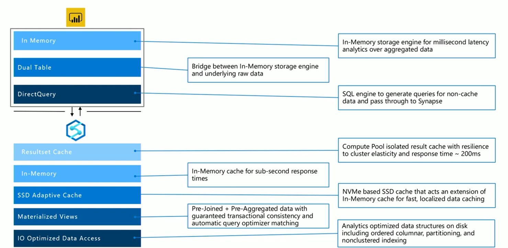

# 5. Optimizing Power BI Reports

Caching layers in PowerBI
- In-Memory (Import): data imported into memory, this technology unlocks sizable datasets for interactive analyses, fast queries expected for massive datasets; with large datasets, you will need a lot of memory
- DirectQuery: dataset acts as virtual pass through layer; as user interact with visualizations, Power BI generates SQL queries to Synapse SQL Pools
Dual Storage: in memory or direct query depending on which one is more efficient
The engine decides when to switch from in-memory to direct query and pushes the logic to the Synapse SQL Pool; depending on the context of the query tables can act as either cached (imported) or not cached
Composite Models: pick and choose which table to cache into memory; combine data from one or more DirectQuery sources, and/or combine data from a mix of DirectQuery sources and imported data

New performance features in Synapse
Result-set caching: caches query results in the user database for repetitive use. 
improves query performance (down to milliseconds) 
reduces compute resource usage. 
queries using cached results set do not use any concurrency slots in Azure Synapse Analytics and thus do not count against existing concurrency limits
Materialized Views: views that pre-compute, store, and maintain data in SQL DW just like a table. 
queries that use all or a subset of the data in materialized views can get faster performance. 
queries can use a materialized view without making direct reference to it
